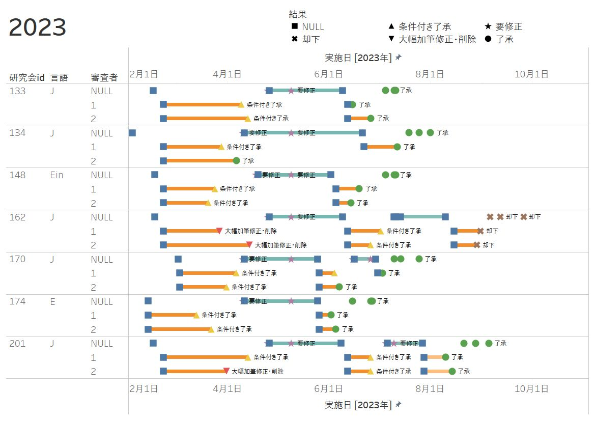
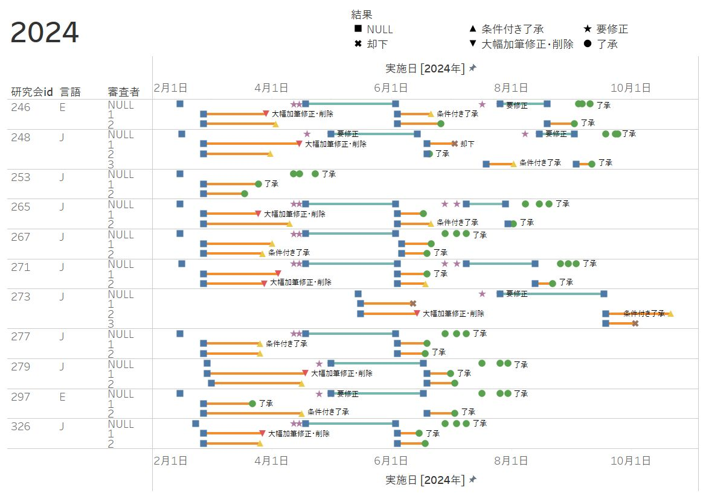
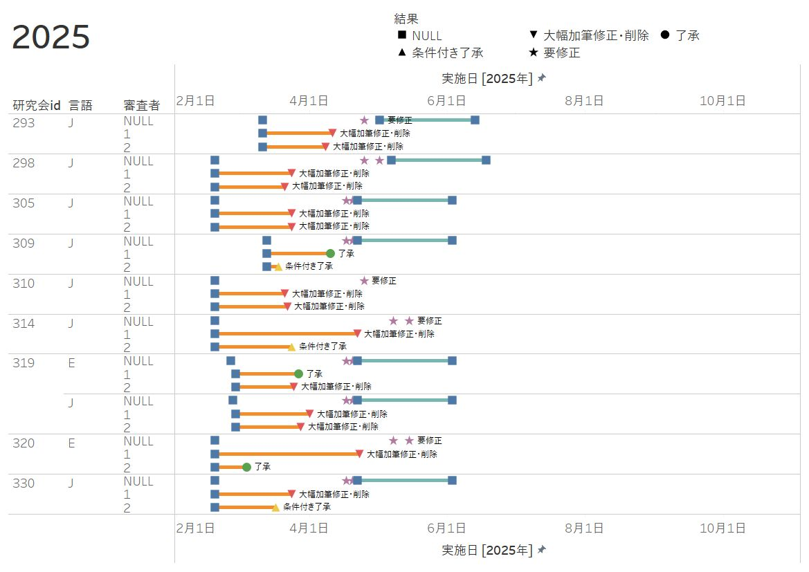

```{css CSS setting, echo=FALSE, results = "hide"}
.SeiroBenign {
  background-color: #FFEBCD;
  padding: 0.5em; /*文字まわり（上下左右）の余白*/
  /* border: 1px solid yellow; */
  /* font-weight: bold; */
}
.SeiroLightGreen {
  background-color: #D0F0C0; /* Tea green */
  padding: 0.5em; /*文字まわり（上下左右）の余白*/
  font-family: Noto S	ans;
  /* border: 1px solid yellow; */
  /* font-weight: bold; */
}
/* Define a margin before hX (header level X) element */
h1  {
  margin-top: 3ex;
  margin-bottom: 3ex;
  /* background: #c2edff; */ /*背景色*/
  padding: 0.5em;/*文字まわり（上下左右）の余白*/
}
h2  {
  margin-top: 2ex;
  margin-bottom: 2ex;
  padding: 0.5em;/*文字周りの余白*/
  ####color: #010101;/*文字色*/
  color: #87a5f2;
  /* background: #eaf3ff; */ /*背景色*/
  /* border-bottom: solid 3px #516ab6; */ /*下線*/
}
Blue {
  color: blue;
}
Red {
  color: red;
}
Purple {
  color: purple;
}
Gray {
  color: gray;
}
DarkBlue {
  color: #11017c;
}
```

<style type="text/css">
  body, td{
  font-size: 16pt;
}
</style>

## ねらい

研究会成果や検討票内容の質が低い場合、成果検討手順の修正によってこれらの質を高めることで、検討過程の生産性引き上げを目指します

以下の4つの課題のうち、第4回成果検討分科会[2025年5月29日(木)]では1.、第7回成果検討分科会[2025年6月25日(水)]と第6回研究企画委員会[2025年7月4日(金)]では2.について説明しました

1. [日本語表現が拙い原稿](AboutReview3.html#sec-nihongo)^[例: 今泉研、村山研、竹内研 ]
1. [成果検討の標準日程よりも大幅に遅れる研究会](AboutReview3.html#sec-toolate)^[例: 小島研、村山研 ]
1. [検討者が変更を把握できない改稿](AboutReview3.html#sec-cannottrack)^[例: 土屋研、竹内研 ]
1. [記述が軽微すぎる検討票](AboutReview3.html#sec-toolight)^[例: 村山研、近田研 ]

第8回成果検討分科会[2025年7月11日(金)]では2.と3.を説明、意見を募ります


::: {.callout-important title='検討過程の現状、懸念、変更の目的 (セールス・ピッチ)' collapse='true'}

現状 

   * 完成度の低い原稿に検討資源を費消
      * 日本語表現
      * 内容
   * 年度内出版=制約
   * 検討者の負荷(タイミング、頻度) vs. 成果改善?
      * 第1回検討時期=原稿締切時期
      * 頻繁なやりとり(7か月で2往復、8-9か月で最大2.5往復)^[外部ジャーナル: 第1回改稿期間≥6か月、改稿機会≤1回 ]
   * 軽微な検討票の存在

懸念

   * 研究会の対応猶予不足 &rArr; 質&darr;、検討期間&uarr;、検討回数&uarr;
   * 検討者の成果の質&darr;
   * 検討者の検討回避 &rArr; 軽微な検討票 &rArr; 検討制度の形骸化

検討制度変更の目的

   * 成果の質向上
   * 検討者の負荷軽減
:::

::: {.callout-important title='検討過程の変更: 要素 (手段)' collapse='true'}

A) <Purple>締め切り日延期:</Purple> 2月&rarr;3月
A) <Blue>原稿修正回数減少:</Blue> 2回&rarr;1回^[日数、1回で不十分な場合、などの[過去実績](AboutReview2.html#%E6%97%A5%E6%9C%AC%E8%AA%9E%E8%A1%A8%E7%8F%BE%E5%AF%BE%E7%AD%96-%E6%A4%9C%E8%A8%8E%E5%9B%9E%E6%95%B0%E3%82%921%E5%9B%9E)を参照 ]
A) <Red>検討終了期日延期:</Red> 9月&rarr;12月-1月 (例)^[翌年度前半期出版を許容 ] ^[3月から新年度の成果検討が始まることに留意 ] ^[年度内出版制約の緩和は不可逆的な意思決定になる気がします。たとえば、 将来に改稿回数を1回にしようと考えたとき、じゃあ出版期限も年度内にしましょうと制約を強めることは難しいでしょう。 ]
A) <Purple>研究会内検討:</Purple> 初稿提出前に3週間 (例)
A) <Red>第1回改稿期間延長:</Red> 60日&rarr;120日 (例)

期待する主な効果: <Red>成果の質</Red>、<Blue>検討者の負荷</Blue>、<Purple>両方</Purple>
:::

::: {.callout-important title='変更案 (製品)' collapse='true'}

1. A.+B. = 簡素化案(前回分科会の座長案)
1. A.+B.+D. = 簡素化自助努力案
1. A.+B.+E. = 簡素化改稿努力案
1. A.+B.+D.+E. = 簡素化ジャーナル型案
1. A.+C.+D. = 延長自助努力案
1. A.+C.+E. = 延長改稿努力案
1. A.+C.+D.+E. = 延長ジャーナル型案
1. A.+B.+C.+D.+E. = 延長簡素化ジャーナル型案

他にも良さそうな組み合わせはあるはず...
:::


## 日本語表現が拙い原稿 {#sec-nihongo}

### 現象

* 日本語が完成していない^[1960年代からタイでは「殺人」の報告件数の上昇が始まり、から増加傾向にあり、 (文終了)] ^[
タイが少年家庭裁判所が導入した集団会議は。 ] ^[村山研検討者1: 誤字脱字、不明な日本語、文章の不備（体言止めなど）、口語表現があまりにも多すぎる。この点がこの本の企画の最大の問題である。大変申し訳ないが、あまりにもそうした箇所が多すぎるので、個別での指摘は控えさせていただいた。幹事、および各章の執筆者はしっかりと誤字脱字、日本語を修正してほしい。特に1章から３章は読みづらい。 ]
* 推敲不足^[村山研、竹内研、小林研でも指摘あり ]

### そのまま読んで検討すべきか

第3回成果検討分科会での対応: 検討者に以下を依頼^[竹内研 ]

* そのまま読んで段落単位や節単位での指摘をする
* ただし、検討2回目で新たな指摘をする可能性も記す

これらは検討者の負荷を高めるので、検討過程の生産性は変わっていない&rarr;問題は残っている、初稿の日本語表現を改善するには対策が別途必要


### (一般論として)検討者は校正しなくてよいのでは?^[日本語表現が拙い原稿は著者に返却してよいのでは、から派生し、そもそも検討者は校正する必要があるかという問題提起。この問題提起は日本語表現が平均以上の原稿にも当てはまるので「一般論として」を付記。 ]

検討&#8841;校正

* 校正しなくても、初稿の日本語表現が拙い+そのまま検討&rarr;検討者の負荷は高いまま
* 初稿の日本語表現を改善させるための手段ではないかも


### 対応(案) 

1. 検討回数を1回^[改稿機会が1回のこと ]
1. 提出期限延長+何らかの検討期間短縮措置

::: {.callout-important title='1回 (vs. 2回)の効果' collapse='true'}
正:

1. 初稿の質&uarr;(かも)
1. 提出期限&uarr;(1か月)
1. 検討期間&darr;
1. 必要な検討資源量&darr;
   * しかし、初稿の質が低い場合、資源量(検討者の負担)は大きいまま

負:

1. 最終稿の質&darr;(かも)&larr;研検間の意思疎通が雑になる(かもしれない)ため
1. 却下率&uarr;(かも)&larr;初稿の質が高くならないとき
1. 採否判断が難しくなる&larr;判断材料の量&darr; &lArr; 検討回数&darr;
1. 却下判断時に検討者の心理的負荷&uarr;
:::

::: {.callout-important title='1か月締切延期&2回 &rArr; 年度内出版が厳しい研究会も出てくる' collapse='true'}

検討期間: 平均=`r 69.1+75.3`日、標準偏差=`r 13.6+16`日

* 1回目69.1日、2回目75.3日


{width=50%}

::: {layout-ncol=2}
{width=49%}

{width=49%}

{width=49%}
:::


エディタ: 20日

最後の2.5%の研究会: 3月半ば+200日+20日=10月末、+1か月バッファ=11月末 &rArr; 年度内出版は厳しい^[正規分布を仮定した簡易数値例 ]

最後の16%の研究会: 3月半ば+170日+20日=9月末、+1か月バッファ=10月末 &rArr; 年度内出版ぎりぎり

2回&rarr;1回: 1回目70+75*(2/3)=120日、+20日=8月末、+1か月バッファ=9月末 &rArr; 年度内出版可能

```{r read data}
library(data.table)
ro <- fread("RefOnce.prn", sep = "\t")
ro1 <- ro[year == 2023, ]
ro1[, year := NULL]
ro1[, 改善不十分 := ""]
ro1[, 追加指摘 := ""]
ro1[, 疎通不全 := ""]
ro1[c(1, 3, 4, 5), 改善不十分 := "○"]
ro1[c(2), 追加指摘 := "○"]
ro2 <- ro[year == 2024, ]
ro2[, year := NULL]
ro2[, 改善不十分 := ""]
ro2[, 追加指摘 := ""]
ro2[, 疎通不全 := ""]
ro2[c(1, 3, 5, 6, 9, 12), 改善不十分 := "○"]
ro2[c(2, 10), 追加指摘 := "○"]
ro2[c(4, 7, 11, 13), 疎通不全 := "○"]
library(kableExtra)
roL <- rbind(ro1, ro2)
roL <- roL[, .(改善不十分=改善不十分[1], 追加指摘=追加指摘[1], 疎通不全=疎通不全[1]), by = id]
roL[id == 246, 改善不十分 := "○"]
roL[id == 273, c("追加指摘", "疎通不全") := "○"]
kbl(roL[order(id), ], 
  align = "cccc", 
  caption = "要約: 検討者が講評2回目で不十分と示す内容(2023年度実施、2024年度実施研究会)", 
  format = "html")
```

研究会が修正1回で指摘事項に応え切れていないのが主因

:::


## 成果検討の標準日程を大幅に遅れる研究会 {#sec-toolate}

```{mermaid}
---
displayMode: compact
---
gantt
    title 最速、最遅、7月修正稿提出ケース
    dateFormat  YYYY-MM-DD
    axisFormat  %m
    tickInterval 1month
    section A. 最速ケース
    section 最速ケース
      検討1回目 : K1f, 2025-02-20, 13w
      検討2回目 : K2f, after K1f, 8w
      検討3回目 : K3f, after K2f, 8w
      出版 : P1f, after K3f, 4M
    section 最速第1回
      検 : active, k1, 2025-02-20, 4w
      エ : done, e1, after k1, 3w
      修 : crit, s1, after e1, 6w
    section 最速第2回
      エ : done, e21, after s1, 1.5w
      検 : active, k2, after e21, 2w
      エ : done, e22, after k2, 1.5w
      修 : crit, s2, after e22, 3w
    section 最速第3回
      エ : done, e31, after s2, 1.5w
      検 : active, k3, after e31, 2w
      エ : done, e32, after k3, 1.5w
      修 : crit, s3, after e32, 3w
    section 最速出版
      組版・編集 : active, n1, after s3, 4M
    section B. 最遅ケース
    section 最遅ケース
      検討1回目 : K1s, 2025-02-20, 21w
      検討2回目 : K2s, after K1s, 8w
      検討3回目 : K3s, after K2s, 8w
      出版 : P1s, after K3s, 4M
    section 最遅第1回
      検討1回目 : active, k1s, 2025-02-20, 9w
      エ : done, e1s, after k1s, 3w
      修正1回目 : crit, s1s, after e1s, 9w
    section 最遅第2回
      エ : done, e21s, 2025-06-21, 5w
      検 : active, k2s, after e21s, 2w
      エ : done, e22s, after k2s, 1.5w
      修 : crit, s2s, after e22s, 3w
    section 最遅第3回
      エ : done, e31s, after s2s, 1.5w
      検 : active, k3s, after e31s, 2w
      エ : done, e32s, after k3s, 1.5w
      修 : crit, s3s, after e32s, 3w
    section 最遅出版
      組版・編集 : active, n1s, after K3s, 4M
    section C. 7月ケース
    section 7月ケース
      検討1回目 : K1j, 2025-02-20, 2025-07-31
      検討2回目 : K2j, after K1j, 8w
      検討3回目 : K3j, after K2j, 8w
      出版 : P1j, after K3j, 4M
    section 7月第1回
      検討1回目 : active, k1j, 2025-02-20, 9w
      エ : done, e1j, after k1j, 3w
      修正1回目 : crit, s1j, after e1j, 2025-07-31
    section 7月第2回
      エ : done, e21j, after s1j, 1.5w
      検 : active, k2j, after e21j, 2w
      エ : done, e22j, after k2j, 1.5w
      修 : crit, s2j, after e22j, 3w
    section 7月第3回
      エ : done, e31j, after s2j, 1.5w
      検 : active, k3j, after e31j, 2w
      エ : done, e32j, after k3j, 1.5w
      修 : crit, s3j, after e32j, 3w
    section 7月出版
      組版・編集 : active, n1j, after s3j, 4M
```

標準日程より遅れる研究会は今後も発生する

### 現象

* 外部出版期限(1年)を過ぎても内部出版のための成果検討を申請しない研究会がある
* 成果検討において改稿期限を大幅に遅れる研究会がある

### 越年度の問題

* 公平性
* 時宜逸失
* 成果出版課作業時期の偏り
* 成果検討資源・出版資源・予算の活用効率低下

### 原因

* 初稿の完成度が低いので大幅改稿するため
* 個人研究会などは(作業量)/(人時間)が多いため
* 多忙

### 対応

* 現在の運用: (翌)年度内出版
   * 暗黙裏の合意、制度として定めはない
* 予防策
   * 原稿検討会
   * 締切延長
* 事後策
   * ?
<!--   * 初稿提出時に選択的1回改稿(改稿機会は1回のみ、改稿期間を延長)-->
* 対応は必要?
   * できるまで待つ
   * 一定期間を過ぎたら成果検討分科会は手を引く&rarr;成果未刊行、外部出版


## 検討者が変更を把握できない改稿 {#sec-cannottrack}

### 現象

指摘対応に具体性がない

```{r}
#| echo: false
#| warning: false
library(data.table)
library(knitr)
library(tinytable)
eg <- read.table(
textConnection("
第1章で整理されているエジプトの住宅政策の沿革については、後章（第4章が顕著）でも内容的に重複する部分が多い。第1章にそれらを集約整理し、後章では理論分析を加筆したほうがより良いのではないか。 構成を変更しました。
本稿が立脚する「政治経済学／開発学の視点」について、先行研究を適宜引用・参照しながら、より詳しく説明してください。（講評を参照） 序章を書き直して、視点、枠組みを明確にするようにしました。
本稿の学術的オリジナリティを明示してください。（講評を参照） 終章で本書の位置付けを整理しました。
"))
eg <- data.table(as.matrix(eg, ncol = 2, byrow = F))
setnames(eg, c("指摘", "対応"))
tb <- tt(eg, 
  caption = "例", 
  theme = "striped")
tb <- style_tt(tb, j = 1:2, align = "l", fontsize = .8)
style_tt(tb, i = 0, align = "c", color = "black", background = "lightblue")
```


検討票ファイルの指示^[修正すべき: ...具体的な対応内容<Red>~~（修正箇所の指摘等）~~</Red>を記載してください。<Red>~~（~~</Red>単に「修正しました」とだけ記載されると、検討者は修正箇所を正確に把握して再検討を行うことが難しくなり、結果として検討作業が遅れる一因となります<Red>~~）~~</Red>。 ]

> 研究会（執筆者）は、検討者が示した個別の指摘に対する具体的な対応内容（修正箇所の指摘等）を記載してください（単に「修正しました」とだけ記載されると、検討者は修正箇所を正確に把握して再検討を行うことが難しくなり、結果として検討作業が遅れる一因となります）。


### 問題

1. 検討者が変化を把握しづらい&rarr;却下 and/or 検討者の負担&uarr;

### 対応

現在の運用

* 履歴が維持されていない(=変更の把握が難しい)改稿に対し、エディタ+事務局が履歴維持^[手段: 変更履歴機能、個別指摘事項や別ファイルに具体的な変更を記述など ]要請して返却
   * 要請に応えないままの修正稿が再提出されるケースあり
      * 入り組んでいて旧稿との比較が容易ではない場合
      * ほぼ新規原稿の場合
   * 今年度の事例紹介

今後の指針

* 履歴なしの修正稿は履歴維持要請とともに研究会に返却
   * 大幅改稿にはAI利用を推奨
   * 小幅改稿には[adobe acrobat proの版比較](https://helpx.adobe.com/acrobat/using/compare-documents.html)や[google docの提案モード](https://docs.google.com/document/d/19st05M0zvMplJaeKu_VPm5dxkF7Ql6UjwRdRf5-Nl7M/edit?usp=drive_link)も有用
      * 例
* 分科会は修正稿に対しどの程度介入すべきか
   * 対象: 指摘対応が
      * 空欄
      * 非具体的で変更の確認が困難
      * 不穏当な表現
   * 返却は何度まで?
      * 採否は検討者が判断
      * 一度でしょう...今回限りと研究会に通知
   * 分科会のdue diligence?: 履歴維持要請+返却、AI利用方法、研修(成果検討過程の利用心得と検討者心得)


## 記述が軽微すぎる検討票 {#sec-toolight}

 誠実に検討しているのか疑問を招く「軽い」検討票

検討者の責務に不誠実なまでに軽い検討


### 現象

とある研究職からの問題提起

> (完成度の低い原稿について議論になっていますが)今の自分の原稿はこの完成度の低い原稿に当てはまります。...(中略)...主査も確認する暇もなく締め切りぎりぎりに提出しました。...(中略)... したがって、私の原稿に文句が無いはずはなく、「推敲して出せ」と怒りのコメントが来るのを覚悟していたのですが、ほぼスルーだったこと...(中略)...(は検討者が: 伊藤追記)「読んでない」ことを証明していると思います。

2024年度村山研の英1検討票も誠実に検討したと思えない内容でした

「辛辣」な検討票を書いた教科書研究会の検討者1も、検討者2が「条件付き了承」としていたことに不信感を示していました


### 問題

* 資源が無駄になる
   * 研究会に読ませる=無駄
   * 検討そのもの=無駄
   * 分科会・事務局・企画委員会の労力=無駄
* 検討過程が形骸化する
   * 成果の質&darr;
   * でも、検討過程としての格好は付いている

### 原因: なぜ発生するか

* 匿名制^[匿名制 &hArr; 努力+ノイズ &rArr; モラル・ハザード ]
* 検討努力の便益なし^[学術雑誌の編集委員は、検討者の指名、検討者との関係性を通じて便益に影響を及ぼすことができる ]
   * 利己的な検討者: 便益なし
   * 利他的な検討者: 採否権限がない^[「どうせ出版されるのでしょう」 ] =便益がない、と捉えているかも^[極端な例: 理事の研究会成果に却下判断する意味はあるのか? ] ^[検討過程に対する信認が低いともいえる ]
* 検討者の努力回避行動^[却下や大幅修正は大変だから微修正で終わりにする ]
    * 時間や労力を節約したい
       * 研究成果の質が低い &rArr; 時間あたり検討費用&uarr; &rArr; 努力&darr;
       * 過去に不本意な検討者経験 &rArr; 努力&darr;

### 対応(案) 

1. 検討票3-1 講評を「成果の長所、改善すべき点」として検討票項目化=義務化
   * 項目例
      * 貢献・強み
      * 動機
      * リサーチ・クエスチョン
      * 分析枠組み
      * 資料
      * 結果
      * 懸念点、疑問
   * 軽レビューはなくなるが硬直的な項目化は悪手
      * 成果の改善にどれだけ役立つか不確実
      * 誠実にレビューする検討者の負担を確実に増やす
1. エディタと分科会が介入し、検討票を検討者に差し戻す
   * 事前に差し戻しがあることを周知すれば、軽レビュー予防になる
   * 返却 vs. 受領をどう線引き・明文化するか
      * 線引き&larr;どのような検討が成果改善に役立つかを考える
      * 例: 成果全体としての目的、目的達成度・方法、長所、改善すべき点などを論拠にした疑問や修正提案がない、もしくは、なくても良い理由を示していない&rarr;差し戻し

::: {.callout-important title='英1検討票(了承)3-1: 講評' collapse='true'}
> 日本とバングラデシュの関係については、日本人研究者、バングラデシュ人ジャーナリストや学者による**先行研究があるにも関わらず、新規性**を示せている。歴史、経済、人的交流、国際関係、文献紹介など**内容は多彩**で、区分は一般書ではあるものの**学術的価値も高い。**

> **いくつかの章の分量が他に比べて大きく、バランスを欠く**ように見えるが、2章は説明を省くと読者の理解を妨げるし、現場の緊張感も伝わらなくなるだろうから仕方ない。4章に関しても、図やグラフによって分量が増えているから**仕方ない。**

> 5章と6章で内容に若干重複があるが、イントロダクションで指摘されているように異なる視点に基づく分析であり、それぞれ興味・関心が異なる読者にとって有益であるのだろうと推察される。

* 先行研究の特徴は何で、本研究成果の新規性の内容は?
* 内容が多彩=学術的価値は高い?
* 章分量のばらつきは仕方ない&rarr;本当か? 図表が30を超える4章は付論を付けるべきでは?
* この研究成果は何を目的としていて、その目的を達成しているか、達成の手段は適切か、の検討がない

エディタのこうした疑問を差し戻しの理由にすることの弊害は? 

専門分野が違ってもエディタならば同様の疑問を抱くのか?
:::

メリット・レビューにも軽レビューがある

* 改善機会を逸している
* 知り合い同士で依頼すれば軽レビューはないという期待&larr;正しくないときもある


## 補完策: その他の働きかけ

検討過程変更案とは独立して実施すべき

### 対検討者

* 検討研修
   * 正当性、一意性、追加指摘の回避、表現の穏当さ
   * 校正は義務ではない
   * 軽微な検討票の何が問題か

### 対研究会

初稿提出前

* 内部出版の成果検討過程 
   * 研究会にはコメントを得る権利とコメントに応える義務
   * 検討者との対話
* 外部コメント・視点の取り込み^[建設的コメントを早期に取り入れる=メリット・レビューと同じ目的 ]
   * 個人研究会
   * 新しいトピックの研究会
* 原稿検討会
   * 日本語表現の改善

課題検討分科会と連携し、課題提案時に上記を促す


