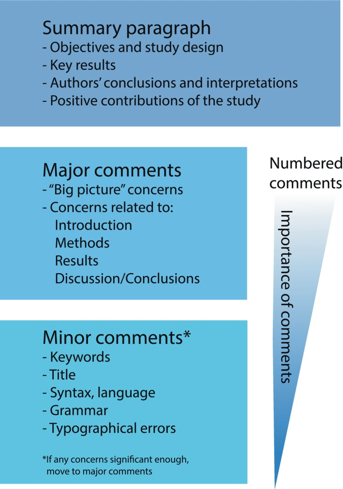

<style>
:root{--r-main-font-size: 36px;}
.reveal h1, .reveal h2, .reveal h3, .reveal h4, .reveal h5 {
              text-transform: none;
      }
.spacer {
    margin-top: 20px;
}
br {
  /* change <br> space length*/
  display: block; /* makes it have a width */
  content: ""; /* clears default height */
  margin-top: 10px; /* change this to whatever height you want it */
}
</style>
<!--
<style type="text/css">
    ul > li { list-style-type: "\1F44D"; }
    ul > li:nth-child(2) { list-style-type: "\1F44E"; }
    ul > li:nth-child(3) { list-style-type: "\1F44E"; }
</style>
-->
```{css, echo=F, results = "hide"}
DBlue {
  color: dodgerblue;
}
Red {
  color: red;
}
```

## TL; DR

:::{.incremental}
* 成果検討=研究成果の質改善のための建設的プロセス
* 検討者がすべきこと
   * 読者の理解を深めるような建設的提言
* 研究会がすべきこと
   * 読者や検討者の理解を容易にするための努力: 表現方法、構成
* 双方がお互いに対し敬意を持つこと
:::

----

## 検討者の責務

<br>

付託 mandate (1., 2., [Elesevier](https://www.elsevier.com/reviewer/role#1-what-do-reviewers-do?), 3., 5. [Wiley](https://authorservices.wiley.com/asset/the-modern-guide-to-peer-review.pdf#page=6.04) and [CSE](https://www.councilscienceeditors.org/2-3-reviewer-roles-and-responsibilities), 4. many) 

::::: {style="font-size: 90%;line-height: 1.1;"}

:::::::::: {.columns}
:::: {.column width="35%"}
::: {.fragment}
1. 出版可否の判断と根拠の明示
:::
:::: 

:::: {.column width="65%"}
:::{.fragment}
&larr;基準? 「アジ研成果物として相応しいか」
:::
:::: 

:::: {.column width="35%"}
::: {.fragment}
2. 分析の評価
:::
:::: 

:::: {.column width="65%"}
::: {.incremental}
a) 正確さ accuracy
a) 完全さ completeness
a) 質 (論理の整合性・精緻さ) quality
:::
:::: 

:::: {.column width="35%"}
::: {.fragment}
3. 貢献の把握・評価
:::
:::: 

:::: {.column width="65%"}
:::: 

:::: {.column width="35%"}
::: {.fragment}
4. 研究会との対話&rarr;出版可能性&uarr;
:::
:::: 

:::: {.column width="65%"}
::: {.fragment}
(以下の順番で)
:::

::: {.incremental}
a) 研究目的と貢献・長所の提示
a) 内容へのコメント: 懸念・疑問、改善方法の提案と根拠
a) 表現方法の改善提案: 図、表、論理構成
a) (必要に応じて) 資料/情報の提供・請求
:::
:::: 

:::: {.column width="35%"}
::: {.fragment}
5. 研究倫理チェック
:::
:::: 


::::::::::

:::::

----

## 検討者の責務

<br>

心構え: [検討の3原則 (Wiley)](https://authorservices.wiley.com/asset/the-modern-guide-to-peer-review.pdf#page=6.04)

<br>

:::::::::: {.columns}
:::: {.column width="30%"}
::: {.fragment fragment-order=1}
1. 秘匿 confidentiality
:::
:::: 

:::: {.column width="70%"}
::: {.fragment fragment-order=2}
  <ul style="list-style-type:'&#x274C'; padding: 1em; margin-top: -1cm;">
    <li>他者との共有</li>
  </ul>
:::
:::: 

:::: {.column width="30%"}
::: {.fragment fragment-order=3}
2. 公正 integrity
:::
:::: 

:::: {.column width="70%"}
::: {.fragment fragment-order=4}
  <ul style="list-style-type:disc; padding: 1em; margin-top: -1cm;">
    <li>学術価値のみで判断</li>
    <li>個人的、組織的、信条的利害の影響を排除・開示</li>
  </ul>
:::
:::: 

:::: {.column width="30%"}
::: {.fragment fragment-order=6}
3. 不偏 impartiality
:::
:::: 

:::: {.column width="70%"}

::: {.fragment fragment-order=7}
<ul style="list-style-type: disc; padding: 1em; margin-top: -1cm;">
  <li>客観的・建設的な指摘</li>
  <li>目標=厳密な研究の支援、成果の改善、出版阻止ではない</li>
</ul>
:::
:::: 

::::::::::


----

## 検討者の責務

<br>

指摘内容 (参照[AAAS](https://www.science.org/content/article/how-review-paper)その他)

:::::::::: {.columns}
:::: {.column width="35%"}
:::{.incremental}
* 考察対象の尊重
:::
:::: 

:::: {.column width="65%"}
<ul style="list-style-type:disc; font-size: 24pt; padding: 0em; margin-top: 0cm;">
::: {.fragment fragment-order=1}
  <li>提示された考察に応える</li>
:::
::: {.fragment fragment-order=2}
  <li>新たな問いを立てることを要求しない</li>
:::
::: {.fragment fragment-order=3}
  <ul style="list-style-type:'&#x274C;'">
    <li>「XではなくYを問うべきでは」</li>
  </ul>
:::
</ul>
:::: 

:::: {.column width="35%"}
::: {.fragment}
* 著者と対等で建設的な対話
:::
:::: 

:::: {.column width="65%"}
::::: {style="font-size: 24pt;line-height: 1.1;"}
::: {.incremental}
* 心理的安全性の差
   * Single-blinded review
  <ul style="list-style-type:'&rarr;">
    <li>検討者=匿名>記名=著者</li>
  </ul>
* 交渉力の差
   * 採択率の圧倒的高さ(>90%)+最大3名の多数決
  <ul style="list-style-type:'&rarr;">
    <li>検討者<著者</li>
  </ul>
:::
:::::
:::: 

::::::::::

----

## 検討者の責務

<br>

指摘内容 (参照[AAAS](https://www.science.org/content/article/how-review-paper)その他)

:::::::::: {.columns}

:::: {.column width="35%"}
:::{.fragment}
* 読者の理解を深めるための指摘
:::
:::: 

:::: {.column width="65%"}
<ul style="list-style-type: disc; font-size: 24pt; padding: 0em; margin-top: -.0cm;">
::: {.fragment fragment-order=5}
  <li>研究動機、リサーチ・クエスチョン</li>
:::
::: {.fragment fragment-order=6}
  <li>既存研究との対比</li>
:::
::: {.fragment fragment-order=7}
  <li>方法論、本全体のフレームワーク</li>
:::
::: {.fragment fragment-order=8}
  <ul style="list-style-type: square">
    <li>各章での論理遷移</li>
  </ul>
  <ul style="list-style-type: square">
    <li>この方法論はリサーチ・クエスチョンに答えられるか? </li>
  </ul>
:::
::: {.fragment fragment-order=9}
  <li>結論: 一般化と限定...I want statements of fact backed up by data, not opinion or speculation.</li>
  <ul style="list-style-type: square">
    <li>what is the context?</li> 
    <li>do the authors make claims that overreach the data?</li>
  </ul>
:::
</ul>
:::: 

:::: {.column width="35%"}
::: {.fragment}
* 採否の論拠
:::
:::: 

:::: {.column width="20%"}
::::: {style="font-size: 24pt;line-height: 1.1;"}
::: {.incremental}
* 新奇性
* 証拠や議論の質
:::
:::::
:::: 
:::: {.column width="45%"}

::::: {style="font-size: 24pt;line-height: 1.1;"}
::: {.fragment}
* 社会への貢献
:::
:::::

::: {.fragment}
<ul style="list-style-type:'&#x274C'; font-size: 24pt; padding: .25em; line-height: .7; margin-top: -5em;">
  <li>検討者の「学派」(意見・見方)との一致</li>
</ul>
:::

:::: 
::::::::::

----

## 検討者の責務

<br>

検討票の順序([Sedaghat et al. 2024](https://onlinelibrary.wiley.com/doi/10.1002/lio2.1266), [Figure 2](https://onlinelibrary.wiley.com/cms/asset/19af86cb-81e9-47ee-96d9-95db351f2335/lio21266-fig-0002-m.jpg))

:::::::::: {.columns}
:::: {.column width="50%"}
{width="50%"}
:::: 

:::: {.column width="50%"}
* 講評・総評・貢献
* 必須
* 任意
:::: 
::::::::::


----

## 検討者の責務

<br>	

表現方法([AAAS](https://www.science.org/content/article/how-review-paper#:~:text=I%20never%20use,comes%20to%20mind.))

> I never use value judgments or value-laden adjectives. Nothing is "lousy" or "stupid," and nobody is "incompetent." However, as an author your data might be incomplete, or you may have overlooked a huge contradiction in your results, or you may have made major errors in the study design. That's what I communicate, with a way to fix it if a feasible one comes to mind. 

* 不完全
* 矛盾を見逃す
* 方法論に過誤

> The review process is brutal enough scientifically without reviewers making it worse.

----

## 著者の責務

<br>

:::::::::: {.columns}
:::: {.column width="100%"}
<ul style="list-style-type: square; font-size: 28pt; padding: 1em; margin-top: -1cm;">
::: {.fragment}
  <li>検討過程は検討者との対話</li>
:::
::: {.fragment}
  <li>第1信=原稿提出</li>
:::
::: {.fragment}
  <ul style="list-style-type: '&rarr;'">
    <li>検討過程のトーンを決める</li>
  </ul>
:::
</ul>
:::: 
:::::::::: 


:::::::::: {.columns}
:::: {.column width="30%"}
::: {.fragment}
1. 推敲
:::
:::: 
:::: {.column width="70%"}
::: {.incremental}
* 日本語が不完全な原稿を提出しない
* 論理
:::
:::: 

:::: {.column width="30%"}
::: {.fragment}
2. 読み手への配慮
::: 
:::: 
:::: {.column width="70%"}
::: {.incremental}
* 論拠を明示
* 節・段落の役割を章全体で位置づけ
* 短く簡易な文章
* 専門用語や概念を初出で説明
* 枝葉の内容は脚注
* 副詞を自制:「とても」「大変」「非常に」「はるかに」「甚だしく」
:::
:::: 

::::::::::


----

## 著者の責務

<br>


:::::::::: {.columns}
:::: {.column width="30%"}
3. 学術形式の遵守
:::: 
:::: {.column width="70%"}
::: {.incremental}
* 動機
* リサーチ・クエスチョン・仮説
* 先行研究
* 資料
* 方法
* 結果
* 貢献
   * 一文で表現できる「...を用いて...を実施して...が判明した」
   * 新奇性
   * 一般化
   * 限定
:::
:::: 
::::::::::


----

## 著者の責務

<br>


:::::::::: {.columns}
:::: {.column width="30%"}
4. 検討者との対話
:::: 
:::: {.column width="70%"}
::: {.incremental}
* 敬意と謝意を示す
* カバー・レター(変更の要旨)を付ける
* 指摘に対し、必ず回答する
   * 指摘に対応しなくても、対応しない理由を書く
* 変更を明示する
   * 前版&rarr;現版
   * 場所
   * 理由
   * 検討者が容易に確認できる提示
      * 提示方法は何でも良い
         * ファイルの変更履歴
         * 指摘対応表への書き込み
:::
:::: 
::::::::::

----

## 分科会・編集委員会の責務

<br>

:::::::::: {.columns}
:::: {.column width="100%"}
<ul style="list-style-type: square; font-size: 28pt; padding: 0em; margin-top: -1cm;">
::: {.fragment}
  <li>著者と検討者の対話の円滑化</li>
:::
::: {.fragment}
  <ul style="list-style-type: '&rarr;'">
    <li>表現の一意性</li>
    <li>履歴維持</li>
  </ul>
:::
::: {.fragment}
  <li>検討過程の正当性監視</li>
:::
::: {.fragment}
  <li>表現の穏当さ堅持</li>
:::
::: {.fragment}
  <li>研究倫理チェック</li>
:::
::: {.fragment}
  <li>申し立て、意見、その他諸々への対応</li>
:::
</ul>
:::: 
:::::::::: 


:::::::::: {.columns}
:::: {.column width="30%"}
::: {.fragment}
1. 適切な検討者の選出
:::
:::: 
:::: {.column width="70%"}
::: {.incremental}
* (preferred) 専門性
* 利害対立&larr;single-blinded review
   * 原則として利害は対立しないはずだが、相性は考慮すべきか...
:::
:::: 

::::::::::


----

## 分科会・編集委員会の責務

<br>


:::::::::: {.columns}
:::: {.column width="30%"}
2. 検討者への検討方針伝達
:::: 
:::: {.column width="70%"}
::: {.incremental}
* 第一義の目的: 原稿の改善
   * 著者と検討者は対等の立場
* 採否基準
:::
:::: 

:::: {.column width="30%"}
3. 検討者への検討内容依頼
:::: 
:::: {.column width="70%"}
::: {.incremental}
* 問題設定・仮説は明確か
   * 読者は何について読むのか
* 資料は何か
* 方法論は問題を解明できるか
   * 何を(比較)すれば設定した問題を解明(仮説を検定)できるか
* 結論
   * 結果を過大解釈・誇張していないか
   * 新奇性・確認のいずれを探求しているか
:::
:::: 
::::::::::

----

## 分科会・編集委員会の責務

<br>


:::::::::: {.columns}
:::: {.column width="30%"}
4. 検討過程の監理
:::: 
:::: {.column width="70%"}
::: {.incremental}
* スケジュール
* 意思疎通の円滑化
   * 指摘の一意性
   * 正当性監視
      * 考察対象の尊重
      * 採否根拠
      * 相互に矛盾する結果の消去
   * 履歴維持
      * 著者はすべての指摘に回答
      * 論旨に関わる変更明示
      * 2回目以降の新規指摘禁止
* 表現の穏当さ
:::
:::: 
::::::::::


----


## 検討者の責務

<br>	

匿名性 (single-blinded)

* トラブル回避に必須
* 記名であるかのごとく検討票を書く

::::: {style="font-size: 80%;line-height: 1.1;"}
> However, I know that being on the receiving end of a review is quite stressful, and a critique of something that is close to one's heart can easily be perceived as unjust. I try to write my reviews in a tone and form that I could put my name to, even though reviews in my field are usually double-blind and not signed.
:::::

::::: {style="font-size: 80%;line-height: 1.1;"}
> If you make a practice of signing reviews, then over the years, many of your colleagues will have received reviews with your name on them. Even if you are focused on writing quality reviews and being fair and collegial, it's inevitable that some colleagues will be less than appreciative about the content of the reviews. And if you identify a paper that you think has a substantial error that is not easily fixed, then the authors of this paper will find it hard to not hold a grudge. 
:::::

::::: {style="font-size: 80%;line-height: 1.1;"}
> Before submitting a review, I ask myself whether I would be comfortable if my identity as a reviewer was known to the authors. Passing this "identity test" helps ensure that my review is sufficiently balanced and fair.
:::::

----

## 検討者の責務

[](https://pmc.ncbi.nlm.nih.gov/articles/PMC6949493/)

<br>

[Chung (2019)](https://pmc.ncbi.nlm.nih.gov/articles/PMC6949493/#:~:text=The%20following%20three%20reasons%20may%20cause%20a%20reviewer%20to%20agree%20to%20accept%20a%20paper%3A)

3 reasons may cause a reviewer to agree to accept a paper: 

::: {.incremental}
1. the paper is timely and relevant to the latest research trends; 
1. the paper is easy to read, logical, and well-written; 
1. the research design and methods are scientifically reasonable. 
:::

6 reasons for papers can be rejected; 

::: {.incremental}
1. the paper is incomplete in terms of its statistical analysis; 
1. the paper interprets results in an exaggerated way; 
1. the methods are suboptimal or insufficiently described; 
1. the sample size is too small; 
1. the manuscript is written in a way that is too difficult to understand; 
1. there is an insufficient description of the paper’s limitations. 
:::

----

## 検討者の責務

<br>

[The Council of Science Editors (CSE)](https://www.councilscienceeditors.org/2-3-reviewer-roles-and-responsibilities)

Reviewer responsibilities toward authors

* Providing written, unbiased, constructive feedback in a timely manner on the scholarly merits and the scientific value of the work, together with the documented basis for the reviewer’s opinion
* Indicating whether the writing is clear, concise, and relevant and rating the work’s composition, scientific accuracy, originality, and interest to the journal’s readers
* Avoiding personal comments or criticism
* Maintaining the confidentiality of the review process: not sharing, discussing with third parties, or disclosing information from the reviewed paper

----

## 検討者の責務

<br>

[The Council of Science Editors (CSE)](https://www.councilscienceeditors.org/2-3-reviewer-roles-and-responsibilities)

Reviewer responsibilities toward editors

::::: {style="font-size: 90%;line-height: 1.1;"}

1. Notifying the editor immediately if unable to review in a timely manner and, if able, providing the names of alternative reviewers
1. Alerting the editor about any potential personal, financial or perceived conflict of interest and declining to review when a conflict exists
1. Complying with the editor’s written instructions on the journal’s expectations for the scope, content, and quality of the review
1. Providing a thoughtful, fair, constructive, and informative critique of the submitted work, which may include supplementary material provided to the journal by the author
1. Determining scientific merit, originality, and scope of the work; indicating ways to improve it; and, if requested, recommending acceptance or rejection using whatever rating scale the editor deems most useful
1. Noting any ethical concerns, such as any violation of accepted norms of ethical treatment of animal or human subjects or substantial similarity between the reviewed manuscript and any published paper or any manuscript concurrently submitted to another journal that may be known to the reviewer
1. Refraining from direct author contact
:::: 

----

## 検討者の責務

<br>

[The Council of Science Editors (CSE)](https://www.councilscienceeditors.org/2-3-reviewer-roles-and-responsibilities)

Reviewer responsibilities toward readers

1. Ensuring that the methods and analysis are adequately detailed to allow the reader to judge the scientific merit of the study design and be able to replicate the study
1. Ensuring that the article cites all relevant work by other scientists

----

## 検討者の責務

<br>

[Wiley: The modern guide to peer review](https://authorservices.wiley.com/asset/the-modern-guide-to-peer-review.pdf#page=6.04)

Communicating your feedback

* A well-structured review should begin with a concise summary of the manuscript’s aims and contributions. Recognizing the strengths of the study before identifying areas for improvement helps authors understand where their work succeeds and where it needs refinement. 
* Criticism should be constructive and specific, with clear explanations of why particular revisions are needed. Rather than vague comments like “The discussion is unclear,” an actionable suggestion would be, “Consider reorganizing the discussion section to align more closely with the results, particularly in paragraphs 3 and 4.” 
* The final section of the review should include a clear recommendation on whether to accept, request minor or major revisions, or reject the manuscript. Regardless of the recommendation, feedback should be professional and unbiased, contributing to the improvement of scholarly communication. 


----

## 検討者の責務

<br>

[Wiley: The modern guide to peer review](https://authorservices.wiley.com/asset/the-modern-guide-to-peer-review.pdf#page=6.04)

Ethical peer review is built on three fundamental principles: 

confidentiality, 
  do not share
  do not use

integrity, 
  honest
  unbiased
  based purely on academic merits
  avoid conflicts of interest on the following aspects: personal, institutional, ideological

impartiality.
  avoid conflicts of interest
  ensure that feedback is objective and constructive
  The goal is to support rigorous and ethical research, helping authors improve their work rather than obstructing publication.

