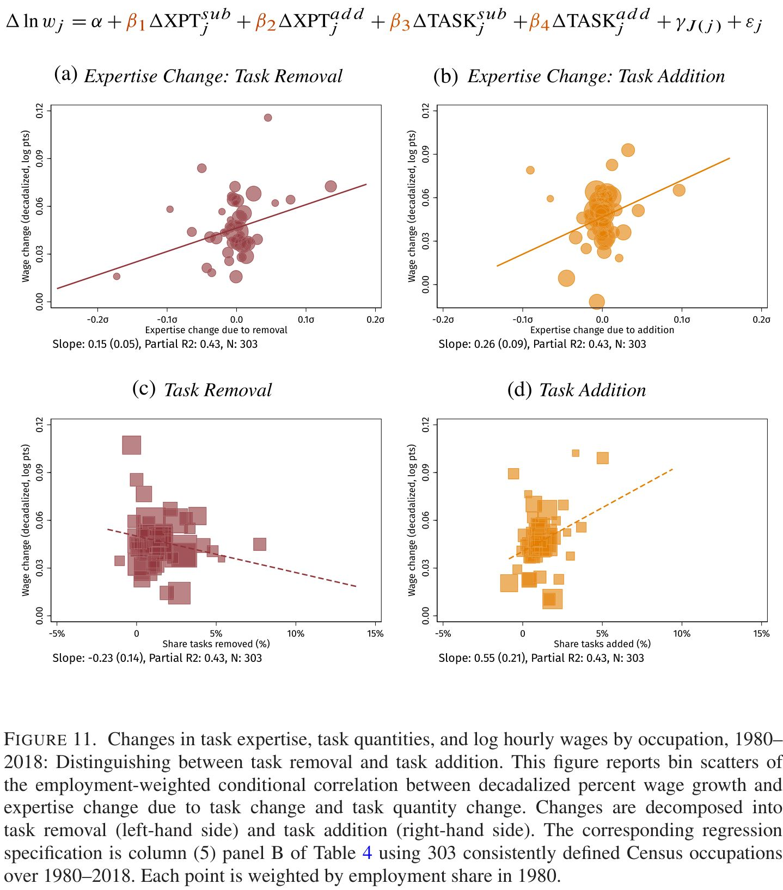
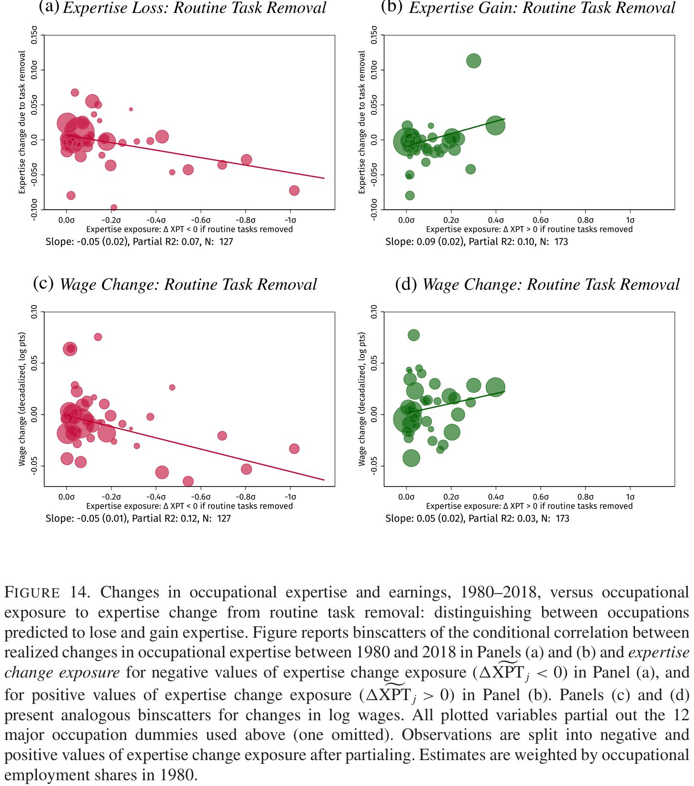
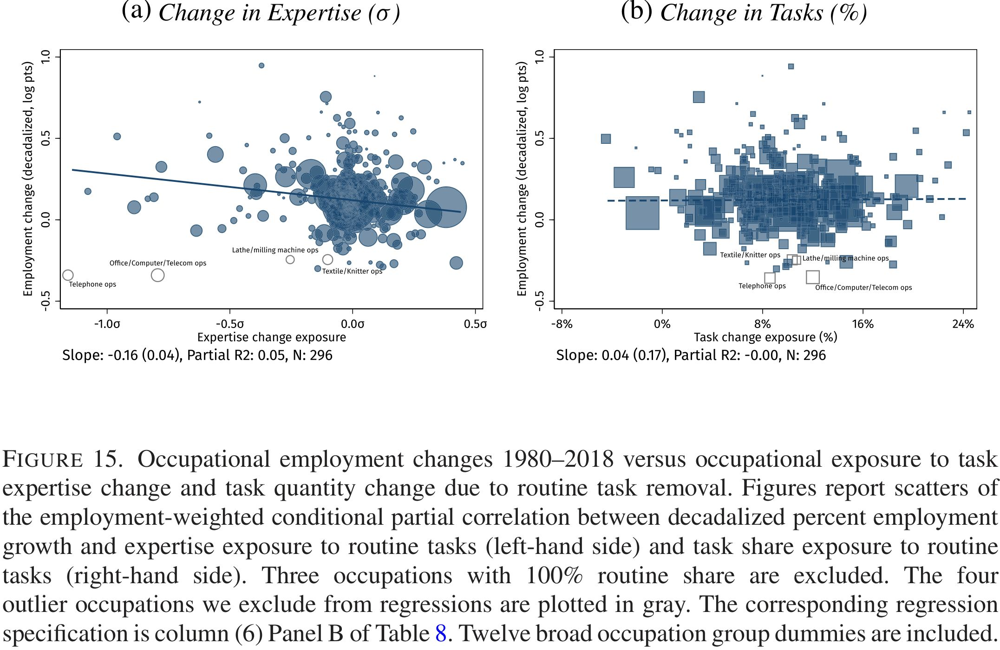
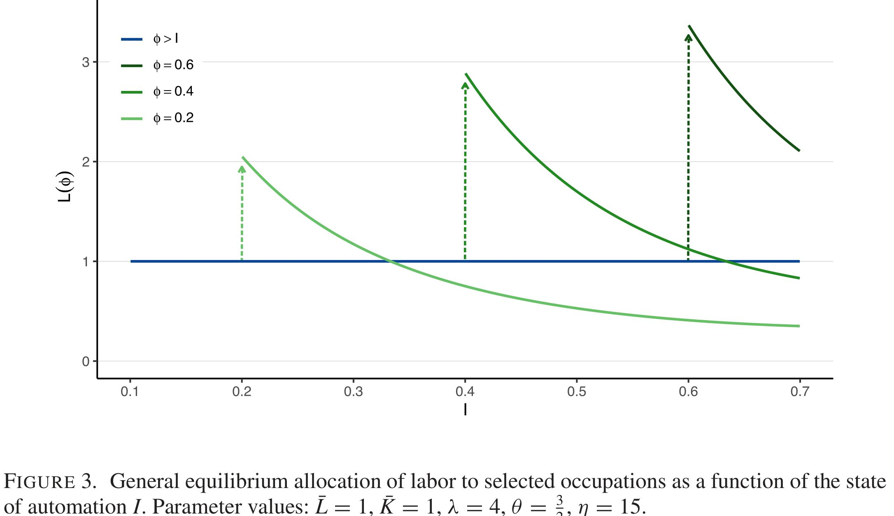
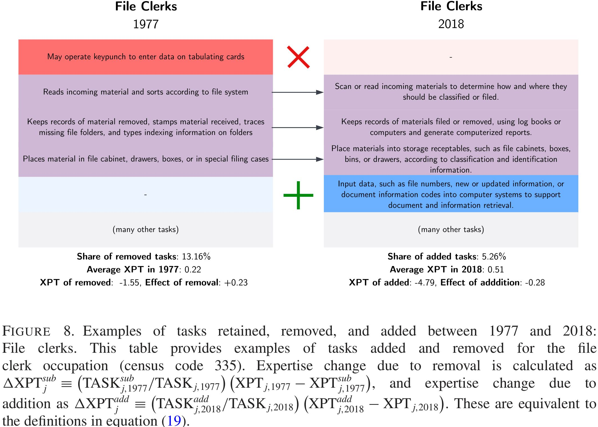
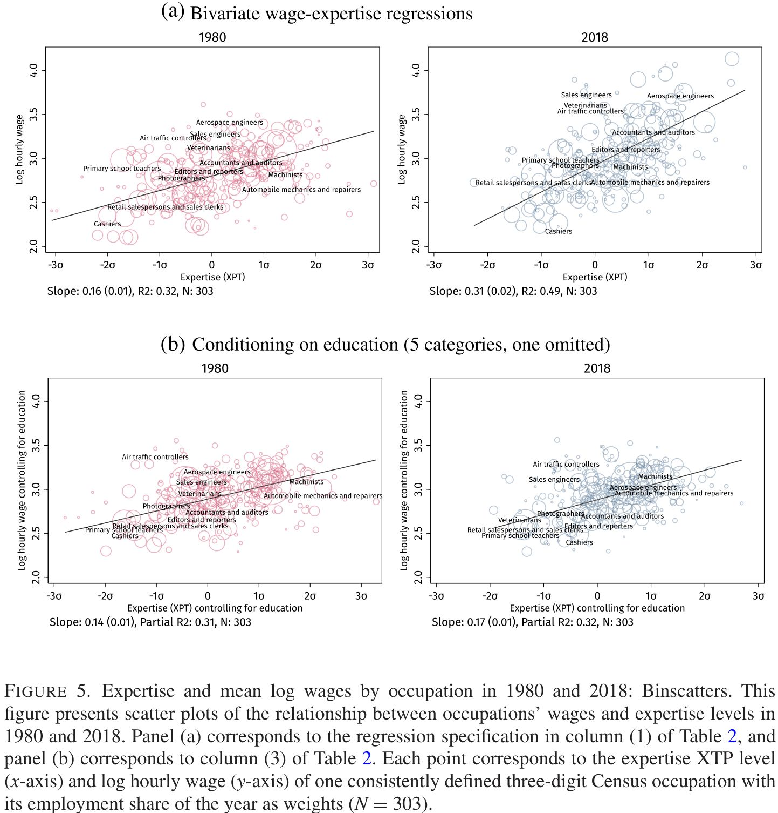
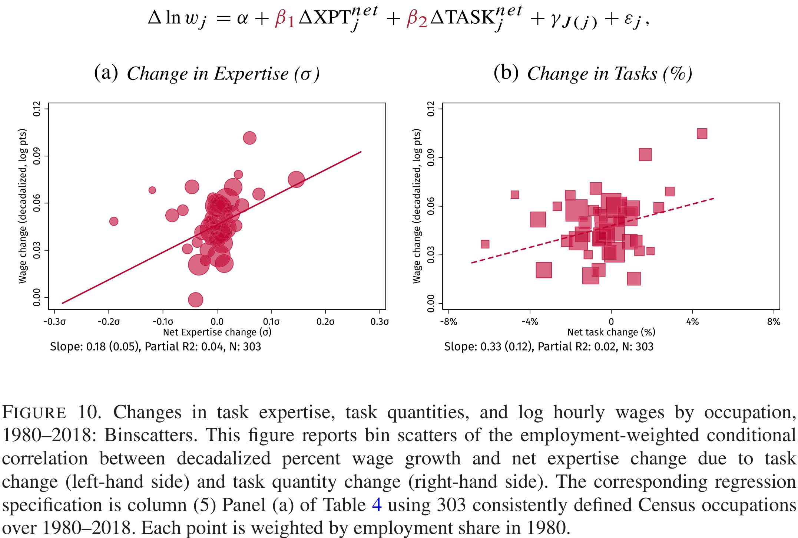
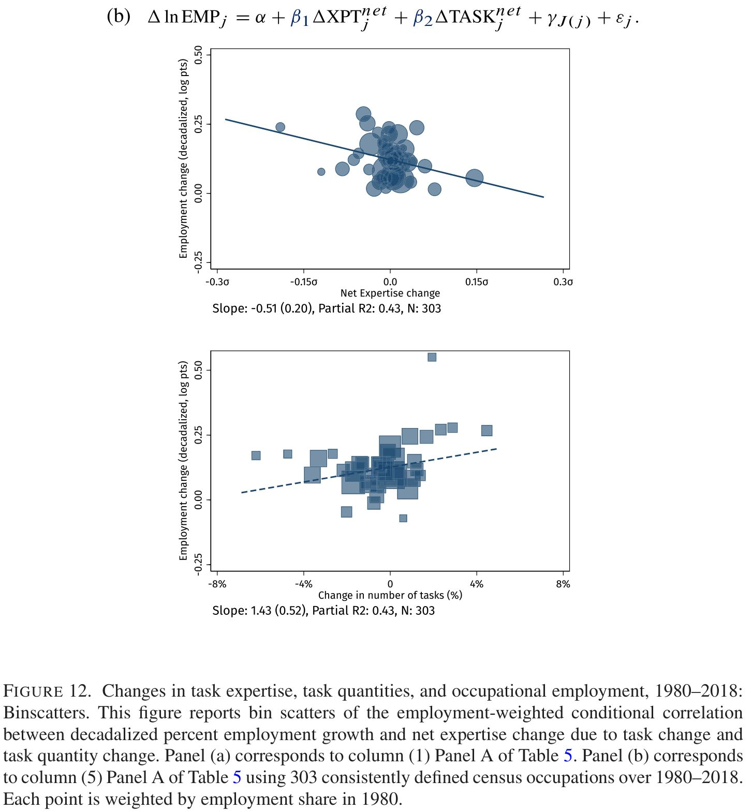
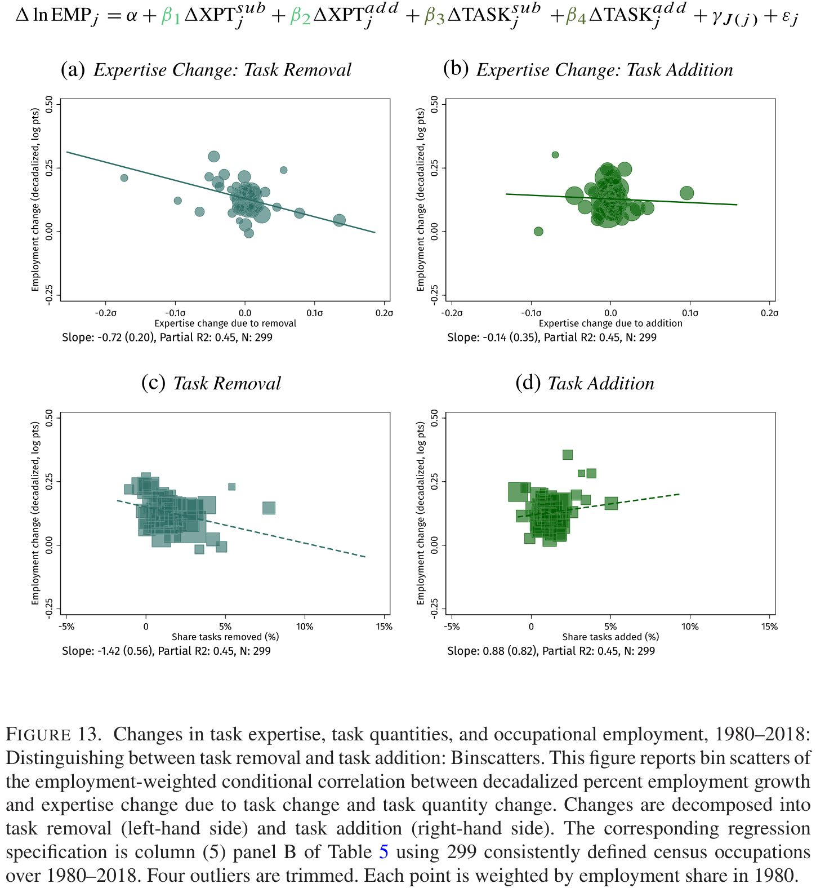

```{css CSS setting, echo=FALSE, results = "hide"}
.SeiroBenign {
  background-color: #FFEBCD;
  padding: 0.5em; /*文字まわり（上下左右）の余白*/
  /* border: 1px solid yellow; */
  /* font-weight: bold; */
}
.SeiroLightWreen {
  background-color: #D0F0C0; /* Tea green */
  padding: 0.5em; /*文字まわり（上下左右）の余白*/
  font-family: Noto S	ans;
  /* border: 1px solid yellow; */
  /* font-weight: bold; */
}
/* Define a margin before hX (header level X) element */
h1  {
  margin-top: 3ex;
  margin-bottom: 3ex;
  /* background: #c2edff; */ /*背景色*/
  padding: 0.5em;/*文字まわり（上下左右）の余白*/
}
h2  {
  margin-top: 2ex;
  margin-bottom: 2ex;
  padding: 0.5em;/*文字周りの余白*/
  ####color: #010101;/*文字色*/
  color: #87a5f2;
  /* background: #eaf3ff; */ /*背景色*/
  /* border-bottom: solid 3px #516ab6; */ /*下線*/
}
DBlue {
  color: dodgerblue;
}
Blue {
  color: blue;
}
Red {
  color: red;
}
```

<style type="text/css">
  body, td{
  font-size: 16pt;
}
</style>

```{=html}
<style>
.flushright {
   text-align: right;
}
</style>
```

\newcommand{\bfgamma}{\boldsymbol{\gamma}}


::: {.flushright data-latex=""}
[doi.org/10.1093/jeea/jvaf023](https://doi.org/10.1093/jeea/jvaf023)
:::

## TL; DR

::: {.column-margin}





:::
* Intuition: Automation impacts on wages/employment should depend on what levels of expertise is automated
* Context: Automation $\neq$ AI
* Occupation = generic tasks + routine tasks + non-routine tasks
   * Theory: Occupation = generic tasks + routine tasks
   * Empirics: Occupation = routine tasks + non-routine tasks
* Tasks: Varying in required expertise
   * Generic tasks: Cannot be automated, low expertise (essential work)
   * Routine tasks: Can be automated, varying expertise
   * Non-routine tasks: Cannot be automated, high expertise
* Theory
   * Task model: added/substituted task = additional/eliminated labour demand
   * Expertise model: Impacts of added/substituted tasks depends on expertise contents of the tasks (theoretical prediction=empirics)
* Empirics
   * For occupations whose inexpert routine tasks are automated (Inexpert task automation): expertise&uarr; wage&uarr;,employment&darr;
   * For occupations whose expert routine tasks are automated (Expert task automation): expertise&darr; wage&darr; employment&uarr;
   * Fraction of routine task removed&uarr; &rArr; expertise&uarr; (Tab 7A), wage&darr;, employment$\simeq 0$&larr; task model prediction: employment&darr;

# Theory

* A model that explains almost all (complicated) empirical findings based on realistic occupation-task hierarchy
* A very good work
* Some strong simplification assumptions (linear tech, etc.) to get analytical solutions

## Model

(Need to add derivations from memo)

#### 2.1 Task Level Production

<details><summary>Click here to see this subsection.</summary>
$$
x_L(t, l_i(t)) =
\begin{cases}
l_i(t) & \text{if } t \in (-\theta, e_i] \\
0 & \text{otherwise}
\end{cases}
\quad(1)
$$

$$
x_K(t, k_i(t)) =
\begin{cases}
\eta k_i(t) & \text{if } t \in (0, I] \\
0 & \text{otherwise}
\end{cases}
\quad(2)
$$

$$
x(t, l_i(t), k_i(t)) =
\begin{cases}
x_L(t, l_i(t)) & \text{if } t \in (-\theta, 0] \cup (I, 1) \\
x_K(t, k_i(t)) & \text{if } t \in (0, I]
\end{cases}
$$
Linear technology ensures analytical solutions. It also has a direct effect that spreading labor evenly maximizes the incomes.^[If task level production is Cobb- Douglas, $x_L(t, l_i(t)) = l_i(t)^{a(t)}$ with $a(t)\neq a(t')$ for $t\neq t'$, allocation of labour over tasks depends on the distribution of elasticity $a(t)$ over tasks ] 
</details>


#### 2.2 What Workers Produce

<details><summary>Click here to see this subsection.</summary>
$$
1 = \int_{\theta(\phi-1)}^{0} l_i(t)dt + \int_{I(\phi)}^{\phi} l_i(t)dt
$$

$$
k_i = \int_{0}^{I(\phi)} k_i(t) dt
$$

$$
y_i(\phi) = T(\phi) \exp \left\{ \int_{\theta(\phi-1)}^{\phi} \frac{\ln x(t, k_i(t), l_i(t))}{T(\phi)} dt \right\}
\quad(3)
$$

$$
\ln\left(\frac{y_i(\phi)}{T(\phi)}\right) = T(\phi)^{-1} \left[ \int_{\theta(\phi-1)}^{0} \ln(l_i(t))dt + \int_{0}^{I(\phi)} \ln(k_i(t)\eta)dt + \int_{I(\phi)}^{\phi} \ln(l_i(t) \mathbf{1}\{e_i \ge t\})dt \right]
\quad(4)
$$

$$
y_i(\phi) = \left( \frac{1}{1-\alpha(\phi)} \right)^{1-\alpha(\phi)} \cdot \left( \frac{k_i \eta}{\alpha(\phi)} \right)^{\alpha(\phi)}
\quad(5)
$$

$$
\alpha(\phi) := I(\phi)/T(\phi) = \frac{\min\{\phi, I\}}{\theta(1-\phi) + \phi}
$$
</details>

#### 2.3 What Occupations Produce

<details><summary>Click here to see this subsection.</summary>
$$
\int_{i \in o^{-1}(\phi)} k_i d\mu = K(\phi)
\quad(6)
$$

$$
Y(\phi) = A(\phi)L(\phi)^{1-\alpha(\phi)}K(\phi)^{\alpha(\phi)}
\quad(7)
$$

$$
A(\phi) := \left( \frac{1}{1-\alpha(\phi)} \right)^{1-\alpha(\phi)} \cdot \left( \frac{\eta}{\alpha(\phi)} \right)^{\alpha(\phi)}
$$

$$
L^*(\phi) = \frac{1-\alpha(\phi)}{w(\phi)} Y(\phi) p(\phi)
\quad(8)
$$

$$
K^*(\phi) = \frac{\alpha(\phi)}{r} Y(\phi) p(\phi)
\quad(9)
$$
</details>

#### 2.4 General Equilibrium

<details><summary>Click here to see this subsection.</summary>
$$
Y = \left( \int_0^1 Y(\phi)^{\frac{\lambda-1}{\lambda}} d\phi \right)^{\frac{\lambda}{\lambda-1}}
\quad(10)
$$

$$
C^*(\phi) = w(\phi) \frac{L^*(\phi)}{1-\alpha(\phi)}
$$

$$
p(\phi) = w(\phi)^{1-\alpha(\phi)} (r/\eta)^{\alpha(\phi)}
$$

$$
p(\phi) = \left(\frac{Y(\phi)}{Y}\right)^{-\frac{1}{\lambda}}
$$

$$
L(\phi) = Y \frac{1-\alpha(\phi)}{w(\phi)} \left( w(\phi)^{1-\alpha(\phi)} (r/\eta)^{\alpha(\phi)} \right)^{1-\lambda}
\quad(11)
$$

$$
K(\phi) = Y \frac{\alpha(\phi)}{r} \left( w(\phi)^{1-\alpha(\phi)} (r/\eta)^{\alpha(\phi)} \right)^{1-\lambda}
\quad(12)
$$

$$
o(i) = \underset{\phi \le E_i}{\arg\max} \ Y \left[ \frac{1-\alpha(\phi)}{L(\phi)} (r/\eta)^{\alpha(\phi)(1-\lambda)} \right]^{\frac{1}{\lambda-\alpha(\phi)(\lambda-1)}}
\quad(13)
$$

$$
\frac{\bar{I}\bar{L}}{Y} = \int_0^{\bar{I}} (1-\alpha(\phi)) w(\phi)^{(1-\alpha(\phi))(1-\lambda)-1} (r/\eta)^{\alpha(\phi)(1-\lambda)} d\phi
\quad(14)
$$

$$
\frac{\bar{L}}{Y} = (1-\alpha(\phi)) w(\phi)^{(1-\alpha(\phi))(1-\lambda)-1} (r/\eta)^{\alpha(\phi)(1-\lambda)}, \quad \forall \phi > \bar{I}
\quad(15)
$$

$$
\frac{\bar{K}}{Y} = \int_0^{\bar{I}} \frac{\alpha(\phi)}{r} w_g^{(1-\alpha(\phi))(1-\lambda)} (r/\eta)^{\alpha(\phi)(1-\lambda)} d\phi
\quad(16)
$$

$$
+ \int_{\bar{I}}^1 \frac{\alpha(\phi)}{r} w(\phi)^{(1-\alpha(\phi))(1-\lambda)} (r/\eta)^{\alpha(\phi)(1-\lambda)} d\phi
\quad(17)
$$
</details>

## Derivation of key results

### Derivation of the occupation-level production function

This explains why "linear aggregation ensures that the Cobb–Douglas form (found in out of worker level production) reemerges at the occupation level", by deriving the occupation-level production function from the worker-level function [@AutorThompson2025]

<details><summary>Click here to see this subsection.</summary>
#### **The Building Blocks (Equations and Assumptions)**

1.  **Worker-level output (Equation 5):** This is the output produced by a single worker $i$ who is given $k_i$ units of capital.
    $$
    y_i(\phi) = \left(\frac{1}{1-\alpha(\phi)}\right)^{1-\alpha(\phi)} \cdot \left(\frac{k_i \cdot \eta}{\alpha(\phi)}\right)^{\alpha(\phi)}
    $$

2.  **Aggregation Rule:** The total output of the occupation, $Y(\phi)$, is the linear sum (integral) of the outputs of all $L(\phi)$ individual workers employed in that occupation.
    $$
    Y(\phi) = \int_{i \in o^{-1}(\phi)} y_i(\phi) d\mu
    $$

3.  **Optimal Capital Allocation:** To maximize total output, the total capital for the occupation, $K(\phi)$, is distributed uniformly among all $L(\phi)$ workers.
    $$
    k_i = \frac{K(\phi)}{L(\phi)}
    $$

#### **Step-by-Step Derivation**

1.  **Start with the aggregation rule.**
    $$
    Y(\phi) = \int_{i \in o^{-1}(\phi)} y_i(\phi) d\mu
    $$

2.  **Substitute the worker-level production function into the integral.**
    $$
    Y(\phi) = \int_{i \in o^{-1}(\phi)} \left[ \left(\frac{1}{1-\alpha(\phi)}\right)^{1-\alpha(\phi)} \cdot \left(\frac{k_i \cdot \eta}{\alpha(\phi)}\right)^{\alpha(\phi)} \right] d\mu
    $$

3.  **Substitute the optimal capital per worker, $k_i$.**
    $$
    Y(\phi) = \int_{i \in o^{-1}(\phi)} \left[ \left(\frac{1}{1-\alpha(\phi)}\right)^{1-\alpha(\phi)} \cdot \left(\frac{\frac{K(\phi)}{L(\phi)} \cdot \eta}{\alpha(\phi)}\right)^{\alpha(\phi)} \right] d\mu
    $$

4.  **Pull the constant term (the entire bracketed expression) out of the integral.**
    $$
    Y(\phi) = \left[ \left(\frac{1}{1-\alpha(\phi)}\right)^{1-\alpha(\phi)} \cdot \left(\frac{\frac{K(\phi)}{L(\phi)} \cdot \eta}{\alpha(\phi)}\right)^{\alpha(\phi)} \right] \cdot \int_{i \in o^{-1}(\phi)} 1 d\mu
    $$

5.  **Evaluate the remaining integral, which is simply the total number of workers, $L(\phi)$.**
    $$
    \int_{i \in o^{-1}(\phi)} 1 d\mu = L(\phi)
    $$

6.  **Substitute this result back into the main equation.**
\begin{align}
Y(\phi) 
&= 
\left[ \left(\frac{1}{1-\alpha(\phi)}\right)^{1-\alpha(\phi)} \left(\frac{\frac{K(\phi)}{L(\phi)} \eta}{\alpha(\phi)}\right)^{\alpha(\phi)} \right] L(\phi)\\
&=
\left(\frac{1}{1-\alpha(\phi)}\right)^{1-\alpha(\phi)} L(\phi)^{1-\alpha(\phi)} \frac{(K(\phi)\eta)^{\alpha(\phi)}}{\alpha(\phi)^{\alpha(\phi)}}\\
&= 
\left(\frac{L(\phi)}{1-\alpha(\phi)}\right)^{1-\alpha(\phi)} \left(\frac{K(\phi)\eta}{\alpha(\phi)}\right)^{\alpha(\phi)}\\
&= 
\left(\frac{1}{1-\alpha(\phi)}\right)^{1-\alpha(\phi)} \left(\frac{\eta}{\alpha(\phi)}\right)^{\alpha(\phi)} L(\phi)^{1-\alpha(\phi)} K(\phi)^{\alpha(\phi)}
\end{align}

</details>


### Proof for Assumption 5: Gross-substitutes

Want to prove that an increase in the productivity of a single occupation j leads to an increase in its value share of the total economy:
$$
\frac{\partial s(j)}{\partial A(j)} > 0
$$
where:

- $s(j)$ is the value share of occupation `j`.
- $A(j)$ is the total factor productivity (TFP) of occupation `j`. 

<details><summary>Click here to see this subsection.</summary>

#### Step 1: Define the Occupation's Share in Total Output

The value share of an occupation, $s(j)$, is the total revenue generated by that occupation divided by the total revenue of the entire economy (the value of the final good, Y).
$$
s(j) = \frac{p(j) \cdot Y(j)}{P \cdot Y}
$$
The paper sets the price of the final good, $P$, to 1 (it's the numeraire). So, the share simplifies to:
$$
s(j) = \frac{p(j) \cdot Y(j)}{Y}
$$

#### Step 2: Use the Demand-Side Price Equation

The final good `Y` is produced by combining the outputs of all occupations `Y(φ)` using a CES production function (Equation 10). A standard result from CES demand theory is that the price of any individual input `Y(j)` is related to its quantity relative to the aggregate. The paper provides this as:
$$
p(j) = \left(\frac{Y(j)}{Y}\right)^{-\frac{1}{\lambda}}
$$
where $\lambda$ is the elasticity of substitution between the outputs of different occupations.

#### Step 3: Substitute the Price into the Share Equation and Simplify

Now we substitute this expression for $p(j)$ back into our equation for the share, $s(j)$. This is the crucial step that introduces $\lambda$ into our analysis.
$$
s(j) = \frac{\left(\frac{Y(j)}{Y}\right)^{-\frac{1}{\lambda}} \cdot Y(j)}{Y}
$$
Let's use the rules of exponents to simplify this expression:
$$
s(j) = \frac{Y(j)^{-\frac{1}{\lambda}} \cdot Y(j)^1}{Y^{-\frac{1}{\lambda}} \cdot Y^1}
$$
Combine the exponents in the numerator and the denominator (since $x^a \cdot x^b = x^{a+b}$):
$$
s(j) = \frac{Y(j)^{1 - \frac{1}{\lambda}}}{Y^{1 - \frac{1}{\lambda}}}
$$
This simplifies to a very elegant relationship between the value share and the quantity share:
$$
s(j) = \left(\frac{Y(j)}{Y}\right)^{\frac{\lambda-1}{\lambda}}
$$

#### Step 4: Analyze the Relationship between Share and Quantity

From the final equation in Step 3, we can see how the share $s(j)$ changes when the quantity of that occupation's output $Y(j)$ changes. To do this, we can take the partial derivative of $s(j)$ with respect to $Y(j)$:
$$
\frac{\partial s(j)}{\partial Y(j)} = \frac{\partial}{\partial Y(j)} \left[ \left(\frac{Y(j)}{Y}\right)^{\frac{\lambda-1}{\lambda}} \right]
$$
Using the power rule for differentiation, we get:
$$
\frac{\partial s(j)}{\partial Y(j)} = \left(\frac{\lambda-1}{\lambda}\right) \left(\frac{Y(j)}{Y}\right)^{\frac{\lambda-1}{\lambda} - 1} \cdot \left(\frac{1}{Y}\right)
$$

Now, let's analyze the sign of this derivative.
- The term $\left(\frac{Y(j)}{Y}\right)^{\dots}$ is positive.
- The term $\left(\frac{1}{Y}\right)$ is positive.
- The sign of the whole expression therefore depends entirely on the sign of the leading term: $\left(\frac{\lambda-1}{\lambda}\right)$.

**This is where Assumption 5, $\lambda > 1$, becomes critical.**

If $\lambda > 1$, then $(\lambda-1)$ is positive, and the entire term $\left(\frac{\lambda-1}{\lambda}\right)$ is positive.
Therefore, if $\lambda > 1$, we have:
$$
\frac{\partial s(j)}{\partial Y(j)} > 0
$$
This means that an increase in the *quantity* of an occupation's output, $Y(j)$, leads to an increase in its *value share*, $s(j)$.

#### Step 5: Connect Productivity to Quantity and Finalize the Proof

An increase in productivity, $A(j)$, allows occupation `j` to produce more output, $Y(j)$, for any given amount of labor and capital. Therefore, $\frac{\partial Y(j)}{\partial A(j)} > 0$.

We can now use the chain rule to find the relationship between the share and productivity:
$$
\frac{\partial s(j)}{\partial A(j)} = \underbrace{\frac{\partial s(j)}{\partial Y(j)}}_{\text{Positive, if } \lambda > 1} \cdot \underbrace{\frac{\partial Y(j)}{\partial A(j)}}_{\text{Positive by definition}}
$$
Since both terms on the right-hand side are positive, their product must also be positive.

$$
\frac{\partial s(j)}{\partial A(j)} > 0
$$

**Conclusion:** We have mathematically shown that if the elasticity of substitution between occupations ($\lambda$) is greater than 1, an increase in the productivity of one occupation raises its share in total output. This is the definition of "Gross-Substitutes" in this context: the increase in demand (due to the lower effective price from higher productivity) is so strong that it outweighs the price drop, leading to higher total spending (share) on that occupation's output.
</details>

### Derivation of CES demand function via Lagrangian

Want to find the cost-minimizing demand for an input `Y(j)` for a firm producing a fixed amount of the final good, `Y`. From this demand function, we will derive the inverse demand (price) function.

<details><summary>Click here to see this subsection.</summary>

#### 1. The Optimization Problem

A representative firm produces the final good `Y` by combining intermediate inputs `Y(φ)`. The firm's problem is to **minimize its total cost** subject to a production quota.

*   **Objective Function (Cost):** $C = \int_0^1 p(\phi) Y(\phi) d\phi$
*   **Constraint (Production):** $Y_0 = \left( \int_0^1 Y(\phi)^{\frac{\lambda-1}{\lambda}} d\phi \right)^{\frac{\lambda}{\lambda-1}}$

The firm chooses the level of each $Y(\phi)$ to minimize $C$ for a given output level $Y_0$.

#### 2. Setting up the Lagrangian

We combine the objective and the constraint into a single Lagrangian equation, $\mathcal{L}$, using a Lagrange multiplier, which we'll call $\mu$.

$$
\mathcal{L} = \underbrace{\int_0^1 p(\phi) Y(\phi) d\phi}_{\text{Total Cost}} - \mu \left[ \underbrace{\left( \int_0^1 Y(\phi)^{\frac{\lambda-1}{\lambda}} d\phi \right)^{\frac{\lambda}{\lambda-1}} - Y_0}_{\text{Production Constraint set to zero}} \right]
$$

To find the optimal level of input for a specific occupation `j`, we take the derivative of the Lagrangian with respect to $Y(j)$ and set it to zero.

#### 3. The First-Order Condition

The first-order condition (FOC) for an arbitrary input $Y(j)$ is:
$$
\frac{\partial \mathcal{L}}{\partial Y(j)} = p(j) - \mu \left[ \left( \frac{Y}{Y(j)} \right)^{\frac{1}{\lambda}} \right] = 0
$$


**Starting Point: The Lagrangian**

We begin with the full Lagrangian equation that we need to differentiate with respect to a single input, $Y(j)$.

$$
\mathcal{L} = \int_0^1 p(\phi) Y(\phi) d\phi - \mu \left[ \left( \int_0^1 Y(\phi)^{\frac{\lambda-1}{\lambda}} d\phi \right)^{\frac{\lambda}{\lambda-1}} - Y_0 \right]
$$

Our goal is to compute $\frac{\partial \mathcal{L}}{\partial Y(j)}$. We can break this down into three parts based on the terms in the Lagrangian.


**Part 1: Derivative of the Cost Term**

First, let's find the derivative of the total cost with respect to the input $Y(j)$.
$$
\frac{\partial}{\partial Y(j)} \left( \int_0^1 p(\phi) Y(\phi) d\phi \right)
$$
This is a standard result in calculus of variations. Since the integral is a sum over all inputs $\phi$, taking the derivative with respect to one specific input $Y(j)$ isolates the coefficient of that input, which is its price, $p(j)$.
$$
\frac{\partial}{\partial Y(j)} \left( \int_0^1 p(\phi) Y(\phi) d\phi \right) = p(j)
$$


**Part 2: Derivative of the Production Constraint Term (The Tricky Part)**

Next, we differentiate the production constraint term. We can ignore the constant $-Y_0$ for now, as its derivative is zero. The term we need to differentiate is:
$$
\frac{\partial}{\partial Y(j)} \left[ \mu \left( \int_0^1 Y(\phi)^{\frac{\lambda-1}{\lambda}} d\phi \right)^{\frac{\lambda}{\lambda-1}} \right]
$$
This requires the **Chain Rule**. Let's define the inner and outer functions:
*   **Inner function, $g$:** $g = \int_0^1 Y(\phi)^{\frac{\lambda-1}{\lambda}} d\phi$
*   **Outer function, $f(g)$:** $f(g) = \mu \cdot g^{\frac{\lambda}{\lambda-1}}$

The chain rule states that the derivative is $\frac{df}{dg} \cdot \frac{dg}{dY(j)}$.

**Step 2a: Differentiate the outer function ($f(g)$) with respect to the inner function ($g$).**
Using the power rule:
$$
\frac{df}{dg} = \mu \cdot \left(\frac{\lambda}{\lambda-1}\right) g^{\left(\frac{\lambda}{\lambda-1} - 1\right)} = \mu \cdot \left(\frac{\lambda}{\lambda-1}\right) g^{\left(\frac{1}{\lambda-1}\right)}
$$

**Step 2b: Differentiate the inner function ($g$) with respect to $Y(j)$.**
$$
\frac{dg}{dY(j)} = \frac{\partial}{\partial Y(j)} \left( \int_0^1 Y(\phi)^{\frac{\lambda-1}{\lambda}} d\phi \right)
$$
Similar to Part 1, the derivative of the integral with respect to $Y(j)$ is just the derivative of the term inside the integral that contains $Y(j)$.
$$
\frac{dg}{dY(j)} = \frac{\partial}{\partial Y(j)} \left( Y(j)^{\frac{\lambda-1}{\lambda}} \right) = \left(\frac{\lambda-1}{\lambda}\right) Y(j)^{\left(\frac{\lambda-1}{\lambda} - 1\right)} = \left(\frac{\lambda-1}{\lambda}\right) Y(j)^{\left(-\frac{1}{\lambda}\right)}
$$

**Step 2c: Combine the parts using the Chain Rule.**
Now we multiply the results from 2a and 2b:
$$
\frac{df}{dg} \cdot \frac{dg}{dY(j)} = \left[ \mu \cdot \left(\frac{\lambda}{\lambda-1}\right) g^{\frac{1}{\lambda-1}} \right] \cdot \left[ \left(\frac{\lambda-1}{\lambda}\right) Y(j)^{-\frac{1}{\lambda}} \right]
$$
The terms $\left(\frac{\lambda}{\lambda-1}\right)$ and $\left(\frac{\lambda-1}{\lambda}\right)$ cancel each other out, simplifying this greatly:
$$
= \mu \cdot g^{\frac{1}{\lambda-1}} \cdot Y(j)^{-\frac{1}{\lambda}}
$$

**Step 2d: Substitute back for $g$ and simplify.**
Now we replace $g$ with its definition, $g = \int_0^1 Y(\phi)^{\frac{\lambda-1}{\lambda}} d\phi$. And we also know from the production constraint that $Y = (g)^{\frac{\lambda}{\lambda-1}}$, which means $g = Y^{\frac{\lambda-1}{\lambda}}$. Let's substitute this simpler form of $g$ in:
$$
= \mu \cdot \left(Y^{\frac{\lambda-1}{\lambda}}\right)^{\frac{1}{\lambda-1}} \cdot Y(j)^{-\frac{1}{\lambda}}
$$
The exponents multiply, $(\frac{\lambda-1}{\lambda}) \cdot (\frac{1}{\lambda-1}) = \frac{1}{\lambda}$, leaving us with:
$$
= \mu \cdot Y^{\frac{1}{\lambda}} \cdot Y(j)^{-\frac{1}{\lambda}} = \mu \left[ \left( \frac{Y}{Y(j)} \right)^{\frac{1}{\lambda}} \right]
$$


**Part 3: Assemble the Final FOC**

Now we combine the results. The full derivative of the Lagrangian is:
$$
\frac{\partial \mathcal{L}}{\partial Y(j)} = \underbrace{p(j)}_{\text{from Part 1}} - \underbrace{\mu \left[ \left( \frac{Y}{Y(j)} \right)^{\frac{1}{\lambda}} \right]}_{\text{from Part 2}}
$$
The first-order condition for minimization requires setting this derivative to zero. While the FOC is technically the derivative *set to zero*, the expression for the derivative itself is what was requested:
$$
\frac{\partial \mathcal{L}}{\partial Y(j)} = p(j) - \mu \left[ \left( \frac{Y}{Y(j)} \right)^{\frac{1}{\lambda}} \right]
$$

Rearranging this gives us a relationship between the input price and the Lagrange multiplier:
$$
p(j) = \mu \left( \frac{Y}{Y(j)} \right)^{\frac{1}{\lambda}}
$$

#### 4. Interpreting the Lagrange Multiplier ($\mu$)

In a cost-minimization problem, the Lagrange multiplier $\mu$ represents the **marginal cost** of production. In a perfectly competitive market for the final good, price equals marginal cost. Since the final good `Y` is the numeraire, its price is 1. Therefore:
$$
\mu = \text{Marginal Cost} = P_Y = 1
$$

#### 5. Finding the Final Inverse Demand Function

Substituting $\mu=1$ back into our first-order condition from Step 3:
$$
p(j) = 1 \cdot \left( \frac{Y}{Y(j)} \right)^{\frac{1}{\lambda}}
$$

This can be rewritten in the final form used in the paper:
$$
p(j) = \left( \frac{Y(j)}{Y} \right)^{-\frac{1}{\lambda}}
$$
</details>

### Why spreading labor evenly maximizes income

A worker's income is her wage, which in a competitive market equals her marginal revenue product. To maximize her wage, she must maximize her physical output, $y_i(\phi)$. 

<details><summary>Click here to see this subsection.</summary>

From Equation (3), the worker's output $y_i(\phi)$ is a monotonic function of:
$$
\exp \left\{ \int_{\text{non-automated}} \frac{\ln(l_i(t))}{T(\phi)} dt \right\}
$$
Maximizing her output is therefore equivalent to maximizing the term inside the exponential:
$$
\underset{l_i(t)}{\max} \int_{\text{non-automated}} \ln(l_i(t)) dt
$$
The worker must perform this maximization subject to her **labor constraint**: she has a total of 1 unit of labor to supply, which must be spread across all non-automated tasks.
$$
\text{Constraint:} \int_{\text{non-automated}} l_i(t) dt = 1
$$

**The Cobb-Douglas connection (via Jensen's Inequality)**

The function we are maximizing is an integral (a continuous sum) of a **concave function**, $\ln(l_i(t))$. The constraint is linear. This is a classic optimization problem with a well-known result, often proven using Jensen's Inequality.

*   **Jensen's Inequality** states that for any concave function $f$ (like the natural logarithm), the mean of the function is less than or equal to the function of the average. In integral form:
    $$
    \frac{1}{b-a} \int_a^b f(x(t)) dt \le f\left(\frac{1}{b-a} \int_a^b x(t) dt\right)
    $$
    Equality holds if and only if $x(t)$ is a constant.

Let's apply this to our problem.

* Our function is $f(\cdot) = \ln(\cdot)$.
* Our variable is the labor allocation, $l_i(t)$.
* The interval of integration is the set of non-automated tasks, which has a total "length" or measure of $T(\phi) - I(\phi)$.

Applying Jensen's Inequality:
$$
\frac{1}{T(\phi) - I(\phi)} \int_{\text{non-automated}} \ln(l_i(t)) dt \le \ln\left( \frac{1}{T(\phi) - I(\phi)} \int_{\text{non-automated}} l_i(t) dt \right)
$$
Now, look at the right-hand side. We know from the worker's labor constraint that the integral $\int_{\text{non-automated}} l_i(t) dt$ is equal to 1.
$$
\frac{1}{T(\phi) - I(\phi)} \int_{\text{non-automated}} \ln(l_i(t)) dt \le \ln\left( \frac{1}{T(\phi) - I(\phi)} \cdot 1 \right)
$$
Multiplying both sides by the constant $(T(\phi) - I(\phi))$ gives us:
$$
\int_{\text{non-automated}} \ln(l_i(t)) dt \le (T(\phi) - I(\phi)) \ln\left( \frac{1}{T(\phi) - I(\phi)} \right)
$$
This inequality shows us the **maximum possible value** for our objective function. According to Jensen's Inequality, this maximum is achieved **if and only if the input to the concave function is constant**.

In our case, this means the maximum is achieved if and only if $l_i(t)$ is constant for all non-automated tasks `t`.

**Conclusion**

To maximize her output (and thus her income), the worker must make her labor allocation, $l_i(t)$, constant across all the tasks she performs. Since she has 1 unit of labor to spread across $T(\phi) - I(\phi)$ tasks, the constant value for each task must be:
$$
l_i(t) = \frac{\text{Total Labor}}{\text{Number of Non-Automated Tasks}} = \frac{1}{T(\phi) - I(\phi)}
$$
This is the unique labor allocation that maximizes the worker's production, which is a direct result of the symmetric and concave (logarithmic) nature of the Cobb-Douglas specification over its inputs.
</details>


## Key results

### Prop 1 {#sec-prop1}

A separating equilibrium exists

* Expert workers ($e_i > I$) choose the occupation that perfectly matches her expertise level
$$
o(i) = e_i
$$
* Non-expert workers ($e_i \leqslant I$) find employment in the "generic" occupations ($\phi \leqslant I$), uniform wage $w_{g}$ across all generic jobs.
* $w(e_{i})>w_{g}$ for $e_i > I$^[Wage is decreasing in $L$. Note the labour demand
$$
L(\phi, w) = Y \frac{1-\alpha(\phi)}{w} \left( w^{1-\alpha(\phi)} \left(\frac{r}{\eta}\right)^{\alpha(\phi)} \right)^{1-\lambda}
$$
can be written as 
$$
\begin{aligned}
w(\phi, L) &= \left( \frac{Y (1-\alpha(\phi)) (r/\eta)^{\alpha(\phi)(1-\lambda)}}{L} \right)^{\frac{1}{\lambda(1-\alpha(\phi)) + \alpha(\phi)}},\\
&=  C_\phi^{\frac{1}{E_\phi}} \cdot L^{-\frac{1}{E_\phi}}
\end{aligned}
$$
where $C_\phi=Y (1-\alpha(\phi)) (r/\eta)^{\alpha(\phi)(1-\lambda)}$ and $E_\phi = \lambda(1-\alpha(\phi)) + \alpha(\phi)$. Then:
$$
\frac{\partial w(\phi, L)}{\partial L} = C_\phi^{\frac{1}{E_\phi}}E_{\phi}L^{-\frac{1}{E_\phi} - 1}<0
$$ ]


<details><summary>
Click here to see the proof.
</summary>
This holds because the expert wage of $e_{i}>I$ is strictly greater
$$
w\left(e_i, \bar{L}\right)> w_g 
$$
where $\bar{L}$ is the number (measure) of employees at $\phi_{i}=e_{i}$

The proof uses lemmas and decreasing slope of wage

* Lemma 1: Wages is weakly increasing in expertise: For $\phi_2 > \phi_1$, $w(\phi_2) \geqslant w(\phi_1)$. All generic occupations ($\phi \leqslant I$) pay the same wage $w_g$.
* [Lemma B.1](#sec-propLemmaB1): Wage function $w(\phi, \bar{L})$, is strictly increasing in $\phi$ at $L=\bar{L}$.

**Step 1: Generic wage $w_g$**

There must be at least one generic occupation $\phi^*$, with $\phi^* \leqslant I$, where the equilibrium amount of labor is exactly the standard amount, $L(\phi^*) = \bar{L}$. By second part of Lemma 1, the following holds:
$$
w\left(\phi^*, \bar{L}\right)= w\left\{\phi^*, L(\phi^*)\right\} = w_g 
$$

**Step 2: The Expert worker's decision**

There must be some $\phi'\leqslant I$ such that $L\left(\phi'\right)\geqslant \bar{L}$, a relatively productive occupation that hires more labour (than mean $\bar{L}$) to be employed at the common wage $w_{g}$, because:

* The number of generic jobs must be no smaller than the number of all non-expert workers 
    $$
I\bar{L}\leqslant \int_{0}^{I}L(\phi)d\phi
    $$
* Continuity of labour demand function&rarr;intermediate value theorem
    $$
L(\phi) = Y \frac{1-\alpha(\phi)}{w_{g}} \left( w^{1-\alpha(\phi)_{g}} \left(\frac{r}{\eta}\right)^{\alpha(\phi)} \right)^{1-\lambda}
    $$
    implies there is some $\phi'\leqslant I$ such that $\bar{L}\leqslant L(\phi')$ for $I\bar{L}\leqslant \int_{0}^{I}L(\phi)d\phi$ to hold.

Way 1 (in paper):

Then, because wage function is decreasing in labour, 
$$
w(\phi', \bar{L})\geqslant w\left(\phi', L(\phi')\right)=w_g 
$$

Because wage is strictly increasing in $\phi$, for any $\phi'<e_{i}$ (or $\phi'\leqslant I$ and $e_{i}>I$), we have
$$
w(e_i, \bar{L})>w(\phi', \bar{L})
$$
So
$$
w(e_i, \bar{L})>w(\phi', \bar{L})\geqslant w\left(\phi', L(\phi')\right)=w_g 
$$


Way 2 (simpler):

Then, from Lemma 1, for any $\phi'\leqslant I$,
$$
w(\phi', \bar{L})= w\left(\phi', L(\phi')\right)=w_g 
$$
Because wage is strictly increasing in $\phi$, for any $\phi'<e_{i}$ (or $\phi'\leqslant I$ and $e_{i}>I$), we have
$$
w(e_i, \bar{L})>w(\phi', \bar{L})
$$
So
$$
w(e_i, \bar{L})>w(\phi', \bar{L})=w\left(\phi', L(\phi')\right)=w_g 
$$

::: {.flushright data-latex=""}
∎
:::
</details>

### Corollary 1 {#sec-Corollary1}

The separating equilibrium is unique ^[Up to reallocation of workers $i$ with $e_{i}\leqslant I$ across occupations $\phi\leqslant I$ = unique for how many specific expertise will work in each occupations, but not the individual identity of k-th person in the group of people with expertise $e_{i}$ ]


### Prop 2 {#sec-prop2}

$$
\lim_{\phi\rightarrow I^{+}} w(\phi)>w_{g}=w(I)
$$
There is a discrete drop in wages when automation catches up in expertise

<details><summary>
Click here to see the proof.
</summary>
Short. See Appendix.
</details>

### Prop 3 {#sec-prop3}

$$
w'(I)>0 \quad \mbox{on }[0, \bar{I}]
$$
but a discrete drop in wages when automation catches up at $\phi=I$ (Prop 2)

::: {.column-margin}

:::

<details><summary>
Click here to see the proof.
</summary>

Case 1: An expert occupation ($\phi>I$)

1.  Corollary 1: Equilibrium wage is $w(\phi, \bar{L}, I)$.
2.  Proof of Lemma B.1 shows
    * $I$&uarr; &rArr; $\alpha(\phi, I)$&uarr; &larr; $\alpha(\phi)=\frac{\min\{I, \phi\}}{T}=\frac{I}{T}$
    * $\frac{\partial \ln(w)}{\partial \alpha} > 0$ if $\eta > r \left(\frac{L(1-\alpha)}{Y}\right)^{-\frac{1}{2}} e^{\frac{\lambda-\alpha(\lambda-1)}{\lambda(\lambda-1)(1-\alpha)}}$ &larr; "Productive automation" (Assumption 6)

Case 2: A generic occupation ($\phi\leqslant I$)

1.  Generic wage, $w_g(I)$, determined by the system in Corollary 1
2.  The CES aggregator ensures that all inputs are $q$ compliments, so increase in productivity in other inputs increases the demand for other inputs.
    $$
    Y = \left( \int_0^1 Y(\phi)^{\frac{\lambda-1}{\lambda}} d\phi \right)^{\frac{\lambda}{\lambda-1}}
    $$
3.  Why scale effect dominates substitution effect when $\lambda>1$:
    *   Total revenue for `j`:
        $$
        R_j = p_j \cdot Y_j = p_j \cdot (Y p_j^{-\lambda}) = Y \cdot p_j^{1-\lambda}
        $$
    *   $A_k \uparrow$ &rArr; $Y$&uarr;
    *   $A_k \uparrow$ &rArr; $p_{j}$&darr; &rArr; $p^{1-\lambda}_{j}$&uarr;

A discrete jump

For any $\phi\in(I^{*}, I^{*}+\epsilon]$ with $I^{*}\epsilon<I^{*}+\delta<\bar{I}$, 

* $w_{\phi}\left(I^{*}\right)>w_{g}\left(I^{*}\right)$&larr; automation $I^{*}$ has not caught up with $\phi$
* $w_{\phi}\left(I^{*}+\delta\right)=w_{g}\left(I^{*}+\delta\right)$&larr; automation $I^{*}+\delta$ has caught up with $\phi$

So
$$
\begin{aligned}
w_{\phi}\left(I^{*}\right)-w_{g}\left(I^{*}\right)
&=
w_{\phi}\left(I^{*}\right)-w_{g}\left(I^{*}\right)+w_{\phi}\left(I^{*}+\delta\right)-w_{g}\left(I^{*}+\delta\right)\\
&=
w_{\phi}\left(I^{*}\right)-w_{\phi}\left(I^{*}+\delta\right)-w_{g}\left(I^{*}\right)+w_{g}\left(I^{*}+\delta\right)
\end{aligned}
$$
Taking limits $\delta\rightarrow 0$,
$$
\lim_{\delta\rightarrow 0}w_{\phi}\left(I^{*}\right)-w_{\phi}\left(I^{*}+\delta\right)>0, \quad 
\lim_{\delta\rightarrow 0}w_{g}\left(I^{*}\right)-w_{g}\left(I^{*}+\delta\right)=0
$$
so there is a discrete jump when automation catches up and wage becomes $w_{g}$.

::: {.flushright data-latex=""}
∎
:::
</details>


### Lemma B1. {#sec-propLemmaB1}

$$
\frac{\partial w\left(\phi, \bar{L}\right)}{\partial \phi}>0
$$

<details><summary>
Click here to see the proof.
</summary>
Sketch of proof: Need to prove
$$
\eta > r \left( \frac{1-\alpha}{\bar{L}/Y} \right)^{-\frac{1}{\lambda}} e^{\frac{\lambda - \alpha(\lambda-1)}{\lambda(1-\alpha)(\lambda-1)}}
$$
Given that partial of $\frac{\lambda - \alpha(\lambda-1)}{\lambda(1-\alpha)(\lambda-1)}$ wrt $\alpha$ is positive and $\alpha(\phi)\leqslant I$ or $(1-\alpha)^{-\frac{1}{\lambda}}\leqslant (1-I)^{-\frac{1}{\lambda}}$, if we can prove the inequality after subsituting $\alpha$ with $I\geqslant\alpha$ (bracketed term and exponential term are both larger, hence RHS is greater), the proof is done. So need to prove
$$
\eta > r \left( \frac{1-I}{\bar{L}/Y} \right)^{-\frac{1}{\lambda}} e^{\frac{\lambda - I(\lambda-1)}{\lambda(1-I)(\lambda-1)}}
$$

**Step 1:**

The proof first shows 
$$
\eta^{\frac{\lambda-1}{\lambda}} \left( \frac{\bar{L}}{\bar{K}} \frac{I}{1-I} \right)^{-\frac{1}{\lambda}} e^{\frac{\lambda - I(\lambda-1)}{\lambda(1-I)(\lambda-1)}}
>
r \left( \frac{1-I}{\bar{L}/Y} \right)^{-\frac{1}{\lambda}} e^{\frac{\lambda - I(\lambda-1)}{\lambda(1-I)(\lambda-1)}}
\tag{b1}\label{b1}
$$

**Step 2:**

Then further using ass 6, 
$$
\eta
>
\eta^{\frac{\lambda-1}{\lambda}} \left( \frac{\bar{L}}{\bar{K}} \frac{I}{1-I} \right)^{-\frac{1}{\lambda}} e^{\frac{\lambda - I(\lambda-1)}{\lambda(1-I)(\lambda-1)}}
\tag{b2}\label{b2}
$$
so the claim is shown. 

----

To show \eqref{b1}, we show
$$
Y \frac{I}{\bar{K}} \left( \frac{1-I}{\bar{L}/Y} \right)^{\frac{1}{\lambda}} e^{\frac{\lambda - I(\lambda-1)}{\lambda(1-I)(\lambda-1)}}\geqslant
r \left( \frac{1-I}{\bar{L}/Y} \right)^{-\frac{1}{\lambda}} e^{\frac{\lambda - I(\lambda-1)}{\lambda(1-I)(\lambda-1)}}
$$
which uses $r\leqslant \frac{IY}{\bar{K}}$. Rearranging LHS gives

$$
\begin{aligned}
Y \frac{I}{\bar{K}} \left( \frac{1-I}{\bar{L}/Y} \right)^{\frac{1}{\lambda}} e^{\frac{\lambda - I(\lambda-1)}{\lambda(1-I)(\lambda-1)}}
&<
\left( \frac{\eta\bar{K}}{I} \right)^{\frac{\lambda-1}{\lambda}} \frac{I}{\bar{K}} \left( \frac{1-I}{\bar{L}} \right)^{-\frac{1}{\lambda}}e^{\frac{\lambda - I(\lambda-1)}{\lambda(1-I)(\lambda-1)}}\\
&=
\eta^{\frac{\lambda-1}{\lambda}} \bar{K}^{-\frac{1}{\lambda}} I^{\frac{1}{\lambda}}\left(\frac{\bar{L}}{1-I} \right)^{-\frac{1}{\lambda}} e^{\frac{\lambda - I(\lambda-1)}{\lambda(1-I)(\lambda-1)}}\\
&= 
\eta^{\frac{\lambda-1}{\lambda}} \left( \frac{\bar{L}}{\bar{K}} \frac{I}{1-I} \right)^{-\frac{1}{\lambda}} e^{\frac{\lambda - I(\lambda-1)}{\lambda(1-I)(\lambda-1)}}
\end{aligned}
$$
where we used (28). 


To show \eqref{b2}, we use Ass 6 which says
$$
\eta>\bar{\eta}\equiv \frac{\bar{L}}{\bar{K}}\frac{\bar{I}}{1-\bar{I}}e^{\frac{\rho^{-1}-\bar{I}}{1-\bar{I}}}
$$
so, 
$$
\begin{aligned}
\eta
&>
\frac{\bar{L}}{\bar{K}}\frac{I}{1-I}e^{\frac{\rho^{-1}-I}{1-I}}
=
\frac{\bar{L}}{\bar{K}}\frac{I}{1-I}e^{\frac{\frac{\lambda}{\lambda-1}-I}{1-I}}\\
&=
\frac{\bar{L}}{\bar{K}}\frac{I}{1-I}e^{\frac{\lambda-(\lambda-1)I}{(1-I)(\lambda-1)}}
\end{aligned}
$$
where the first inequality holds by $\bar{I}\geqslant I$. Exponentiating,
$$
\eta^{\frac{1}{\lambda}} > \left( \frac{\bar{L}}{\bar{K}} \frac{\bar{I}}{1-\bar{I}} \right)^{-\frac{1}{\lambda}} e^{ \frac{\lambda-\bar{I}(\lambda-1)}{\lambda(1-\bar{I})(\lambda-1)} } 
$$
Note
$$
\eta^{\frac{1}{\lambda}} >  A
$$ implies
$$
\eta>\eta^{\frac{\lambda-1}{\lambda}}A
$$
because
$$
\eta^{\frac{1}{\lambda}}=\eta^{1-\frac{\lambda-1}{\lambda}}>A
$$
So
$$
\eta^{\frac{1}{\lambda}} > \left( \frac{\bar{L}}{\bar{K}} \frac{\bar{I}}{1-\bar{I}} \right)^{-\frac{1}{\lambda}} e^{ \frac{\lambda-\bar{I}(\lambda-1)}{\lambda(1-\bar{I})(\lambda-1)} } 
$$
implies
$$
\eta > \eta^{\frac{\lambda-1}{\lambda}} \left( \frac{\bar{L}}{\bar{K}} \frac{\bar{I}}{1-\bar{I}} \right)^{-\frac{1}{\lambda}} e^{ \frac{\lambda-\bar{I}(\lambda-1)}{\lambda(1-\bar{I})(\lambda-1)} } 
$$

::: {.flushright data-latex=""}
∎
:::
</details>


### Corollary 3 {#sec-Corollary3}

::: {.column-margin}

:::

$$
\underbrace{\lim_{I\rightarrow \phi^{-}} L_{\phi}(I)}_{\mbox{\tiny labour when automation is just below $\phi$}}=\bar{L}<L_{\phi}(\phi)
$$
Equilibrium labour amount under automation $L_{\phi}(I)$

Once automation catches up, there will be a discrete jump in the labour supply, so labour supply curve shifts outwards at the point of catching up

# Empirics

## Data

Requirements

1. Need information on all tasks in each occupation 
1. Need information on expertise level of tasks, then aggregate at occupation level
1. Observe changes through time

Source

* 1977 Dictionary of Occupational Titles by U.S. Department of Labor, Employment andTraining Administration 1977
* 2018 O*NET release 23.0 by U.S. Department ofLabor, Employment and Training Administration 2018

Idea

* Efficient Coding Hypothesis (ECH): Trading off precision/clarity and brevity/simplicity in word selection
* Expert words are: 
   * Relatively infrequently encountered in common vocabulary
   * Have relatively low entropy, meaningthat their domain of occurrence is relatively predictable when they are encountered

Implementation

* Standard Frequency Index (SFI) score 
   * Combines frequency and entropy
   * Computed for each word, take task level mean


## Estimation

Correlations, not strictly causal relationships 

::: {.column-margin}

:::

:::: {.callout-important title='Variable definitions' collapse='true'}
| Definition   | Expression |
|-------------:|:-----------|
Occupation $j$'s mean expertise level | <span style="font-size: 80%;">$\textrm{XPT}_{j}$</span>                                                                            |
Occupation $j$'s mean expertise level of tasks present in both 1977 and 2018 (retained, purple in Fig 8) | <span style="font-size: 80%;">$\textrm{XPT}^{ret}_{j, 1977}$</span>                                                                            |
Expertise changed by task addition: Difference in occupation $j$'s mean year 2018 expertise due to tasks added since 1977 (blue in Fig 8) | <span style="font-size: 80%;">$\Delta\textrm{XPT}^{add}_{j}\equiv\textrm{XPT}_{j, 2018}-\textrm{XPT}^{add}_{j, 2018}$</span>                                                                            |
Expertise changed by task removal: Difference in occupation $j$'s mean year 1977 expertise due to tasks removed by 2018 (red in Fig 8) | <span style="font-size: 80%;">$\Delta\textrm{XPT}^{sub}_{j}\equiv\textrm{XPT}^{ret}_{j, 1977}-\textrm{XPT}_{j, 1977}$</span>|
| Expertise changed: Total changes in expertise = Expertise changed by task removal + Expertise changed by task addition (red and blue in Fig 8) | <span style="font-size: 80%;">$\Delta\textrm{XPT}^{net}_{j} \equiv \Delta\textrm{XPT}^{sub}_{j}+\Delta\textrm{XPT}^{add}_{j}$</span> |
| Occupation $j$'s mean expertise level of non-routine tasks | <span style="font-size: 80%;">$\textrm{XPT}^{nr}_{j}$</span>|
| Occupation $j$'s total number of tasks | <span style="font-size: 80%;">$N_{j}$</span>                                                                           |
| Occupation $j$'s total number of tasks present in both 1977 and 2018 (retained, purple in Fig 8)| <span style="font-size: 80%;">$N^{ret}_{j, 1977}$</span>                                                                           |
| Occupation $j$'s total number of year 2018 tasks added since 1977 (blue in Fig 8)| <span style="font-size: 80%;">$N^{add}_{j, 2018}$</span>                                                                           |
| Tasks removed (substituted): Fraction of year 1977 tasks removed by 2018 (red in Fig 8) | <span style="font-size: 80%;">$\Delta\textrm{Task}^{sub}_{j} \equiv 1-\frac{N^{ret}_{j,1977}}{N_{j, 1977}}$</span> |
| Tasks added: Fraction of year 2018 tasks added since 1977 | <span style="font-size: 80%;">$\Delta\textrm{Task}^{add}_{j} \equiv 1-\frac{N^{add}_{j,2018}}{N_{j, 2018}}$</span> |
| Tasks changed: Fraction of tasks added - fraction of tasks removed | <span style="font-size: 80%;">$\Delta\textrm{Task}^{net}_{j} \equiv \Delta\textrm{Task}^{add}_{j}-\Delta\textrm{Task}^{sub}_{j}$</span> |
| Occupation $j$'s total number of non-routine tasks | <span style="font-size: 80%;">$\textrm{N}^{nr}_{j}$</span>                                                                           |
|       Expertise exposure (to automation): Change in expertise if all routine tasks are removed | <span style="font-size: 80%;">$\Delta\widetilde{\textrm{XPT}}_{j} \equiv \textrm{XPT}^{nr}_{j, 1977}-\textrm{XPT}_{j, 1977}$</span> |
| Task exposure (to automation): Fraction of tasks lost if all routine tasks are removed | <span style="font-size: 80%;">$\Delta\widetilde{\textrm{Task}}_{j} \equiv 1-\frac{N^{nr}_{j,1977}}{N_{j, 1977}}$</span> |
|                                                                                   Occupation $j$'s mean wage level | <span style="font-size: 80%;">$W_{j}$</span>                                                                                       |
|                                                                                   Occupation $j$'s total employment | <span style="font-size: 80%;">$\textrm{Emp}_{j}$</span>                                                                                       |
::::
```{r variable definitions, eval = F, warning = F}
library(tinytable)
#### tinytable cannot render math without below
options(tinytable_html_mathjax = TRUE)
vd <- read.table("./VariableDefinitions.prn", 
  quote = "\"", sep ="\t", header = T)
tb <- tt(vd, width = c(.65, .35))
tb <- style_tt(tb, j = 1:2, align = "rl")
####format_tt(tb, math = F)
#### kableExtra cannot render math 
library(kableExtra)
tb <- kbl(vd, "html")
tb <- kable_styling(tb, full_width = F)
tb <- column_spec(tb, 1, width = "100px")
column_spec(tb, 2, width = "80px")
```


Estimated equations

\begin{alignat}{3}
& \Delta \ln w_{j}&& =\alpha+\beta_{1}\Delta\textrm{XPT}^{net}_{j}
&&+\beta_{2}\Delta\textrm{Task}^{net}_{j}\\
&&&+\bfgamma_{j}+\epsilon_{j}\tag{20}\\
& \Delta \ln w_j &&= \alpha + \beta_1 \Delta \textrm{XPT}^{\text{sub}}_j 
&&+\beta_2 \Delta \textrm{XPT}^{\text{add}}_j\\
& && + \beta_3 \Delta \textrm{TASK}^{\text{sub}}_j 
&&+ \beta_4 \Delta \textrm{TASK}^{\text{add}}_j\\
& && + \gamma_{J(j)} + \epsilon_j
\tag{21}\\
& \Delta \ln \textrm{Emp}_{j}&& =\alpha+\beta_{1}\Delta\textrm{XPT}^{net}_{j}
&&+\beta_{2}\Delta\textrm{Task}^{net}_{j}\\
&&&+\bfgamma_{j}+\epsilon_{j}\tag{22}\\
& \Delta \ln \textrm{Emp}_j &&= \alpha + \beta_1 \Delta \textrm{XPT}^{\text{sub}}_j 
&&+\beta_2 \Delta \textrm{XPT}^{\text{add}}_j\\
& && + \beta_3 \Delta \textrm{TASK}^{\text{sub}}_j 
&&+ \beta_4 \Delta \textrm{TASK}^{\text{add}}_j\\
& && + \gamma_{J(j)} + \epsilon_j
\tag{Fig13}\\
& \Delta Y_{j}&& =\alpha+\beta_{1}\Delta\widetilde{\textrm{XPT}}_{j}
&&+\beta_{2}\Delta\widetilde{\textrm{Task}}_{j}\\
&&&+\bfgamma_{j}+\epsilon_{j}\tag{23}\\
\end{alignat}


## Results


::: {.column-margin}

:::

* Positive correlation of occupation expertise levels and wages^[To show the relevance of XPT measures, I guess ] ^[1st: Tab 2, Fig 5 ] ^[2nd: $\beta_{1}>0$ in (20), Tab 4A, Fig 10 ]

\begin{align}
\textrm{XPT}_{j}\uparrow &\Rightarrow W_{j}\uparrow\\
\Delta\textrm{XPT}_{j}\uparrow &\Rightarrow \Delta W_{j}\uparrow
\end{align}

* Labour demand effects (of new task introduction)^[Presumably intended to show relevance of task model ] ^[1st: $\beta_{2}>0$ in (21), Tab 4A, Fig 10(a), $\beta_{4}>0$ in (21), Tab 4B, Fig 11(d) ] ^[2nd: $\beta_{3}<0$ in (21), Tab 4B, Fig 11(c), but p value > 5% ] ^[3rd: $\beta_{2}>0$ in (22), Tab 5A, Fig 12(b)bottom ] ^[4th: $\beta_{2}>0$ in (23), Tab 7A ]


\begin{align}
\Delta\textrm{Task}\uparrow &\Rightarrow \Delta W\uparrow\\
\Delta\textrm{Task}\downarrow &\Rightarrow \Delta W\downarrow\\
\Delta\textrm{Task}\uparrow &\Rightarrow \Delta \textrm{Emp}\uparrow\\
\Delta\textrm{Task}\uparrow &\Rightarrow \Delta \textrm{XPT}\uparrow
\end{align}

:::: {.flushright data-latex=""}
::: {layout-ncol=4}
{width=20%}

{width=20%}

{width=20%}

{width=20%}
:::
::::


* Supply effects (of qualified workers$\downarrow$)^[1st: $\beta_{1}<0$ in (22), Tab 5A, Fig 12(b)top, reflects disemployment effects of increased expertise level by	 task content changes ] ^[2nd: $\beta_{1}<0$ in (Fig3), Tab 5C, Fig 13(a), when task content change increases expertise level, employment reduces ]  ^[3rd: $\beta_{2}\simeq 0$ in (Fig3), Tab 5C, Fig 13(b). Expertise increase of newly added tasks does not create employment (point estimate is negative), most probably because they are done by existing experts...? ]

\begin{align}
\Delta\textrm{XPT}\uparrow &\Rightarrow \Delta\mbox{Emp}\downarrow\\
\Delta\textrm{XPT}^{sub}\uparrow &\Rightarrow \Delta\mbox{Emp}\downarrow\\
\Delta\textrm{XPT}^{add}\uparrow &\Rightarrow \Delta\mbox{Emp}\simeq 0\\
\end{align}

* Inexpert routine task automation (automation impacts of occupations whose routine task automation &rArr; expertise level&uarr;)^[$\beta_{1}>0$ for $Y_{j}=\textrm{XPT}_{j}$ in (23) for subsample with $\Delta\widetilde{\textrm{XPT}}>0$, Figure 14B, so prediction is met ] ^[$\beta_{1}>0$ for $Y_{j}=w_{j}$ in (23) for $\Delta\widetilde{\textrm{XPT}}>0$ sample, Table 8A, Figures 14C ] ^[$\beta_{1}<0$ for $Y_{j}=\textrm{Emp}_{j}$ in (23) for $\Delta\widetilde{\textrm{XPT}}>0$ sample, after trimming 4 outlier occupations, Table 8B ]

\begin{align}
\Delta\widetilde{\textrm{XPT}}\uparrow &\Rightarrow \Delta\textrm{XPT}\uparrow\\
\Delta\widetilde{\textrm{XPT}}\uparrow &\Rightarrow \Delta W\uparrow\\
\Delta\widetilde{\textrm{XPT}}\uparrow &\Rightarrow \Delta \textrm{Emp}\downarrow 
\end{align}

* Expert routine task automation (automation impacts of occupations whose routine task automation &rArr; expertise level&darr;)^[$\beta_{1}<0$ for $Y_{j}=\textrm{XPT}_{j}$ in (23) for subsample with $\Delta\widetilde{\textrm{XPT}}<0$, Figure 14A, so prediction is met ] ^[$\beta_{1}<0$ for $Y_{j}=w_{j}$ in (23) for $\Delta\widetilde{\textrm{XPT}}<0$ sample, Table 8A, Figures 14D ] ^[$\beta_{1}\simeq 0$ for $Y_{j}=\textrm{Emp}_{j}$ in (23) for $\Delta\widetilde{\textrm{XPT}}<0$ sample, after trimming 3 outlier occupations of 100% routine tasks, however, point estimates are mostly positive (employment&uarr;) in Figure 15B] ^[Employment effect has p value of ]

\begin{align}
\Delta\widetilde{\textrm{XPT}}\downarrow &\Rightarrow \Delta\textrm{XPT}\downarrow\\
\Delta\widetilde{\textrm{XPT}}\downarrow &\Rightarrow \Delta W\downarrow\\
\Delta\widetilde{\textrm{XPT}}\downarrow &\Rightarrow \Delta\textrm{Emp}\uparrow
\end{align}

# 感想

* 素晴らしい: 職業と作業と自動化を現実に沿うように理論にして実証している
* 結論も明快: どのような水準の技能作業を自動化するかで効果が違う
* 効果の多様性=作業に用いる技能の多様性で説明
* 自動化の対象をroutine tasksだけにしている点に疑問
   * AI chatbotはnon-routine tasks (e.g., customer servicesのspontaneity相手への同調とquestion choice的確な質問選択)の一部を自動化できる
   * 自動化対象を広げても同じ実証結果になるか?
   * 理論ではroutine vs. non routineの区別はないので無関係
* AI as automation
   * Use in customer services=expert task automation
      * Low skilled worker productivity&uarr;, high skilled worker productivity=constant
   * Use in academia should depend on how one uses
      * Ask creative/intelligent questions^[丸投げ: Can this be solved in a model? Is there a better way to understand the problem? Is there a way to code this task? ]=Expert task automation
      * Ask noncreative/brute force questions^[作業委託: Write down all equations of this paper. Summarise this paper in this way. Improve this code to be more succinct/efficient/simple. ]=Inexpert task automation


