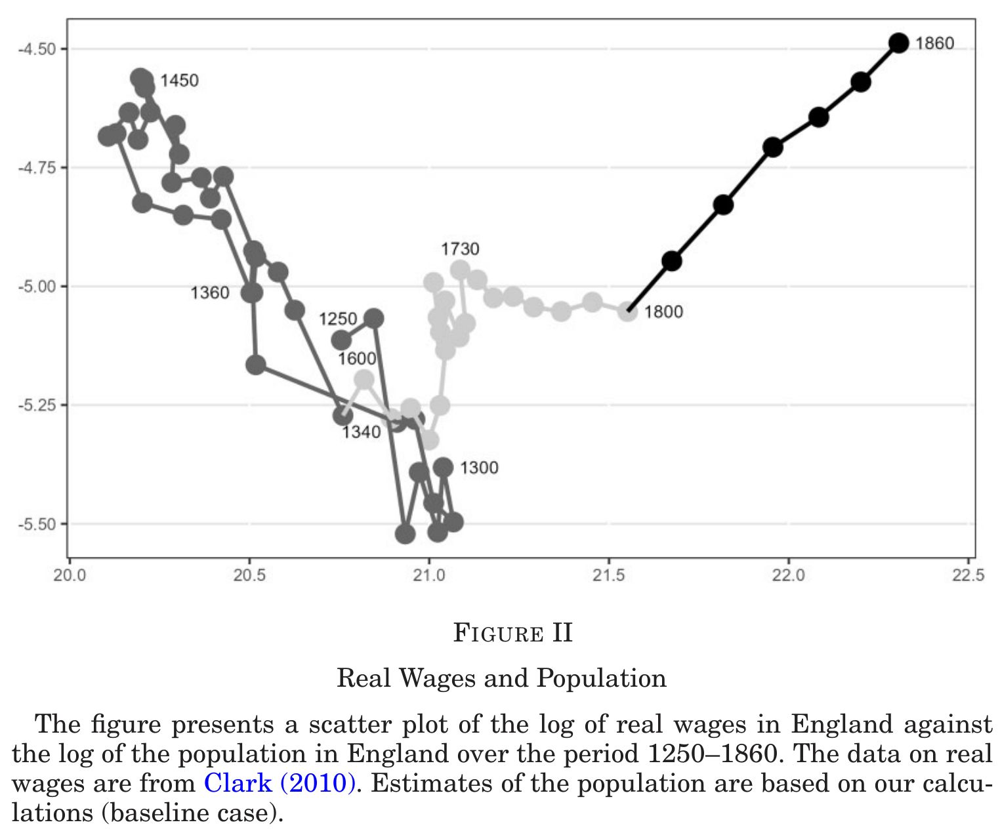
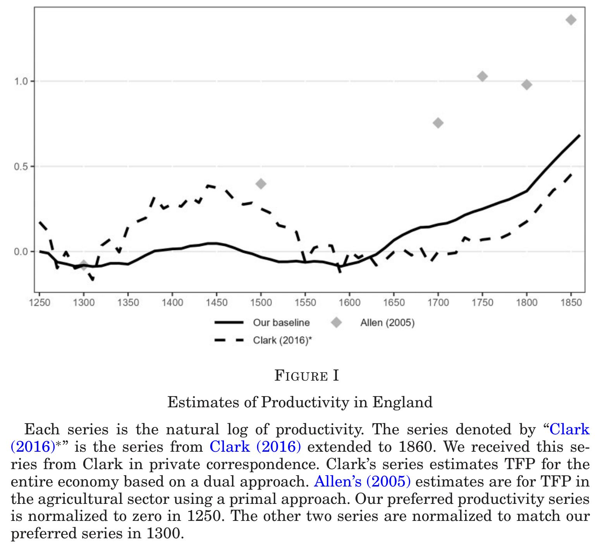
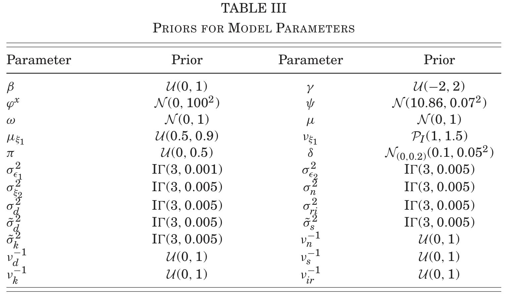
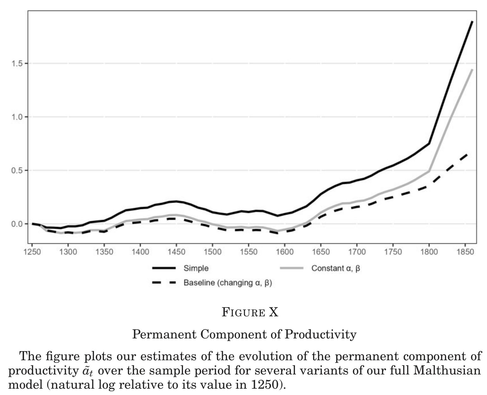
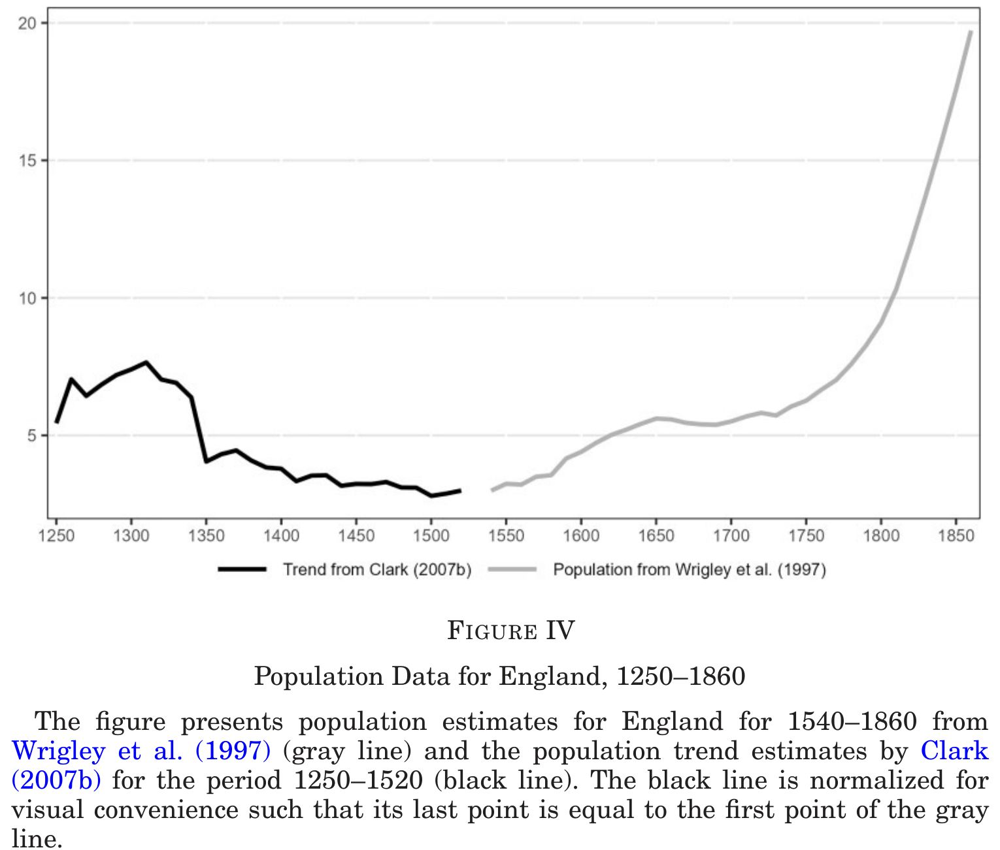
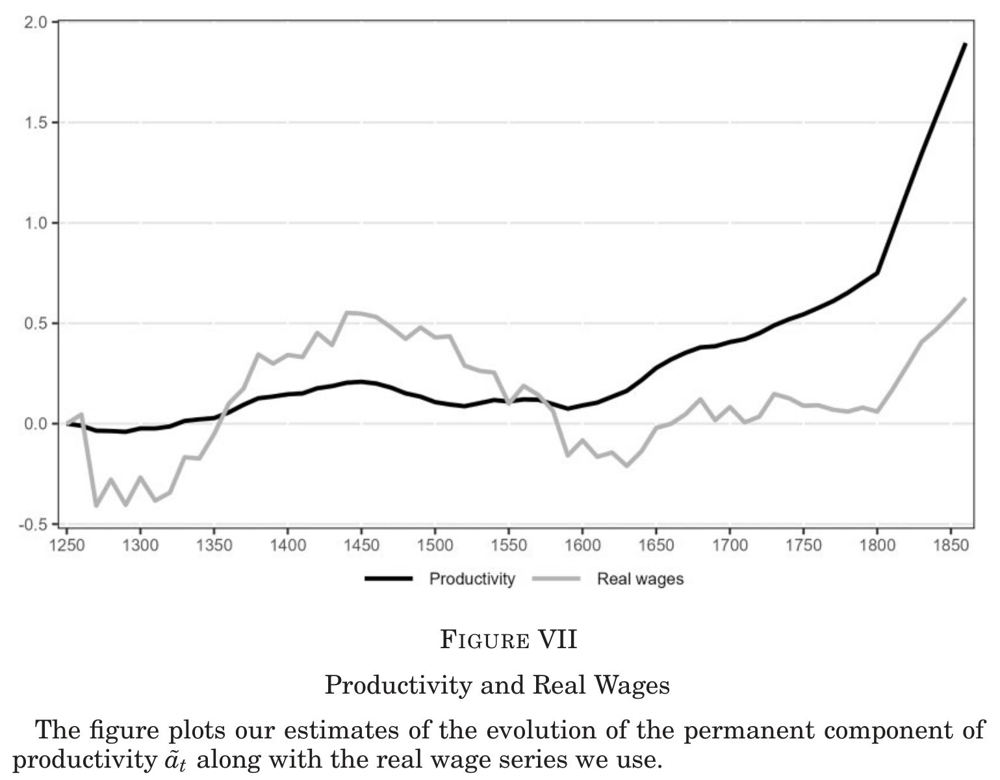
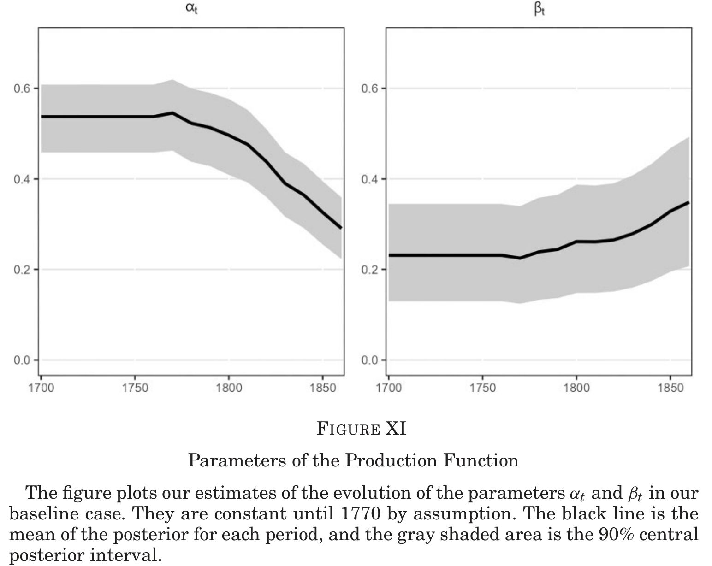
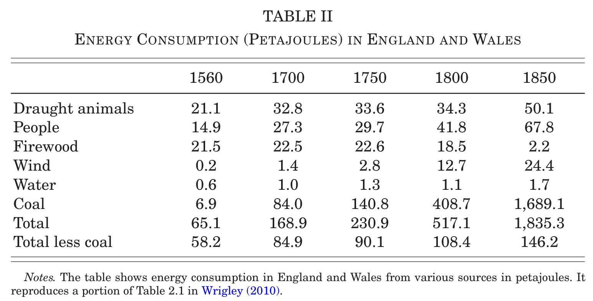
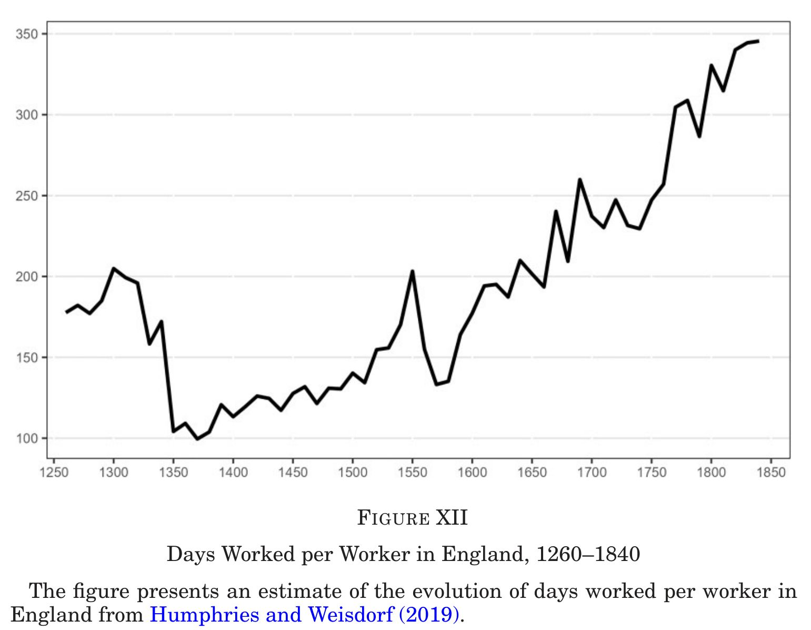

```{css CSS setting, echo=FALSE, results = "hide"}
/* Define a margin before hX (header level X) element */
h1  {
  margin-top: 3ex;
  margin-bottom: 3ex;
  /* background: #c2edff; */ /*背景色*/
  padding: 0.5em;/*文字まわり（上下左右）の余白*/
}
h2  {
  margin-top: 2ex;
  margin-bottom: 2ex;
  padding: 0.5em;/*文字周りの余白*/
  ####color: #010101;/*文字色*/
  color: #87a5f2;
  /* background: #eaf3ff; */ /*背景色*/
  /* border-bottom: solid 3px #516ab6; */ /*下線*/
}
DBlue {
  color: dodgerblue;
}
Blue {
  color: blue;
}
Red {
  color: red;
}
```

<style type="text/css">
  body, td{
  font-size: 16pt;
}
</style>


::: {.flushright}

[doi.org/10.1093/qje/qjae046](https://doi.org/10.1093/qje/qjae046)

:::


# 産業革命の遙か前から成長していた

日の沈まない帝国を統治したエリザベス女王が現在のわれわれの生活を聞いたら、SFか、と思うでしょう。無理もありません。暑いときには冷房の効いた部屋にいながら好きなものが配達されます。お休みには空を飛んで外国に行き、雲を見下ろして食事をしながら宿泊先を予約できます。病気で死ぬ心配が減り、100歳まで生きる人が続出します。誰かから連絡が来ると機械の秘書がスケジュール帳を見て返答の選択肢を話しかけるので、「2番目、この前と違う程々の値段のお土産を買って」と話すと、丁寧な返事を出して相手が好きそうな名産品を程々の値段で注文し、アポ内容を記録してくれます。

こうした現実は経済成長をなしえたからこそ、享受できます。

では、経済成長、つまり、一人あたり所得の成長はなぜ可能になったのでしょうか。その問いに答えるためには、経済成長の開始時期を知る必要があります。経済成長が始まった時期を問われると、イギリスの産業革命(1800年前後)から、と多くの人は考えるかもしれません。しかし、1980年代頃からこうした見方は修正されるようになり、現在は遅くとも18世紀半ばには生産量が増えていたと主張されています。

今回紹介する研究は、驚くべきことに、さらに150年前まで開始時期が遡ると主張しています。彼らの研究では、イギリスでは1600年前後(産業革命の200年前)から成長が始まっていたことを示しています。19世紀の急速な経済成長の前に、200年もの成長期間があったのです。

# 研究デザイン

この研究の面白さはいろいろありますが、変わった面白さとして論文の著者たちがハードコアの経済史家ではないことが挙げられます。著者たちは資料を発掘しデータを作り上げる経済史家ではなく、マクロ経済学の専門家です。このため、この研究では他の経済史家が作成した資料を借用しています。主たる資料は実質賃金[@Clark2010 作成]と人口[@Clark2007b; @WrigleyEtAl1997 作成]で、いずれも1250-1850年の10年ごとの平均値です。既存資料を使いつつ新たな知見を示せたのは、異なる手法を用いたためです。

働き手が増えると賃金は低下します(労働需要曲線が右下がりだからです)。労働量の多寡に応じて決まる賃金水準は、経済全体の生産性(TFP)や労働が生産量に転化する比率(弾力性、正確には労働量1%増加したときの生産量変化率、完全競争労働市場では賃金の変化率に等しい)が高いほど高くなります。違う言い方をすれば、弾力性の値さえ分かれば、労働(=人口)と賃金のデータから生産性を逆算できるのです。これはマクロ経済学の教科書的な手法です。

弾力性の値を得るために、著者たちは黒死病により人口が急減した時期(1348-1366)に着目しました。そしてデータから1340年-1360年の賃金増加率と人口減少率の比を計算し、弾力性の値(0.7)を得ました。著者たちは黒死病という自然実験に着目することで弾力性を計算でき、それゆえに生産性を逆算できたのです。

計算した生産性を図に描くと、生産性は1600年頃から微増し、1810年以降は急激に増えていました。著者たちはモデルを拡張して、現実性を高めた設定でも結果が変わらないことを確認しています。たとえば、資本を生産関数に含めた場合、実質所得が増えることで人口が増えるマルサス的な人口動態を考慮した場合、などです。

# ベイジアン推計

データは10年平均値なので観測できるのは61回だけ(T=61)です。生産性のように長期的に上昇傾向のあるデータは非定常的かもしれません。通常は(標本学派では)非定常性の検定をして、定常・非定常ごとに異なる分析をしますが、61だと非定常性検定のための観測数が十分とはいえません。一方、ベイジアン推計には定常・非定常の区別はなく、すべてに共通の分析ができます。^[この点は筆者の同僚の橋口善弘さんの指摘によります。時間とともに変化する弾力性を推計するカルマン・フィルターも定常データにのみ適用され、かつ、線形性を仮定する必要があります。 ]こうした利点からか、著者たちはベイジアン推計を採用しています。 ^[一方、小標本なので事前分布の影響を受けやすいことを念頭に置く必要があります。 ] 著者たちはデータの測定誤差に配慮し、その影響をベイジアン推計に巧みに取り込んでいます。

# 成長のきっかけは何か

1600年前後というタイミングを確定させることは何でもないように思えますが、学術的には大きな影響力を持っています。成長の契機として主張されてきた各学説のうち、1600年よりも大幅に遅い出来事は却下されるためです。最たる例が名誉革命(1688年)です。これ以降、議会によって王権は制限され、徴税が乱発されず私的所有権が保障され、囲い込み(エンクロージャ)にも発展しました。1600年前後は @NorthWeingast1989 や @BogartRichardson2011 らの名誉革命&rarr;産業革命とする見解と矛盾するとまでいえませんが、第二義的な影響しかなかったといえそうです。

1600年前後と整合的な学説は、農業の生産性上昇と農業就労人口低下[@WallisColsonChilosi2018]、ヘンリー8世の教会領没収[@HeldringRobinsonVollmer2021]、ヨーマンの興隆[@Allen1992]、貿易・植民地とロンドン都市化[]、活版印刷と識字率上昇[@Dittmar2011]などです。一方、進歩主義思想・ブルジョワ的価値[@Mokyr2009; @Mokyr2016;  @McCloskey2006]やプロテスタンティズムの倫理[@Weber1904; @Tawney1926]などは整合的であるがタイミングを示しづらい、と著者たちは述べています。

# エネルギー革命の証拠

産業革命といえば、蒸気機関+紡績機械=大量生産、というイメージがあるかもしれません。これを可能にしたのは、生産で用いる動力源を森林、役畜、人間などから石炭に代替させたエネルギー革命です。これを生産過程の入力・出力として表現すると、生産における土地の重要性低下と言い換えられます。森林、役畜、人間が動力を提供するためには、森林が土地を要するだけでなく、飼料、食料のために耕作地が欠かせません。石炭が動力源の主力になり工場生産が増えると、生産額一単位あたりに土地を以前ほど使わなくなります。つまり、容易に増やすことのできない土地の制約から経済を解放し、生産を(工場内で)増やせるようになったのです。これに応じて、年間労働日数も成長開始前の約150日から1800年代以降は2倍以上に延びています。

土地をあまり使わなくなると、土地の入力量の変化に対し生産量が反応しなくなります。つまり、生産の土地弾力性が下がります。著者たちは、労働、資本、土地の3要素を用いる生産関数を推計し、この解釈通りに産業革命以降に土地の弾力性が半減したことを示しました。それと対応して、資本と労働の弾力性が高まっていました。成長開始期の特定と直接の関係はないですが、エネルギー革命の証拠を生産関数を用いて示したのは画期的といえます。

# マルサス的モデルの有効性

本研究はマルサス的な人口動態を考慮した理論モデルの枠組みにデータを流し込むことで、成長開始とその後の加速を示しています。これはマルサス的モデルの有効性を示すことにもなっています。第一に、マルサス的な貧困の罠に瀕しながら蒸気機関登場前のイギリスで成長が開始したことは、(古代ギリシャ、古代ローマ、宋代中国、イスラム黄金期など)古代から中世における持続的経済成長期(efforescence)もマルサス的な貧困の罠と矛盾しないことを示しました。第二に、18世紀に発生した生産拡大の中の賃金停滞(Engels' Pause)は、マルサス的な人口増大によって引き起こしたものであり、エンゲルスが主張したような資本家による搾取、つまり、労働分配率(コブ・ダグラス型生産関数での労働弾力性)の低下が原因ではないことを示しました。

# 途上国への示唆

成長の開始時期を今まで考えられていたよりも昔の年代に特定したことだけでは、何が成長を引き起こしたか分かりません。よって、このこと自体に現代の途上国への示唆はないように思えます。自然に成熟して産業革命に到達したイギリスはそのまま成長を続けましたが、ベルギーやドイツのように、政府が主導して意識的に産業革命に到達した後発国の経験を学ぶべきかもしれません。むろん、国際競争環境は当時と現代では大きく異なります。石炭供給と鉄鋼生産(ベルギーの例は本コラム「共謀したのは労働者の搾取」でも紹介)などを現代風に置き換える必要があるでしょう。

一定の教育水準を備えた労働力の供給、技術と資本の(国外からの)誘致、インフラと生産に関わる諸制度の整備など、イギリスが時間をかけて得たものを圧縮して提供するのは大変です。しかし、さまざまな努力の結果、成長の開始から4と四半世紀を経て、バングラデシュやエチオピアといった一昔前の最貧国でも成長が始まっている例が出てきています。

<!--
イギリスでも国際貿易は産業革命後の成長にとって必須でした。アメリカなどの市場規模大国を除き、現在までの各国の経済成長でも同様です。東アジアだけでなく、バングラデシュでも、エチオピアでも、輸出志向的な産業が成長をもたらしました。
-->

::: {.column-margin}
{#fig-Fig02}

{#fig-Fig01}
:::

* Growth = Industrial Revolution began in 1600's

    <table style="margin: 10px auto; width: auto !important; border-collapse: collapse; line-height: 1.2;">
      <thead>
        <tr>
          <th style="text-align: center; padding: 4px 20px; border-bottom: 1px solid currentColor;">period</th>
          <th style="text-align: center; padding: 4px 20px; border-bottom: 1px solid currentColor;">growth</th>
        </tr>
      </thead>
      <tbody>
        <tr>
          <td style="text-align: right; padding: 2px 20px;">&#45; 1600</td>
          <td style="text-align: center; padding: 2px 20px;">0%</td>
        </tr>
        <tr>
          <td style="text-align: center; padding: 2px 20px;">1600 &#45; 1810</td>
          <td style="text-align: center; padding: 2px 20px;">2%</td>
        </tr>
        <tr>
          <td style="text-align: left; padding: 2px 20px;">1810 &#45;</td>
          <td style="text-align: center; padding: 2px 20px;">5%</td>
        </tr>
      </tbody>
    </table>

    * Not after the Glorious Revolution, as argued in the literature
    * Predates 100 years from the Glorious Revolution
* A new series of TFP (1250-) is computed by combining existing data, a labour demand function, and Black Death as an exogenous population shock
* Increased TFP growth may be due to: 
    * Reformation 宗教改革
    * decline of feudalism
    * rise of yeoman
    * movable type printing and increase in literacy
    * international trade
* Post Industrial Revolution (1810-) growth is explained by release from fixed land constraint (steam engines) and increased days worked

# Research design

:::: {.callout-important title='Variable definitions' collapse='true'}
| Category | Symbol | Definition / Description |
| :--- | :--- | :--- |
| **Observed Data & State Variables** | $w_t$ | Log of real wages |
| | $l_t$ | Log of total labor supply |
| | $n_t$ | Log of the population |
| | $d_t$ | Log of days worked per worker per year |
| | $k_t$ | Log of the capital stock |
| | $s_t$ | Log of the rental price of land |
| | $r_t$ | Rental rate for capital <br>*(Note: kept as a rate, appears in equations as $\log(r_t + \delta)$)* |
| | $Z$ | Fixed quantity of land <br>*(Appears in equations as $\log Z$)* |
| **Productivity Measures** | $a_t$ | Log of Total Factor Productivity (TFP) |
| | $\tilde{a}_t$ | Permanent (random-walk) component of TFP |
| | $m_t$ | Log of the Malmquist productivity index <br>*(Accounts for structural change when $\alpha_t, \beta_t$ vary)* |
| | $\tilde{m}_t$ | Permanent component of the Malmquist productivity index |
| | $\bar{w}$ | Theoretical steady-state real wage <br>*(Derived from the Malthusian model)* |
| | $\hat{x}_t$ | Difference/growth from the previous period <br>*(i.e., $x_t - x_{t-1}$)* |
| | $\bar{x}_t$ | Average of the current and previous period <br>*(i.e., $\frac{x_{t-1} + x_t}{2}$)* |
| **Structural Parameters** | $\alpha, \alpha_t$ | Elasticity of output with respect to land <br>*(Represents slope of labor demand in the simple model)* |
| | $\beta, \beta_t$ | Elasticity of output with respect to capital <br>*(Note: $1 - \alpha - \beta$ equals labor elasticity)* |
| | $\delta$ | Rate of depreciation of capital |
| | $\lambda$ | Log of the labor scaling constant $\Lambda$ <br>*(Maps population and days worked into total labor force)* |
| | $\mu$ | Average growth rate of productivity <br>*(Drift parameter in the random walk process)* |
| | $\gamma$ | Elasticity of population growth to real income <br>*(Represents the "Malthusian population force")* |
| | $\phi, \phi_t, \tilde{\phi}$ | Constant terms aggregating structural parameters, <br>fixed land ($Z$), and the labor scaling constant ($\lambda$) |
| | $\omega$ | Constant drift term in the population growth equation |
| **Shocks & Error Processes** | $\epsilon_{1t}$ | Permanent productivity shock <br>*(Innovation to the random walk of $\tilde{a}_t$ or $\tilde{m}_t$)* |
| | $\epsilon_{2t}$ | Transitory productivity shock <br>*(Captures weather variations, short-term noise, etc.)* |
| | $\xi_t$ | Total exogenous shock to population growth |
| | $\xi_{1t}$ | "Plague" shock <br>*(Rare, large negative shock modeled via mixture distribution)* |
| | $\xi_{2t}$ | Normal/transitory exogenous population shock |
| | $\sigma_{\epsilon_1}^2, \sigma_{\epsilon_2}^2, \sigma_{\xi_2}^2$ | Variances of their respective independent normal distributions |
| | $\iota_t$ | Measurement errors mapping true unobserved variables <br>to noisy observed data *(e.g., $\iota_t^d$ for days, $\iota_t^r$ for rates)* |
::::

:::: {.callout-important title='Model and data' collapse='true'}

 **1. The Simple Model (Section II)**

*   **Used for:** Table I, Figure V, Figure VI
*   **Data:** Real wages ($w_t$), Population ($l_t$)
*   **Equations:** 
    *   $a_t = w_t + \alpha l_t - \phi$ (from 1)
    *   $a_t = \tilde{a}_t + \epsilon_{2t}$ (6)
    *   $\tilde{a}_t = \mu + \tilde{a}_{t-1} + \epsilon_{1t}$ (2)
*   **Plots/Estimates:** 
    *   **Table I:** Estimates average growth $\mu$.
    *   **Figure V:** Plots posterior probability of structural breaks in $\mu$.
    *   **Figure VI:** Plots the permanent component $\tilde{a}_t$.
*   **Assumptions:** $\epsilon_{1t} \sim \mathcal N(0, \sigma_{\epsilon_1}^2)$ and $\epsilon_{2t} \sim \mathcal N(0, \sigma_{\epsilon_2}^2)$ are assumed independent over time. 

 **2. Full Malthusian Model: Constant $\alpha, \beta$ (Section III.A)**

*   **Used for:** Table IV ("Constant $\alpha, \beta$"), Figure X ("Constant $\alpha, \beta$")
*   **Data:** Real wages ($w_t$), Population ($n_t$), Days worked ($d_t$), Rates of return ($r_t$)
*   **Equations:**
    *   $a_t = (1-\beta)(w_t - \tilde{\phi}) + \alpha(d_t + n_t) + \beta \log(r_t + \delta)$ (from 8)
    *   $a_t = \tilde{a}_t + \epsilon_{2t}$ (6)
    *   $\tilde{a}_t = \mu + \tilde{a}_{t-1} + \epsilon_{1t}$ (7)
    *   $n_t - n_{t-1} = \omega + \gamma(w_{t-1} + d_{t-1}) + \xi_t$ (9)
    *   $\xi_t = \xi_{1t} + \xi_{2t}$ (10)
*   **Plots/Estimates:** $\mu$ (Table IV), $\tilde{a}_t$ (Figure X).
*   **Assumptions:** $\epsilon_{1t}$ and $\epsilon_{2t}$ are assumed independent. Population shocks consist of a rare plague mixture shock $\xi_{1t}$ (11) and a normal shock $\xi_{2t} \sim \mathcal N(0, \sigma_{\xi_2}^2)$, which are assumed independent. 

 **3. Early Industrial Economy: Time-Varying $\alpha_t, \beta_t$ (Section III.B)**

*   **Used for:** Table IV ("Baseline"), Table V, Figure I, Figure X ("Baseline"), Figure XI, Figure XIII, Figure XVI, Figure XVII
*   **Data:** $w_t$, $n_t$, $d_t$, $r_t$, Capital stock ($k_t$), Land rents ($s_t$)
*   **Equations:**
    *   $\alpha_t, \beta_t$ are pinned down by land and capital demand: 
        * $s_t = w_t + n_t + d_t - \log Z + \log \alpha_t - \log(1 - \alpha_t - \beta_t) + \lambda$ (15)
        * $\log(r_t + \delta) = w_t + n_t + d_t - k_t + \log \beta_t - \log(1 - \alpha_t - \beta_t) + \lambda$ (16)
    *   $a_t$ is extracted via labor demand: 
        * $w_t = \phi_t + \frac{1}{1-\beta_t}a_t - \frac{\alpha_t}{1-\beta_t}(d_t + n_t) - \frac{\beta_t}{1-\beta_t}\log(r_t + \delta)$ (13)
    *   Converted to Malmquist productivity index ($m_t$) to account for structural change: 
        * $\hat{m}_t = \hat{a}_t + \hat{\alpha}_t \log Z + \hat{\beta}_t \bar{k}_t - (\hat{\alpha}_t + \hat{\beta}_t)(\bar{d}_t + \bar{n}_t + \lambda)$ (18)
    *   $m_t = \tilde{m}_t + \epsilon_{2t}$ (19)
    *   $\tilde{m}_t = \mu + \tilde{m}_{t-1} + \epsilon_{1t}$ (20)
    *   Population dynamics follow (9) and (10) as above.
*   **Plots/Estimates:** 
    *   **Table IV:** Estimates $\mu$.
    *   **Table V:** Estimates population income elasticity $\gamma$.
    *   **Figure I, Figure X, Figure XIII:** Plots the permanent component $\tilde{m}_t$ ($\tilde{a}_t$).
    *   **Figure XI:** Plots extracted structural parameters $\alpha_t, \beta_t$.
    *   **Figure XVI:** Plots $n_t$ simulated iteratively forward using (9) with shocks set to zero.
    *   **Figure XVII:** Plots $n_t$ estimated from the state-space model incorporating shock processes (10) and (11).
*   **Assumptions:** Independence is assumed between $\epsilon_1, \epsilon_2$ and between $\xi_1, \xi_2$. Factor share simplex ($\alpha_t, \beta_t, 1-\alpha_t-\beta_t$) is assumed to follow a Dirichlet prior distribution to discipline structural change after 1760. Input data assumed measured with independent error processes ($\iota_t$).

 **4. Steady-State Analytics (Section V)**

*   **Used for:** Figure XIV, Figure XV
*   **Data:** $w_t$, $d_t$ (as well as posterior parameters from Section III.B)
*   **Equations:**
    *   $\bar{w} = \frac{\mu}{\alpha \gamma} + \text{constant}$ (21)
*   **Plots/Estimates:** 
    *   **Figure XIV:** Plots the theoretical $\bar{w}$ mapping across different values of $\alpha$ and $\mu$.
    *   **Figure XV:** Plots the ratio of theoretical steady-state wage $\bar{w}$ derived via (21) against the actual data $w_t$.

**5. Pure Data / No Structural Model Applied**

*   **Used for:** Table II, Table III, Figure II, Figure III, Figure IV, Figure VIII, Figure IX, Figure XII.
*   **Methodology:** These display raw historical input data, simple transformations (scatter plots), or statistical priors (Table III). No structural equations or error processes are applied.
::::


## Simplest method

Data
: Land, real wage^[@Clark2010 ], population^[1250-1540 population is imputed with time and village/manor FEs in @Clark2007b, 1540-1860 is from @WrigleyEtAl1997 ] ^[Measurement errors in observed population $n_t$ with true population $\tilde{n}_t$
$$
n_t = \psi + \tilde{n}_t + \iota_t^n
$$
$$
\iota_t^n \sim t_{\nu_n}(0, \sigma_n^2)
$$
]

CD production
: $Y_{t}=A_{t}Z^{\alpha}L^{1-\alpha}_{t}$ &rarr;FOC&rarr; $w_{t}=\phi+a_{t}-\alpha l_{t}$, $\phi = \ln(1 - \alpha) + \alpha \ln Z$^[Assume: Fixed supply of labour ($\propto$ population) ] 

Identification of $\alpha$
: $\alpha=\frac{\Delta W_{t}}{\Delta L_{t}}$ before/after Black Death&rarr;$\hat{\alpha}=.7$

Backing out TFP
: $\hat{a}_{t}=w_{t}-\hat{\phi}+\hat{\alpha} l_{t}$

Separate permanent and transitory TFP by Brownian motion with drift
: $\tilde{a}_t = \mu + \tilde{a}_{t-1} + \epsilon_{1t}$

Normalisation equation for real wages
: $w_t = \phi^w + \tilde{w}_t \quad \text{where} \quad \phi^w \sim \mathcal N(0, 100^2)$

Structural break in $\mu$
: Separating to 3 periods, data suggests break years at 1600, 1810


## A fixed elasticity Malthusian model

Merit: Capital is incorporated

Add

Data
: Interest rate (rent charges on collaterallised loans), days worked^[From @HumphriesWeisdorf2019 ]

Production function and optimisation
: $Y_t = A_t Z^\alpha K_t^\beta L_t^{1-\alpha-\beta}$ &rarr;FOCs&rarr; $w_t = \phi + \frac{1}{1-\beta} a_t - \frac{\alpha}{1-\beta} (d_t + n_t) - \frac{\beta}{1-\beta} \ln(r_t + \delta)$^[More general prod func: $Y_t = A_t F(Z,L_t,K_t)$ &rarr;FOCs and ln linearise&rarr; $w_t \approx \tilde{\varphi} + (1+\tilde{\beta})a_t
           - \tilde{\alpha}\ell_t
           - \tilde{\beta}\ln(r_t+\delta)$ with
$\tilde{\alpha} = -\frac{L}{F_LF_{KK}}\!\left(F_{LL}F_{KK}-F_{LK}^2\right), \tilde{\beta}  = -\frac{F_KF_{LK}}{F_LF_{KK}}$ ]

Malthusian population dynamics
: $n_t - n_{t-1} = \omega + \gamma(w_{t-1} + d_{t-1}) + \xi_t$

Measurement equation
: $r_t = \tilde{r}_{it} + \iota_{it}^r \quad \text{where} \quad \iota_{it}^r \sim t_{\nu_{ir}}(0, \tilde{\sigma}_{ir}^2)$ for $i$= interest rates, land rents, if no interest rates or land rents, $r_t \sim \mathcal N_{(0,.2)}(r_{t-1}, 0.01^2)$


## A varying elasticity Malthusian model

Merit: Structural change (elasticity change) is incorporated

Add

Data
: Net capital stock^[From @Feinstein1988 ], land rents $S_{t}$^[From @Clark2002 ]

3 factor CD production
: $Y_t = A_t Z^{\alpha_t} K_t^{\beta_t} L_t^{1-\alpha_t-\beta_t}$ &rarr;FOCs&rarr; $s_t = w_t + n_t + d_t - \ln Z + \ln \alpha_t - \ln(1 - \alpha_t - \beta_t) + \lambda$, $\ln(r_t + \delta) = w_t + n_t + d_t - k_t + \ln \beta_t - \ln(1 - \alpha_t - \beta_t) + \lambda$
These 2 eqns give $\alpha_{t}, \beta_{t}$

Malmquist index
:  For time-variant production technology $\hat{m}_t = \hat{a}_t + \hat{\alpha}_t \ln Z + \hat{\beta}_t \bar{k}_t - (\hat{\alpha}_t + \hat{\beta}_t)(\bar{d}_t + \bar{n}_t + \lambda)$

Measurement errors
: $s_t = \tilde{s}_t + \iota_t^s \quad \text{where} \quad \iota_t^s \sim t_{\nu_s}(0, \tilde{\sigma}_s^2)$, $k_t = \tilde{k}_t + \iota_t^k \quad \text{where} \quad \iota_t^k \sim t_{\nu_k}(0, \tilde{\sigma}_k^2)$, $m_t = \tilde{m}_t + \epsilon_{2t} \quad \text{where} \quad \epsilon_{2t} \sim \mathcal N(0, \sigma_{\epsilon_2}^2)$, $\tilde{m}_t = \mu + \tilde{m}_{t-1} + \epsilon_{1t} \quad \text{where} \quad \epsilon_{1t} \sim \mathcal N(0, \sigma_{\epsilon_1}^2)$

Normalisation equation
: $K_t = \phi^K + \tilde{K}_t \quad \text{where} \quad \phi^K \sim \mathcal N(0, 100^2)$, $S_t = \phi^S + \tilde{S}_t \quad \text{where} \quad \phi^S \sim \mathcal N(0, 100^2)$

## Data issues

* $T=61$ for real wages and population
* $T=10$ (1760-1860) for capital, interest rates, land rents

Despite the power limitations, the only estimate with large $p$ value is

* Table V baseline $\hat\gamma$ = 0.03, CI [−0.06, 0.12] — the Malthusian feedback is
  imprecisely estimated with fixed days worked

# Bayesian estimation

{#tbl-Tab03}

* MCMC (not Gibbs sampling, Hamiltonian MC)
* Assume Dirichlet likelihood for $\alpha_t, \beta_t, 1-\alpha_t - \beta_t$

## $\tilde{a}_{t}$ likelihood

Substitute (6) into (8):
$$
w_t = \underbrace{\phi + \frac{1}{1-\beta}\,\tilde{a}_t
      - \frac{\alpha}{1-\beta}(d_t+n_t)
      - \frac{\beta}{1-\beta}\ln(r_t+\delta)}_{\displaystyle\mu_{w,t}(\tilde{a}_t)}
    \;+\; \frac{\varepsilon_{2t}}{1-\beta}
$$
Wage conditional likelihood for (8) through transitory shock $\varepsilon_{2t} \sim \mathcal N(0,\sigma_2^2)$
$$
w_t \;\Big|\; \tilde{a}_t,\,n_t,\,d_t,\,r_t,\,\alpha,\beta,\phi
\;\sim\;
\mathcal N\left(\mu_{w,t}(\tilde{a}_t),\;
\left[\frac{\sigma_2}{1-\beta}\right]^{\!2}\right)
\tag{$\mathcal{L}_8$}
$$
where
$$
\mu_{w,t}(\tilde{a}_t) \;\equiv\;
\phi + \frac{\tilde{a}_t}{1-\beta}
      - \frac{\alpha}{1-\beta}(d_t+n_t)
      - \frac{\beta}{1-\beta}\ln(r_t+\delta)
$$
(7) is the state transition for $\tilde{a}_t$.  It contributes a separate likelihood factor (state equation) throgh $\varepsilon_{1t} \sim \mathcal N(0,\sigma_1^2)$:
$$
\tilde{a}_t \;\Big|\; \tilde{a}_{t-1},\mu,\sigma_1
\;\sim\; \mathcal N(\mu + \tilde{a}_{t-1},\;\sigma_1^2)
\tag{$\mathcal{L}_7$}
$$


## $n_{t}$ likelihood

Define the deterministic part of equation (9):
$$
\mu_{n,t} \;\equiv\; \omega + \gamma(w_{t-1} + d_{t-1}) + n_{t-1}
$$

Then $n_t = \mu_{n,t} + \xi_{1t} + \xi_{2t}$.  The noise $\xi_{2t}
\sim \mathcal N(0,\sigma_\xi^2)$ makes $n_t$ normal *conditional on*
$\xi_{1t}$.  The plague shock $\xi_{1t}$ shifts the mean; its occurrence
is uncertain.

The plague indicator is not observed.  Integrating over plague shock gives a
two-component mixture:
\begin{align}
p(n_t &\mid w_{t-1},d_{t-1},n_{t-1},\xi_{1t},\pi)\\
& = 
\pi\cdot\mathcal N\bigl(n_t;\;\mu_{n,t}+\xi_{1t},\;\sigma_\xi^2\bigr)\\
&\hspace{1em}+ (1-\pi)\cdot\mathcal N\bigl(n_t;\;\mu_{n,t},\;\sigma_\xi^2\bigr)
\tag{$\mathcal L_{9}$}
\end{align}
where $\xi_{1t} = \ln(\mathrm{XI1}_t)$ and
$\mathrm{XI1}_t \sim \mathrm{Beta}(\beta_1,\beta_2)$.

The plague intensity $\mathrm{XI1}_t$ (fraction of population surviving)
is itself a sampled parameter with its own likelihood:
$$
\mathrm{XI1}_t \sim \mathrm{Beta}(\beta_1,\beta_2), \qquad
\xi_{1t} = \ln(\mathrm{XI1}_t) \leq 0
$$
So log-likelihood is
\begin{align}
\ln p(n_t,&\,\mathrm{XI1}_t \mid \cdot)\\
&= \underbrace{\ln\mathrm{Beta}(\mathrm{XI1}_t;\beta_1,\beta_2)}_{\text{plague intensity prior}}\\
&+ \underbrace{\ln\!\left[
    \pi\,\phi_{\sigma_\xi}\!\left(n_t - \mu_{n,t} - \xi_{1t}\right)
  + (1-\pi)\,\phi_{\sigma_\xi}\!\left(n_t - \mu_{n,t}\right)
  \right]}_{\text{mixture population likelihood}}
\end{align}
where $\phi_{\sigma}(\cdot)$ is the $\mathcal N(0,\sigma^2)$ density.
\begin{alignat}{2}
\ln L_t &=
&\underbrace{\ln p(\tilde{a}_t \mid \tilde{a}_{t-1})}_{\mathcal{L}_7:\;\text{state eq.}}
&+\underbrace{\ln p(w_t \mid \tilde{a}_t,\ldots)}_{\mathcal{L}_8:\;\text{wage eq.}}\\
&\hspace{1em}+ 
&\underbrace{\ln p(\mathrm{XI1}_t \mid \beta_1,\beta_2)}_{\text{plague intensity}}
&+\underbrace{\ln p(n_t \mid w_{t-1},n_{t-1},\xi_{1t})}_{\mathcal{L}_9:\;\text{pop. eq.}}
\end{alignat}

## Dirichlet likelihood

* Simplex ($\alpha_t, \beta_t, 1-\alpha_t-\beta_t$) is assumed to follow Dirichlet with concentration parameter $c_{s}$
* $c_{s}\times(\alpha_t, \beta_t, 1-\alpha_t-\beta_t) \sim DirMult(\theta|c_{b})$
* $c_{s}=3$ &rArr; mean = first lag

# Results

## Onset

::: {.column-margin}
{#fig-Fig10}

{#fig-Fig04}

{#fig-Fig07}
:::

* No growth (- 1600) &rarr; low growth (1600-1810) &rarr; high growth (1810-) @fig-Fig10
* Engels' Pause (no wage growth despite increased TFP growth) is due to population growth, not a decline in labour share [@fig-Fig04]

### Off

By dating the onset of growth at 1600, below is ruled out:

* Glorious Revolution (1688) [@NorthWeingast1989]^[North and Weingast
argue that the post-GR power-sharing arrangement among Parliament, the Crown,
and the common law courts secured property rights and rule of law, laying the
foundation for growth. Ruled out as the *onset*: productivity already rose 34%
from 1600 to 1680—roughly a century before 1688. ]

* English Civil War (1642–1651) and Glorious Revolution as joint cause
[@AcemogluJohnsonRobinson2005]^[Acemoglu, Johnson, and Robinson synthesize
the Marxist and institutionalist views: Atlantic trade enriched a merchant
class that then secured property rights through the Civil War and the Glorious
Revolution. Ruled out as the trigger: growth preceded the Civil War by ~40
years, and no acceleration is detected in the immediate aftermath of either
event (decadal TFP growth: 3.2% in 1600–1640, 4.2% in 1640–1680, 4.5% in
1680–1810). ]

* Post-Glorious Revolution property rights and enclosure reforms
[@BogartRichardson2011]^[Bogart and Richardson stress the post-GR regime's
reorganization of property rights through enclosures, statutory authority
acts, and estate acts. Ruled out as the *onset*; the authors note these
reforms may have helped *sustain* growth already underway. ]

* Industrial Revolution (~1800) as the genesis of growth^[The traditional
view holds that growth began with industrialization around 1800. Ruled out:
BNS estimate 2% per decade TFP growth from 1600 to 1800, well before the IR.
The larger post-1810 acceleration (5% per decade) is attributed largely to
structural change—a falling land share in production—not faster productivity
growth. ]

* Capital capturing the gains from technical change as the explanation for
Engels' Pause [@Allen2009b; @AcemogluRestrepo2019a]^[The standard view of
stagnant real wages in the late eighteenth century is that the fruits of
technical change accrued to capital rather than labor—an idea with modern
resonance in discussions of automation and AI. BNS instead attribute Engels'
Pause to rapid population growth exerting Malthusian downward pressure on the
marginal product of labor. ]


### Still on

Corroborating (external data independently confirm the timing)

* Onset of structural transformation away from agriculture
  [@WallisColsonChilosi2018]^[Wallis, Colson, and Chilosi estimate
  that the share of workers in agriculture began a sustained fall around
  1600 after being stable in the sixteenth century, and that labour
  productivity in agriculture, industry, and services all started rising
  around 1600. The paper calls this alignment "lines up well." ]

Consistent (timing of historical events aligns with 1600)

* Dissolution of the English monasteries and land-market shock
  [@HeldringRobinsonVollmer2021]^[Henry VIII's confiscation of monastic
  lands (1530s–1540s) was a large shock to land ownership and the land
  market. England also became a destination for skilled Protestant
  immigrants fleeing persecution on the continent. The paper calls the
  Reformation "an obvious candidate." ]
* Rise of the yeoman class and gradual expansion of property rights
  [@Allen1992]^[Allen argues that a 600-year process from the Norman
  Conquest culminated in the sixteenth century with the yeoman class
  holding a substantial proprietary interest in land, and hence an
  incentive to innovate. The paper notes this "lines up reasonably well"
  with the estimated onset. ]
* Atlantic trade, colonisation, and London's urbanisation^[The British
  East India Company was founded in 1600; the Virginia Company established
  its first permanent North American settlement in 1607. London's population
  exploded from 55,000 (1520) to 475,000 (1670), driven by rapid expansion
  of international trade in woollens, intercontinental commerce, and
  privateering. Timing coincides directly with the 1600 break. ]
* Printing press and rising literacy [@Dittmar2011]^[Spread of
  movable-type printing after 1450 produced large literacy gains in England
  in the sixteenth and seventeenth centuries and a sharp fall in book
  prices. Dittmar finds that cities exposed to printing grew substantially
  faster than otherwise comparable cities. Timing is consistent with the
  1600 onset. ]
* Marxist view: economic change propels political change
  [@Marx1867; @MarxEngels1848]^[Marx stressed the transition from
  feudalism to capitalism—expulsion of peasants through enclosure creating
  a proletariat available for wage labour, ultimately driving political
  revolution. The finding that growth preceded both the Civil War and the
  Glorious Revolution is consistent with economic transformation causing
  political change rather than the reverse. The paper says this "lends
  support" to the Marxist view. ]

Consistent but timing hard to pin down

* Culture of progress and bourgeois values [@Mokyr2009; @Mokyr2016;
  @McCloskey2006]^[Mokyr and McCloskey argue that the crucial change was
  the emergence of a science-based culture holding that human conditions
  can be improved through rational thought. The paper notes the timing
  "lines up reasonably well" but acknowledges it is "not straightforward
  to pinpoint precisely what these theories imply about the timing of the
  onset of growth." ]
* Protestant ethic and Puritanism [@Weber1904; @Tawney1926]^[Weber and
  Tawney link the Protestant Reformation to attitudes favouring diligence,
  thrift, and commercial activity. The paper applies the same caveat as
  for culture-of-progress theories: timing is reasonably consistent but
  imprecise. ]

Complementary (explains the character of the Industrial Revolution, not its onset)

* High-wage, cheap-coal theory of the Industrial Revolution
  [@Allen2009a]^[Allen argues that the IR took the particular form it
  did—labour-saving textile machinery, steam engines—because growth in the
  seventeenth century had already pushed English wages high relative to
  coal prices, making it uniquely profitable to invent such technologies.
  The paper notes this "helps explain how growth was sustained and the
  particular direction it took" but does not point to it as the genesis
  of growth. ]


## Modest growth after the onset

Efforescence: Sustained growth prior to Industrial Revolution

* Ancient Greece, ancient Rome, Song China (宋960–1279), Islamic golden age, golden age of Holland
* Often used as evidence against a Malthusian model
* Similar to the Malthusian model of England 1600-1810


## Post Industrial Revolution

This is more of a secondary research question, but a very insightful finding


::: {.column-margin}
{#fig-Fig11}

{#tbl-Tab02}

{#fig-Fig12}
:::

* Decline in importance of land in production (@fig-Fig11)
* (Not a result): Steam engine took over after 1810 (@tbl-Tab02)
* (Not a result): Days worked increased (@fig-Fig12)

By easing the fixed land constraint, people started to work longer and production increased with more labour and capital


# 感想

* 世界で経済発展が開始した年代を特定した影響力のある論文
* 他人のデータを使いつつ、単純なモデルと組み合わせることで新たな発見を提供したお手軽論文かと思って読み始めた
* 読み進めると、Bayesianを使う仕掛けをそこら中に仕込んだ手の込んだ論文だと分かった
* 産業革命の解釈: 経済活動を土地制約から開放したこと
* 蒸気機関さまさま
* Vent for surplus: 余剰だった労働が不足になった
* T=61、仕方ないが...
* 今後もこの分野は、推計方法の改善よりもデータ構築の方が貢献度は高い


