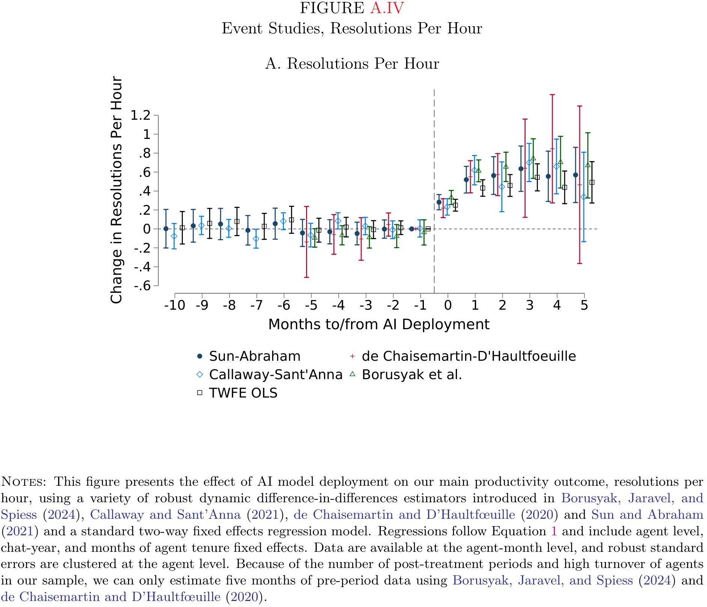
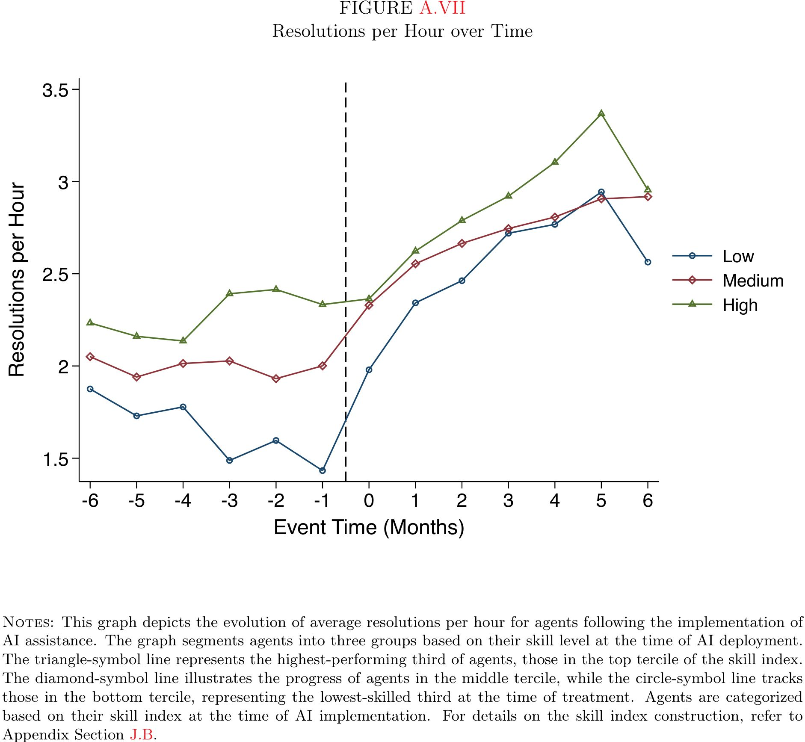
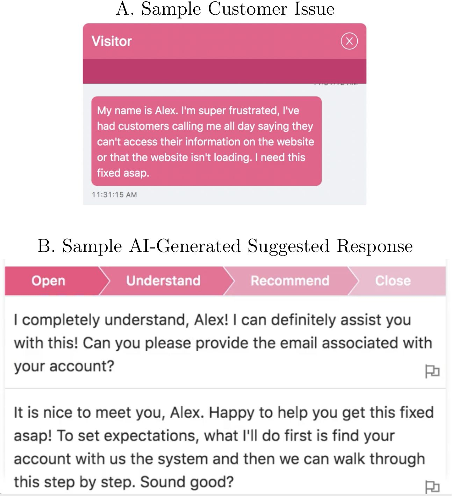
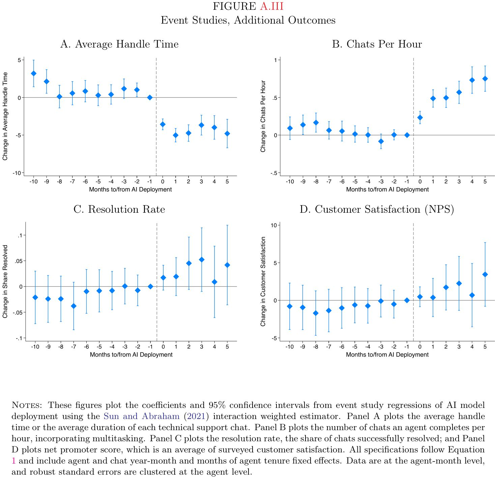
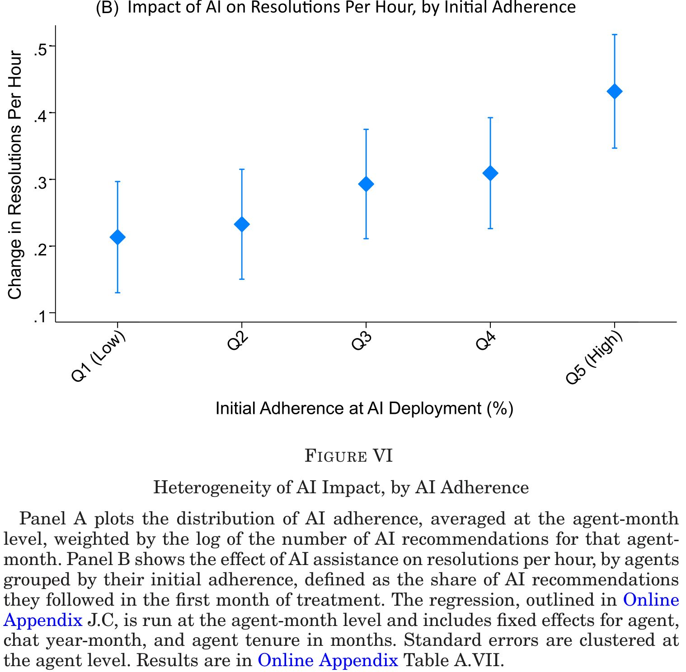
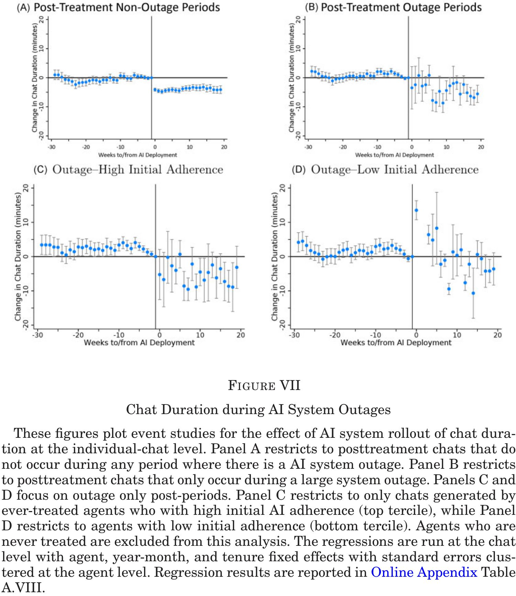
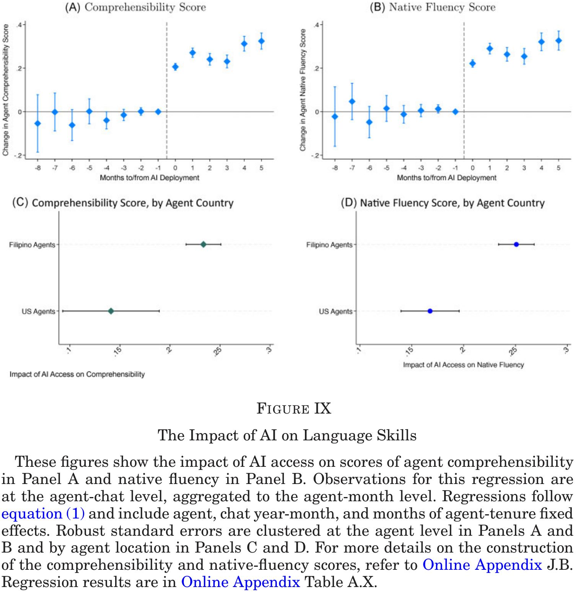

```{css CSS setting, echo=FALSE, results = "hide"}
.SeiroBenign {
  background-color: #FFEBCD;
  padding: 0.5em; /*文字まわり（上下左右）の余白*/
  /* border: 1px solid yellow; */
  /* font-weight: bold; */
}
.SeiroLightWreen {
  background-color: #D0F0C0; /* Tea green */
  padding: 0.5em; /*文字まわり（上下左右）の余白*/
  font-family: Noto S	ans;
  /* border: 1px solid yellow; */
  /* font-weight: bold; */
}
/* Define a margin before hX (header level X) element */
h1  {
  margin-top: 3ex;
  margin-bottom: 3ex;
  /* background: #c2edff; */ /*背景色*/
  padding: 0.5em;/*文字まわり（上下左右）の余白*/
}
h2  {
  margin-top: 2ex;
  margin-bottom: 2ex;
  padding: 0.5em;/*文字周りの余白*/
  ####color: #010101;/*文字色*/
  color: #87a5f2;
  /* background: #eaf3ff; */ /*背景色*/
  /* border-bottom: solid 3px #516ab6; */ /*下線*/
}
DBlue {
  color: dodgerblue;
}
Blue {
  color: blue;
}
Red {
  color: red;
}
```

<style type="text/css">
  body, td{
  font-size: 16pt;
}
</style>

```{=html}
<style>
.flushright {
   text-align: right;
}
</style>
```

::: {.flushright data-latex=""}
[doi.org/10.1093/qje/qjae044](https://doi.org/10.1093/qje/qjae044)
:::

## TL; DR

::: {.column-margin}



:::
* Summary: AI chatbots increased the productivity of low skilled workers, but not of high skilled workers, in one-on-one, text-based services
* Context: Software customer service chat agents&larr;AI assistance
* Estimation: Staggered rollout DID
* GPT-3 based assistance &rArr; resolutions per hour&uarr;
* Resolutions per hour&uarr; is largest among the least skilled workers
   * Productivity distribution dispersion&darr;
* Adherence rate&uarr; &rArr; productivity&uarr;
* Mechanism:
   * Agents learn usefulness of AI &rArr; adherence &rArr; durable learning
   * Fewer turnovers (quits) of relatively new agents
   * Larger impacts on lower skilled&larr;AI suggestions&larr;high productivity worker data
* External validity: 
   * A text-based, stable set of tasks
   * Skill-augmenting/replacing role of AI


## Introduction

Context

* ICT=skill-biased technical change &rArr; high-skilled worker demand&uarr;
* Machine learning ($\subset$ generative AI) can be skill-augmenting/replacing &rArr; high-skilled worker demand&darr;(?)
   * ML guesses solutions from data without instructions
   * Inputs (customer query, etc.)&rarr;actions for better outcomes
     * Sits well with non-routine tasks
     * White collar skills can be replaced

Will it decrease/increase employment/wages of low/high skilled? Not shown^[See @AutorThompson2025 for a theory ]

Using skills augmenting^[Hence replacing high skilled workers ] AI chatbots on software customer service agents, the paper shows they replace (a part of) skills on problem diagnosis, knowledge retrieval, and customer communications

* This is exactly what was intended, so no surprise here^[p.935: 
In areas where the product or environment is changing rapidly, the relative value of AI recommendations may be different. ... Indeed, recent work by [Perry et al. (2023)](https://arxiv.org/abs/2211.03622) and [Otis et al. (2023)](https://papers.ssrn.com/sol3/papers.cfm?abstract_id=4671369) have found cases in which AI adoption has limited or even negative effects. ]
* It boosts productivity of low skilled workers more than high skilled
* But this is already shown in previous studies 
   * This paper showed more comprehensively in real business environment


<details><summary>Click here to see a summary comparison table with previous work.</summary>
| feature | | Brynjolfsson et al. (2025) | Noy & Zhang (2023) | Peng et al. (2023) | Dell'Acqua et al. (2023) | Choi & Schwarcz (2023) |
|---:|-|:---|:---|:---|:---|:---|
| setting | | Field study (Fortune 500) | Online experiment (Prolific) | Online experiment (Upwork) | Field experiment (BCG) | Lab experiment (University) |
| subjects | | 5,172 cust. service agents | 453 professionals | 95 programmers | 758 elite consultants | 48 law students |
| task contents | | Real customer support chats | Writing press releases, reports, and emails | Implementing an HTTP server in JavaScript | Creative product ideation and business problem-solving | Multiple-choice and essay questions from law exams |
| skill measurement | | Objective, longitudinal | Objective, snapshot | Self-reported | Objective, snapshot | Objective, snapshot |
| skill contents | | Months of real KPIs & tenure. | Grade on one pre-task. | Years of experience. | Score on assessment task. | Score on prior real exam. |
| main impacts (pp.) | | +15% productivity (RPH) (p.907) | -40% time, +18% quality (p.4) | -56% time (p.5) | +40% quality, +25% speed (p.16) | +29 percentile (MCQ), 0 (essay) (p.18) |
| AI deployment | | Real-time assistant | One-off use for writing | Pair programmer for coding | Interactive use for consulting | Assistant for exam questions |
| leveling comparison | | Skill quintiles vs. performance | Grade on task 1 vs. task 2 | Regression on years of exp. | Bottom-half vs. top-half | Baseline percentile vs. change in percentile |
| leveling impact size (pp.) | | +36% (bottom) vs. 0% (top) in RPH (p.911) | Grade correlation drops 0.41->0.14 (p.5) | Effect varies by exp. (p.6) | +43% (bottom) vs. +17% (top) in quality (p.15) | +45 (bottom) vs. -20 (top) percentile (p.21) |
| top-tier impact (pp.) | | Null on speed, small negative on quality (p.911) | Null on quality, still reduces time (p.4) | Not explicitly isolated (p.6) | Positive, but smaller gains (+17%) (p.15) | Significant negative (-20 percentile) on essays (p.21) |
| external validity | | Stable tasks; AI augments knowledge/comms; real stakes. | Creative/writing tasks; AI as a first-draft tool; low stakes. | Standardized coding; AI code completion; time incentives. | Complex knowledge work; AI as a brainstorming partner; high-skill workers. | Formal reasoning tasks; AI as knowledge support; academic setting. |
</details>


## LLM use & generalizability


### Training of AI^[Chat GPT-3 based ]

* Data: Customer support center recordings
* Up-weights top performing agents in training
* Aspects of agent behaviour trained to AI (p.900)
   * when to ask clarifying questions
   * being attentive to customer concerns
   * de-escalating tense situations
   * adapting communication styles
   * explaining complex topics in simple terms
* Priotize agent responses that
   * express empathy
   * provide appropriate technical documentation
   * limit unprofessional language

Usage 

* To augment, rather than replace, human agents^[No matter how it is expressed, this is exactly how replacement works: By substituting expertise with AI ]
* AI gives no advice on insufficiently trained topics


### How an agent uses AI

::: {.column-margin}

:::

Chat box

1.  Customer sends a message
2.  AI analyzes the chat
3.  AI displays suggestions to the agent on a separate panel or window
    * Suggested text: Ready-to-use phrases or sentences (e.g., "Happy to help you get this fixed asap").
    * Suggested links: Links to internal technical documentation relevant to the problem.
4.  Agent chooses response
    * Use: Copy-paste
    * Edit: Modify
    * Ignore: Type a completely different response from scratch
    * Learn: Read the doc before typing own response


## Data

Proprietary data from a Fortune 500 firm ("Data Firm")

* Data Firm sells business-process software
* "AI Firm" provides the generative AI assistance and data for research
* 5,172 agents, 3M+ chats
   * Employed directly by the Data Firm or by third-party subcontractors
* Agent-chat panel: Chat transcripts, durations, resolution status, customer feedback
   * Main analysis: aggregated to agent-month
   * Outage study: individual chat level
   * Background information on each agent: Tenure, geographic location, employer, team assignment, but no individual pay or wages
* Derived variables
   * Resolutions per hour, average handle time, chats per hour
   * Adherence = 1 if either of below holds:
     a.  Direct copy tracking: An exact match to AI's suggestions
     a.  High content similarity: Compares the message vs. AI suggestions^[Not shown explicitly, but probably used cosign similarity $$\frac{\mathbf{A} \cdot \mathbf{B}}{\|\mathbf{A}\| \|\mathbf{B}\|} = \frac{\sum\limits_{i=1}^{n} A_i B_i}{\sqrt{\sum\limits_{i=1}^{n} A_i^2} \sqrt{\sum\limits_{i=1}^{n} B_i^2}}$$ where $\mathbf{A}$ is a vector of 0 or 1 for all the words  ] 
   * Topics: Classified using Gemini
   * Conversation style: Comprehensibility, native (American English) fluency, scored by Gemini
   * Customer sentiments $\in[-1,1]$: Measured by using [SiEBERT](https://huggingface.co/siebert/sentiment-roberta-large-english)


## Treatment assignment

* AI tool roll out: Staggered, Fall 2020 - Winter 2021
   * Limited training capacity (small sessions, few trainers)
   * Budgetary limits for the new technology
   * Full sample period: No information
* Treatment Assignment: Team&rarr;agent
   * Team selection: No information
   * Agent selection: By team managers
     * Stagger training within a team to minimize service disruption
     * Priority given to higher productive agents&larr;des stats


## Empirical Strategy

### Identification

* Robust DID&larr;staggered rollout of the AI tool
* No pre-trend (Fig II), but selective treatment assignment

### Estimation

$$
\begin{alignat}{2}
y_{it}
&= 
\delta_t + \alpha_i + \beta AI_{it} 
&&+ \mathbf{\gamma'} \mathbf{x}_{it} + \epsilon_{it}\\
y_{it}
&= 
\delta_t + \alpha_i + \sum_{r=1}^{4}\beta_{r} AI_{it}\times q_{r} 
&&+ \mathbf{\gamma'} \mathbf{x}_{it} + \epsilon_{it}\\
\end{alignat}
$$ 

$q_{r}$: Productivity quantile, overall topic frequency quantile, agent's topic frequency quantile, adherence quantile

* @SunAbraham2021 estimator using never-treated as control
   * @CallawaySantAnna2021 uses not-yet-treated as control
   * @dCDH2020 is for stayers
   * @BorusyakJaravelSpiess2024 is imputation based, more model oriented
   * Results are qualitatively similar

## Results

### Main impacts

::: {.column-margin}



:::
Overall Productivity (`Table II`, `Figure II`)

+   Resolutions Per Hour (RPH) `↑ 15%`.
+   Average Handle Time (AHT) `↓ 8.5%`.
+   Chats Per Hour (CPH) `↑ 15%` (more multitasking) (`Table III`).

### Heterogeneity by skill & experience, by topic

+ By skill (`Figure III`)
   + Lowest-skill agents: RPH `↑ 36%`
   + Highest-skill agents: No gain. Small decrease in quality
+ By experience (`Figure IV`)
   + Newest agents see largest gains
   + Experienced agents (>1 year) see no gain
   + Faster learning (`Figure V`): An agent with 2 months of AI experience is as productive as an agent with 6+ months of experience without AI
+ By topic frequency (`Figure VIII`)
   + U-shaped: Moderately rare topics had the biggest impacts
      + Rarity&uarr; &rArr; sophistication&darr; &larr; fewer data to train AI
      + Rarity&uarr; = more room for improvements

### Other effects

Experience of work

+ Customer sentiment: Customers are more positive and polite (`Figure X`, `Table IV`)
+ Escalations: Requests to "speak to a manager" `↓ 25%` (`Figure X`, `Table IV`)
+ Attrition: Employee turnover `↓8.7%`, more pronounced for new workers


## Mechanisms

Pathways

::: {.column-margin}





:::

1. Adherence: adherence&uarr;  &rArr; productivity&uarr;  (`Figure VI`)
1. Durable learning: Productivity gains persist even during AI outages (`Figure VII`)^[true? estimates are too noisey ]
1. Communication: English fluency&uarr; (`Figure IX`), low-skill agents communicate more like high-skill agents (textual convergence)^[P values are not shown for textual convergence ] 

## Conclusion

* Early empirical evidence on the effects of a generative AI tool in a real-world workplace
* AI-generated recommendations:
   * Increases overall worker productivity by 15%
   * Larger effects for lower-skill and novice agents
   * Improve worker on-the-job experiences
* Productivity gains reflect durable worker learning 


## 感想

* AI利用&rArr;労働生産性、に関する本格的な効果推計&larr;みんな待ってた
* 最大の貢献: AIが熟練を代替(熟練労働賃金への示唆)
   * skil leveling effects
   * 格差縮小(?)...ではないかも、賃金データ無いので分からない
* chatレヴェルの詳細なデータを得たのが素晴らしい...質(resolutions)と量(chats, handling time)へのインパクトを示し、AI効果の理解に貢献
* 「長期への懸念」も指摘: 労働生産性格差がなくなり、熟練への報酬がいずれ下がるので、トレーニング・データを提供していた高技能労働者のデータ提供誘因が弱まる
   * AIが高技能労働者を駆逐すると、環境が変わったときに成功事例を開拓して学習材料を提供できる人がいなくなる
* Outage study (falsification test)はメカニズムを検証する賢い検定
* しかし、durable learningは推計結果がはっきりしない
* 低生産性エージェントはコピペしているだけかも
   * 模範解答を反復して覚えてしまう
   * 学習...か?
   * それでいいかも
* 外的妥当性
   * これは非定型nonroutineタスクか? 問答の類型routine化は可能だが、ケース分けが多すぎてマニュアルにするのがすごく大変というだけでは?
     * 受け身: 労働者はプロンプトを出さないので、受動的にgo with the flowでアドバイスを取り込んでいる気がする
     * AI=自動でアドバイスをくれる過保護な上司的存在
     * AI利用=包括的マニュアルを作成する費用、検索する費用、表現調整する費用を劇的に下げていると理解可能
   * AIへの入力(データ)と作業指示を(問題とその解決方法に応じて)人間が決めるunstructured tasksでの影響とは違う
     * 非テキスト・ベースのタスク=uncodifiable
     
         > manage employees, raise capital, pilot new initiatives, run advertising strategies, price their services, react to competitors, and decide which of these and myriad other tasks to focus their efforts on (Chandler, 1977, quoted from Otis et al. 2023)
     
     * [Otis et al. (2023)](https://papers.ssrn.com/sol3/papers.cfm?abstract_id=4671369)では優秀な経営者のみAIの利潤効果が正、それ以外は負


