```{css CSS setting, echo=FALSE, results = "hide"}
.SeiroBenign {
  background-color: #FFEBCD;
  padding: 0.5em; /*文字まわり（上下左右）の余白*/
  /* border: 1px solid yellow; */
  /* font-weight: bold; */
}
.SeiroLightWreen {
  background-color: #D0F0C0; /* Tea green */
  padding: 0.5em; /*文字まわり（上下左右）の余白*/
  font-family: Noto S	ans;
  /* border: 1px solid yellow; */
  /* font-weight: bold; */
}
/* Define a margin before hX (header level X) element */
h1  {
  margin-top: 3ex;
  margin-bottom: 3ex;
  /* background: #c2edff; */ /*背景色*/
  padding: 0.5em;/*文字まわり（上下左右）の余白*/
}
h2  {
  margin-top: 2ex;
  margin-bottom: 2ex;
  padding: 0.5em;/*文字周りの余白*/
  ####color: #010101;/*文字色*/
  color: #87a5f2;
  /* background: #eaf3ff; */ /*背景色*/
  /* border-bottom: solid 3px #516ab6; */ /*下線*/
}
DBlue {
  color: dodgerblue;
}
Blue {
  color: blue;
}
Red {
  color: red;
}
```

<style type="text/css">
  body, td{
  font-size: 16pt;
}
</style>

```{=html}
<style>
.flushright {
   text-align: right;
}
</style>
```

::: {.flushright data-latex=""}
Amory Gethin, Distributional Growth Accounting: Education and the Reduction of Global Poverty, 1980–2019, The Quarterly Journal of Economics, Volume 140, Issue 4, November 2025, Pages 2571–2618, https://doi.org/10.1093/qje/qjaf033

[doi.org/10.1093/qje/qjaf033](https://doi.org/10.1093/qje/qjaf033)
:::

# TL; DR

::: {.column-margin}
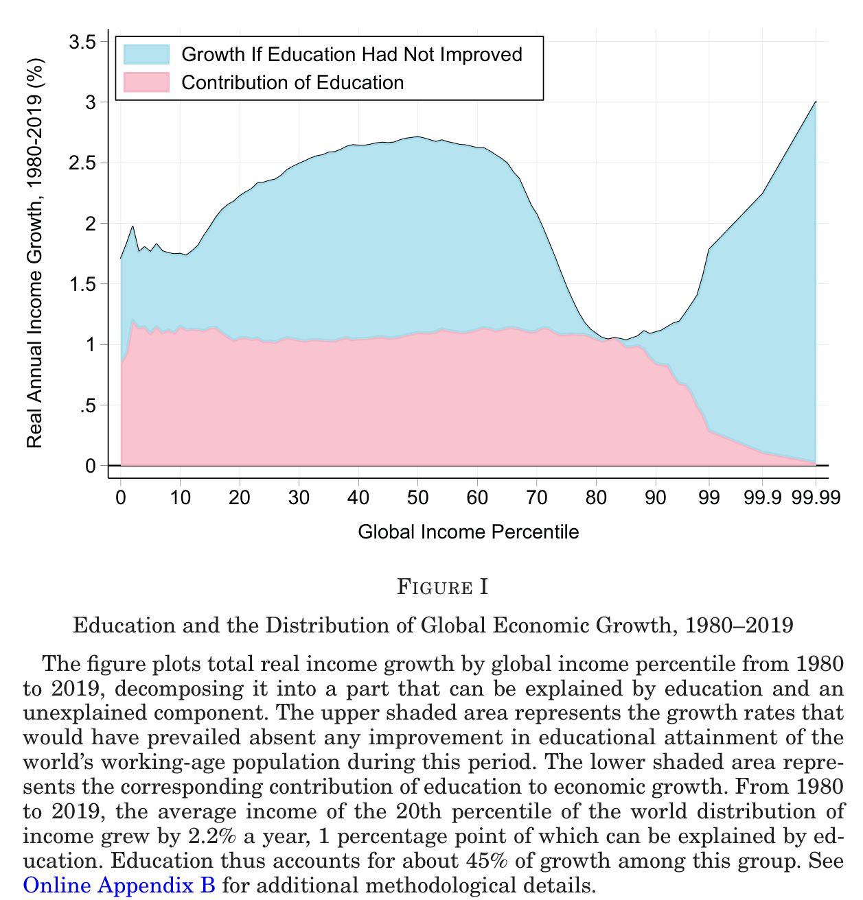

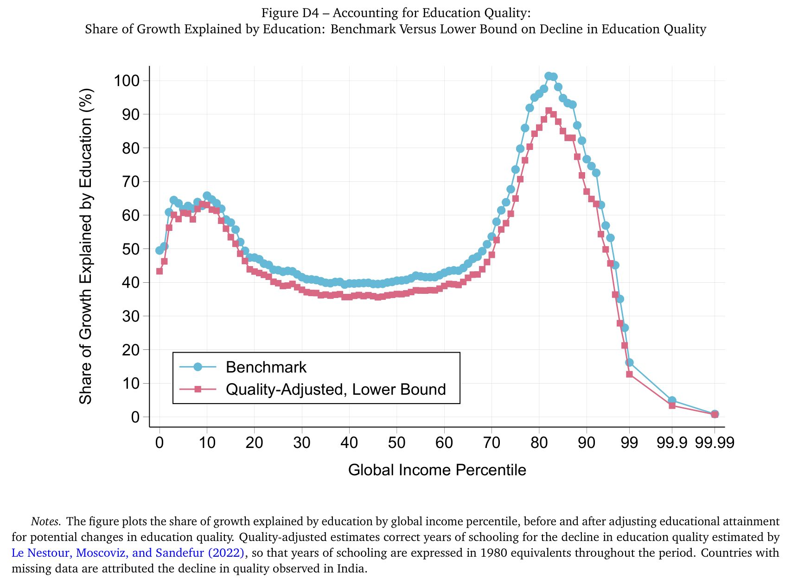

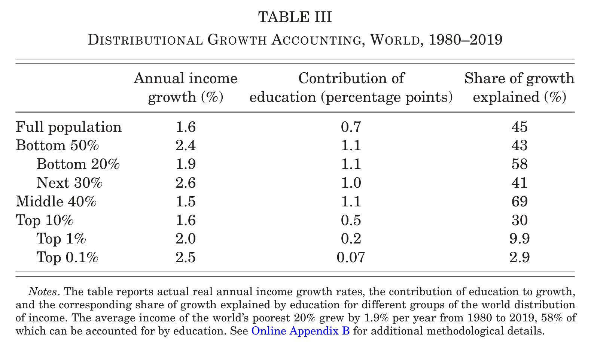
:::


* Summary: Education expansion explains 40-70% of income growth for bottom 20% - middle 40% of world population
* New findings: Edu contribution is larger 
   1. Than standard growth accounting decomposition, because current returns to schooling is depressed by increased supply of skilled labour
   1. For low income earners &larr; lower wage of skilled labour &larr; edu expansion
* Results validated: Compare with IV estimates under natural experiments in 3 countries
* Methodological innovation: Edu Contribution = independent edu expansion + skill biased tech change
   * Labor econ: Supply and demand of skilled labour, within country
   * Macro econ: Supply impacts of skilled labour, between country
   * This paper consolidates the two
* Data: 1980-2019, harmonising various surveys (ILO, World Bank, national, etc.), factor income data, world inequality data
* Estimation/computation: 
   * OLS/IV for returns to schooling
   * Growth decomposition under CES &larr; incorporate imperfect substitutability between skilled and unskilled labour
   * Solve for SBTC using competitive profit maximisation given estimated schooling returns and human capital data
   * Allow for firms' endogenous response of elasticity of substitution (long-run EOS, but does not play a major role in analysis)
* Mechanism: none proposed, decomposition with labour demand considerations


<details><summary>Click here to see the variable definitions.</summary>
| Variable | Description |
| :------------------------------------------: | :----------------------------------------------------------------------------------- |
| $Y^t$ | Output per capita at time t |
| $K^t$ | Per capita physical capital at time t |
| $H^t$ | Labor input per capita at time t |
| $z^t$ | Total factor productivity at time t |
| $\alpha$ | Capital share of income |
| $L_1^t, L_2^t$ | Shares of low-skilled and high-skilled workers |
| $\theta_1^t, \theta_2^t$ | Factor-augmenting technology terms |
| $\eta$ | Elasticity of substitution between low-skilled and high-skilled workers |
| $\theta$ | Technology level (skill bias) |
| $L$ | Relative supply of skilled workers |
| $\text{Share}_L$ | Share of output growth accounted for by education |
| $\kappa_1, \kappa_2, \omega$ | Parameters of the technology frontier |
| $A_j^t$ | Technology parameters for skill group j |
| $\sigma$ | Long-run elasticity of substitution |
| $w_j^t$ | Wage of skill group j at time t |
| $y_i$ | Total annual earned income of individual i |
| $D_{i,j}$ | Dummy for individual i having reached education level j (primary, secondary, tertiary) |
| $X_i$ | Vector of controls for individual i |
| $\beta_j$ | Coefficient for education level j |
| $r_j$ | Return to education level j |
| $L_{ter}^t, L_{\underline{ter}}^t$ | Share of tertiary and non-tertiary educated workers |
| $L_{sec}^t, L_{\underline{sec}}^t$ | Share of secondary and below-secondary educated workers |
| $L_{pri}^t, L_{non}^t$ | Share of primary and no schooling workers |
| $\sigma_1, \sigma_2, \sigma_3$ | Elasticities of substitution between skill groups in the nested model |
| $r^{*\text{annual}}$ | "True" annualized return to schooling |
| $S^t$ | Average years of schooling at time t |
| $y_{iL}$ | Labor and mixed income of individual i |
| $s_1, s_2$ | Education levels |
| $y^p$ | Income of group p |
| $\alpha^p$ | Capital income share of group p |
| $y_{rt}^i$ | Average income of group i in region r at time t |
| $S_{rt}$ | Average years of schooling in region r at time t |
| $X_{rt}$ | Vector of controls for region r at time t |
| $Z_{rt}$ | Instrumental variable for schooling |
| $\delta_r, \delta_t$ | Region and time fixed effects |
| $\gamma_j^i$ | Coefficients in the regression model |
| $H^{t, \text{standard}}$ | Standard measure of human capital at time t |
| $r$ | Mincerian return to schooling |
</details>


# Model

Production function
\begin{equation}
Y^t = F(K^t, H^t) = K_t^\alpha (z^t H^t)^{1-\alpha} \tag{1}
\end{equation}

Labour aggregator
\begin{equation}
H^t(\theta^t, L^t) = \left\{ \theta_1^t (L_1^t)^{\frac{\eta-1}{\eta}} + \theta_2^t (L_2^t)^{\frac{\eta-1}{\eta}} \right\}^{\frac{\eta}{\eta-1}} \tag{2}
\end{equation}

Time difference
\begin{align}
\Delta \ln Y &= 
\alpha \Delta \ln(K) + (1-\alpha)\Delta \ln(z) + (1-\alpha)\Delta \ln(H) \tag{3}\\
1 & = 
\underbrace{\alpha \frac{\Delta \ln(K)}{\Delta \ln Y   }}_{\mbox{\scriptsize physical capital
}} + 
\underbrace{(1-\alpha)\frac{\Delta \ln(z)}{\Delta \ln Y}}_{\mbox{\scriptsize TFP
}} + 
\underbrace{(1-\alpha)\frac{\Delta \ln(H)}{\Delta \ln Y}}_{\mbox{\scriptsize education + skill bias
}} \tag{4}
\end{align}

**Contribution of education**

<DBlue>*Total*</DBlue>  (given elevated skill bias of 2019)
\begin{equation}
\text{Share}_L^{\theta^{2019}} = (1-\alpha) \frac{\ln H( \color{red} \theta^{2019} \color{black} , L^{2019}) - \ln H(\color{red}\theta^{2019}\color{black}, L^{1980})}{\ln Y^{2019} - \ln Y^{1980}} \tag{5}
\end{equation}

<DBlue>*Independent*</DBlue> (given fixed skill bias of 1980)
\begin{equation}
\text{Share}_L^{\theta^{1980}} = (1-\alpha) \frac{\ln H(\color{red}\theta^{1980}\color{black}, L^{2019}) - \ln H(\color{red}\theta^{1980}\color{black}, L^{1980})}{\ln Y^{2019} - \ln Y^{1980}} \tag{6}
\end{equation}

<DBlue>*Long-run* (with profit maximising skill bias)</DBlue> elasticities^[$\sigma$ is defined under optimally chosen skill bias $\theta_{j}$. So $\sigma$ reflects firm's response to educational expansion. ] $\sigma>\eta$ (short-run elasticities)^[Allowing firms to choose skill bias $\theta_{j}$ under a skill constraint 
$$
\left[\left(\kappa_{1}\theta_{1}\right)^{\omega}+\left(\kappa_{2}\theta_{2}\right)^{\omega}\right]^{\frac{1}{\omega}}\leqslant B
$$
\begin{equation}
\left(\kappa_1 (\theta_1^t)^\omega + \kappa_2 (\theta_2^t)^\omega\right)^{1/\omega} \le 1 \tag{7}
\end{equation}
yields a long-run CES labour aggregator form [@HendricksSchoellman2023]:
\begin{equation}
H^t(A^t, L^t) = \left( A_1^t (L_1^t)^{\frac{\sigma-1}{\sigma}} + A_2^t (L_2^t)^{\frac{\sigma-1}{\sigma}} \right)^{\frac{\sigma}{\sigma-1}} \tag{8}
\end{equation}
 ]

* A smaller (than $\sigma$), short-run elasticity of substitution (EOS) $\eta$ = a measure of imperfect substitutability between skilled and unskilled labour (relative to long-run substitutability)

This paper treat educational choice as exogenous

* There is no survey data from 1980's that allows modeling household choice as a response to the firm labour demand
* Use long-run EOS $\sigma$

Return to schooling and human capital, skill bias

* Standard approach: human capital=f(fixed return to schooling, fixed skill bias)
* This paper: 
   * Return to schooling and skill bias $\frac{A_{2}^{t}}{A_{1}^{t}}$ are determined simultaneously 
   * Treat human capital $\frac{L_{2}^{t}}{L_{1}^{t}}$ as exogenous

\begin{equation}
\ln\left(\frac{w_2^t}{w_1^t}\right) = \ln\left(\frac{A_2^t}{A_1^t}\right) - \frac{1}{\sigma} \ln\left(\frac{L_2^t}{L_1^t}\right) \tag{9}
\end{equation}

Implications of simultaneity (returns to schooling $\frac{w_{2}^{t}}{w_{1}^{t}}$, skill bias $\frac{A_{2}^{t}}{A_{1}^{t}}$) on contribution of education expansion

1. Share$^{\theta^{2019}}_{L}$&uarr;
   * Education expansion &rArr; returns to schooling&darr; &rArr; (returns to schooling×human capital)&darr;
   * Holding returns to schooling fixed &rArr; contribution of education expansion&uarr;
1. Share$^{\theta^{2019}}_{L}$&uarr; is greater at the lower end of EOS
   * Lower values of EOS = smaller adjustments of EOS by firms &rArr; smaller adjustments of skill bias if human capital reverts to 1980 level  &rArr; larger decline in outputs in counterfactual
1. Share$^{\theta^{2019}}_{L}$ - Share$^{\theta^{1980}}_{L}$ (Total - Independent) is greater at lower EOS in (2)
   * EOS&darr; &rArr; $\Delta$skill weights $\left|\frac{\theta^{1980}_{2}}{\theta^{1980}_{1}}-\frac{\theta^{2019}_{2}}{\theta^{2019}_{1}}\right|$&uarr; &rArr; $\Delta$skill bias  $\left|\frac{A^{1980}_{2}}{A^{1980}_{1}}-\frac{A^{2019}_{2}}{A^{2019}_{1}}\right|$&uarr;
   * Lower EOS &hArr; smaller contribution of skill bias &hArr; larger contribution of human capital (educational expansion)

**Distributional effects of increasing $L_2^{1980}$ to $L_2^{2019}$**

Education&uarr; &rArr; labour income inequality&darr;

* Education expansion&uarr; &rArr; $\frac{w_{2}^{t}}{w_{1}^{t}}$&darr;
* Inequality&darr; &lArr; EOS&darr; (reduction impacts are larger when EOS is smaller)
* This effect is independent of skill bias $A^{t}_{j}$

\begin{equation}
\begin{aligned}
& \ln\left[\frac{w_2(A^t, L^{1980})}{w_1(A^t, L^{1980})}\right] - \ln\left[\frac{w_2(A^t, L^{2019})}{w_1(A^t, L^{2019})}\right] \\
& = \frac{1}{\sigma}\left[\ln\left(\frac{L_2^{1980}}{L_1^{1980}}\right) - \ln\left(\frac{L_2^{2019}}{L_1^{2019}}\right)\right] > 0
\end{aligned} \tag{10}
\end{equation}

# Data sources


1.  International Labour Organization (ILO) Harmonized Microdata
    *   Individual-level survey data
    *   Coverage: 10 million individuals in 154 countries (c. 2019), representing over 95% of the world's population
    *   To estimate baseline returns to schooling and construct counterfactual income distributions
2.  World Bank's I2D2 (International Income Distribution Database)
    *   Historical household survey data

    | Survey Category | Typical Sample Size Range |
    | ---: | :---: |
    | smaller/targeted surveys | 2,000 - 8,000 |
    | standard national surveys | 10,000 - 30,000 |
    | large national/regional surveys | 40,000 - 100,000+ |

    *   Coverage: Data for 109 countries (c. 2000), representing about 80% of the world's population
    *   To estimate skill-biased technical change
3.  Barro and Lee (2013) Database
    *   Time-series data on educational attainment
    *   Coverage: 146 countries from 1980-2019 (supplemented by other sources)
    *   To quantify the change in the supply of skilled labor over time
4.  World Inequality Database (WID)
    *   Macro-level income distribution data
    *   Coverage: Global (all countries) from 1980-2019
    *   To benchmark microdata against macroeconomic growth rates
5.  World Bank Data Portal
    *   Global poverty statistics
    *   Coverage: Global
    *   To calculate education's contribution to poverty reduction
6.  Penn World Tables & Bachas et al. (2022)
    *   Country-level factor income shares
    *   Coverage: Broad cross-country coverage
    *   To conduct standard growth accounting comparisons
7.  Previous Academic Studies (Khanna 2023; Duflo 2001; etc.)
    *   Regional data on education policy exposure
    *   Coverage: Subnational regions within India, Indonesia, and the United States
    *   To validate the model's predictions using natural experiments

Estimation of returns to schooling

\begin{equation}
\ln y_i = \alpha + \beta_{pri}D_{i,pri} + \beta_{sec}D_{i,sec} + \beta_{ter}D_{i,ter} + X_i\beta + \epsilon_i \tag{11}
\end{equation}
Marginal returns
\begin{equation}
r_{pri}(A^{2019}, L^{2019}) = \ln\left(\frac{w_{pri}^{2019}}{w_{non}^{2019}}\right) = \beta_{pri} \tag{12}
\end{equation}
\begin{equation}
r_{sec}(A^{2019}, L^{2019}) = \ln\left(\frac{w_{sec}^{2019}}{w_{pri}^{2019}}\right) = \beta_{sec} - \beta_{pri} \tag{13}
\end{equation}
\begin{equation}
r_{ter}(A^{2019}, L^{2019}) = \ln\left(\frac{w_{ter}^{2019}}{w_{sec}^{2019}}\right) = \beta_{ter} - \beta_{sec} \tag{14}
\end{equation}
* Returns to schooling look convex (Figure II)
* The paper also compiles 33 studies using both IV and OLS, show IV estimates are larger (Figure III)
   * It looks like it blows up OLS by some percentage to correct the bias, calling it as "upward-corrected using IV-OLS gaps"
   * Mean gap is about 40%
   * Convexity of returns remains in IV estimates

# Methodology

## Solve the model

1. Assume nested CES production
\begin{align}
H^t &= \left( A_{ter}^t (L_{ter}^t)^{\frac{\sigma_1-1}{\sigma_1}} + A_{\underline{ter}}^t (L_{\underline{ter}}^t)^{\frac{\sigma_1-1}{\sigma_1}} \right)^{\frac{\sigma_1}{\sigma_1-1}} \tag{15}\\
L_{\underline{ter}}^t &= \left( A_{sec}^t (L_{sec}^t)^{\frac{\sigma_2-1}{\sigma_2}} + A_{\underline{sec}}^t (L_{\underline{sec}}^t)^{\frac{\sigma_2-1}{\sigma_2}} \right)^{\frac{\sigma_2}{\sigma_2-1}} \tag{16}\\
L_{\underline{sec}}^t &= \left( A_{non}^t (L_{non}^t)^{\frac{\sigma_3-1}{\sigma_3}} + A_{pri}^t (L_{pri}^t)^{\frac{\sigma_3-1}{\sigma_3}} \right)^{\frac{\sigma_3}{\sigma_3-1}} \tag{17}
\end{align}
1. Set EOS $\sigma = 4, 6, 8$
1. Solve the model
\begin{align}
\ln \left( \frac{w^{2019}_{pri}}{w^{2019}_{non}} \right) 
&= \ln \left( \frac{A^{2019}_{pri}}{A^{2019}_{non}} \right) - \frac{1}{\sigma_3} \ln \left( \frac{L^{2019}_{pri}}{L^{2019}_{non}} \right) \tag{18}\\
\ln\left(\frac{w_{sec}^{2019}}{w_{pri}^{2019}}\right) 
&= \ln\left(\frac{A_{sec}^{2019}}{A_{\underline{sec}}^{2019}}\right) - \frac{1}{\sigma_2}\ln\left(\frac{L_{sec}^{2019}}{L_{\underline{sec}}^{2019}}\right) \tag{19}\\
\ln\left(\frac{w_{ter}^{2019}}{w_{sec}^{2019}}\right) 
&= \ln\left(\frac{A_{ter}^{2019}}{A_{\underline{ter}}^{2019}}\right) - \frac{1}{\sigma_1}\ln\left(\frac{L_{ter}^{2019}}{L_{\underline{ter}}^{2019}}\right) \tag{20}
\end{align}
   * 3 equations &rArr; recover unknowns $\frac{A^{2019}_{pri}}{A^{2019}_{non}}, \frac{A^{2019}_{sec}}{A^{2019}_{\bar{sec}}}, \frac{A^{2019}_{ter}}{A^{2019}_{\bar{ter}}}$
1. Compute implied returns to schooling
\begin{equation}
r^{*\text{annual}}(A^{2019}) = \frac{\ln H(A^{2019}, L^{2019}) - \ln H(A^{2019}, L^{1980})}{S^{2019}-S^{1980}} \tag{21}
\end{equation}

## Distributional growth accounting exercise

1. Downgrade education levels as a policy exercise
1. Adjust wages to downgraded education levels, recompute labour incomes
\begin{equation}
y_{iL}(A^{2019}, L^{1980}) = e^{ \ln y_{iL}(A^{2019}, L^{2019}) - \ln\frac{w_{s_2}(A^{2019}, L^{2019})}{w_{s_1}(A^{2019}, L^{1980})}} \tag{22}
\end{equation}
1. Assume capital is unaffected and compute capital incomes
1. Total income = labour income + capital income
1. Growth accounting
\begin{equation}
\text{Share}_L^p = \frac{\ln y^p(A^{2019}, L^{2019}) - \ln y^p(A^{2019}, L^{1980})}{\ln y^p(A^{2019}, L^{2019}) - \ln y^p(A^{1980}, L^{1980})} \tag{23}
\end{equation}

::: {.column-margin}
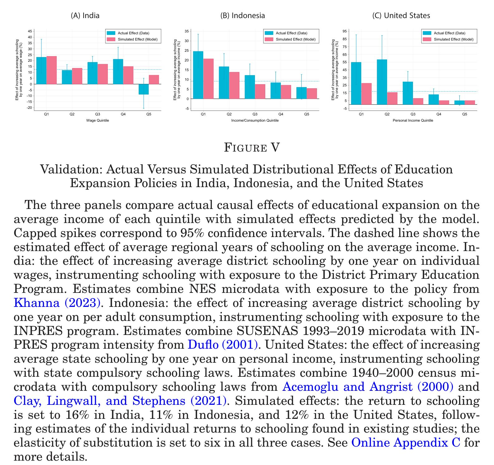
:::

6. Validation using DPEP (India, IV=RDD cutoff), INPRES (Indonesia, IV=number of schools built), Compulsory schooling laws (US, IV=Birth-State cohort)
\begin{align}
\ln y_{rt}^i &= \gamma_0^i + \gamma_1^i S_{rt} + X_{rt}\beta + \delta_r + \delta_t + \epsilon_{rt} \tag{24}\\
S_{rt} &= \alpha_0 + \alpha_1 Z_{rt} + \eta_{rt} \tag{25}
\end{align}
    Figure V shows estimated returns to schooling: IV $\simeq$ OLS
   * OLS estimates are validated

# Results

## Main results

::: {.column-margin}
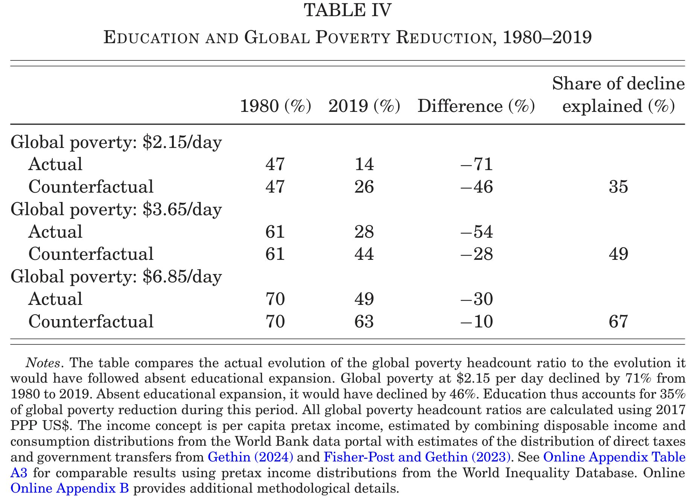

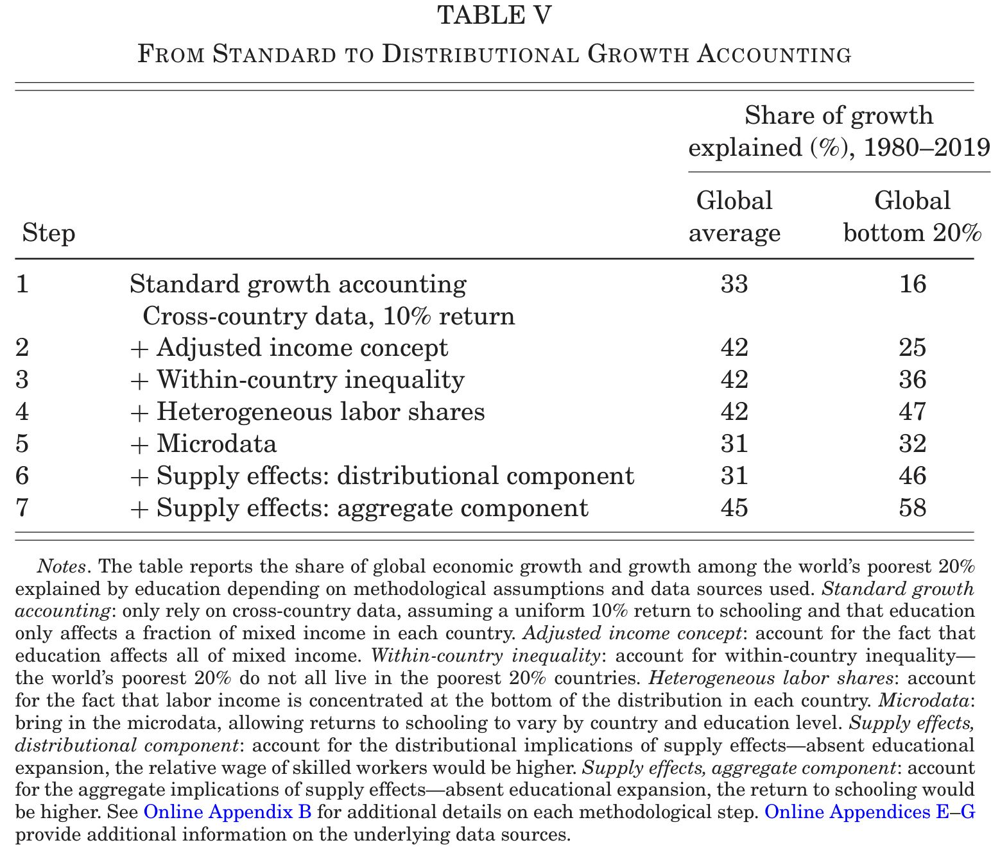
:::

* Elephant curve (Fig 1)
   * Rise of China, India
   * Sluggish growth in low income countries
   * Weak income growth for most of HHs in high income countries
   * Sky rocketing top income inequality in many countries
1. Share of below extreme poverty&darr; (Tab 4)
   * Education: 35% of $\Delta$share (USD 2.15/day)
1. Use of returns to schooling on total income
   * OLS estimates: labour income $\simeq$ capital income 
   * Bachas et al. (2022) factor share data, not Penn World Table
1. Incorporate within-country inequality &rArr; contribution of education&uarr; for bottom 20% of the world, because:
   * Bottom 20% = low income + middle income (more improvements)
   * Inequality&uarr; in many countries &rArr; less growth to be explained for the poor
1. Incorporate within-country capital income inequality &rArr; contribution of education&uarr; for bottom 20% of the world
   * Passthrough is 100% for low income earners, but only labour income share for top earners
1. Microdata &rArr; returns differ by country and education level &rArr; contribution of education&darr;
   * Estimated mean returns are 8%, smaller than standard exercise 10%
1. Relative supply of skilled workers&uarr; &rArr; contribution of education&uarr; for bottom 20% of the world
   * Relative wage of skilled&darr; + increased skilled workers among low income&uarr;
   * Restriction: Mean income is unchanged
1. Aggregate growth effects of education &rArr; contribution of education&uarr; for bottom 20% of the world

## Sensitivity to alternative specifications

1. IV-corrected returns to schooling
1. EOS
1. Alternative nesting of CES, no nesting, imperfect substitution between age groups (single EOS for skill groups, single EOS for age groups)
1. Physical capital adjustments to educational expansion
1. Educational attainment categories
1. Heterogenous educational expansion by age, gender, region (India), race (South Africa, US)
1. School attendance
1. Education quality

## Heterogeneity

::: {.column-margin}
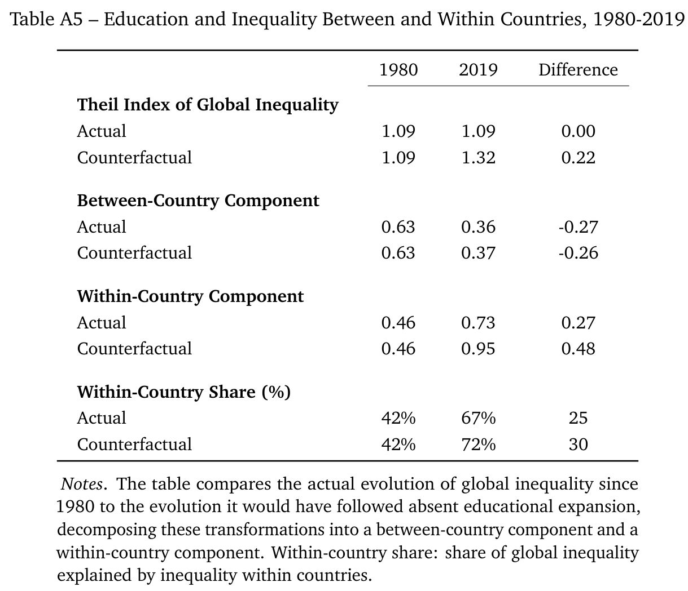

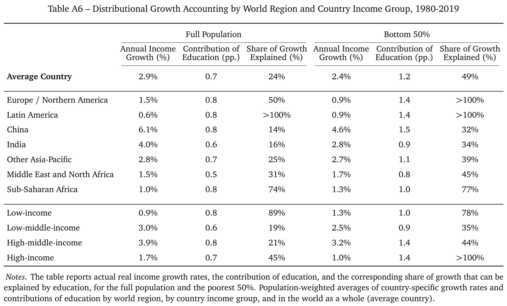
:::

1. Within and between countries (Tab A5)
   * No change in global inequality
   * Absent educational expansion, global inequality&uarr; by 20%
   * Between country inequality&darr;, within country inequality&uarr;
1. By world region (Tab A6)
   * Education explains 25% of income growth globally
   * Mean: Latin America > Sub-Saharan Africa > Europe and North America > MENA > APAC > China, India
   * Bottom 50%: Latin America, Europe and North America > Sub-Saharan Africa > MENA > APAC, China, India

# Skill biased technological change

::: {.column-margin}
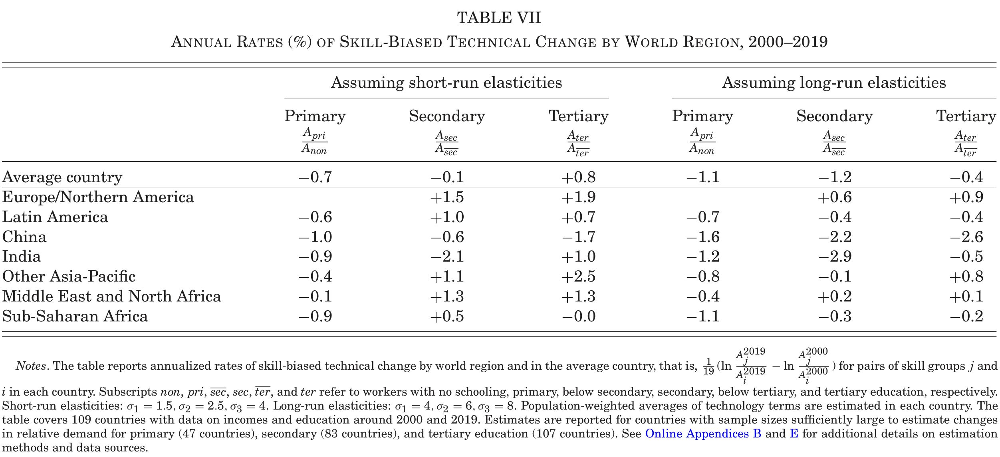

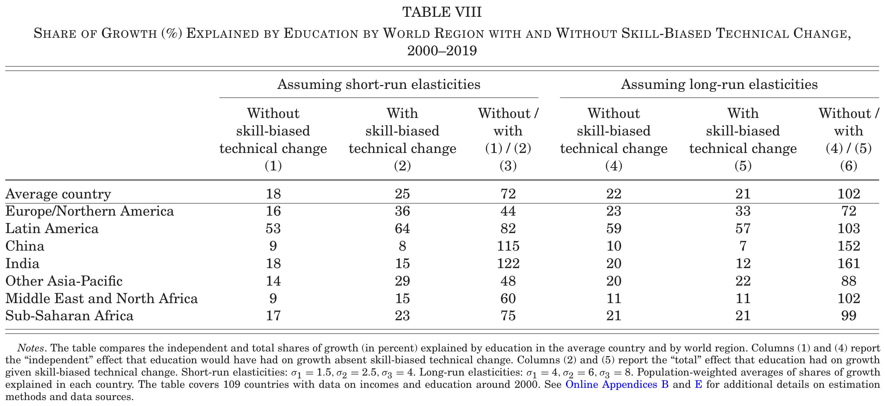

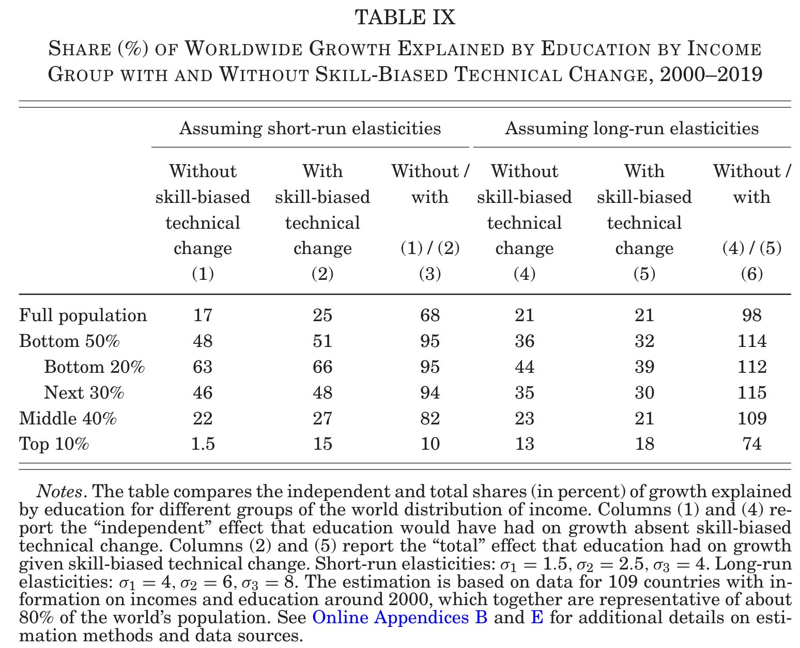
:::


Long-run EOS = larger, educational expansion is accounted for &rarr; adjust with EOS  &rArr; smaller SBTC

Short-run EOS = smaller, educational expansion is not accounted for &rarr; adjust with $\theta_{j}$ &rArr; larger SBTC

SBTC

* Large: Tertiary, Europe/North America, APAC, MENA
* Negative: Primary, secondary China, seconday India, tertiry China


Education contribution 

* SBTC increases education contribution (Tab 8)
   * 70% is educational expansion
   * 30% is SBTC
* Low income groups (Tab 9)
   * Larger than high income groups 
   * Similar with/without SBTC 
      * Low or negative skilled labour demand in low income countries
* High income groups (Tab 9)
   * Increases with SBTC 
      * Growing skilled labour demand in high income countries

# 感想

* Goldin-Katzに似た枠組みをマクロ成長会計に導入した
* SBTCと就学収益率を同時決定することで、SBTCの影響を考慮できるようにしたのは素晴らしい
   * 機械的な収益率計算、技術パラメタを固定したマクロ生産関数による要因分解ではない
   * 収益率変化を許容することで、教育の貢献が過小評価されていることを示した
   * データ制約により推計できないため、人的資本は外生扱い
* skill biasパラメタを初年値に固定することで教育の独自効果independent effects、後年値に固定することで合計効果total effectsを計算するアイディアがよい
* データ作業量は想像を絶する (RA1人!)
* 余りに多岐にわたるデータ利用なので、全体を展望できるほど理解できていない
* 推計したらこうなっています、理由はこれだと思います、という論文
* CESパラメタや収益率推計値を低中高所得国グループ毎に変えるとどうなるのか

