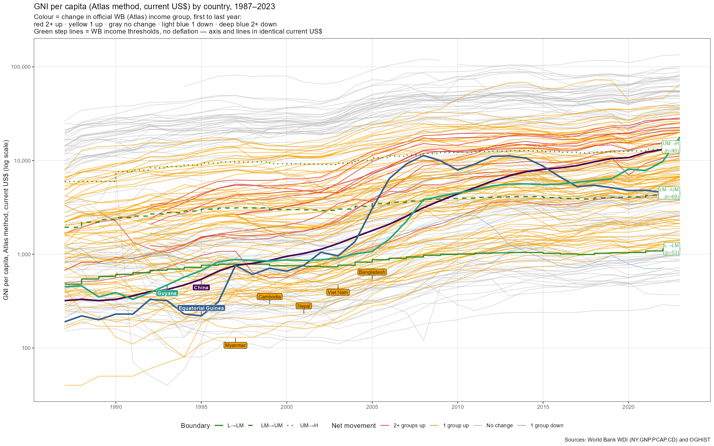
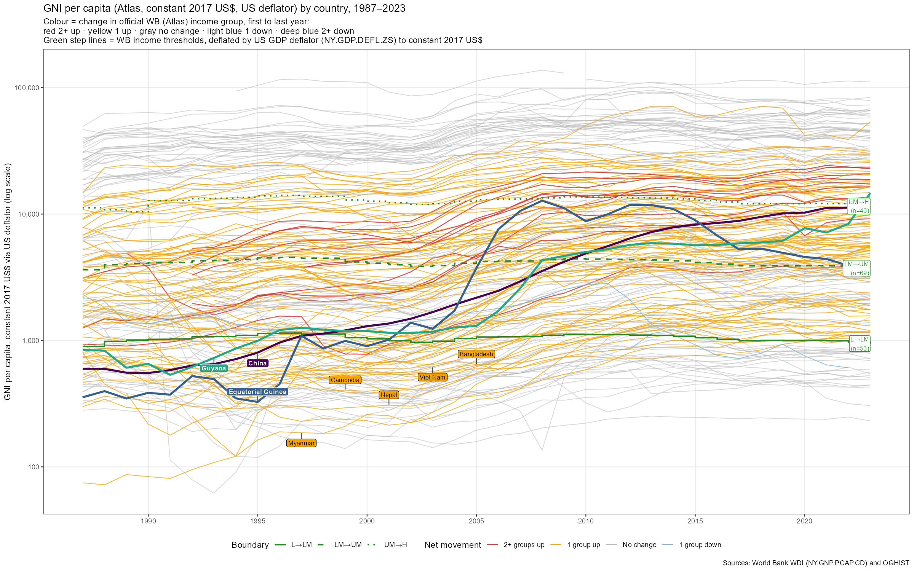
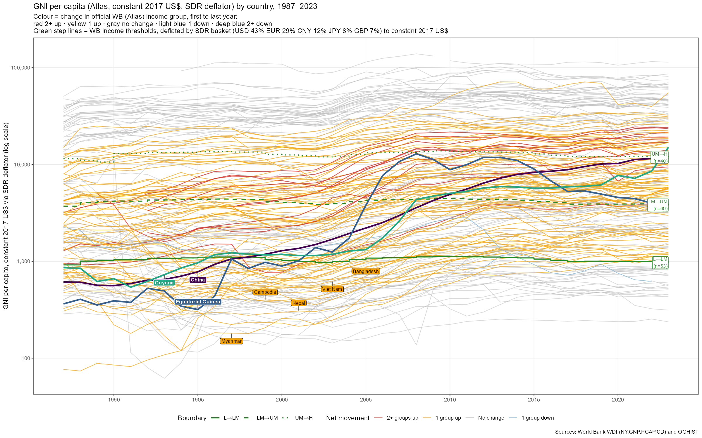
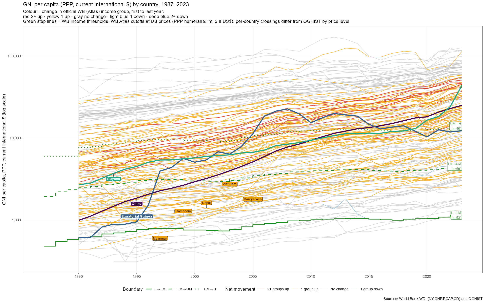

<link rel="stylesheet" href="https://cdn.jsdelivr.net/npm/glightbox/dist/css/glightbox.min.css">

## World Bank Income Group Definitions

The World Bank classifies countries annually by GNI per capita using the [Atlas method](https://datahelpdesk.worldbank.org/knowledgebase/articles/378832-the-world-bank-atlas-method-detailed-methodology) (current USD):

| Group | GNI per capita ([FY2025 thresholds](https://blogs.worldbank.org/en/opendata/world-bank-country-classifications-by-income-level-for-2024-2025)) |
|---|---|
| Low income | ≤ $1,135 |
| Lower-middle income | $1,136 – $4,495 |
| Upper-middle income | $4,496 – $13,935 |
| High income | > $13,935 |

Thresholds are updated each July 1 using the previous calendar year's data. The historical classification series ([OGHIST](https://datahelpdesk.worldbank.org/knowledgebase/articles/906519)) runs from 1987 to the present.

---

## Data

**Income group history:**

> World Bank. *Historical Classification by Income (OGHIST).* Updated annually.
> <https://datahelpdesk.worldbank.org/knowledgebase/articles/906519>

**Income level (y-axis):**

> World Bank WDI indicator [`NY.GNP.PCAP.CD`](https://data.worldbank.org/indicator/NY.GNP.PCAP.CD): GNI per capita, Atlas method, current US$.
> Downloaded via the [`wbstats`](https://cran.r-project.org/package=wbstats) R package.
> This is the same series the World Bank uses to assign income groups.

**Coverage:** 1987–2023.

**Panel dataset:** `source/wb_income_panel.csv` — columns `iso3c`, `country`, `year`, `income_group`, `ig_ord`, `gni_atlas`, `gni_atlas_US`, `gni_atlas_SDR`, `gni_ppp`.

---

## Income Thresholds — definition and deflation

The green step lines in Figure 2 are the **official World Bank Atlas-method income thresholds, copied per year** from the OGHIST *Thresholds* sheet (current US\$). Three deflation variants are produced, one per figure.

### Threshold deflation methods

The World Bank adjusts its thresholds annually using the **SDR deflator**: a weighted average of the GDP deflators of China, Japan, the United Kingdom, the United States, and the Euro area (weights = amount of each currency in one SDR unit). Source: [Atlas method methodology](https://datahelpdesk.worldbank.org/knowledgebase/articles/378832-the-world-bank-atlas-method-detailed-methodology).

| Figure | Method | Formula | Notes |
|---|---|---|---|
| `_current` | No deflation | $y_b(t) = T_b(t)$ | Current US\$; axis and lines identical units, no approximation |
| `_US` | US GDP deflator | $y_b(t) = T_b(t) \times D_{US}(2017)/D_{US}(t)$ | WDI [`NY.GDP.DEFL.ZS`](https://data.worldbank.org/indicator/NY.GDP.DEFL.ZS) (USA); simple but approximates SDR with one country |
| `_SDR` | SDR basket deflator | $y_b(t) = T_b(t) \times D_{SDR}(2017)/D_{SDR}(t)$ | Matches WB methodology; $D_{SDR}$ = weighted avg of 5 GDP deflators |

**SDR basket weights used** ([2022 IMF review](https://www.imf.org/en/Topics/special-drawing-right/SDR-Valuation), fixed for full 1987–2023 period):
USD 43.38% · EUR 29.31% · CNY 12.28% · JPY 7.59% · GBP 7.44%

**Worked rows (selected), L/LM boundary:**

| GNI year | Nominal US\$ | US conv factor | L/LM (US-deflated) | SDR conv factor | L/LM (SDR-deflated) |
|---|---|---|---|---|---|
| 1990 | 610 | 1.675 | 1,022 | ≈1.67 | ≈1,018 |
| 2000 | 755 | 1.366 | 1,031 | ≈1.35 | ≈1,019 |
| 2010 | 1,005 | 1.108 | 1,114 | ≈1.10 | ≈1,107 |
| 2017 | 995 | 1.000 | 995 | 1.000 | 995 |
| 2023 | 1,145 | 0.825 | 945 | ≈0.83 | ≈950 |

In constant prices the L/LM line is near-flat at ≈ $1,000; the two deflated variants track closely. See comparison section below for divergence.

---

## Figure 1 — Count of countries by income group, 1987–2023

`fig1_income_groups_count.png` — stacked bar chart; High on top, Low on bottom.

`fig1Facet_income_groups_count.png` — same data, one panel per income group (1 × 4 column), free y-axis scale so each group's trend is readable on its own baseline.

---

## Figure 2 — Income trajectories, 1987–2023 (four variants)

### Construction

**Data sources:**
* Y-axis: [`NY.GNP.PCAP.CD`](https://data.worldbank.org/indicator/NY.GNP.PCAP.CD) — GNI per capita, Atlas method, current US\$.
* Green step lines: official WB thresholds parsed from [OGHIST](https://datahelpdesk.worldbank.org/knowledgebase/articles/906519) *Thresholds* sheet (current US\$ each year).

**Issue:** Both series are nominal. Over 1987–2023, inflation drifts the entire distribution upward, compressing early-year observations and making inter-temporal comparison of countries' distance from boundaries difficult.

**Four variants — what changes between them:**

| Variant | Y-axis | Threshold lines | Deviation from WB definition |
|---|---|---|---|
| `_current` | [`NY.GNP.PCAP.CD`](https://data.worldbank.org/indicator/NY.GNP.PCAP.CD) as published | OGHIST as published | **Zero** — WB classifies using current US\$ |
| `_US` | GNI × $D_{US}(2017)/D_{US}(t)$ | OGHIST × same factor | Approximation (single-country proxy for SDR) |
| `_SDR` | GNI × $D_{SDR}(2017)/D_{SDR}(t)$ | OGHIST × same factor | Closest to WB methodology |
| `_PPP` | [`NY.GNP.PCAP.PP.CD`](https://data.worldbank.org/indicator/NY.GNP.PCAP.PP.CD) (PPP, current intl \$) | OGHIST current US\$ (US prices) | Crossings **do not** match per-country (see below) |

For `_current`/`_US`/`_SDR`, both GNI and thresholds are multiplied by the **same** per-year scalar, so a country's line crosses a threshold in year $t$ if and only if the WB reclassified it that year — the classification is unchanged by deflation.

**`_PPP` is different.** The Atlas→PPP ratio is country- *and* time-specific, so no single scalar maps both GNI and thresholds. We draw the Atlas current-US\$ cutoffs as the reference line, valid because PPP international \$ ≡ US\$ at the US (the PPP numeraire). A country's PPP line therefore sits **above** the Atlas threshold to the extent its domestic prices are below US levels — the vertical gap between a country's PPP line and where its Atlas line would be *is* the price-level effect. Per-country crossings consequently do not coincide with OGHIST reclassifications; only the Atlas variants reproduce ground truth exactly.

The SDR deflator $D_{SDR}$ is computed as the weighted average of five GDP deflators ([`NY.GDP.DEFL.ZS`](https://data.worldbank.org/indicator/NY.GDP.DEFL.ZS)) using fixed 2022 IMF basket weights: USD 43.38% · EUR 29.31% · CNY 12.28% · JPY 7.59% · GBP 7.44%.

**`_US` vs `_SDR` diverge** when US inflation deviates from the basket: notably 2021–2023 (US inflation above basket average, so `_US` lines sit slightly lower) and 1987–1995 (modest divergence in the other direction).

---

### Shared elements

* One line per country; colour = net change in official [OGHIST](https://datahelpdesk.worldbank.org/knowledgebase/articles/906519) income group, first to last year of data.
* Green step lines = WB thresholds (deflated as per variant). Labels: **n** = number of unique *countries* (not crossing events) that cross that boundary upward.
* **Bold viridis lines with name labels:** the three countries that started in Low income, rose 2+ groups, *and* were genuinely below the L/LM line in their first year — **China, Equatorial Guinea, Guyana**. Each has a distinct viridis colour (colour-blind safe) with a matching label.

> **Indonesia and Maldives are excluded** from this set. OGHIST classifies both as Low in 1987, so a naïve `ig_first == "L"` rule would include them — but their *revised* WDI Atlas GNI for 1987 already exceeds that year's L/LM cutoff (**Indonesia** \$500 vs \$480 — marginal, 1987 only; **Maldives** \$670–990 vs \$480–675 — above the cutoff every year 1987–92). The Low classification was assigned at the time using lower contemporaneous estimates that have since been revised upward, so by today's data neither truly began as a Low-income economy. Both remain in the figure as ordinary dark-red "2+ up" lines — just not annotated.

| Colour | Category | N countries |
|---|---|---|
| Dark red | 2+ groups up | 14 |
| Yellow | 1 group up | 84 |
| Gray | No change | 107 |
| Light blue | 1 group down | 2 |
| Deep blue | 2+ groups down | 0 |

Boundary crossings (upward, unique countries): L→LM 53 · LM→UM 69 · UM→H 40.

---

### Atlas variants (current · US deflator · SDR deflator)

Click any figure to enlarge; arrows navigate across all four.

* **Left (`_current`):** Thresholds rise nominally (L/LM: \$610 in 1990 → \$1,145 in 2023). Distribution drifts upward with inflation; 1987 observations sit low on the scale. **Zero deviation from the WB definition** — both axis and lines are current US\$, exactly how the WB classifies each year.
* **Centre (`_US`):** Inflation removed via US deflator. Threshold near-flat in real terms (~\$995 ± 10%). Slight over-correction 2021–2023 vs SDR.
* **Right (`_SDR`):** Same pattern as `_US` but using the basket deflator WB actually applies. Threshold flat at ~\$1,000 constant 2017 US\$ throughout. Preferred for publication.

### PPP variant

* **Y-axis:** GNI per capita, PPP, current international \$ ([`NY.GNP.PCAP.PP.CD`](https://data.worldbank.org/indicator/NY.GNP.PCAP.PP.CD)) — purchasing-power-real income expressed in US dollars.
* **Green line:** WB Atlas cutoffs at US prices (PPP numeraire). Country lines sit **above** the threshold by their price-level gap, so crossings here are *not* OGHIST reclassifications — read colour, not line-crossings, for the official class. The PPP↔Atlas gap is the figure's substantive content.

---

## Key References

**Classification methodology:**

> Fantom, N. and Serajuddin, U. (2016). *The World Bank's Classification of Countries by Income.* World Bank Policy Research Working Paper No. 7528.
> <https://documents1.worldbank.org/curated/en/408581467988942234/pdf/WPS7528.pdf>

**Atlas method deflator:**

> World Bank Data Help Desk. *The World Bank Atlas Method — Detailed Methodology.*
> <https://datahelpdesk.worldbank.org/knowledgebase/articles/378832-the-world-bank-atlas-method-detailed-methodology>

**Compiled graduation dates:**

> Juden, M. (2016, March 23; updated April 21). "Which Countries Have Graduated from Each Income Group, and When?" CGD Blog, Center for Global Development.
> <https://www.cgdev.org/blog/which-countries-have-graduated-each-income-group-and-when>

**FY2015 press release (Bangladesh, Kenya, Myanmar, Tajikistan):**

> World Bank (2015, July 1). Press release.
> <https://www.worldbank.org/en/news/press-release/2015/07/01/new-world-bank-update-shows-bangladesh-kenya-myanmar-and-tajikistan-as-middle-income-while-south-sudan-falls-back-to-low-income.print>

---

## Citation guidance for journal papers

1. Cite **Fantom & Serajuddin (2016, WPS7528)** for the classification methodology.
2. Download **OGHIST** from the World Bank Help Desk link above and cite it as the data source for income group assignments, including download date.
3. Cite **WDI indicator `NY.GNP.PCAP.CD`** for the income level series, with download date.
4. For the SDR deflator, cite the [Atlas method methodology page](https://datahelpdesk.worldbank.org/knowledgebase/articles/378832-the-world-bank-atlas-method-detailed-methodology) and state the basket weights and base year used.

