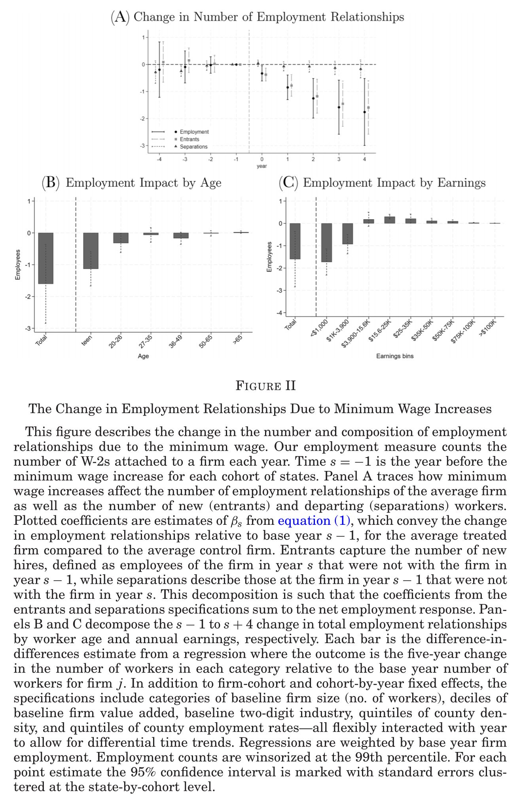
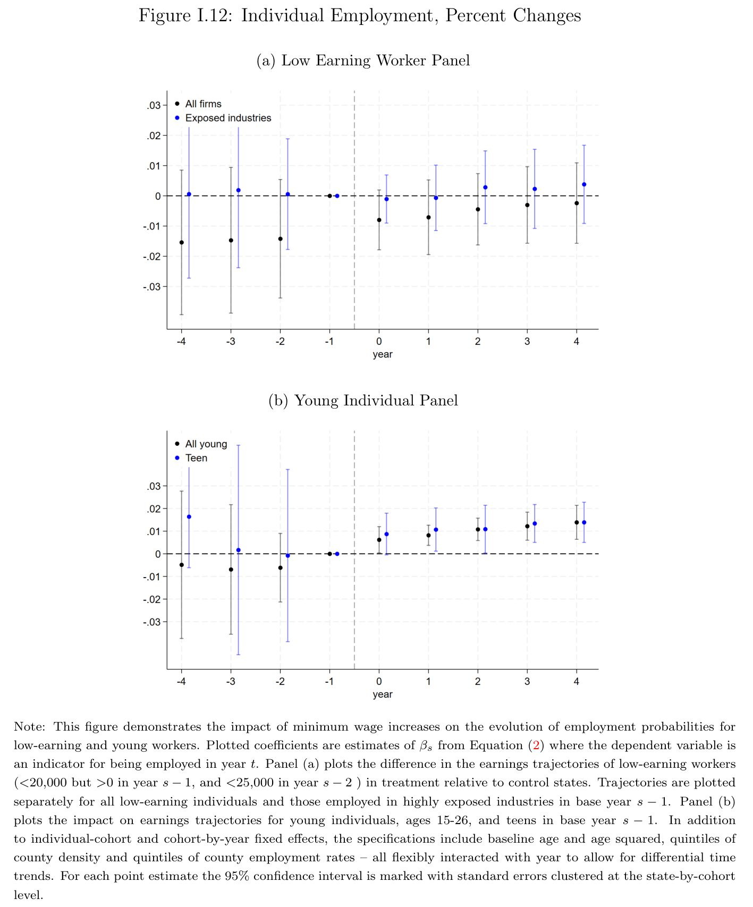
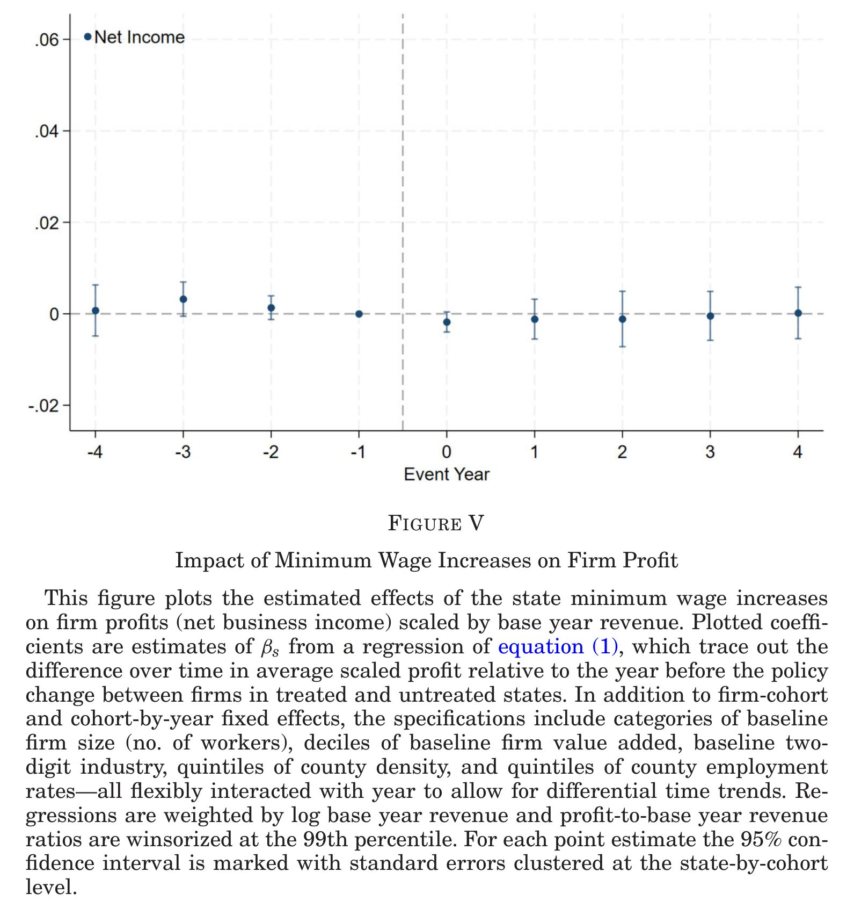
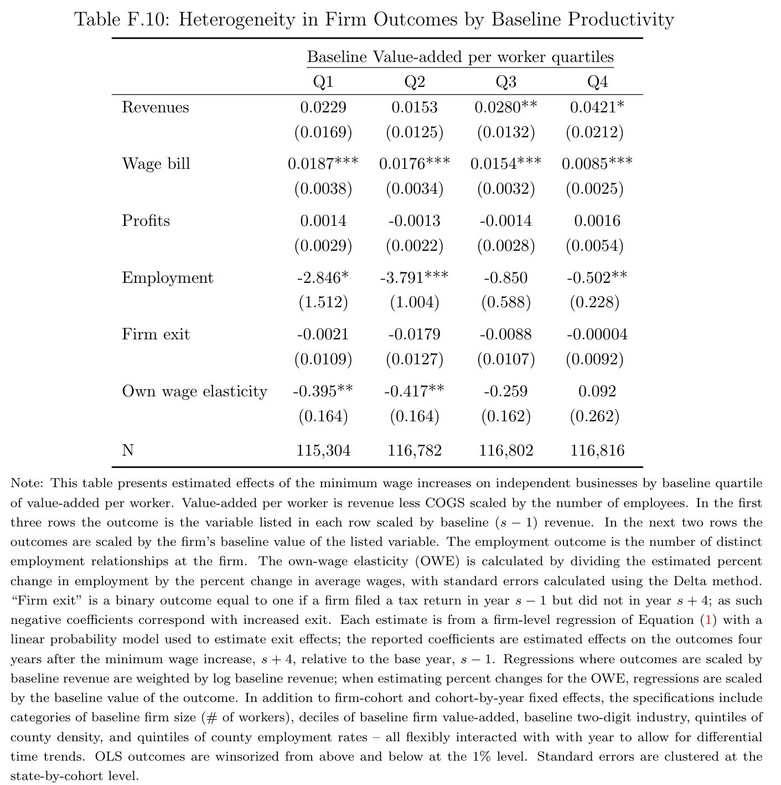
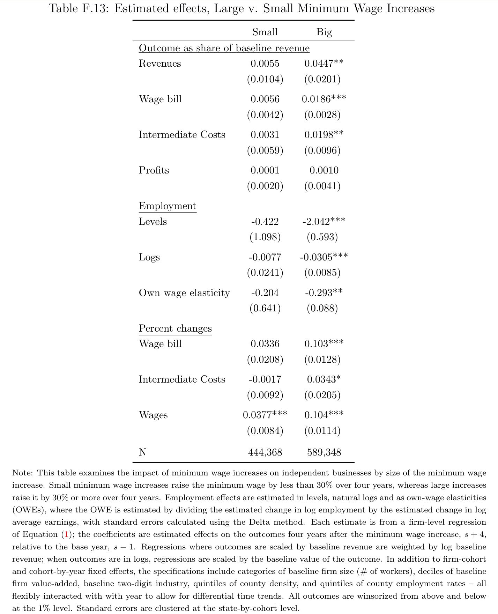
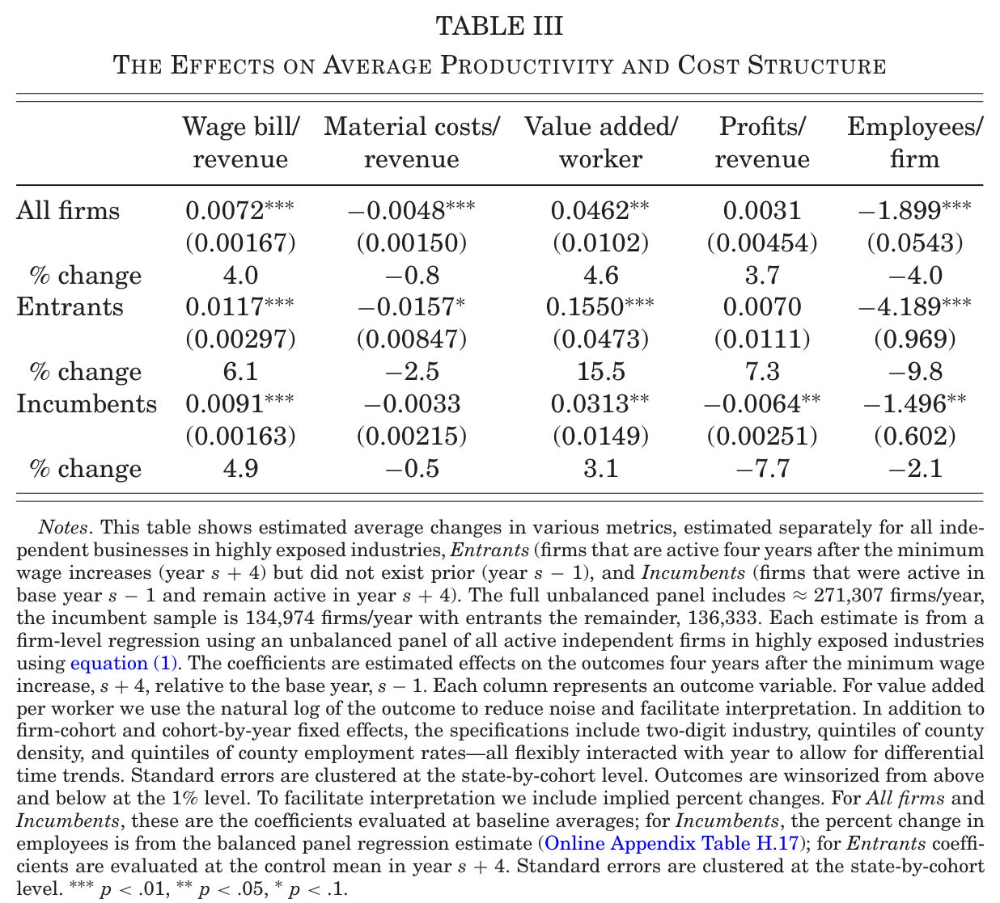
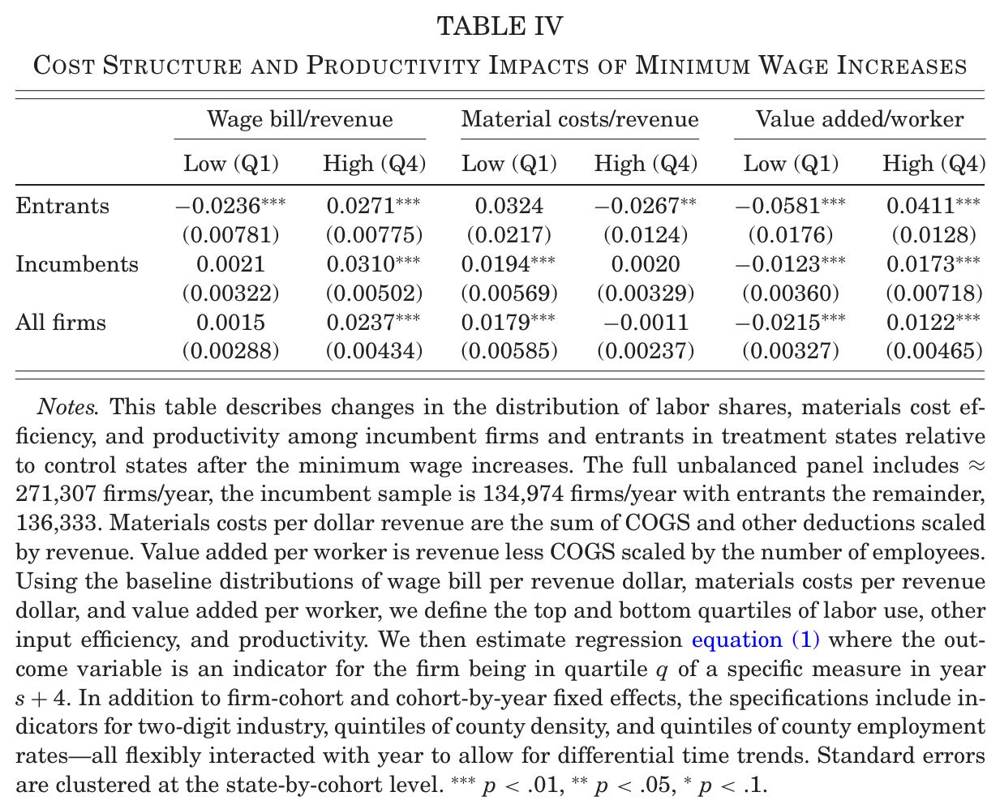
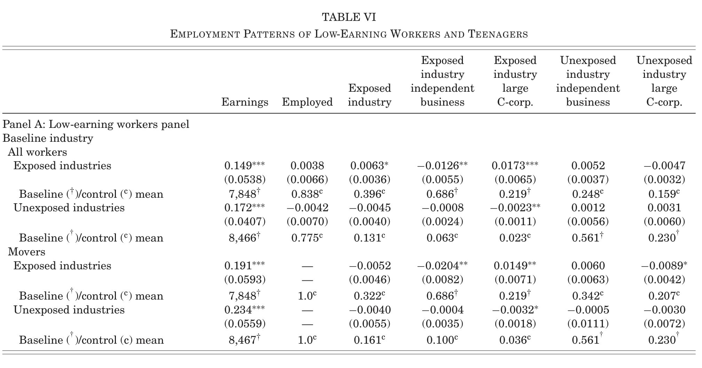
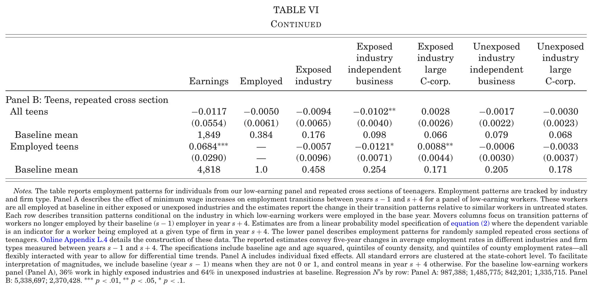

```{css CSS setting, echo=FALSE, results = "hide"}
.SeiroBenign {
  background-color: #FFEBCD;
  padding: 0.5em; /*文字まわり（上下左右）の余白*/
  /* border: 1px solid yellow; */
  /* font-weight: bold; */
}
.SeiroLightGreen {
  background-color: #D0F0C0; /* Tea green */
  padding: 0.5em; /*文字まわり（上下左右）の余白*/
  font-family: Noto S	ans;
  /* border: 1px solid yellow; */
  /* font-weight: bold; */
}
/* Define a margin before hX (header level X) element */
h1  {
  margin-top: 3ex;
  margin-bottom: 3ex;
  /* background: #c2edff; */ /*背景色*/
  padding: 0.5em;/*文字まわり（上下左右）の余白*/
}
h2  {
  margin-top: 2ex;
  margin-bottom: 2ex;
  padding: 0.5em;/*文字周りの余白*/
  ####color: #010101;/*文字色*/
  color: #87a5f2;
  /* background: #eaf3ff; */ /*背景色*/
  /* border-bottom: solid 3px #516ab6; */ /*下線*/
}
Blue {
  color: blue;
}
Red {
  color: red;
}
Purple {
  color: purple;
}
Gray {
  color: gray;
}
DarkBlue {
  color: #11017c;
}
```

<style type="text/css">
  body, td{
  font-size: 16pt;
}
</style>

<!-- LaTeX math shortcode -->



# Outline

::: {.column-margin}
{}

{}

{}
:::

Minimum wage impacts on: 

1. Pass-through corporations^[利潤をすべて配分するトンネル・ファネル企業、アメリカの営業利益総計の約半分がPT企業、中小企業が多いが巨大企業(インフラ、油田開発、保険Fidelity)もいる ] ^[Non-PT companies include C corporations (listed on stock exchange) ] 
<!--
   * $\frac{\mbox{\scriptsize wage bill}}{\mbox{\scriptsize revenue}}$&uarr;
   * $\frac{\mbox{\scriptsize COGS}}{\mbox{\scriptsize revenue}}$&uarr;
   * $\frac{\mbox{\scriptsize value added}}{\mbox{\scriptsize number of workers}}$&uarr;
-->
   * Withstood the impacts 
   * Employment&darr; (-1.5 jobs per firm)
      * Vacancies were not filled by new hires ("Entrants")
      * Only the least productive firms cut employment
      * Concentrated among teenage part-timers
   * Profit rates unchanged&larr;costs&uarr;, revenues&uarr;
      * Wage bill&uarr; (ratio to revenue)
      * COGS&uarr; (ratio to revenue)
      * Value added&uarr; (ratio to number of workers)
   * Exits unchanged ($\Delta$Pr[exit]=0.21% for least productive firms)
   * Entries&darr;
1. Low income ($<$ USD 20K in s-1 and $<$ USD 25K in s-2)^[What the heck is this? ] and young (16-26) individuals 
   * Benefited in the medium run
   * Wage&uarr;
   * Employment&darr;
   * Pr[employed in s+4]&uarr; for young, unchanged for low income
1. Entrants 
   * Became fewer but more productive 
   * Wage bill&uarr; (ratio to revenue)
   * COGS&darr; (ratio to revenue)
   * Value added&uarr; (ratio to number of workers)
   * Employment&darr;
1. Overall
   * Impacts on PTs are mostly from large MW increases
   * Profits unchanged
   * Employment &darr; mostly by least productive firms (who cannot raise revenues) to stay afloat (=to keep profits unchanged)
   * Low wage worker earnings&uarr;, if employed
   * Labour productivity&uarr;
   * Consumers paid for min wage&uarr; &larr; profits unchanged &larr; wages bills&uarr;, firm revenue&uarr; 
      * Income reallocation: Everyone&rarr;sub minimum wage workers
   * Entries&darr; &rArr; business dynamism&darr;
   * Although profits and exit rates remain unchaned even for the least productive firms, there is a chance that the least productive firms may have suffered under large MW increases, but authors do not examine this


# Motivation


1. Fears of minimum wage impacts on independent businesses (pass-throughs) 
   * Operate on margins too slim to accommodate cost increases
   * Face demand too elastic to pass costs to consumers
1. A large share of PT corporation owners support higher minimum wages 

# Data

1. Income tax returns (IRS) data on pass-through corporations
   * Matched employer-employee data
   * Employer level
      * Revenue
      * COGS
      * Wage bill
      * Other deductibles (incl. depreciation line item = investment)^[Fn 28 ] ^[Costs of capital? ]
      * Value added (rev-COGS)
      * Profits (rev-COGS-wage bill-other)
      * Number and contents of employment relationships
   * Employee level
      * Earnings
      * Employers
      * Employment periods
   * 2010-2019
      * MW&uarr;: 2013-2016
      * Can test pre-trends/placebo effects
   * 271K balanced panel firms per year
      * 135K treated ("highly exposed")
      * 136K control
   * 1.386M unbalanced panel firms per year
   * 2% random panel sample of low earning individuals (including C-corporations)^[They used tax returns data for low earning workers for C-corporations... they also write that these firms are difficult to take up because of complex parent-subsidiary relationships and use of third-party payroll services, difficulty in linking operations of a firm to a specific location. ]
   * 2% random panel sample of young individuals (16-26)
1. CPS Monthly Outgoing Rotation Groups (MORGs)
   * Use hourly wage information
   * Get "highly exposed" industries by year and state
   * Map to IRS data


# Methodology

## Data preparation

"Highly exposed" industry $\equiv$ Sub MW worker share > 1% 

1. Using CPS MORGs, for each industry, state, and year s-1, compute the mean shares of sub-MW workers
   * Highly exposed industries are defined for each state
1. Map CPS indstry code =crosswalk=> 2012NAICS ==> 2017NAICS in IRS data

## Sample selection

Pass-throughs

* A business that does not pay income tax at the company level
* Instead, the company's profits and losses "pass through" directly to the owners^[C Corporations: Pay corporate income tax, shareholders pay tax on dividends and capital gains, employees pay individual income tax ]

1. Sole proprietorships^[Independent contractors, freelancers, small retail businesses, sole-owner restaurants, and many self-employed professionals ]
1. Partnerships^[Large law firms, accounting firms, private equity partnerships, hedge fund partnerships, real estate partnerships, and master limited partnerships in energy and infrastructure ]
1. Limited Liability Companies (LLCs)^[Small tech startups and family businesses to joint venture real estate projects] ^[LLCs can elect different tax treatments such as C-coporations, but by default they’re taxed as pass-throughs ]
1. S Corporations (S Corps)^[Many privately held retail chains, construction firms, regional banks, professional service firms (law, accounting, consulting), and closely held manufacturing companies ] ^[Income "passes through" to shareholders' personal returns, must be less than 100 shareholders ]

* [About 95 %](https://www.brookings.edu/articles/9-facts-about-pass-through-businesses) of U.S. businesses are structured as pass-through entities (2017)
* They earn more than half of all net business income in the United States (i.e., the aggregate profits generated by businesses).
* Shares of PT in terms of both [numbers (more than 80%)](https://taxpolicycenter.org/sites/default/files/3.16.2_fig1.png) and [business net incomes (more than 50% in 2015)](https://taxpolicycenter.org/sites/default/files/3.16.2_fig2.png) are rising since passage of the Tax Reform Act of 1986 [@PleskoToder2013]

Use of balanced panel

* Least productive firms may attrit&rarr;balanced panel emphasizes too much of upside

## Estimation

Stacked-design event study estimator^[Not the most efficient but not the most biased (when assumptions got wrong) ]

An outcome $y_{jct}$ of firm $j$, event cohort $c$ (same cohort=collection of states increased MW in the same year), year $t$ with event date $s$ is explained by a binary treatment indicator $D_{jc}$ and covariates $\bfx_{jc}$ with time-varying coefficients $\beta_{s}, \bfgamma'_{s}$ and FEs (cohort-time, cohort-firm)^[Note cohort can be the same over more than a single state, e.g., when States A and B increased MW in the same year. ] ^[State FEs are omitted because there can be a cohort with only one state, causing collinearity in that State and the corresponding cohort ] ^[cohort-firm FEs...a firm can have multiple establishments over different cohorts ]

$$
\begin{aligned}
y_{jct}
&=
\alpha + \sum_{s=4, s\neq -1}^{4}\left(\beta_{s}D_{jc}+\bfgamma'_{s}\bfx_{jc}\right)\times year_{s=t}\\
&\hspace{2em}+\delta_{ct}+\phi_{jc}+v_{jct}
\end{aligned}
\tag{1}
$$

Outcomes are

* Ratios to baseline log revenues $\frac{z_{jct}}{\ln Rev_{jcs-1}}$
* Percentage change relative to base year $\frac{z_{jct}}{z_{jcs-1}}$

Regressions are weighted by baseline denominator variables

* Robustness to weighting choice is not shown... 


SEs are clustered at state-by-cohort level^[I would cluster at State-industry level because that is where interventions are aimed at ]

Placebo tests on less than 1% exposed industries (passed)

# Heterogeneity

* Least productive firms cut costs because could not increase revenues
* Large > 30% MW increases are where impacts come from
* Many states in third quadrant (profits&darr;, employment&darr;)
* Employment: PT&rarr;C corporations

::: {#fig-hetero layout-ncol=2}
{}

{}
:::


```{r employment impacts by state, warning = F}
library(data.table)
grepout <- function(str, x)
  # returns element of match (not numbers)
  x[grep(str, x, perl = T)]
x <- fread("TabF12.prn")
x <- x[, .(State, Profits_scaled, Employment_percent, N)]
x[, state := shift(State, type = "lag")]
x[State != "", state := State]
x[, State := NULL]
x[, type := rep(c("est", "se"), nrow(x)/2)]
setnames(x, c("Profits_scaled", "Employment_percent"), 
  c("var.profits", "var.employment"))
xL <- reshape(x, direction = "long", idvar = c("state", "type"),
  varying = grepout("var", colnames(x)))
xLW <- reshape(xL, direction = "wide", idvar = c("state", "time"),
  timevar = "type", v.names = grepout("var|N", colnames(xL)))
xLW[, N.se := NULL]
setnames(xLW, c("state", "variable", "N", "estimate", "se"))
xLW[, lb := estimate - 1.96*se/N]
xLW[, ub := estimate + 1.96*se/N]
library(ggplot2)
library(ggrepel)
set.seed(10)
x[, ApproxN := round(N/1000)]
apN <- unique(x[!is.na(ApproxN), ApproxN])
apN <- apN[order(apN)]
ggplot(data = x[type == "est", ], 
  aes(x=var.profits, y=var.employment, label = state, size = ApproxN)) + 
#### geom_pointrange(mapping=aes(x=state, y=estimate, ymin=lb, ymax=ub), 
####  color="blue") + 
geom_point(aes(size = N)) +
labs(
  size = "Number of firms",
  title = "Four year MW impacts by state (Table F12)",
  x = "Changes in profit-to-revenue ratios", 
  y = "Percentage point changes in employment"
)+
theme(
    legend.position = "bottom",
    plot.title = element_text(size=20, vjust=1.5)
) +
#### scale_size_manual(values=c(rep(1, 4), round(160/135, 1), round(167/135, 1)))+
guides(size=guide_legend(nrow=1, byrow=TRUE))+
geom_hline(yintercept=0, color = "red") +
geom_vline(xintercept=0, color = "red") +
geom_text_repel(size = 3.5) 
```

::: {.callout-note title='Dynamic efficiency impacts' collapse='true'}

> Among incumbents, the cost structure changes, leading them to spend proportionately less on nonlabor inputs as they increase sales through greater value added per worker. (p.376)

They do spend more on COGS...

::: {layout-ncol=2}
{}

{}
:::


:::


::: {.callout-note title='Reduced foothold' collapse='true'}
> ... reduced part-time hiring and reduced firm entry could deny young workers a foothold in the labor mar- ket and decrease the number of jobs available to low-earning workers. Examining individual panels of low-earning workers and young individuals, we find that their annual earnings rise on average by 18.9% and 21.8%, respectively, in the years after the minimum wage increase.(p.376)

Estimated on existing workers, not low-earning and young individuals in general
:::

::: {.callout-note title='Move to C-corporations' collapse='true'}

> making workers more likely to move to larger firms, especially large C-corporations (p.377)

{}

{}
:::


# 感想

* 大きな母集団を使って新しい(今までと違く意外な)知見を提供
* 失業効果が少ない理由
   * 先行研究: 失職者が他企業に再雇用 [@Dustmannetal2022; @EngbomMoser2022]
   * 本論文: 失職者はいるが倒産は僅少、新規雇用が減少
* 企業退出率
   * 先行研究: 増加
   * 本研究: 不変
* 消費者負担
   * 先行研究: substantial but partial (ハンガリー、UK)
   * 本論文: 100% (アメリカPT企業)
* よって利潤
   * 先行研究: 低下 (ハンガリー、UK)
   * 本論文: 不変 (アメリカPT企業)
* 低所得労働者の賃金がその後成長
* 制約
   * 観察期間は中期まで
      * 低生産性企業が雇用を減らした後の効果?
   * Subpopulation of all firms
   * 他の情報源(CPS)で産業別Fraction affectedを計算し、IRSデータにマッピング
* 外的妥当性?
   * アメリカの中小企業は優秀なのでは
   * ドイツやブラジルでは低生産性企業が倒産した
   * 途上国の中小企業が収入を引き上げて利潤をキープ?
* Highly exposed $\equiv$ FA>1%を変えると?
* どうやって収入を引き上げることができた?
   * 低生産性(Q1)企業が大きなMW&uarr;のときに倒産しているかも
* 資本代替は観察不可能
* 理論に頼った解釈なしなので、総合的な理解が難しい
