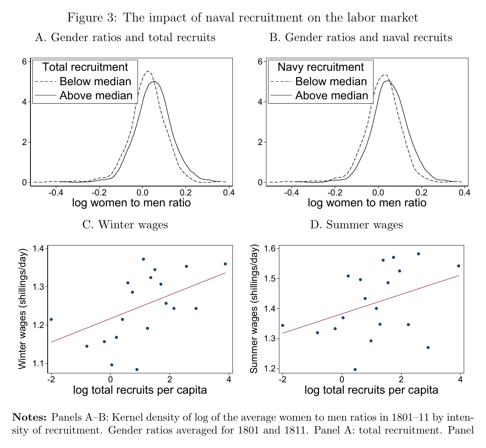

```{css CSS setting, echo=FALSE, results = "hide"}
.SeiroBenign {
  background-color: #FFEBCD;
  padding: 0.5em; /*文字まわり（上下左右）の余白*/
  /* border: 1px solid yellow; */
  /* font-weight: bold; */
}
.SeiroLightGreen {
  background-color: #D0F0C0; /* Tea green */
  padding: 0.5em; /*文字まわり（上下左右）の余白*/
  font-family: Noto Sans;
  /* border: 1px solid yellow; */
  /* font-weight: bold; */
}
/* Define a margin before hX (header level X) element */
h1  {
  margin-top: 3ex;
  margin-bottom: 3ex;
  /* background: #c2edff; */ /*背景色*/
  padding: 0.5em;/*文字まわり（上下左右）の余白*/
}
h2  {
  margin-top: 2ex;
  margin-bottom: 2ex;
  padding: 0.5em;/*文字周りの余白*/
  color: #87a5f2;
  /* background: #eaf3ff; */ /*背景色*/
  /* border-bottom: solid 3px #516ab6; */ /*下線*/
}
Blue {
  color: blue;
}
Red {
  color: red;
}
Purple {
  color: purple;
}
Gray {
  color: gray;
}
DarkBlue {
  color: #11017c;
}
```

<style type="text/css">
  body, td{
  font-size: 16pt;
}
</style>

<!-- LaTeX math shortcode -->



[here](https://www.aeaweb.org/articles/pdf/doi/10.1257/aer.20240393)

# Outline

::: {.column-margin}
{}

![cov[navy, labor saving]>0...?](figtab/Figure1.png){}

{}
:::

What gave rise to the Industrial Revolution of England?

a) Directed technical change (demand side): High wages + cheap energy [@Hicks1932; @Habakkuk1962; @Acemoglu2007; @Allen2009a]
a) Skill biased technical change (supply side): Human capital accumulation + culture [@Mokyr2009]
a) This paper: Both

    Case: Napoleonic-war military recruitment (natural experiment)
    
     ⇒local labour scarcity 
     ⇒adoption of labour-saving machinery
     ⇒larger effects in upper-skill rich areas

    Demand side (high wages) induced the IR with a supply side interaction (human capital)
* Factor abundance/scarcity &rArr; technology choice is not new [@San2023; @Allen2009a; @Dittmar2011; @SquicciariniVoigtlander2015; @KellyMokyrOGrada2023] with varying degree of rigorousness
    * New in this paper: unskilled labour scarcity * upper-skill abundance
* But upper-skill = mechanics is treated as exogenous
* Novelty of the paper rests on this exogeneity assumption

    ⇒@Mokyr2009: Culture affects both mechanics and tech adoption/tinkering
* The best strength of paper: Clean identification of directed tech change (labour supply shock &rArr; tech) for all of England: <Blue>Distance to a deep (15m) undersea contour</Blue> that accommodates large naval vessels=IV for recruitment
    * Distance to deep sea should not affect machine adoption
    * Corr[machine adoption, distance]: light naval recruitmemt < heavy naval recruitment
        
        &rarr;credibility&uarr;

# Motivation

Why and why in mid-17th century did IR start in England?

a) Unskilled labour scarcity, cheap coal [@Allen2009a]
a) Relatively abundant upper-tail of skilled labour [@Mokyr2009]

Test results by far 

* Support b): @SquicciariniVoigtlander2015
* Reject a): @KellyMokyrOGrada2023 

## :x D1

Army enlistment (@Floud1990) + navy ships' muster rolls (National Archives)
:   Individual-level recruitment of army + navy during the Napoleonic Wars.

    * Peak &#8771; 350K men; Navy 16K (1792) &rarr; &#8771;150K (1812)
    * Only &#8771;1/3 of ships' rolls survive; of individual entries, only &#8771;30% carry precise geographic origin &rArr; large measurement error

Historical newspapers &mdash; machine advertisements (British Library &amp; Findmypast 2022)
:   Machine adoption from farm-sale notices, 1790&ndash;1820, across ~10,000 English parishes.

    * **4,875** agricultural machines identified 1790&ndash;1830: 3,878 labour-saving + 997 non-labour-saving (functionality per @Fussell1952)
    * Labour-saving (replace manual work) vs non-labour-saving (facilitate work not previously done)
    * Cell-level counts entering controls: **2,723** machine ads vs **14,532** farm ads &rArr; control for total farm ads and distance to newspaper towns
    * Reverse-causality check geolocates **&gt;14,500** farm sale/lease ads (1800&ndash;1820)


# Data

* labour (Army and navy recruitment) + capital (machine listing of farm sales ads on newspaper) + wage (agricultural survey) + maps

    recruitment ⇒ scarcity &rArr; machine adoption
* ship movements (Lloyd's): IV relevancy check (commercial vs. naval fleets of each port)
* demography (1801 population census): sex ratio, recruitment rate
* machine productivity (RASE competition): post adoption TFP growth, machine productivity


@d1. [: 1. Army enlistment (@Floud1990) + navy ships' muster rolls (National Archives)](#D1)

@Floud1990; @Fussell1952; @Young1817; @Clark2010 

::: {.details}
Army enlistment (Floud, 1990) + navy ships' muster rolls (National Archives)
:   Individual-level recruitment of army + navy during the Napoleonic Wars.

    * Peak &#8771; 350K men; Navy 16K (1792) &rarr; &#8771;150K (1812)
    * Only &#8771;1/3 of ships' rolls survive; of individual entries, only &#8771;30% carry precise geographic origin &rArr; large measurement error

Historical newspapers &mdash; machine advertisements (British Library &amp; Findmypast 2022)
:   Machine adoption from farm-sale notices, 1790&ndash;1820, across ~10,000 English parishes.

    * **4,875** agricultural machines identified 1790&ndash;1830: 3,878 labour-saving + 997 non-labour-saving (functionality per Fussell, 1952)
    * Labour-saving (replace manual work) vs non-labour-saving (facilitate work not previously done)
    * Cell-level counts entering controls: **2,723** machine ads vs **14,532** farm ads &rArr; control for total farm ads and distance to newspaper towns
    * Reverse-causality check geolocates **&gt;14,500** farm sale/lease ads (1800&ndash;1820)

Government agricultural surveys &mdash; "General Views" (Young, 1817, 20,000+ pages)
:   1,500+ newly-collected local wage rates.

    * Winter +103%, summer +104% (1790&ndash;1811)
    * vs Clark (2010) cost-of-living index +64%, wheat +77% &rArr; labour dearer in absolute and relative terms
    * Local variation, not just the aggregate trend

Royal Agricultural Society of England (RASE) competition records
:   Number and quality of experimental agricultural machines at RASE meetings.

    * Prize competitions across England &rArr; machine productivity measure
    * Used to test whether early (war-induced) adoption raised the later *pace* of improvement

Lloyd's List &mdash; ship movements (two years digitised)
:   Shipping traffic to/from British ports; used to validate the naval-recruitment instrument (introduced in the IV-results port-validation subsection).

    * Tracks every ocean-going vessel to/from a British port; top 17 ports = 96% of national traffic
    * Top 7 naval ports = 95% of 1799&ndash;1800 Royal Navy vessels &rArr; classify "naval" ports; rules out commercial-port activity as the driver
:::

# Historical background

* Dorset General View, 1813, p.144:

> A considerable number of thrashing [sic] machines have been erected in this county ... the principal inducement for using them is a scarcity of labourers, which, in a state of warfare, may be expected to be felt most in maritime districts.

* Britain broke Malthusian fetters: sustained per-capita growth despite rising population
   * Real GDP growth 1.2% p.a. (late 18C) &rarr; 1.7&ndash;2.3% (next 50 yrs)
   * Per-capita 0.3&ndash;0.9%
   * TFP grew &lt;0.5% over the 70 yrs after 1760 (@Broadberry2015) &mdash; small but positive
* Structural change early: agriculture and industry employment shares equal at 31% by 1801
* Napoleonic Wars (1793&ndash;1815): most protracted, costly war before 1914
   * Decentralised recruitment; press-gangs compelled involuntary service (@Rodger2006)
   * Navy accepted many "landsmen" (recruits without maritime experience)
* The Poor Law: Generous supports, but requires local residency &rArr; immobile abour &rArr; local labour inbalance is adjusted with wages

# Shocks &rArr; scarcity &rArr; adoption

1. Recruitment shock (1793&ndash;1815)
   * 10%+ of the male population under arms; army + navy $\simeq$ 350K at peak
   * Navy grew 16K (1792) &rarr; $\simeq$ 150K (1812)
1. Labour scarcity
   * Skewed sex ratios ("missing men")&uarr; where recruitment was heavy
   * Wages&uarr; (winter +103%, summer +104%, 1790&ndash;1811)
1. Technology adoption
   * Labour-saving machines (threshers etc.)&uarr;
   * Non-labour-saving machines: no effect

# Identification

Machine adoption $M_i$ in cell $i$ on military recruitment $R_i$:

$$
M_i = \alpha_r + \beta R_i + \gamma X_i' + u_i
\tag{1}
$$

* Unit $i$: one of 2,600 equally-sized cells covering England and Wales
* $\alpha_r$: five region fixed effects (Poor Laws, law of settlement vary regionally)
* $X_i'$: 1801 population, agriculture/trade employment shares, country banks 1791 (finance), local mechanical expertise, area, wheat suitability, ruggedness, fisheries access, port proximity, distance to post-office town, newspaper controls
* Log transforms for skewed vars; cells with zero recruitment assigned $-2$ [@ChenRoth2023]

## IV strategy

::: {.column-margin}
](figtab/FigA4.jpg){}
:::

* OLS is inconsistent
    * Measurement errors in recruitment data
    * Omitted variables: Corr[recruitment, adoption rate]>0, if recruitment targets non-agricultural workers in urban areas where adoption rate is high
* IV to navy recruitment  = shortest distance to deep, navigable sea
   * Deep-sea line = closest seabed point 12.5 m below the waterline (FUD anchoring rule: 10&ndash;15 m)
   * Larger vessels supplied the bulk of naval manpower [@Lavery2020]
   * Deeper than 15m is not preferred because it requires longer chains/ropes
* Sample restricted to coastal cells $\leqslant$ 15 km from coast; distance-to-coast controlled directly
* Exclusion restriction: within coastal cells and conditional on distance to coast, distance to the 12.5 m line affects adoption only through naval recruitment

## Validation

::: {.column-margin}
{}

{}
:::

1. Deep-sea distance 1 $\sigma$&uarr; &rArr; naval recruitment 0.13&ndash;0.17 $\sigma$&darr;, $F \simeq 13$&ndash;$25$
    * Deep-sea distance predicts navy ports strongly but commercial ports only weakly (vanishes with controls)
1. Effects only from the 7 m contour onward, peaking at 10&ndash;15 m (matches FUD depth), zero afterwards
    * Vessels do not anchor deeper seas
    * If no ships anchor &rArr; recruitment by distance is a pure noise &rArr; zero coeff
1. Deep-sea distance $\perp$ army recruitment ($p \leqslant 0.006$ for the difference)
1. Magnitude of corr[deep sea distance, naval recruitment]<0: large ships > small ships [Table A3]
    * Why should the distance-recruitment gradient be larger for large ships than small ships?
    * Maybe: It is too much to travel long distance if you can only fill a tiny portion of demand
1. IV not correlated with likely omitted variables: 
    * 1801 agricultural share
    * population density
    * wheat suitability correlates in the *wrong* direction
1. Validity check on never-takers (cells with $\leqslant$ 1 naval recruit, or farthest from Recruitment Impress offices): No deep-sea effect on adoption
1. Demand from commercial ships?
    * Lloyd's data on ship movement
1. Naval recruitment &rArr; labour&darr& &rArr; farm sales&uarr;
    * Search on British Library Findmypast (2022) to geolocate ads
    * Add control: turn of 19 century land market info, at least one farm ads
        * Results remain


# Results

::: {.column-margin}
{}

{}
:::

::: {.callout-note title='Gender imbalances and wage pressure (Table 1, Figure 3)' collapse='true'}
* 1 $\sigma$ in log total (navy) recruitment &rArr; log women-to-men ratio&uarr; by 0.13 (0.15) $\sigma$
* 25th &rarr; 75th percentile of naval recruitment &rArr; winter (summer) wages +0.8 (1.0) pence/day $\simeq$ 5&ndash;6% of the mean
* No wage relationship before the war with France (placebo passes)
:::

::: {.callout-note title='IV: 2SLS estimates (Table 3)' collapse='true'}
* First stage strong ($F \simeq 13$&ndash;$25$); reduced form: farther from deep sea &rArr; far fewer labour-saving machines
* **2SLS: 1 $\sigma$ navy recruitment &rArr; 0.6&ndash;1.0 $\sigma$ more labour-saving machines**
* Non-labour-saving: null; coefficients significantly different from labour-saving ($p \leqslant 0.01$)
* Anderson&ndash;Rubin $p \leqslant 0.002$; @LeeMcCraryMoreiraPorter2022 $tF$ 10% CI excludes zero &rArr; weak-instrument concerns dismissed
:::

OLS ($\simeq$ 0.2) &rarr; IV (0.6&ndash;1.0): the IV coefficient is much larger (or too large?)

a) very severe measurement error — only 1/3 of muster rolls survive, 30% with geographic origin; error-in-variables would explain the whole gap at $<$ 30% reliability
a) omitted-variable downward bias, since the navy recruited in trading centres (towns) with little demand for threshers. @MarbachHangartner2020 compliers look like the rest of the sample, so LATE $\simeq$ ATE. 

Plausible, but a 3&ndash;5&times; jump is a lot to load onto attenuation + OVB. 


# Synergies

## Labour shortages &times; mechanical skills

::: {.column-margin}
{#tbl-Tab4}

{#fig-Fig7}
:::

* Mechanical-knowledge index from apprenticeships (skill supply), machine patents (frontier expertise), and newspaper mentions of machinery
* Higher mechanical skill &rArr; larger effect of recruitment on labour-saving adoption (OLS interaction strong, @tbl-Tab4 -A col 4)
* IV interaction: point estimate close to OLS, but $t$ below conventional significance^[IV with interacted endogenous variables is notoriously under-powered — the two endogenous regressors, the instrument, and the interacted instrument are highly collinear. The "synergy" headline therefore rests on the **reduced form** (interaction $p = 0.08$), not the 2SLS. ]
* labour scarcity [@Allen2009a] and human capital [@Mokyr2009] are not mutually exclusive but reinforced each other

## Other drivers of growth

* Finance [@HeblichTrew2019], coal [@FernihoughORourke2021], slave wealth [@Heblich2022]
* No significant, systematic interaction with recruitment in reduced form / 2SLS (OLS often wrongly signed)
* Main navy-recruitment effect is stable to including and interacting these factors


# Long-term consequences

::: {.column-margin}
{}

{}
:::

* Post-1820: machines stayed (2,171 after vs 2,293 before 1820); naval recruitment remains a significant 2SLS predictor of later adoption
* RASE thresher productivity: faster improvement where naval recruitment had promoted early adoption &larr; conjecture: more competition on tinkering
* Labour-saving-adoption&uarr; &rArr; share of agricultural families&darr;


# Robustness

* Extensive margin: Probit / Poisson discrete-choice models &rArr; similar results
* Matching exercises
* Spatial inference: @Conley1999, Ibragimov and Müller (2010), @ConleyKelly2025 &mdash; significance survives
* Plausibly-exogenous / bounds on exclusion violations
* Alternative samples, controls, recruitment definitions
* Ruled out: commercial-port activity and land-market activity as the driver (seven naval ports = 95% of 1799&ndash;1800 RN vessels; controlled)


# 感想

* 賃金&uarr; &rArr; 資本集約度&uarr;を産業革命期イギリスで示した
* 産業革命期: 製造業への就労構成、歴史的な高賃金、3年に1年は戦争中を総合した、と言っています
* ナポレオン戦争=自然実験として賃金高騰を利用
* IV=15メートル深度への距離を船の技術情報を使って正当化
* 賃金高騰 or 高スキル蓄積 &rarr; 賃金高騰 and 高スキル蓄積
* 「貢献」=高スキル蓄積のある地域では機械導入が多かった、は高スキル蓄積を外生と仮定しているので、貢献部分が実は弱い
* 産業革命のきっかけではなく、進展を説明しているのでは
    * きっかけ=1600年頃から成長(原因不明)、土地の貢献&darr;=エネルギー革命
    * 進展=農業機械化
* 付論に入れて良い説明が本文の大部分
