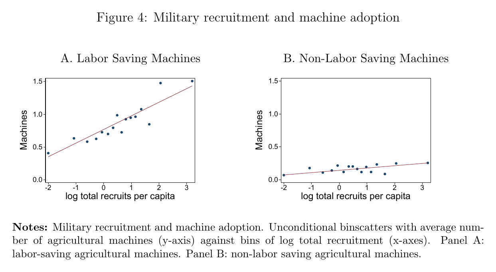
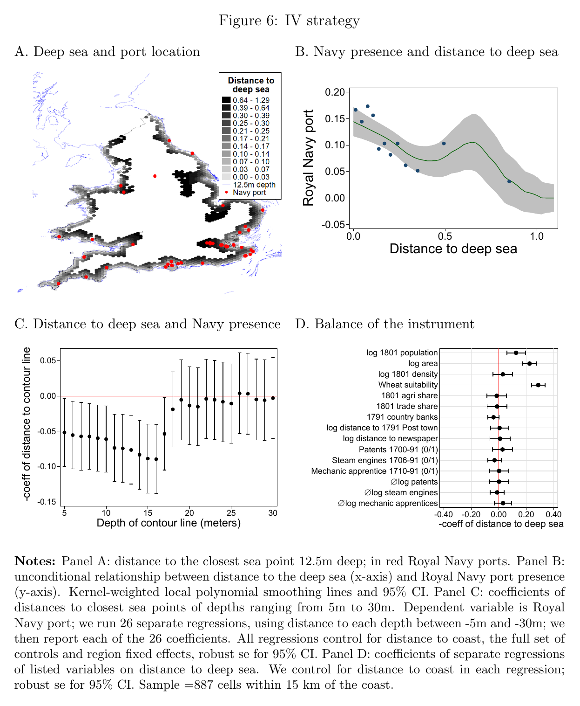
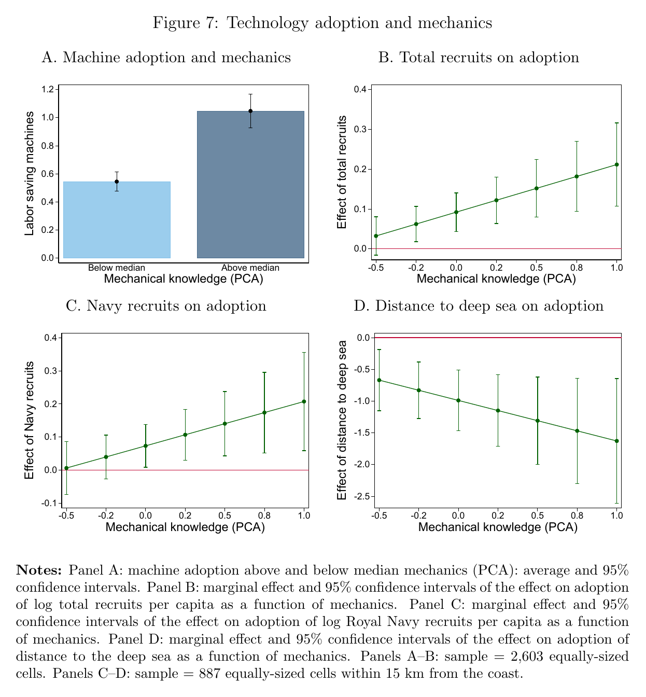
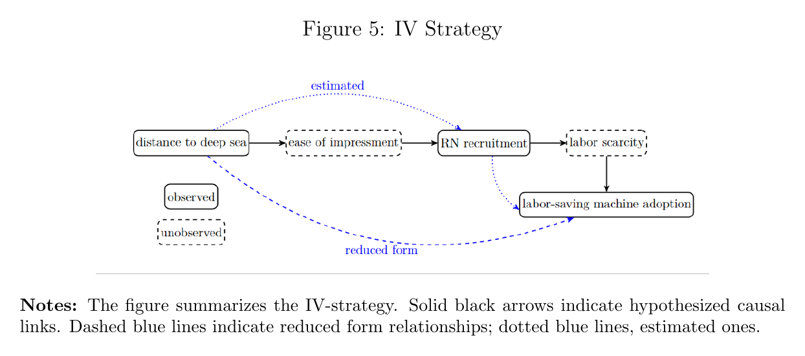
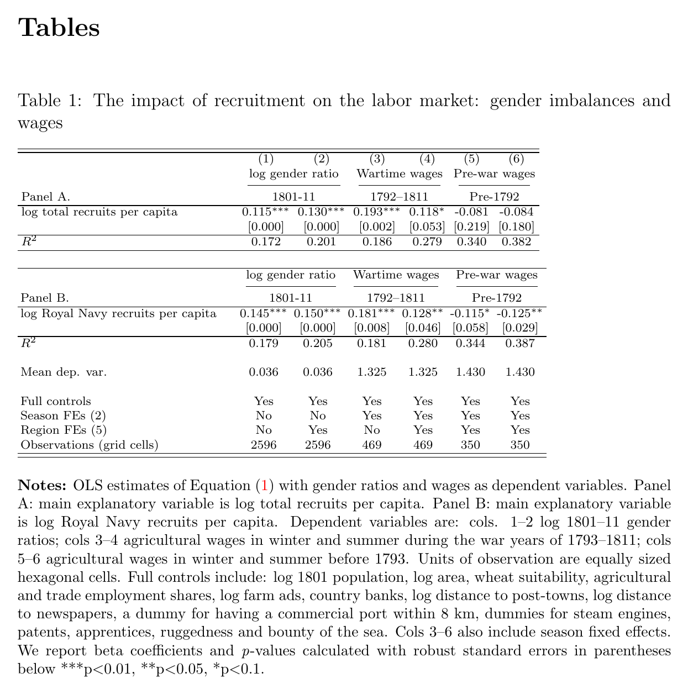
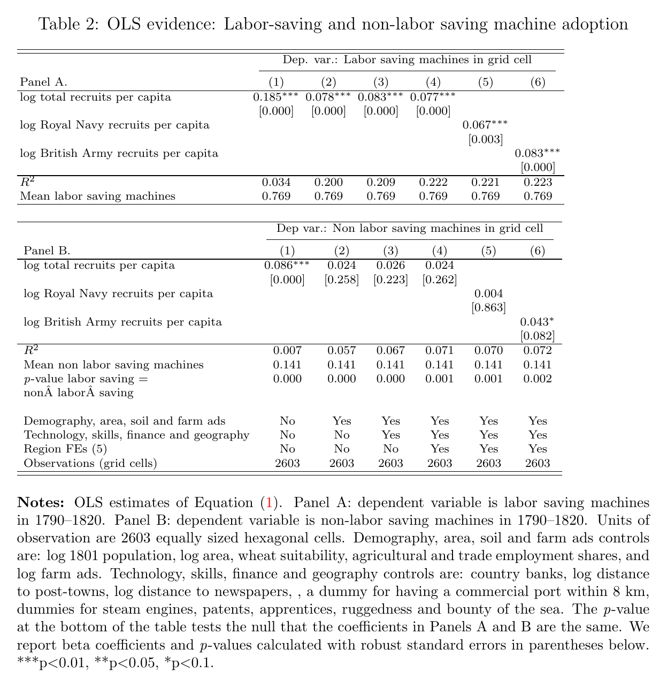
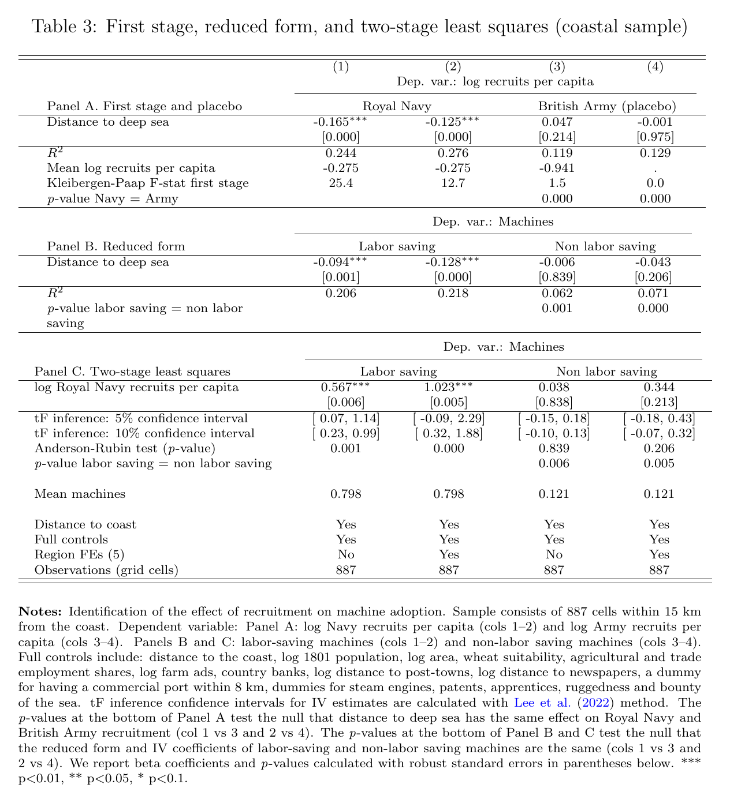
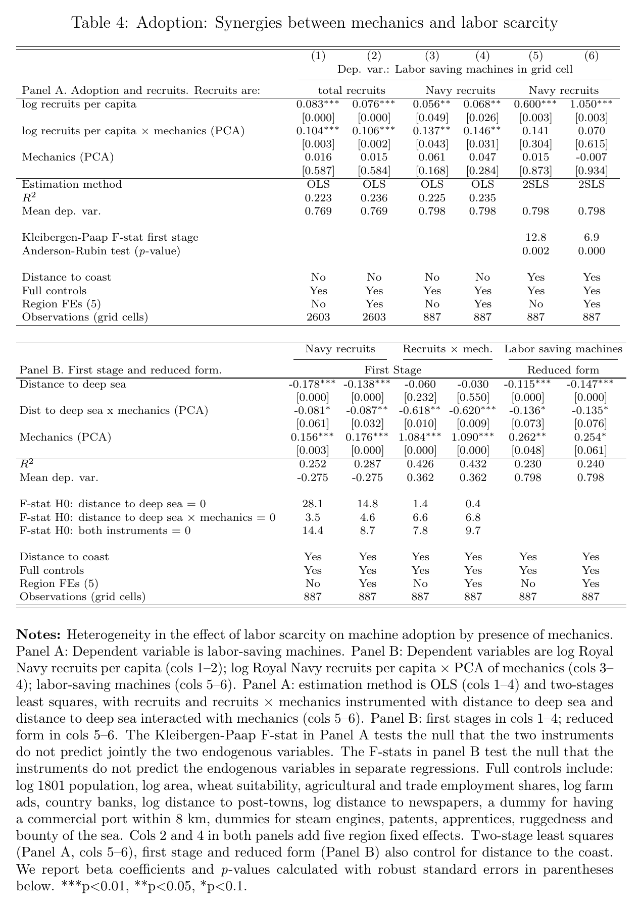
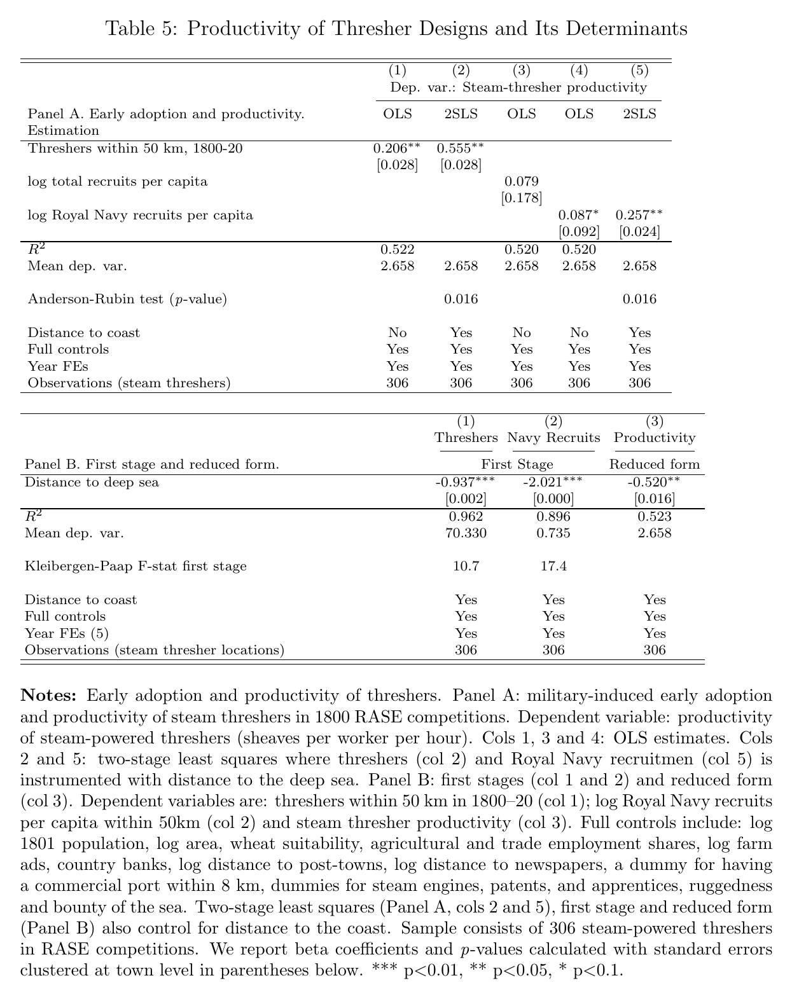
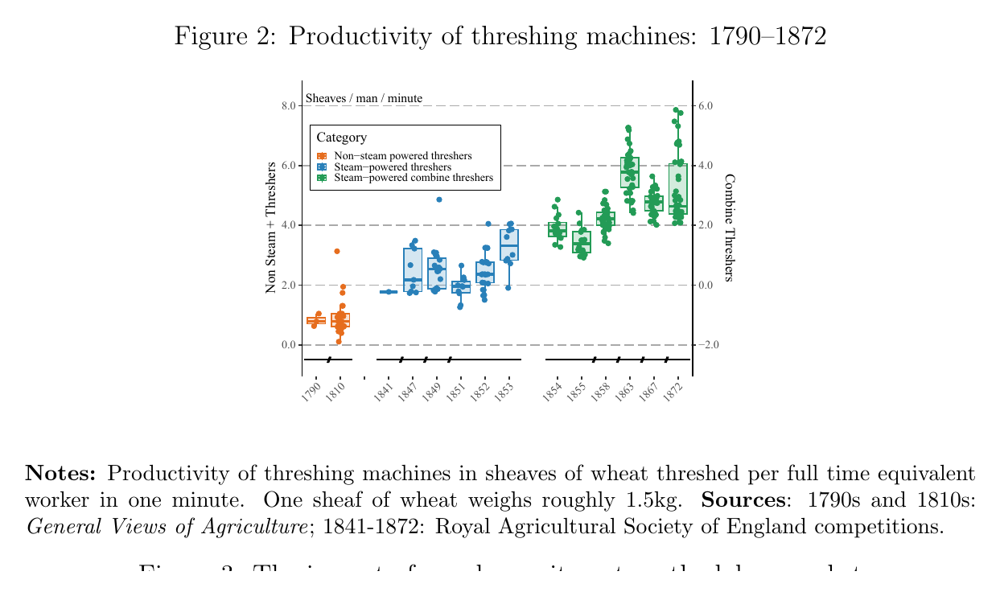

```{css CSS setting, echo=FALSE, results = "hide"}
.SeiroBenign {
  background-color: #FFEBCD;
  padding: 0.5em; /*文字まわり（上下左右）の余白*/
  /* border: 1px solid yellow; */
  /* font-weight: bold; */
}
.SeiroLightGreen {
  background-color: #D0F0C0; /* Tea green */
  padding: 0.5em; /*文字まわり（上下左右）の余白*/
  font-family: Noto Sans;
  /* border: 1px solid yellow; */
  /* font-weight: bold; */
}
/* Define a margin before hX (header level X) element */
h1  {
  margin-top: 3ex;
  margin-bottom: 3ex;
  /* background: #c2edff; */ /*背景色*/
  padding: 0.5em;/*文字まわり（上下左右）の余白*/
}
h2  {
  margin-top: 2ex;
  margin-bottom: 2ex;
  padding: 0.5em;/*文字周りの余白*/
  color: #87a5f2;
  /* background: #eaf3ff; */ /*背景色*/
  /* border-bottom: solid 3px #516ab6; */ /*下線*/
}
Blue {
  color: blue;
}
Red {
  color: red;
}
Purple {
  color: purple;
}
Gray {
  color: gray;
}
DarkBlue {
  color: #11017c;
}
```

<style type="text/css">
  body, td{
  font-size: 16pt;
}
</style>

<!-- LaTeX math shortcode -->


<!--
NOTE (Seiro): tight-cropped exhibits live in figtab/ as Table1-5.png and
Figure1-7.png (cropped with magick from PDF pages 37-46, where AER collects
exhibits). Whole-page scans p37-p46.png are also kept. Citations are plain
author-year because seiro.bib has no key for this paper yet; add a bib entry and
swap to @keys if desired.
-->

# Outline

::: {.column-margin}
{}

{}

{}
:::

Napoleonic-war military recruitment &rArr; local labour scarcity &rArr; adoption of **labour-saving** machinery in industrialising England.

1. Recruitment shock (1793&ndash;1815)
   * &gt;10% of the male population under arms; army + navy &#8771; 350K at peak
   * Navy grew 16K (1792) &rarr; &#8771;150K (1812)
1. Labour scarcity
   * Skewed sex ratios ("missing men")&uarr; where recruitment was heavy
   * Wages&uarr; (winter +103%, summer +104%, 1790&ndash;1811)
1. Technology adoption
   * Labour-saving machines (threshers etc.)&uarr;
   * Non-labour-saving machines: no effect&larr;
1. Identification
   * Navy recruitment instrumented by distance to deep, navigable sea (12.5 m contour)
   * Coastal sample only, controlling for distance to coast
1. Synergy
   * Where mechanical skills&uarr; (apprentices, patents), the scarcity effect on adoption&uarr;
   * Unifies Allen (labour costs) and Mokyr (human capital)
1. Long run
   * Machines stayed after 1820; RASE machine productivity&uarr; where wartime adoption&uarr;
   * Structural change out of agriculture&uarr;


# Motivation

Two rival explanations of the British Industrial Revolution:

1. Allen (2009): "invented in Britain ... because that was where it paid to invent it"
   * High wages + cheap energy &rArr; directed technical change (Hicks 1932; Habakkuk 1962; Acemoglu 2007)
1. Mokyr (2009): human capital / Enlightenment culture
   * Abundance of "savants and mechanics"; industrialisation began where skilled craftsmen were (Kelly et al. 2022), not where wages were high

Identification challenge

* Need cross-sectional variation in labour scarcity that is **exogenous**, not just local economic conditions
* Skill-availability and technology-adoption data have hitherto been unavailable
* Open question (Crafts 2011): did labour shortages facilitate the transition to self-sustaining growth?

This paper: a unified view assigning a role to **both** labour scarcity and human capital, using four newly-collected datasets.


# Existing literature

The paper sits at the intersection of two strands: **directed technical change** (DTC) and the **origins of the British Industrial Revolution**.

Directed technical change &mdash; theory
:   Labour scarcity raises the payoff to labour-saving invention [@Hicks1932; @Habakkuk1962; @Acemoglu2002; @Acemoglu2003; @Acemoglu2007].

    * Key refinement: only *strongly* labour-saving technologies benefit from scarcity &mdash; factor bias matters.

Directed technical change &mdash; empirical (scarcity &rarr; innovation)
:   Exogenous factor-supply shocks redirect invention toward the scarce factor.

    * @Hanlon2015: the US Civil War cotton-supply shock pushed UK textile inventors toward machines for non-US cotton yarns.
    * @Andersson2022 and @San2023: mass emigration and the end of the Bracero programme each raised labour-saving innovation.

Wages &rarr; technology adoption / automation
:   Higher relative labour cost accelerates adoption and automation.

    * @Lewis2011 (US manufacturing), @AcemogluRestrepo2020 (robots across US cities and industries), Acemoglu and Finkelstein (2008, US health).
    * Contrary/ambiguous: Franck (2022, 19C France); Dower and Markevich (2018) &mdash; Russian WWI mobilisation cut cultivation rather than mechanising.
    * Capital&ndash;labour substitution via higher wages: @HornbeckNaidu2014, Clemens et al. (2018), Abramitzky et al. (2022) &mdash; but new capital need not embody new technology, so weaker DTC evidence.

Origins of the British Industrial Revolution
:   Competing accounts of "what made Britain special".

    * Institutions (North and Weingast 1989), colonies (Inikori 2002), culture (McCloskey 2010), natural resources (Wrigley 2010), chance [@Crafts1985], reconstructed national accounts [@Broadberry2015].
    * High-wage economy [@Allen2009a]: dear labour + cheap energy made labour-saving invention pay.
    * Human capital / skilled mechanics [@Mokyr2009; @KellyMokyrOGrada2023]: abundant trained mechanics enabled a stream of micro-inventions.

Scope note &mdash; these two are not the only accounts, but the paper is *not* omitting the rest
:   Allen vs Mokyr are two of many "why Britain" theses (institutions, coal/geography, trade/colonies, demography).

    * The design uses **within-England** spatial variation &rArr; *national* rivals (1688 institutions, empire, culture, national coal endowment) are differenced out
    * *Local* versions are controlled: coal deposits (Fernihough&ndash;O'Rourke, Table A.10), enclosure (A.34), finance/steam/patents (matching covariates)
    * It tests a *mechanism* (scarcity &rarr; mechanisation, 1790&ndash;1820), not the *origin* of the IR &mdash; so the grand rivals are scope conditions, not competitors here

Empirical tests of the grand hypotheses (data / identification / estimator / result)
:   How the rival theses have themselves been tested.

    * **@KellyMokyrOGrada2023** (JPE) &mdash; *rejects Allen's high-wage premise*
        * Data: 41 English counties, 1760s&ndash;1830s (textile growth, initial wages, mechanical skills, literacy, banks, coal)
        * Identification / estimator: cross-county **semiparametric spatial regression** (spatial smooth), descriptive (N = 41)
        * Result: industry rose in *low-wage, high-mechanical-skill* counties; low wages in the 1760s alone explain **~70%** of textile-employment variation; literacy/banks/coal add little (they flag 1790s mechanical skill as possibly endogenous)
    * **@SquicciariniVoigtlander2015** (QJE) &mdash; *supports Mokyr (upper-tail)*
        * Data: French cities; Encyclopédie subscriber density (upper-tail proxy) vs literacy (average HC)
        * Identification / estimator: **OLS** (cross-section + panel) + placebo/timing (matters only *after* 1750) + controls + patent/firm mechanism &mdash; **no IV** (confirmed at source)
        * Result: upper-tail knowledge &rArr; faster growth; literacy doesn't
    * **@Dittmar2011** (QJE) &mdash; *causal information-technology effect*
        * Data: European cities 1500&ndash;1600; presses set up in the 1400s
        * Identification / estimator: **IV = distance from Mainz** &rArr; 2SLS; placebo distances (Venice/Amsterdam/London/Wittenberg) insignificant
        * Result: print-adopting cities grew **~60% faster** 1500&ndash;1600
    * *External validity*: all three are place/period-specific historical cross-sections &mdash; suggestive, not a general law
    * *Source-verification*: all three read at source (local PDFs, stored in `paper_digest.sqlite`) &mdash; KMOG uses semiparametric spatial regressions (not plain OLS); S&ndash;V uses **no IV**; Dittmar's distance-from-Mainz IV confirmed

Synergy: scarcity &times; skill, and reinstating tasks
:   * Scarcity and skill abundance *jointly* spur automation &mdash; predicted in theory [@HemousOlsen2022] (also Krusell et al. 2000) but with little prior empirical support.
    * Automation then generates new skilled tasks ("reinstating" change) [@AcemogluRestrepo2018].

This paper's contribution
:   * First well-identified, country-wide labour-market shock shown to accelerate IR-era technological progress.
    * Allen's mechanism holds economy-wide, beyond the few "leading sectors" (textiles, metal).
    * The scarcity &times; skill synergy is demonstrated empirically for a canonical case &mdash; unifying DTC with the human-capital account of the Industrial Revolution.


# Historical background

* Britain broke Malthusian fetters: sustained per-capita growth despite rising population
   * Real GDP growth 1.2% p.a. (late 18C) &rarr; 1.7&ndash;2.3% (next 50 yrs); per-capita 0.3&ndash;0.9%
   * TFP grew &lt;0.5% over the 70 yrs after 1760 (Broadberry et al. 2015) &mdash; small but positive
* Structural change early: agriculture and industry employment shares equal at 31% by 1801
* Napoleonic Wars (1793&ndash;1815): most protracted, costly war before 1914
   * Decentralised recruitment; press-gangs compelled involuntary service (Rodger 2006)
   * Navy accepted many "landsmen" (recruits without maritime experience)
* Contemporary voice (Dorset General View, 1813, p.144):

> A considerable number of thrashing [sic] machines have been erected in this county ... the principal inducement for using them is a scarcity of labourers, which, in a state of warfare, may be expected to be felt most in maritime districts.

The account already names all three moving parts: labour scarcity &rarr; adoption; warfare as the driver; and "maritime" (not merely coastal) districts as most exposed.


# Data

Five newly-collected datasets.

Army enlistment (Floud et al. 1990) + navy ships' muster rolls (National Archives)
:   Individual-level recruitment of army + navy during the Napoleonic Wars.

    * Peak &#8771; 350K men; Navy 16K (1792) &rarr; &#8771;150K (1812)
    * Only &#8771;1/3 of ships' rolls survive; of individual entries, only &#8771;30% carry precise geographic origin &rArr; large measurement error

Historical newspapers &mdash; machine advertisements (British Library &amp; Findmypast 2022)
:   Machine adoption from farm-sale notices, 1790&ndash;1820, across ~10,000 English parishes.

    * **4,875** agricultural machines identified 1790&ndash;1830: 3,878 labour-saving + 997 non-labour-saving (functionality per Fussell 1952)
    * Labour-saving (replace manual work) vs non-labour-saving (facilitate work not previously done)
    * Cell-level counts entering controls: **2,723** machine ads vs **14,532** farm ads &rArr; control for total farm ads and distance to newspaper towns
    * Reverse-causality check geolocates **&gt;14,500** farm sale/lease ads (1800&ndash;1820)
    * Window by version &mdash; main text (AER): adoption 1790&ndash;1820 (p4, p38); working-paper appendix (DP17881 p50): newspaper corpus 1750&ndash;1830

Government agricultural surveys &mdash; "General Views" (Young 1817, 20,000+ pages)
:   1,500+ newly-collected local wage rates.

    * Winter +103%, summer +104% (1790&ndash;1811)
    * vs Clark (2010) cost-of-living index +64%, wheat +77% &rArr; labour dearer in absolute and relative terms
    * Local variation, not just the aggregate trend

Royal Agricultural Society of England (RASE) competition records
:   Number and quality of experimental agricultural machines at RASE meetings.

    * Prize competitions across England &rArr; machine productivity measure
    * Used to test whether early (war-induced) adoption raised the later *pace* of improvement

Lloyd's List &mdash; ship movements (two years digitised)
:   Shipping traffic to/from British ports; used to validate the naval-recruitment instrument (introduced in the IV-results port-validation subsection).

    * Tracks every ocean-going vessel to/from a British port; top 17 ports = 96% of national traffic
    * Top 7 naval ports = 95% of 1799&ndash;1800 Royal Navy vessels &rArr; classify "naval" ports; rules out commercial-port activity as the driver

Mechanical knowledge &mdash; human capital
:   Three geolocated sources combined into a "mechanical knowledge" score, aggregated to the 2,600 hexagonal cells; feeds the labour-scarcity &times; mechanical-skills synergy (&sect;Synergies). Sourced from &mdash;

    Apprenticeship Books of the Board of Stamps (OCR-digitised, Transkribus)
    :   Apprenticeships (skill supply) &mdash; young men apprenticed to a mechanical master. *Main text (AER p12):* wheelwrights/clockmakers, 1792&ndash;1811, counted in the human-capital index. *Working-paper appendix (DP17881 p22, p57):* metal workers/watchmakers, 1710&ndash;1791, a pre-war dummy `Mechanic apprentice 1710-91 (0/1)`.

    Woodcroft (1854), *Alphabetical Index of Patentees of Inventions*
    :   Patents (frontier expertise) &mdash; resident inventors of agricultural, metallurgy and metal-goods patents, 1792&ndash;1820 (main text p12).

    British Newspaper Archive (British Library &amp; Findmypast 2022)
    :   Newspaper mentions of machinery &mdash; words signalling mechanical knowledge in any British newspaper, 1792&ndash;1820; distinct from the machine-advertisement adoption data above.


# Methodology

## OLS specification

Machine adoption $M_i$ in cell $i$ on military recruitment $R_i$:

$$
M_i = \alpha_r + \beta R_i + \gamma X_i' + u_i
\tag{1}
$$

* Unit $i$: one of 2,600 equally-sized cells covering England and Wales
* $\alpha_r$: five region fixed effects (Poor Laws, law of settlement vary regionally)
* $X_i'$: 1801 population, agriculture/trade employment shares, country banks 1791 (finance), local mechanical expertise, area, wheat suitability, ruggedness, fisheries access, port proximity, distance to post-office town, newspaper controls
* Log transforms for skewed vars; cells with zero recruitment assigned $-2$ (Chen and Roth 2023)

## IV strategy

::: {.column-margin}
{}

{}
:::

* $R$ is measured with error and correlated with unobservables &rArr; potential bias
* Focus on **navy** recruitment; instrument = shortest distance to deep, navigable sea
   * Deep-sea line = closest seabed point 12.5 m below the waterline (ships-of-the-line draft &#8771;7 m; FUD anchoring rule &rArr; 10&ndash;15 m)
   * Larger vessels supplied the bulk of naval manpower (Lavery 2020)
* Sample restricted to coastal cells &#8804;15 km from coast; distance-to-coast controlled directly
   * Isolates *military* labour demand from merchant-marine / trade effects
* Exclusion restriction: within coastal cells and conditional on distance to coast, distance to the 12.5 m line affects adoption only through naval recruitment

Validation

* First stage: 1 s.d. in deep-sea distance reduces naval recruitment 0.13&ndash;0.17 s.d.; $F \simeq 13$&ndash;$25$
* Deep-sea distance predicts navy ports strongly but commercial ports only weakly (vanishes with controls)
* Depth-line placebo: significant effect only from the 7 m contour onward, peaking at 10&ndash;15 m (matches ship technicalities)
* Army recruitment unrelated to deep-sea distance ($p \leqslant 0.006$ for the difference)
* Balance: instrument uncorrelated with 1801 agricultural share, density; wheat suitability correlates in the *wrong* direction (conservative)
* Never-takers (cells with &#8804;1 naval recruit, or farthest from Impress offices) show no deep-sea effect on adoption


# Results

::: {.column-margin}
{}

{}

{}
:::

::: {.callout-note title='Gender imbalances and wage pressure (Table 1)' collapse='true'}
* 1 s.d. in log total (navy) recruitment &rArr; log women-to-men ratio&uarr; by 0.13 (0.15) s.d.
* 25th &rarr; 75th percentile of naval recruitment &rArr; winter (summer) wages +0.8 (1.0) pence/day &#8771; 5&ndash;6% of the mean
* No wage relationship before the war with France (placebo passes)
:::

::: {.callout-note title='OLS: adoption vs recruitment (Table 2)' collapse='true'}
* Labour-saving: 1 s.d. recruitment &rArr; adoption&uarr; &#8771;0.2 s.d., large and significant across specifications
* Non-labour-saving: unconditional 0.09 s.d.; falls to &#8771;0 and insignificant once controls added
* Reject equal coefficients (labour- vs non-labour-saving), $p \leqslant 0.02$
* Only army recruitment shows a (half-sized) effect on non-labour-saving machines
:::

::: {.callout-note title='IV: 2SLS estimates (Table 3)' collapse='true'}
* First stage strong ($F \simeq 13$&ndash;$25$); reduced form: farther from deep sea &rArr; far fewer labour-saving machines
* **2SLS: 1 s.d. navy recruitment &rArr; 0.6&ndash;1.0 s.d. more labour-saving machines**
* Non-labour-saving: null; coefficients significantly different from labour-saving ($p \leqslant 0.01$)
* Anderson&ndash;Rubin $p \leqslant 0.002$; Lee et al. (2022) $tF$ 10% CI excludes zero &rArr; weak-instrument concerns dismissed
:::

OLS (&#8771;0.2) &rarr; IV (0.6&ndash;1.0): the IV coefficient is much larger.^[The authors attribute the gap to (a) severe measurement error — only 1/3 of muster rolls survive, 30% with geographic origin; error-in-variables would explain the whole gap at &lt;30% reliability — and (b) omitted-variable downward bias, since the navy recruited in trading centres with little demand for threshers. Marbach and Hangartner (2020) compliers look like the rest of the sample, so LATE &#8771; ATE. Plausible, but a 3&ndash;5&times; jump is a lot to load onto attenuation + OVB alone.]


# Synergies

## Labour shortages &times; mechanical skills

::: {.column-margin}
{}

{}
:::

* Mechanical-knowledge index from apprenticeships (skill supply), machine patents (frontier expertise), and newspaper mentions of machinery
* Higher mechanical skill &rArr; larger effect of recruitment on labour-saving adoption (OLS interaction strong, Table 4-A col 4)
* IV interaction: point estimate close to OLS, but $t$ below conventional significance^[IV with interacted endogenous variables is notoriously under-powered — the two endogenous regressors, the instrument, and the interacted instrument are highly collinear. The "synergy" headline therefore rests on the **reduced form** (interaction $p = 0.08$), not the 2SLS.]
* Reading: Allen (2009) and Mokyr (2009) are **not** mutually exclusive — labour scarcity and human capital reinforced each other

## Other drivers of growth

* Finance (Heblich and Trew 2019), coal (Fernihough and O'Rourke 2021), slave wealth (Heblich et al. 2022)
* No significant, systematic interaction with recruitment in reduced form / 2SLS (OLS often wrongly signed)
* Main navy-recruitment effect is stable to including and interacting these factors


# Long-term consequences

::: {.column-margin}
{}

{}
:::

* Post-1820: machines stayed (2,171 after vs 2,293 before 1820); naval recruitment remains a significant 2SLS predictor of later adoption
* RASE thresher productivity: faster improvement where naval recruitment had promoted early adoption &rArr; consistent with learning-by-doing
* Structural change: movement out of agriculture faster in labour-saving-adoption areas


# Robustness

Reference IV (Table 4, Panel A, cols 5&ndash;6): log Navy recruits on labour-saving adoption, **2SLS** = 0.600 / 1.050, p = 0.003; Anderson&ndash;Rubin p = 0.002 / 0.000; Kleibergen&ndash;Paap F = 12.8 / 6.9. (The alt-explanation appendix tables A.14&ndash;A.15 give only qualitative results in the main text; their coefficient tables are in the online appendix, not in these files.)

## Alternative explanations (&sect;4.1, flagged by NBER discussant G. Hanson)

* **Commercial ports / wartime port boom**
    * Worry: all ports siphoned labour during the war, not just naval ones
    * Estimator/test: descriptive Lloyd's List split, then the main **IV** re-run with commercial-port distance added (Table A.14)
    * Numbers: top-7 naval ports = 95% of RN vessels but 29% of commercial traffic; top-10 commercial ports = 66% of commercial, &lt;4% of Navy; distance-to-12.5m correlates with *military*-port distance, not commercial (Table A.2)
    * Result: first stage, reduced form and IV "stable and significant" adding top-3&hellip;15 commercial ports (exact coefficients: online appendix)
    * My concern: still rests on 12.5m uniquely proxying naval access
* **Land market / reverse causality**
    * Worry: recruitment &rarr; scarcity &rarr; more farm sales &rarr; more machines *listed* (adoption is measured from sale ads)
    * Estimator/test: geolocate **&gt;14,500** farm sale/lease ads (1800&ndash;20); **placebo** with farm ads as the *dependent* variable, reduced form and IV (Table A.15)
    * Result: RF/IV near-zero, sometimes wrong sign, **never significant** (exact coefficients: online appendix)
    * My concern: shows recruitment doesn't move the *count* of sales; adoption still coupled to the sales market &mdash; a within-sold-farm design would fully separate it

## Robustness checks (&sect;5)

* **Functional form** &mdash; DV skew 44.8, 45% zeros
    * Estimator: probit/logit; Poisson + `ivpoisson` control function; zero-inflated Poisson (Tables A.16&ndash;A.18)
    * Result: recruitment predicts labour-saving adoption (not non-labour-saving); marginal effects &asymp; OLS/LPM
    * Soft spot: reduced-form probit only p = 0.1
* **Matching** &mdash; balance on observables
    * **CEM** = Coarsened Exact Matching (Iacus, King &amp; Porro 2012): coarsen each covariate into bins, **exact-match** treated vs control within the same bin, drop unmatched strata, weight the rest &mdash; nonparametric balance with no functional-form assumption
    * also entropy balancing (Hainmueller 2012) and nearest-neighbour (Table A.19); treated = recruitment above median
    * Result: **OLS** on matched/re-weighted data &rArr; effects near baseline (entropy balancing larger); R&sup2; 3&ndash;4&times; higher
    * Limit: observables only &mdash; the unobservables are the IV's job
* **Spatial inference** &mdash; spatial correlation understates SEs
    * No spatial unit root: Müller&ndash;Watson (2024), I(0) not rejected (p &asymp; 0.35), I(1) rejected
    * Four fixes: Conley (1999) SEs at 50&ndash;1000 km + county clustering (A.21); Ibragimov&ndash;Müller (2010) 4-region exact-t &mdash; **RF/IV p = 0.009 / 0.024**, OLS 0.066&ndash;0.073, first stage 0.090 (A.22); linear coordinate controls (A.23); Conley&ndash;Kelly (2025) lat/long B-spline (A.24&ndash;A.25)
    * Result: survives all; assuming longer decay &rArr; *more* significant
* **Exclusion restriction** &mdash; the crux
    * Support: distance-to-deep-sea uncorrelated with pre-war traits; doesn't predict maritime trade, army recruitment, or farm ads
    * **Conley et al. (2012) "plausibly exogenous"**: relaxes the strict exclusion (instrument's *direct* effect &gamma; on the outcome = 0); instead assume &gamma; lies in a range and trace how the IV confidence interval widens (union-of-CI and local-to-zero methods)
    * **Fig A.14** (image not embedded &mdash; online appendix): y-axis = IV coefficient bound; x-axis = assumed direct effect &gamma; of deep-sea on adoption; vertical line = reduced-form coefficient. Reading: the IV stays significant unless &gamma; exceeds about **half** the reduced form
    * My concern: "&gt; half the RF" is a judgement call &mdash; a direct coastal-culture channel (Mokyr) interacting with mechanics could be that large

## Alternative samples, controls, definitions (&sect;5.5) &mdash; why each

* **Urban cells** (A.26): farm implements unlikely to be used in towns &rArr; excluded to focus on agriculture; including them doesn't change results
* **Cells never in farm ads** (A.27): adoption is measured from ads &rArr; excluding never-advertised cells tests ad-coverage selection; results hold
* **Cells &gt;50 km from a newspaper** (A.28): newspaper coverage may select cells &rArr; including far cells tests coverage bias
* **Port / victualling / Wales exclusions** (A.29&ndash;A.33): several direct confounds
    * naval-port cells: wartime naval activity may hit local labour markets directly
    * 19 victualling yards: concentrated food demand may itself spur technology
    * commercial ports: expand in war &rArr; tighter labour markets
    * Wales: sparse, land unsuitable for cereals &rArr; little thresher incentive; including biases in the paper's favour
    * Result: drop cells within 8 km of ports/victualling (even both, **halving** the sample) &rArr; OLS/RF robust; **2SLS** point larger than baseline but imprecise (p = 0.2)
* **Coastal cutoff 15 km** = half a day's walk (Fig A.15): IV and RF stable across cut-offs
* **Enclosures** (A.34): Parliamentary enclosure could drive adoption &rArr; control pre-war (1792) and wartime (1793&ndash;1815) enclosure shares; wartime enclosure promotes adoption, pre-war zero/negative; recruitment effect unaffected
* **Wheat prices** (A.35): food inflation could affect adoption &rArr; high inflation slows adoption but leaves the factor-bias effect unchanged
* **Offshore centroid** (A.36): distance-to-sea is truncated at 0 for cells whose centroid is at sea &rArr; add an indicator; robust
* **Thresher-only** (A.37): "labour-saving" classification may err &rArr; re-estimate with threshers only (unambiguous, expensive, likely listed); near-identical
* **Recruitment measure** (A.38): re-scale by 1801 male population; log with an explicit extensive margin (&minus;2 for zero cells, Chen&ndash;Roth 2023); robust in OLS &amp; IV

## Further tests I would want

* **Instrument depth**: report Panel C's deep-tail explicitly and reconcile with the "depth lines highly correlated" claim; show first-stage F by contour
* **Culture confound**: proxy Mokyr-culture directly (dissenting academies, subscription libraries, Lunar-Society networks) and test whether the synergy survives conditioning on it *and* its interaction with the instrument
* **Adoption measure**: validate against 1830s machinery-census levels; within-sold-farm adoption model
* **Synergy identification**: `distance &times; mechanics` is weak (Panel B F 3.5&ndash;6.8) &rArr; LIML/CLR or over-ID check on the interaction, not bare 2SLS


# Revisions: March 6 &rarr; June 5, 2026

```{r revdiff, echo=FALSE}
library(tinytable)
df <- data.frame(
  `Page (old)` = c("1", "7", "11", "12", "14", "14", "27", "28", "28", "37", "37", "41", "39, 43"),
  Points = c(
    "Draft date",
    "Agricultural shares wording",
    "Hot-press sample window",
    "Recruits wording",
    "Pre-war wage interpretation (major)",
    "OLS equation notation",
    "Reverse-causation placebo (Lloyd's List)",
    "Spatial-robustness p-values (App. Table A.22)",
    "New robustness check added",
    "RASE productivity table — added control",
    "RASE productivity table — re-estimated",
    "RASE productivity units (table note)",
    "Appendix table values updated"
  ),
  Old = c(
    "March 6, 2026",
    "“these shares were equal at 31%”",
    "newspapers “published in 1785–1820”",
    "“origins of these over 45,000 recruits”",
    "“it is not visible prior to the outbreak of war with France (col. 5 and 6).”",
    "Mᵢ = αᵣ + βRᵢ + γXᵢ′ + uᵢ",
    "“have the wrong sign, are close to zero and not significant”",
    "RF/IV p = 0.007 and 0.023; first stage 0.086",
    "(absent)",
    "“Season FEs”",
    "e.g. 0.118*  (F = 1.325 / 1.430)",
    "“sheaves per worker per hour”",
    "e.g. p39 blank cell “.”; p43 “1.4 1.6 …”"
  ),
  New = c(
    "June 5, 2026",
    "“output and employment shares in agriculture were both equal to 31%”",
    "newspapers “published in 1790–1820”",
    "“origins of over 45,000 of these recruits”",
    "“high recruitment areas had prior of the war lower wages (col. 5 and 6), suggesting that wartime recruitment significantly reshaped labor markets.”",
    "Mᵢ = αᵣ + βRᵢ + Xᵢ′γ + uᵢ",
    "“have sometimes the wrong sign, are close to zero and never significant”",
    "RF/IV p = 0.009 and 0.024; first stage 0.090",
    "“Fourth, we follow Conley and Kelly (2025) and include in all regressions a B-spline [in coordinates]”",
    "“Wheat price & season FEs”",
    "e.g. 0.147**  (F = 1.787 / 1.358)",
    "“sheaves per worker per minute”",
    "e.g. p39 “-0.941”; p43 “1.9 2.1 …”"
  ),
  check.names = FALSE, stringsAsFactors = FALSE
)
cap <- "Revisions: Voth, Caprettini & Trew, “Fighting for Growth” — March 6 (old) vs June 5 (new), 2026"
tb <- tt(df, caption = cap, width = c(0.08, 0.22, 0.34, 0.36), theme = "striped")
tb <- style_tt(tb, fontsize = 0.7, j = 1:4)
tb <- style_tt(tb, i = 0, bold = TRUE)
tb <- style_tt(tb, i = c(5, 9, 10, 11), background = "#fff3cd")
tb
```


# Appendix map (one-liners)

Source: working-paper version, CEPR DP 17881 (stored in `paper_digest.sqlite`, `doc = 'DP17881'`).

**Appendix figures**

* Figure A.1 &mdash; British men employed at sea 1790&ndash;1815: scale of naval manpower withdrawal over the war.
* Figure A.2 &mdash; sex ratios vs recruitment: recruitment skewed local sex ratios, evidencing male labour withdrawal.
* Figure A.3 &mdash; bicolor map of machine adoption &times; military recruitment: geographic co-movement of the two key variables.
* Figure A.4 &mdash; depth requirement for safe anchorage: physical basis for the 12.5 m deep-sea-distance instrument.
* Figure A.5 &mdash; tides in Portsmouth and Liverpool: tidal range is small vs ship draft, justifying a fixed depth cutoff.
* Figure A.6 &mdash; IV strategy validation: deep-sea distance predicts naval recruitment (first-stage credibility).
* Figure A.7 &mdash; error-in-variables estimates: measurement-error-corrected OLS; reliability &lt;30% closes the OLS&ndash;IV gap.
* Figure A.8 &mdash; matching exercises: the adoption effect survives covariate matching.
* Figure A.9 &mdash; alternative coastal-sample definitions: effect stable across coastal-cutoff choices.

**Appendix tables**

* Table A.1 &mdash; gender imbalances and recruitment: recruitment raised local male scarcity.
* Table A.2 &mdash; validation: recruitment measure cross-checked against an external source.
* Table A.3 &mdash; validation: second cross-check of the recruitment/instrument data.
* Table A.4 &mdash; analysis of compliers: IV compliers resemble the full sample, so LATE &asymp; ATE.
* Table A.5 &mdash; OLS&ndash;IV weights decomposition: unpacks why IV exceeds OLS.
* Table A.6 &mdash; extensive margin (LPM, probit, logit): adoption result holds on the 0/1 margin.
* Table A.7 &mdash; discrete-choice count models (Poisson, negative binomial): robust to count-data models.
* Table A.8 &mdash; spatial standard errors: inference robust to spatial correlation.
* Table A.9 &mdash; including urban areas: robust to adding towns.
* Table A.10 &mdash; including areas far from a newspaper: robust to newspaper-coverage selection.
* Table A.11 &mdash; excluding areas near victualling centres: robust to dropping Navy-provisioning towns.
* Table A.12 &mdash; excluding Wales: robust to an England-only sample.
* Table A.13 &mdash; recruits per men: robust to an alternative recruitment normalisation.
* Table A.14 &mdash; threshing machines: robust to an alternative adoption measure.


# 感想

* 素晴らしい自然実験: ナポレオン戦争という一過性の巨大な労働供給ショックを、深海までの距離(12.5 m 等深線)という技術的に正当化された操作変数で識別。歴史経済学の「因果推定」として説得力が高い。
* Allen(高賃金) vs Mokyr(人的資本)の二項対立を「相乗効果」で統合する枠組みは魅力的。ただし目玉の相乗効果は 2SLS 交差項が非有意で、reduced form の $p=0.08$ に依存^[交差項付き IV は第一段階の検出力不足で有名なので、著者の弁明は妥当。しかし「両説は補完的」という主論の実証的支柱がこの一点に集中しているのは弱い。]。主張の強さと証拠の強さがやや不釣り合い。
* OLS(0.2 s.d.)から IV(0.6&ndash;1.0 s.d.)への3&ndash;5倍の跳ね上がり^[測定誤差(muster roll の 1/3 のみ現存、地理情報 30%)と下方バイアスで説明。error-in-variables なら信頼性30%未満で全乖離を説明できる、という補遺の図は誠実。それでも、これだけの乖離を減衰バイアス+OVB だけに負わせるのは大きい。compliers が標本と似る(Marbach&ndash;Hangartner)ので LATE&asymp;ATE という主張も、乖離の大きさを完全には消さない。]。
* 除外制約: deep-sea 距離は商業港(control 済)以外に、漁業・密輸・沿岸交易など別の労働需要チャネルと相関しないか^[漁民は農業労働者と別集計で、多くが海軍から免除(Dancy 2018)という反論はある。ただし「maritime district = 海軍需要のみ」を完全には保証しない。]。著者は balance と never-takers で丁寧に潰しており、対応は真摯。
* 小麦適性が操作変数と逆符号で相関 &rArr; 推定は保守的方向、という議論は正しい(脱穀機は小麦地帯で採用されやすいので、逆相関は係数を過小評価させる)。
* 外的妥当性: 舞台は農業(脱穀機)中心。Allen の議論を繊維・金属の leading sector 以外へ拡張した点が売りだが、逆に言えば産業革命の「本丸」セクターの直接証拠ではない。労働逼迫→機械化 が農業で成立しても、資本財産業で同じ弾力性を持つとは限らない。
* adoption を新聞広告で測る点: カバレッジ・選択バイアスを farm ads / 新聞距離で control し、被覆確認もしているが、地域による新聞普及の濃淡は残差に残りうる。
* 総じて、識別の丁寧さは一級品。ただし「相乗効果でMokyrとAllenを統合」という最も野心的な主張だけは、他の結果ほど頑健ではない。
