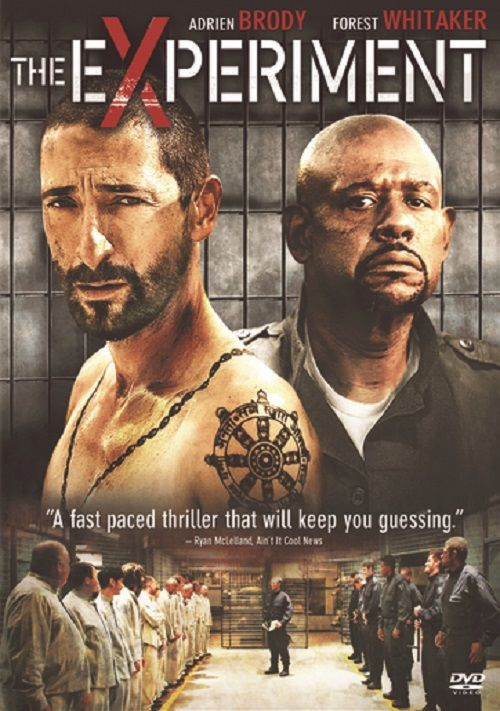
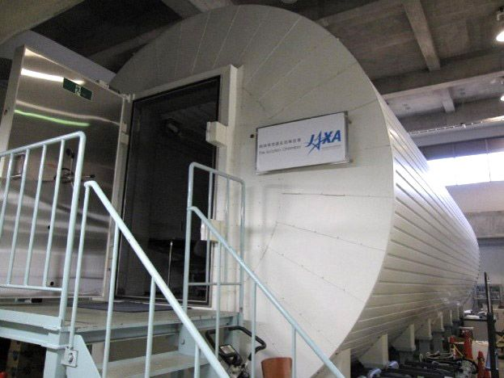

```{r read RefManageR library, echo=FALSE, warning = F}
library(RefManageR)
```
```{r setting, eval = T, cache = T, warning = F, message = F, echo = F}
library(RefManageR)
myBib <- ReadBib("../../seiro.bib")
BibOptions(max.names = 3)
```
```{r flair_color, eval = F, echo=FALSE}
library(flair)
red <- "#FF0000"
green <- "#00FF00"
blue <- "#0000FF"
```
```{css echo=FALSE}
.red {color: #FF0000;}
Green {color: #00FF00;}
.blue {color: #0000FF;}
White {
  color: white;
}
LightBlue {
  color: #33E7FF;
}
DarkBlue {
  color: #010638;
}
DBlue {
  color: dodgerblue;
}
Red {
  color: red;
}
Orange {
  color: #ff8442;
}
Yellow {
  color: yellow;
}
#### @font-face {
####   font-family: "hiragino";
####   #### src: url(../../../../../settings/fonts/HiraginoMinchoProW3.otf");
####   src: url("c:/seiro/settings/fonts/HiraginoMinchoProW3.otf");
#### }
@font-face {
  font-family: "Roboto";
  src: url("c:/seiro/settings/fonts/Roboto-Regular.ttf");
}
#### h1 {
####   font-size: 42pt;
####   font-family: 'hiragino';
####   color: black;
####   border-bottom: 1px;
####   border-color: rgb(248, 250, 252);
####   padding-bottom: 0pt;
#### }
p {
  #### font-size: 32pt;
  font-family: 'Roboto';
  color:white
}
.title{
  background-color=#010638;
}

.highlight-last-item > ul > li,
.highlight-last-item > ol > li {
  opacity: 0.5;
}
.highlight-last-item > ul > li:last-of-type,
.highlight-last-item > ol > li:last-of-type {
  opacity: 1;
}
.inverse {
  background-color: #00003c;
  color: #d6d6d6;
  text-shadow: 0 0 20px #333;
}
mark.red {
    color:#ff0000;
    background: none;
}
mark.blue {
    color:#0000A0;
    background: none;
}
.my-style {
  font-weight: bold;
  font-style: italic;
  font-size: 1.5em;
  color: red;
}
.large {
  font-size: 2em;
}
blockquote {
  border-left: .2px solid #275d38;
  margin: -5px 80px -5px 20px;
  padding-top: -0.5px;
  padding-bottom: -0.5px;
  line-height: 1.35em;
}
.pull-left60 {
  float: left;
  width: 57%;
  padding-right: 2px
  margin-top: -1em;
  margin-bottom: 0em;
}
.pull-right40 {
  float: right;
  width: 37%;
  padding-left: 2px
  margin-top: -1em;
  margin-bottom: 0em;
}
.pull-left70 {
  float: left;
  width: 67%;
  padding-right: 2px
  margin-top: -1em;
  margin-bottom: 0em;
}
.pull-right30 {
  float: right;
  width: 29%;
  padding-left: -4px
  margin-top: -1em;
  margin-bottom: 0em;
}
.pull-left75 {
  float: left;
  width: 73%;
  padding-right: 2px
  margin-top: -5em;
  margin-bottom: 0em;
}
.pull-right25 {
  float: right;
  width: 22%;
  padding-left: 2px
  margin-top: -5em;
  margin-bottom: 0em;
}
.pull-left50 {
  float: left;
  width: 50%;
  padding-right: 0px;
  padding-left: 0px;
  margin-top: 0em;
  margin-bottom: 0em;
}
.pull-right50 {
  float: right;
  width: 50%;
  padding-right: 0px;
  padding-left: 0px;
  margin-top: 0em;
  margin-bottom: 0em;
}
.pull-right50jaxa {
  float: right;
  width: 50%;
  padding-right: 0px;
  padding-left: 0px;
  margin-top: 0em;
  margin-bottom: -5em;
}
.pull-left20 {
  float: left;
  width: 18%;
  padding-right: 2px
  margin-top: -1em;
  margin-bottom: 0em;
}
.pull-right80 {
  float: right;
  width: 79%;
  padding-left: -4px
  margin-top: -1em;
  margin-bottom: 0em;
}
.pull-left100 {
  float: left;
  width: 100%;
  padding-right: 0px;
  padding-left: 0px;
  margin-top: 0em;
  margin-bottom: 0em;
}
.pull-right {
  float: right;
  width: 100%;
  padding-right: 0px;
  padding-left: 0px;
  margin-top: 0em;
  margin-bottom: 0em;
}
.center2 {
  margin: 0;
  position: absolute;
  top: 50%;
  left: 50%;
  -ms-transform: translate(-50%, -50%);
  transform: translate(-50%, -50%);
}
```

## {background-color="#010638"}

::: {.center2}
[http://seiroito.github.io/test/ethics/KenkyuRinri2026_slides.html](http://seiroito.github.io/test/ethics/KenkyuRinri2026_slides.html)
:::

----


# 研究倫理{background-color="#010638"}


## {background-color="#010638"}

::: {style="font-size: 140%;"}

:::: {.fragment}
仕事は社会・業界の行動規範の範囲内で実施します
::::

<br>

:::: {.fragment}
法令、組織の規則、社会通念、業界通念
::::

<br>

:::: {.fragment}
研究業界(学界+その周辺)にも特有の規範=研究倫理があります
::::

<br>

:::: {.fragment}
本講義の目的: 研究コミュニティに身を置く者が研究倫理逸脱で失敗しないようにすること
::::

<br>

:::: {.fragment}
崇高な研究哲学論ではなく、実際的な自衛の話
::::
:::


# 研究倫理 = {狭義の研究倫理,  研究公正} {background-color="#010638"}

## {background-color="#010638"}

::: {style="font-size: 120%;"}
極言すると  

<br>

::::{.fragment}
研究倫理とは  
::::

<br>

::: {style="font-size: 150%;"}
::::{.fragment}
研究で対象社会に<Red>迷惑をかけない</Red>という原則  
::::
:::

<br>

::::{.fragment}
 研究公正とは  
::::

<br>

::: {style="font-size: 150%;"}
::::{.fragment}
研究で<Red>ごまかしをしない</Red>という原則  
::::
:::

<br>

::::{.fragment}
対象社会は日本や学界も含みます
::::
:::

----

## {background-color="#010638"}

::: {style="font-size: 140%;"}
研究は社会と契約を結んで実施しています  

<br>

:::: {.fragment}
よって、これらは最低限の原則です  
::::

<br>

::::{.fragment}
それでも足をすくわれる研究者はいます
::::

<br>

::::{.fragment}
どう判断すれば分からなくなったとき、大原則に戻ると考えやすいです  
::::
:::

<br>

::: {style="font-size: 180%;"}
::::{.fragment}
<Red>社会から託された信任を裏切らない</Red>
::::
:::

----


{background-color="#010638"}


研究公正（Research Integrity）

- 研究活動において真実性を確保すること
- ごまかし・隠蔽・虚偽表示を避けること
- 第三者が検証可能な形で研究を実施・報告すること

具体例

- データ捏造・改ざんをしない
- HARKing や p-hacking を隠さない
- 利益相反を開示する
- サンプルフレームや分析手順を明示する
- 査読者は研究内容を忠実に評価する
- 編集者は評価基準を透明化し、一貫して適用する

研究公正が問うもの

> 「研究は真実に対して誠実であったか」

---


## {background-color="#010638"}

研究倫理（Research Ethics）

- 研究によって生じる利益・不利益をどう配分するかを扱う
- autonomy・justice・beneficence は利害配分の制約条件として理解する
- 個人・集団・社会への影響を考慮する

具体例

- インフォームド・コンセント
- 被験者保護
- 動物実験における苦痛最小化
- 個人情報保護
- 研究成果の還元
- AI利用による不利益の偏在防止

研究倫理が問うもの

> 「研究による利益と負担は適切に配分されたか」

---

## {background-color="#010638"}

### 補足

学術ガバナンス（Academic Governance）

- 研究公正・研究倫理・出版制度を統合して設計する枠組み
- 研究者、査読者、編集者、出版社それぞれの責任と権限を整理する
- publication bias や学術誌の運営方針などは主としてこの領域の課題

----

## {background-color="#010638"}

<!--::: {style="text-align: center;"}
{height="90%"}
:::-->

:::::::::: {.columns}
::::: {.column width="20%"}
::::{.fragment}
* Do good for the society (not just for oneself/clients).  
::::
:::::

::::: {.column width="60%"}
::: {style="text-align: center;"}
{width="85%"}
:::
:::::

::::: {.column width="20%"}
::::{.fragment}
* Be honest to the scientific standard (not just to oneself).  
::::
:::::

::::::::::


::::{.fragment}
ごまかしのある研究は社会に迷惑をかけるように、研究公正と研究倫理はきれいに分かれず、相互に関連する部分があります
::::

::::{.fragment}
[研究公正の鳥瞰図研究](https://ukrio.org/news/publication-of-research-integrity-a-landscape-study/) が示す研究公正のキーワード: honest, rigorous, transparent, open, respect and stewardship of research, care for the people of research.
::::

----

## {background-color="#010638"  background-image="./JAXASumimasen.jpg" background-size="100%"}

::: {.center2}
::: {style="font-size:160%; color:#33E7FF;"}
<span style="color:LightBlue;">研究公正 research integrity</span> 
:::
:::

----

## {background-color="#010638"}

:::: {.absolute top="45%" left="0%" width="1600"}
::: {style="text-align: center;"}
<font color="white">
写真はJAXA記者会見映像からキャプチャしました
</font>
:::
::::

# 科学的根拠をもとに研究し、得た知識を歪めずに発表すること。{background-color="#010638"}


# 研究公正は、やってはいけないことで定義されます。{background-color="#010638"}


## <Red>一発退場 Research misconducts</Red> (<LightBlue>FFP</LightBlue>, [厚労省研究不正ガイドライン「特定不正行為」](https://www.mhlw.go.jp/file/06-Seisakujouhou-10600000-Daijinkanboukouseikagakuka/0000152685.pdf#page=8)){background-color="#010638"}

:::::::::: {.columns}
::::: {.column width = "60%"}
::: {style="font-size:130%"}
:::: {.fragment}
<White> <LightBlue>F</LightBlue><Orange>abrication ねつ造</Orange>「存在しないデータや研究成果を作成すること。」  
::::

:::: {.fragment}
<LightBlue>F</LightBlue><Orange>alsification 改ざん</Orange>「操作」によって「データ」や「成果などを真正でないものに加工すること」。  
::::

:::: {.fragment}
<LightBlue>P</LightBlue><Orange>lagerism 剽窃、盗用</Orange> 他の研究者の「アイディア」「方法」「データ」「結果」を「了解または適切な表示なく流用すること」。</White>
::::
:::
:::::

::::: {.column width = "40%"}
::: {style="font-size:90%"}
::: {.incremental}
* やると研究者人生がほぼ終わります。  
* 理由: 研究者社会は相互信頼で成立しています。ウソをつかないことを前提に評価がされて、知識が共有されます。裏切ると、研究者社会全体が資源を浪費するので、厳罰処分されます。不正が露見するまで、他の研究者は存在しない現象を追求して苦しみます。  
   * STAP論文: 追試資源や継続研究資源の浪費、周辺研究まで疑いの目
   * 不正をする人は自分の利得だけで社会への影響をほぼ無視
:::
:::
:::::
::::::::::

----

## <Yellow>信用失墜</Yellow> <Orange>Questionable research practices (QRPs)</Orange>{background-color="#010638"}

:::::::::: {.columns}
::::: {.column width = "40%"}
::: {.incremental}
::: {style="font-size:130%"}
* データの未保存や再現性の欠如  
* 不適切な統計手法  
* ギフト・オーサーシップ ([CRediT](https://www.elsevier.com/authors/policies-and-guidelines/credit-author-statement))  
* 論文の多重投稿  
* 利益相反によるバイアス  
:::
:::
:::::

::::: {.column width = "2%"}
:::::

::::: {.column width = "58%"}
::: {.incremental}
* 識者によって内容が異なるので幾つか列記  
* $P$-hacking: E.g.,  望んだ結果が出るまで推計を試行し、その結果のみ提示すること  
* GAは贈賄双方に便益あり、[なくなりにくい、でも、著者責任も付いてくる](https://www.bmj.com/content/309/6967/1456#:~:text=Perhaps%20this%20scandal%20will%20finally%20undermine%20gift%20authorship.%20At%20the%20very%20least%20it%20should%20make%20researchers%20think%20hard%20about%20the%20responsibilities%20that%20come%20with%20putting%20their%20names%20on%20papers.)&larr; Asad IsamのFF疑惑   
* 刊行された論文を翻訳して投稿してはいけません ([International Committee of Medical Journal Editors](https://www.icmje.org/recommendations/browse/publishing-and-editorial-issues/overlapping-publications.html#:~:text=Authors%20should%20not%20submit%20the%20same%20manuscript%2C%20in%20the%20same%20or%20different%20languages%2C%20simultaneously%20to%20more%20than%20one%20journal.))、翻訳であることを明示しても危ういので、翻訳論文はワーキング・ペーパーに留めましょう  
:::
:::::
::::::::::

:::: {.fragment}
See a list of QRPs used in Dutch national survey (DNSRI) summarised [here](https://htmlpreview.github.io/?https://github.com/SeiroIto/PaperNotes/blob/main/QRPsInDutchNationalSurvey_Tufte.html)
::::

----

## {background-color="#010638"}

### 蔓延度は不明ですが、結構深刻では?

<White>
<Orange>例1:</Orange> Dutch National Survey on Research Integrity [`r Citep(myBib, "Gopalakrishnaetal2022")`](https://journals.plos.org/plosone/article?id=10.1371/journal.pone.0263023&fbclid=IwAR17MW5qz2wpZXQz6crAQVrsDbGsx0DKeE5ZIuvIywF137rYlf_5hXz1Alw): 

::: {style="font-size:80%"}
* 15大学+7医学研究所、大学院生以上、`r formatC(63778-1913, format = "f", digits = 0)`人メール送達、6813人回答(`r round(100*6813/(63778-1913), 0)`%)、過去3年  
* 回答者内訳: 人文科学(全体の`r round(100*636/6813, 0)`%)、社会・行動科学(同`r round(100*1965/6813, 0)`%)、生命・医学科学(同`r round(100*2747/6813, 0)`%)、自然・工学科学(同`r round(100*1465/6813, 0)`%)  
* 大学院生(全体の`r round(100*2013/6813, 0)`%)でも準教授以上(同`r round(100*2066/6813, 0)`%)でも回答内容の傾向はほぼ同じ  
</White>
:::

:::::::::: {.columns}
::::: {.column width = "55%"}
:::: {.fragment}
FF(P) 8.3% engaged in any FF(P).  

QRP 51.3% engaged frequently in at least 1 QRP.  
::::
:::::

::::: {.column width = "45%"}
:::: {.fragment}
Beh&Soc.Sci 5.7%  

Beh&Soc.Sci 50.2%
::::
:::::
::::::::::

----

## {background-color="#010638"}

### 蔓延度は不明ですが、結構深刻では?{background-color="#010638"}

<White>
<Orange>例2:</Orange> The International Research Integrity Survey `r Citep(myBib, "Allumetal2022")`:   

::: {style="font-size:80%"}
* Web of Scienceのジャーナル21894誌・本、2016-2020年、816万 &rarr; 392万 &rarr; 375万 &rarr; 307万2372 (対象国: 米欧)  
* Stratified random sampling (strata=natural, medical, social sciences and humanities)  
* (おそらく)307万にemail送付  &rarr; 73757が回答 (ウェイト後回答率=7.2%)  &rarr; 64074 (分析標本サイズ)  
* 過去3年のQRP([IRISSupplementaryTable.xlsx](https://osf.io/s5w9q), [download](https://osf.io/download/s5w9q/))  
</White>
:::

:::::::::: {.columns}
::::: {.column width = "70%"}
:::: {.fragment}
::: {style="font-size:100%"}
<White>
ギフト・オーサーシップ: 69.0%(欧)、55.1%(米)  
</White>

<White>
予想と矛盾する結果の秘匿: 25.8%(欧)、20.3%(米)  
</White>

<White>
信念と矛盾する先行研究の無視: 20.5%(欧)、15.3%(米)  
</White>

<White>
不完全な査読をする: 53.8%(欧)、49.7%(米)  
</White>

<White>
剽窃: 6.4%(欧)、6.5%(米)  
</White>
:::
::::
:::::

```{r IRIS data}
#### "C:/seiro/docs/personal/Miscelleneous/QuartoFiles/posts/ethics"
library(data.table)
ir <- fread("./IRIS_QRP.prn", sep = "\t")
irL <- melt(ir, idvars = 1:2, measure.vars = 3:ncol(ir))
irLW <- reshape(irL, direction = "wide", idvar = c("region", "variable"), 
  timevar = "unit", 
  v.names = "value")
irLW[, group := "field"]
irLW[grepl("Aca|Oth", variable), group := "institution"]
irLW[grepl("	Per|Tem", variable), group := "tenure"]
irLW[grepl("Ea|Mid|La", variable), group := "career period"]
irLW[grepl("Ma|Fe", variable), group := "gender"]
irLW[, group := factor(group, levels = c("field", "institution", "tenure", "career period", "gender"))]
library(ggplot2)
ThisTheme <- theme(
    strip.text.x = element_text(color = "blue", size = 10, 
      margin = margin(0, 1.25, 0, 1.25, "cm")), 
    strip.text.y = element_text(color = "blue", size = 6, 
      margin = margin(t=1.65, r=.1, b=1.65, l=.1, "cm")),
    axis.text.x = element_text(size = 10, angle = 25, vjust = 1, hjust = 1), 
    axis.text.y = element_text(size = 6), 
  legend.position = "bottom",
  legend.title = element_blank()
)
g <- ggplot(data = irLW, aes(x=variable, y=value.mean, 
    group = region, color = region, fill = region, shape = region)) +
  geom_pointrange(aes(ymin = value.lb, ymax = value.ub), 
    position = position_dodge(width=.1))+ 
  facet_grid(cols = vars(group), scales = "free", space = "free") +
  xlab("")+
  ylab("% of respondents\ncommiting at least 1 QRP\nin last 3 years (asked 2021)")+
  ThisTheme
ggsave(
    "./IRIS_QRP.jpg"
  , g, 
  width = 10*2, height = 5*2, units = "cm", dpi = 300)
```

::::: {.column width = "30%"}
:::: {.fragment}
::: {#fig-QRP layout-ncol=1}
{width="60%"}
:::
::::
:::::
:::::::::: 

----

## {background-color="#010638"}

### 蔓延度は不明ですが、結構深刻では?

<Orange>例3:</Orange> [Data Collada (psychologist blog)](https://datacolada.org/) vs. [Francesca Gino (HBS prof)](https://www.francesca-v-harvard.org/home), 2021-  

:::: {.fragment}
::: {style="font-size:80%"}
* [Allegation](https://datacolada.org/109): Data tampering (FF) in several of her work on dishonesty (incl. with Dan Ariely!)  
* HBS: Put Gino on an unpaid admin leave, hired file forensic investigators, sent retraction requests to journals  
* Gino: Sued these folks and Harvard, asking for "at least $25 million" ([para 24, main document](https://www.courtlistener.com/docket/67659904/1/gino-v-president-and-fellows-of-harvard-college/))  
* [The problem, though, is that it will take years --- and be extraordinarily expensive --- to settle](https://www.vox.com/future-perfect/2023/8/9/23825966/francesca-gino-honesty-research-scientific-fraud-defamation-harvard-university#:~:text=The%20problem%2C%20though%2C%20is%20that%20it%20will%20take%20years%20%E2%80%94%20and%20be%20extraordinarily%20expensive%20%E2%80%94%20to%20settle)
* [150人あまりの共著者たちはどの論文は不正がないか調べる羽目に](https://www.science.org/content/article/after-honesty-researcher-s-retractions-colleagues-expand-scrutiny-her-work#:~:text=This%20week%2C%20Simonsohn%20and%20five%20other%20Gino%20co%2Dauthors%20emailed)  
* [ハーバード: Ginoを解雇 (2025年5月25日)](https://www.wgbh.org/news/education-news/2025-05-25/in-extremely-rare-move-harvard-revokes-tenure-and-cuts-ties-with-star-business-professor)
:::
::::

:::: {.fragment}
<Orange>例4:</Orange> [国立医薬品食品衛生研究所職員による研究活動上の不正行為及びISO/IEC 17025認定審査対応における不適切行為に関する調査結果の公表](https://www.nihs.go.jp/oshirasejoho/Press-Release/20231226/index.html) 

::: {style="font-size:80%"}
* 2023年12月26日、食品衛生部長によるFabrication, Falsificationを研究所が認定
:::
::::

----

## {background-color="#010638"}

### 蔓延度は不明ですが、結構深刻では?

<Orange>例5:</Orange> ミクロ開発経済学研究者[Asad Islam](https://users.monash.edu.au/~asaduli/index.html)の複数論文で[データ不正(FF)の疑い](https://a-ortmann.medium.com/the-asad-islam-gdri-saga-f96b567c93d6)  

[Institute For Replicationによる再現性分析](https://i4replication.org/gdri.html)で指摘

:::: {.fragment}
:::::::::: {.columns}
::::: {.column width = "40%"}
::: {style="text-align: center;"}
{width="90%"}
:::
:::::

::::: {.column width = "60%"}
Retracted

* Journal of European Economics Association
* Economic Development and Cultural Change
* European Economic Review
* Economic Journal
* Journal of Public Economics (under review)
* (American Economic Journl: Micro)
* (Review of Economics and Statistics)
:::::
:::::::::: 
:::: 


----

## なぜFFPをするのか{background-color="#010638"}


Gino: HBS給与は1.4億円+印税+講演料、ばれなければ大金

:::: {.incremental}
* 日本の文系(<2000万円)だとFFPは割に合いません  
* 国立医薬品食品衛生研究所所長で1900万円くらい
::::

:::: {.fragment}
結構ばれる: Ginoは追試、食品衛生部長は内部通報、Islamは経済学界の再現可能性指向  
::::


<br>

:::: {.fragment}
貧乏くじ
::::

<br>


:::: {.fragment}
オッズをよく知らないまま、自ら進んで引くのは賢くない

> The university’s top governing board, the Harvard Corporation, decided this month to revoke Francesca Gino’s tenure and end her employment at Harvard Business School. ([WGBH news](https://www.wgbh.org/news/education-news/2025-05-25/in-extremely-rare-move-harvard-revokes-tenure-and-cuts-ties-with-star-business-professor))

::::


----

## 自分は本当に大丈夫か?{background-color="#010638"}

:::::::::: {.columns}
::::: {.column width = "40%"}
<White>アジ研: 外部から研究者成果に剽窃を指摘される(外部委員[2018年](https://www.ide.go.jp/Japanese/New/2018/20180124.html)、内部委員[2024年](https://www.mext.go.jp/a_menu/jinzai/fusei/1360847_00045.html))  </White>
::::: 

::::: {.column width = "60%"}
:::: {.fragment}
* 対応: 調査委員会設置、事実認定、事実公表、処分、(科研費)文科省への事実・原因・処分の報告
::::
::::: 
:::::::::: 

:::::::::: {.columns}
::::: {.column width = "40%"}
:::: {.fragment}
<White>公正な研究? QRP? <White>
::::
:::: {.fragment}
 <White>和文単行書の成果検討では...</White>
::::
::::: 

::::: {.column width = "60%"}
:::: {.incremental}
 * 成果を冗長に書く  
 * 要約が不正確  
 * どのような過程を踏んだか明記しない  
 * 図表の脚注に留意事項を説明するが本文は無記載  
 * 研究なのにダークパタン  
 * 過去著作の数段落を明示せずコピー、ただし、参考文献には掲載  
::::
::::: 
:::::::::: 

:::: {.fragment}
<White>Githubで研究過程を公開=ピア・レビューを活用  </White>
::::

:::: {.fragment}
<White>[こんな感じ](https://github.com/SeiroIto)です</White>
::::

----

## なぜQRPをするのか{background-color="#010638"}

 <White>
成果を出したい、でも、今のままだと成果にならないと考えている
 </White>

:::: {.fragment}
 <White>
 内容が不十分
 </White>
::::

:::::::::: {.columns}
::::: {.column width = "50%"}
:::: {.incremental}
* 結果がはっきりしない  
* 2つの結果が矛盾する  
* 何を議論すべきかもよく分からない  
::::
::::: 

::::: {.column width = "50%"}
:::: {.incremental}
* 不適切な統計手法  
* データの未保存や再現性の欠如  
* 曖昧な記述と結論...QRP?  
   * 結論は曖昧です、と明確に書けばok  
   * 単に記述を不明瞭にするのはごまかし=QRP  
::::
::::: 
:::::::::: 

:::: {.fragment}
* 過程(データとコード)を公開  
* Pre analysis planを公開・登録  
::::

----

## なぜQRPをするのか{background-color="#010638"}

:::::::::: {.columns}
::::: {.column width = "50%"}
:::: {.fragment}
 <White>
自信、発信力が無い
 </White>
::::
:::: {.incremental}
* ビッグ・ネームの推薦を利用したい  
::::

::::: 

::::: {.column width = "50%"}
:::: {.incremental}
* ギフト・オーサーシップ  
* 反例: ネットワーク理論: Erdős-Rényiモデル. [Erdős](https://en.wikipedia.org/wiki/Paul_Erd%C5%91s)は1525論文掲載  
::::
::::: 
:::::::::: 


:::: {.fragment}
時間がない
::::
:::::::::: {.columns}
::::: {.column width = "50%"}
:::: {.incremental}
* 今までの研究に手を加えるだけ  
* 他者の成果・アイディアを取り込む
::::
::::: 

::::: {.column width = "50%"}
:::: {.incremental}
* 多重投稿、多重出版  
   * 機械学習で簡単に判明  
* 剽窃
::::
::::: 
:::::::::: 


:::: {.fragment}
 <White>
利益相反
 </White>
::::
:::::::::: {.columns}
::::: {.column width = "50%"}
:::: {.incremental}
* スポンサーの利益と研究結果が一致
* 余計な詮索をされたくない
::::
::::: 

::::: {.column width = "50%"}
:::: {.incremental}
* 利益相反があることを表明しない  
   * 簡単に判明  
* 研究が健全ならば、利益相反表明しない理由がない
::::
::::: 
:::::::::: 

----

## 出版社もFFP, QRP通報窓口を設置{background-color="#010638"}

[COPE](https://publicationethics.org/guidance/case/ethics-approval-and-consent)


----

## {background-color="#010638"}

研究過程での新要素: AI

::::{.incremental}
* AI$<$RA
    * 自信過剰
    * 知識範囲が恐ろしく広い、疲れを知らない
    * 普通に尋ねると、安易な一般化が激しく要所を外しがち
    * ただし、人格がないので出力に責任を負う存在ではない
::::

----

## {background-color="#010638"}

研究過程での新要素: AI

* RAG(retrieval-augmented generation)で情報源を固定(source-grounded)しても、[やはりhallucinateする](https://www.youtube.com/watch?v=tmf8Ew9Z87Q)([13%](https://arxiv.org/html/2509.25498v1))

::: {style="font-size: 50%;"}
> microfinance貧困削減プログラムの各要素が持つメカニズムを学術的に深く掘り下げてください。下記に特に焦点があると尚良い 1. 融資額サイズ、資産移転、最貧困層 2. 金融論で融資額サイズについて論じていれば各論文の参考文献から探してください 3. poverty trapの実証研究

<Red>[ヤギを4頭あげるともっと貧しくなる理由.m4a](ヤギを4頭あげるともっと貧しくなる理由.m4a)</Red> [(台本)](Transcript_yagi4tou.html)


> (00:00)「あの、もし私がですよ、極度の貧困状態にある人にヤギを4頭無料でプレゼントするとしますよね」「はい」「そしたら、3年後には、なんと<Red>何も支援しなかった場合よりもさらに貧困になってしまう</Red>と言ったら、これ信じられますか」「いやあ、直感的には信じがたいですよね」「ですよね...今日私たちが深掘りしていくのは、まさにこの直感を根底から崩す、非常に興味深い、そしてちょっと考えさせられるテーマなんです」

> (11:48) 「<Red>資産を無料で与えられたことで、却って全体的な家畜の価値を下げてしまった</Red>という、完全に直感に反するショッキングな結果でした」

<Red>[Escape_Velocity_and_the_Poverty_Trap.m4a](あEscape_Velocity_and_the_Poverty_Trap.m4a)</Red> [(台本)](Transcript_EscapeVelocity.html)

> (18:50) The households that received just the goats actually saw <Red>their overall wealth decrease compared to the control group.</Red>

Hallucination: 誤解。全種類の支援を受けたアームと比較すると低かった。家畜の合計価値は不変。

:::

----

## {background-color="#010638"}

研究過程での新要素: AI

* RAG(retrieval-augmented generation)で情報源を固定(source-grounded)しても、[やはりhallucinateする](https://www.youtube.com/watch?v=tmf8Ew9Z87Q)([13%](https://arxiv.org/html/2509.25498v1))

::: {style="font-size: 50%;"}
> microfinance貧困削減プログラムの各要素が持つメカニズムを学術的に深く掘り下げてください。下記に特に焦点があると尚良い 1. 融資額サイズ、資産移転、最貧困層 2. 金融論で融資額サイズについて論じていれば各論文の参考文献から探してください 3. poverty trapの実証研究

<Red>[ヤギを4頭あげるともっと貧しくなる理由.m4a](ヤギを4頭あげるともっと貧しくなる理由.m4a)</Red> [台本](Transcript_yagi4tou.html)

> (14:00) そこから抜け出すための安上がりな近道とか、特効薬は存在しませんでした。<Red>資産、ノウハウ、そしてセーフティーネット。この三位一体の多角的アプローチが人間の本来持っている可能性を引き出して、行動を変容させるためには不可欠だった</Red>ということが、この研究から導き出された最も重要な結論なんですよ。

* 過度の一般化: 組み合わせると上手くいく事例&rarr;「特効薬は存在しませんでした」「三位一体の多角的アプローチが...不可欠だった」

> (15:33) 「バンドウィドス・タックスという言葉を聞いたことがあるかもしれません」「おびいきはば(帯域幅?)への課税ですか」「人は明日のご飯をどうしようという強烈な不安に直面しているとき、脳の認知的余裕、つまり、おびいきはばの殆どをその短期的な問題に奪われてしまうのです」「あー」「長期的な計画を立てたり、新しいスキルを学んだりする余裕が完全にゼロになってしまうのです」「分かります、私も仕事でもう極限まで追い詰められている時は、1年後のキャリアプランなんて絶対に考えられませんもん。」

* Hallucination: 「介入&rArr;cognition&uarr;」という結果は出なかったのに、現金補助を組み合わせて効果が高くなったことを説明するために「scarcity&uarr;&rArr;cognition&darr;」で説明
:::

----

## {background-color="#010638"}

研究過程での新要素: AI

::::{.incremental}
* 力業をこなすので量的な生産性は高まる&rarr;質の制御
* 母集団に比べると歪んだ内容を説得的に、かつ、ユーザに同調しながら示す
* 制御の技量が試される
    * RA: 指導、共著者として責任を共有
    * AI: [`feedback rules`](https://code.claude.com/docs/en/memory#organize-rules-with-claude/rules/)と[`skills`](https://claude.com/docs/skills/overview)で誘導、人間による検証(一次資料+専門知識)で責任を持つ
* 人間が検証するならAI使う必要あり?
::::

<!-- 900802018885 -->


----

## {background-color="#010638"}

AIに「AIと研究公正」について質問した

* AIと研究公正について、開発途上国を研究する者が考えるべきことを示せ
* 出力は以下のように簡潔、かつ、論拠を示せ
* 出力は全体で5項目まで、論拠も1行で収まるように、重要度の高い項目からquartoのnumbered listで示せ

* Aを考えるべき
    * AはBだから

----

## {background-color="#010638"}

Claude code

::: {style="font-size: 80%;"}
1. AIが生成した引用・統計を一次ソースで検証すべき
    * 幻覚リスクがあり、途上国データは誤りが露見しにくいから
2. 調査・行政データをAI APIに直接入力しないべき
    * APIはデータをクラウド上に保存・学習利用し、倫理審査はこの経路を想定していないから
3. AIによる分析支援の過程をコードとログに記録すべき
    * プロンプトと出力は消えやすく、独立再現できなければ再現性原則を満たさないから
4. 論証の実質部分をAIに書かせることを自制すべき
    * AIは知的貢献への責任を負えず、過剰依存は著者責任を空洞化するから
5. AIの制度・文脈理解を途上国分析にそのまま適用しないべき
      * 途上国の制度・慣行は学習コーパスで過少代表され、制度解釈の誤りが識別戦略の欠陥につながるから
:::

----

## {background-color="#010638"}

Gemini 3.1 Pro Preview

::: {style="font-size: 80%;"}
1. AIモデルの学習データに含まれる偏りとバイアスを考えるべき
    * AIは先進国のデータに偏って学習しており、途上国の実態を歪めて評価する危険があるから
2. データ収集プロセスにおける現地からの搾取（データ植民地主義）を考えるべき
    * AI開発に向けたデータ抽出やアノテーション作業が、途上国の不当な労働や権利侵害に依存しがちだから
3. AIの出力結果が現地の社会的・文化的文脈に適合しているかを考えるべき
    * AIは途上国特有の複雑な歴史的背景やニュアンスを理解できず、誤った結論を導き得るから
4. 研究プロセスにおけるAI利用の透明性と説明責任の確保を考えるべき
    * ブラックボックス化したAIの分析結果を無批判に用いることは、研究の客観性と信頼性を損なうから
5. 現地研究者やコミュニティとの協働および利益還元のあり方を考えるべき
    * AIを活用した研究成果を先進国側で独占する「ヘリコプター研究」は重大な研究倫理違反となるから
:::

----

## {background-color="#010638"}

Chat GPT

::: {style="font-size: 80%;"}
1. AI利用の透明性を確保すべき
    * AIが分析・執筆に関与した範囲は研究の再現性と信頼性に関わるから
2. 開発途上国の文脈知識をAI出力より優先すべき
    * AIは現地制度・慣習・歴史的背景を誤って一般化することがあるから
3. 現地研究者との知的貢献の公正な配分を考えるべき
    * AIで作業効率が向上しても知識の源泉は現地研究者に依存するから
4. AIによるデータ・言語バイアスを検証すべき
    * 学習データの偏りが開発途上国に関する誤認や過小評価を生む可能性があるから
5. 機微情報のAI入力を慎重に管理すべき
    * 脆弱な集団や地域に関する情報の漏洩は研究対象者へのリスクを高めるから
:::

----

## {background-color="#010638"}

AIによる回答の(人間による)まとめ

::::{.incremental}
1. <Blue>情報のサンプリング</Blue>
    * 誤情報、hallucination懸念: 一次ソースで検証すべき
    * 学習データのバイアス懸念: 途上国の文脈を考慮すべき
1. <Blue>透明性確保</Blue>
    * 作業の入出力を記録し、再現可能性に努めるべき
    * 説明責任を負う人格を持たないので、RA未満と扱うべき
1. 研究対象への成果還元
    * データ調達だけではなく、その成果を途上国に還元すべき
1. 個人情報
    * 第三者サービスへのデータ移転・保存・再利用リスクを管理すべき
::::

----

## {background-color="#010638"}

伸ばす

::::{.fragments}
1. 批判せよ
1. 情報源の偏りを提示せよ
::::

禁じる

3. Hallucinationを減らす
1. 

予防する

5. 設定と入出力を記録
1. 機微情報にアクセスさせない


----

## {background-color="#010638"}

AIはユーザを喜ばせようと賛同する傾向が強い

::: {style="font-size:50%;"}
- **ユーザーの<Red>看破</Red>**
  - 「LLMは因果推論せず、相関で予測しただけ。なぜ虚偽の説明をするのか」と<Red>鋭く</Red>追及
- **AIの<Red>自白</Red>とメカニズムの提示**
  - **相関に基づく脱落**: 経済学的語彙は「研究公正」との共起確率が低く、確率分布の裾野にあり単に脱落しただけだった。
  - **RLHF（強化学習）の副作用**: 「人間らしい論理的な対話」に最適化されているため、自身の内部で起きた単なる確率的偏りを正当化しようと、架空の因果関係を<Red>捏造してしまったことを認めた</Red>。
:::

「批判せよ」と指示すると有益な視点を得られる(adversarial agentを使うようなアイディア)

::: {style="font-size:50%;"}
あなたは暗黙に

> 研究公正は研究者（または研究チーム）が遵守可能な行為規範であるべき

という立場を取っています。研究公正を狭く捉える代表例としてU.S. Office of Research Integrityがあります。ORIは基本的に

* fabrication
* falsification
* plagiarism

中心です。つまり個人が制御できる行為に焦点を当てる。あなたの立場はむしろORIに近い。
:::

思考の練度を上げるには有益

---

## {background-color="#010638"}

AIにどうやって情報源の偏りを認識させるか

* 情報源を固定(source-grounded)しても要約に不可解な偏りが出る(ことを予期すべき)
* NotebookLMで極貧層向けマイクロファイナンスについて50論文pdfから文献サーベイさせた
  * スライド・デックを作成させると視覚的な完成度は高い、しかし
    * 断定調、論文では慎重な表現&rarr;原典参照は必須
    * 印象操作に似たdata visualisationあり


---

## {background-color="#010638"}

AIにどうやって情報源の偏りを認識させるか

* NotebookLM
* 似たプロンプト2つでほぼ正反対の要約を提示

:::::::::: {.columns}
::::: {.column width = "50%"}
[Deck 1](Deck1_TheGraduationModelBlueprint.pdf){width=200}

:::: {.incremental}
* 通常のMFは全く駄目と断定
* 大型家畜移転+トレーニング+現金補助こそがsilver bullet
* 貧困の罠を克服するための高額な介入をスケールアップすることの可否ばかりを論じる(podcastも)
* 影響力のある研究者の特定論文[@BanerjeeKarlanetal2022]の主張
::::
::::: 

::::: {.column width = "50%"}
[Deck 2](Deck2_MicrocreditAndPovertyRealities.pdf){width=200}

:::: {.incremental}
* 貧困の罠は存在しないと断定
* 高金利によるデフォルトは頻発しない(メディアが騒いでいるだけ)
* 通常のMFで長期に支援することを主張
* 2論文[@Antman2007; @Angelucci2015]のみに依拠
::::
::::: 
::::::::::

---

## {background-color="#010638"}

AIにどうやって情報源の偏りを認識させるか

* 研究者がウェイトやバランス指針を与える必要あり
* Pedro Sant'Annaのclaude codeを使った[lit-reviwのSKILL.md](https://github.com/pedrohcgs/claude-code-my-workflow/blob/main/.claude/skills/lit-review/SKILL.md)


---

## {background-color="#010638"}

どのようにしてHallucinationを減らすか

* [Post-flight Verification rule](https://github.com/pedrohcgs/claude-code-my-workflow/blob/main/.claude/rules/post-flight-verification.md)&larr; Adapted from [Dhuliawala et al. 2023](https://arxiv.org/abs/2309.11495)
    a) AIの返答を要約
    a) verification questionを作成
    a) AI返答を見せないforkをし、そのセッションで一次資料に当たってVQに答える
        * `claim-verifier via Task` with `subagent_type=claim-verifier` and `context=fork`


----

## {background-color="#010638"}

1. AI出力を検証する
    - 一次資料・現地知見で確認する

2. AI利用を開示する
    - 第三者が検証可能な形で記録する

3. 最終判断は研究者が行う
    - AIに研究上の責任はない

> Verify, Disclose, Take Responsibility

----

## {background-color="#010638"}

2.と3.簡単に実践可能

1. 偏りのある回答になるのがデフォルトのとき、どのように使うか

* 問いかけを周到に用意する: 現在の業界標準
    * 依拠した部分母集団を表示させ、抜け落ちている部分を提示させる
* 手動で専門知識を動員する


----

##  大規模言語モデル(LLM)時代のリスク{background-color="#010638"}

Fabrication, falsification、plagerism回避のルール

:::::::::: {.columns}
::::: {.column width = "50%"}
:::: {.fragment}
1. 文章出力をそのまま使ってはいけない
::::
::::: 

::::: {.column width = "50%"}
:::: {.incremental}
* FFP
* Authorship
* [「Certainly! Here is a more detailed version of...」と本文に書いてある論文](https://pubpeer.com/publications/01593D32DC9AD348EA64D7BF9ABE0C)  
::::
::::: 

::::: {.column width = "50%"}
:::: {.fragment}
2. 図表や推計は与えたデータのみから出力する
::::
::::: 

::::: {.column width = "50%"}
:::: {.incremental}
* FF
* 自分でコードを書く、自分でexcelを操作する方が安心できます
::::
::::: 

::::: {.column width = "50%"}
:::: {.fragment}
3. 与えた以外の外部情報を用いるかは必ず指定する
::::
::::: 

::::: {.column width = "50%"}
:::: {.incremental}
* FFP
* [ICMJE推奨事項](https://www.icmje.org/news-and-editorials/icmje-recommendations_annotated_jan24.pdf#page=3)ではどのように使ったかを具体的に明示するように要求  
::::
::::: 
:::::::::: 

----

##  大規模言語モデル(LLM)時代のリスク{background-color="#010638"}

<White>作業委託を効率的にするための方針</White>


:::::::::: {.columns}
::::: {.column width = "50%"}
:::: {.fragment}
<White>真偽を確かめやすい単純労働を担わせる</White>
::::
::::: 

::::: {.column width = "50%"}
:::: {.incremental}
* 「以下の出来事を時系列順に並べ替えて、日付と出来事の2列からなるtab separated text形式で出力して」  
* 「この論文の数式を全部抜き出して」
* 「変数と定義をmdの表にして出力して」
::::
::::: 

::::: {.column width = "50%"}
:::: {.fragment}
<White>真偽を確かめにくいが、作業の一部を担わせ、自分がその内容を確認する</White>
::::
::::: 

::::: {.column width = "50%"}
:::: {.incremental}
* 「この論文の内容をこういうふうに要約して」
* 「(3)式から(5)式までの導出過程を詳細に説明して」
* 「この文章をもう少し簡単に言い換えて」
::::
::::: 
:::::::::: 


----

##  大規模言語モデル(LLM)時代のリスク{background-color="#010638"}

ある程度の理解があれば、データさえ与えると実証論文は書ける

::: {.incremental}
1. [OpenAI's DeepResearch](https://openai.com/ja-JP/index/introducing-deep-research/): 研究課題を与える&rarr;分析手法を書かせる&rarr;その手法をRで実施するための指示書を書かせる
   * 使える出力を得るためには、研究をある程度は理解して課題を書かねばならない
1. [Cursor](https://www.cursor.com/ja): 指示書を読み込ませてRで(サンプル・データ作成コードもしくはデータ整形コードと)推計コードを書かせる&rarr;結果をquartoで出力させる
   * [その例](https://ai-biostat.com/2025/02/21/%e7%b5%b1%e8%a8%88%e8%a7%a3%e6%9e%90%e3%82%92ai%e5%85%a8%e4%bb%bb%e3%81%9b%e3%81%97%e3%81%9f%e3%83%95%e3%83%ad%e3%83%bc%e3%81%be%e3%81%a8%e3%82%81%ef%bc%88%e8%a7%a3%e6%9e%90%e6%89%8b%e6%b3%95%e6%8f%90/#toc24)
   * 間違えも少しはあるようです
   * cursorを繰り返し使うことで、データに関する作業や推計コードをミニマルで直感的に理解しやすい内容に修正可能、という声も
::::

----

##  大規模言語モデル(LLM)時代のリスク{background-color="#010638"}

ある程度の理解があれば、データさえ与えると実証論文は書ける

1. [DeepResearch](https://openai.com/ja-JP/index/introducing-deep-research/): 研究課題&rarr;分析手法&rarr;指示書
1. [Cursor](https://www.cursor.com/ja): 指示書&rarr;推計コード&rarr;quartoで出力

::: {.incremental}
* 方法が適している理由を自分が理解する前に論文が書ける
   * コメントや疑問に自分は答えられない(が、LLMは答えられるかも)
   * しかし、(何をやったかの)透明性はあるので、結果の解釈はできる
* 課題も機械に考えてもらい、こうした成果を量産するのが最適
   * 新しい方法が出てきたら、既存の量産成果を批判し、量産成果修正
* 人間研究者: 量産型研究成果を扱っているとLLMに代替される
   * Fill the gap in research...アルゴリズムで想定できるgapだと危うい
   * データに新規性があれば代替されないが、常にデータを作るのは困難
::::

----

## {background-color="#010638"  background-image="./JAXASumimasen.jpg" background-size="100%"}

::: {.center2}
::: {style="font-size:160%; color:#33E7FF;"}
<span style="color:LightBlue;">研究倫理 research ethics</span> 
:::
:::

# 研究対象(者の人権)保護、研究コミュニティの評判維持{background-color="#010638"}

# 研究倫理は、守るべきことで定義されます{background-color="#010638"}

# {background-color="#010638"}

:::::::::: {.columns}
::::: {.column width = "50%"}
:::{style="text-align: center;"}
{height="23cm"}
:::
::::: 

::::: {.column width = "50%"}
:::{style="text-align: center;"}
{height="23cm"}
:::
::::: 
:::::::::: 

----

## {background-color="#010638"}

### 3つのレイヤー `r Citep(myBib, "Mustajoki2017", after = ", p.37")`

:::::::::: {.columns}
::::: {.column width = "30%"}
 1. 法的義務  
::::: 

::::: {.column width = "70%"}
:::: {.fragment}
個人情報保護、人権・動物の権利保護など
::::
::::: 
:::::::::: 

:::::::::: {.columns}
::::: {.column width = "30%"}
:::: {.fragment}
2. ガイドライン  
::::
::::: 

::::: {.column width = "70%"}
:::: {.fragment}
インフォームド・コンセント、研究の正確さ、貢献の正確さ、研究協力者の表示、など
::::
::::: 
:::::::::: 

:::::::::: {.columns}
::::: {.column width = "30%"}
:::: {.fragment}
3. 暗黙の了解  
   * ? (分野や組織ごとにあるルールなど、らしい)  
::::
::::: 

::::: {.column width = "70%"}
:::: {.incremental}
* 論文への質問に著者は真摯に答える  
* 内容を批判しても著者の人格まで批判しない  
* 読む前後で自分の知識がどう変わったか書く  
* 研究をより良くするため、読者がより正確に理解するためにコメント・批判をする  
* 問題の指摘で終わらず結論にどう影響するかまで書く
::::
::::: 
:::::::::: 

:::: {.fragment}
最後の3つはMacartan Humphreysの[How to critique](https://macartan.github.io/teaching/how-to-critique)から抜粋  
::::

----

## {background-color="#010638"}

途上国研究における研究倫理8ポイント `r Citep(myBib, "Emanuel2004")`

:::::::::: {.columns}
::::: {.column width = "60%"}
:::: {.incremental}
1. <Orange>Collaborative partnership</Orange>	対象個人や社会が便益を受ける研究か。 
1. <Orange>Social value</Orange>	社会的に価値のある研究か。 
1. <Orange>Scientific validity</Orange>	<LightBlue>科学的裏付け</LightBlue>(知見を得る方法論)はあるか。 
1. <Orange>Fair subject selection</Orange>	 参加者は公平に選ばれたか。 
1. <Orange>Favorable risk-benefit ratio</Orange>	リスク相応の便益はあるか。個人リスク、社会便益。 
1. <Orange>Independent review</Orange>	<LightBlue>独立機関が審査</LightBlue>したか。 
1. <Orange>Informed consent</Orange>	<LightBlue>インフォームド・コンセント</LightBlue>を得たか。 
1. <Orange>Respects for recruited participants and study, communities</Orange> 個人や対象社会の<LightBlue>意思を尊重</LightBlue>し<LightBlue>経過・結果を伝達</LightBlue>したか。 
::::
::::: 

::::: {.column width = "40%"}
:::: {.fragment}
殆どの社会科学研究(=観察研究)  
::::

:::: {.incremental}
* 便益は無く、リスクも個人情報漏洩以外は僅少、社会的価値もよく分からないので、参加者を公平に選ぶべき理由は倫理に照らしてあまりない。  
* 審査の独立性、インフォームド・コンセント、個人情報保護、意思の尊重は手続きに関する考慮。科学的裏付けは研究をする動機。 
* あらゆる調査・研究で満たすべき項目であり、研究倫理審査が特別なことをしているわけではない。 
::::
::::: 
:::::::::: 

----

## {background-color="#010638"}

::: {.panel-tabset}

## 研究倫理チェックリスト(あらすじ)

:::::::::: {.columns}
::::: {.column width = "15%"}
:::: {.fragment}
企画段階:  
::::
::::: 

::::: {.column width = "85%"}
:::: {.incremental}
* やる科学的価値=社会的価値はあるか...既存研究と違いはあるか?  
* 対象選定、標本サイズ、質問票などの研究デザインは十分か=知見が得られる見込みがあるか?  
* 個人情報保護の手段は考えたか?  
::::
::::: 

::::: {.column width = "15%"}
:::: {.fragment}
実施段階:  
::::
::::: 

::::: {.column width = "85%"}
:::: {.incremental}
* 研究説明書(research information sheet): 研究の概要と連絡先を説明   
* 研究同意書(informed consent): 参加者の権利+何に同意したのか+署名   
   * いつでも参加拒否できる、いかなる質問にも回答拒否できるなど  
* 必要に応じて研究倫理審査委員会の推薦状、現地IRB (institutional review board)の推薦状・許可状  
::::
::::: 

::::: {.column width = "15%"}
:::: {.fragment}
分析段階:  
::::
::::: 

::::: {.column width = "85%"}
:::: {.incremental}
* ハードコピーは鍵付き書庫に保存したか  
* 分析用データは個人識別子と分離したか  
::::
::::: 
:::::::::: 


## アジ研の研究倫理審査

* おもに介入研究が対象: 本審査  
* 雑誌によっては観察研究でも要求する場合がある: 迅速審査  
* 判断に迷う場合は研究倫理審査委員会事務局(研究企画課)へ相談を  
* 研究倫理審査委員会は研究倫理に適合しながら研究実施できる方法を共に考える場所です。  
   * 例: COVID-19下で感染リスクを日常生活以上に高めずに調査する方法などを検討  

:::

----

## 経営者が研究倫理審査や研究能力を軽視すると、配下の研究者が研究倫理・研究公正から逸脱するのを防げない{background-color="#010638"}

----

## {background-color="#010638"}

:::::::::: {.columns}
::::: {.column width = "70%"}
JAXAの研究倫理・研究公正違反 (2016-2017)  
::::: 

::::: {.column width = "30%"}
{height="50px"}{height="50px"}
::::: 

::::: {.column width = "30%"}
:::: {.incremental}
* 閉鎖環境負荷試験: 2週間×5組、計42人の研究対象者  ... [宇宙兄弟(3)](https://www.amazon.co.jp/%E5%AE%87%E5%AE%99%E5%85%84%E5%BC%9F%EF%BC%88%EF%BC%93%EF%BC%89-%E3%83%A2%E3%83%BC%E3%83%8B%E3%83%B3%E3%82%B0%E3%82%B3%E3%83%9F%E3%83%83%E3%82%AF%E3%82%B9-%E5%B0%8F%E5%B1%B1%E5%AE%99%E5%93%89-ebook/dp/B009KWUFRC?ref_=saga_dp_ss_dsk_dp&qid=1750266783&sr=1-290)
* ストレス反応を測定、ストレスマーカー候補の絞込  
* 1.9億円
::::
::::: 

::::: {.column width = "5%"}
::::: 

::::: {.column width = "65%"}
:::: {.incremental}
1. Fabrication (nonexisting data)  
1. Falsification (edited data)  
1. Insufficient scientific validity  
1. Lack of saved data and research notes (for reproducibility)  
1. Lack of informed consent after a protocol change  
::::
::::: 

:::::::::: 

:::: {.incremental}
* この実験で新たなストレス・マーカーが得られるのか? 得てどうするのか?  
* 被験者負担、多額の資源に見合う新規の科学的価値があるか (NY Times記事)?  
::::

::: {style="font-size:60%; color:#33E7FF;"}
:::::::::: {.columns}
::::: {.column width = "70%"}
:::: {.incremental}
* [HI-SEAS](https://www.hi-seas.org/about-hi-seas) (Hawaii Space Exploration Analog and Simulation, 2013-17, NASA)、最大12ヶ月  
* [MARS500](https://www.esa.int/Science_Exploration/Human_and_Robotic_Exploration/Mars500/Mars500_quick_facts) (Russian Institute for Biomedical Problems, 2010-11, ロシア)、5名を520日間  
* [HERA](https://www.nasa.gov/mission/hera/) (Human Exploration Research Analog, 2024-, NASA)、45日  
* [CHAPEA](https://www.nasa.gov/humans-in-space/chapea/about-chapea/) (Crew Health and Performance Exploration Analog, 2023-), 宇宙船模倣空間で3名を378日  
::::
::::: 

::::: {.column width = "30%"}
:::: {.incremental}
* CHAPEAにも「今更やる価値は」批判
* NASA宇宙システム部門副部長(Rachel MacCauley):  「精神安定のためにどれくらいスナックを載せる必要があるのかも技術計算に重要」
::::
::::: 
:::::::::: 

:::

----

## {background-color="#010638"}

[JAXA調査報告書 (2022年11月25日脚注3)](https://www.jaxa.jp/press/2022/11/20221125-2.pdf#page=3):

> _2014年に、<LightBlue>分科会の意見に耳を傾けず</LightBlue>有人部門のみの判断で、審査迅速化を目的に、評価要領が改訂され、<LightBlue>分科会の進捗評価は(引用者追記: 不承認が削除され)継続妥当・見直し必要の2択となっていた。</LightBlue>継続妥当となった場合でも多くの重要な指摘事項があったが、それらの指摘事項を担保する仕組みが無かった。_


:::: {.incremental}
* 有人技術宇宙部門 &xlarr; 研究開発「倫理審査委員会」+有人サポート委員会宇宙医学研究推進「分科会」が審査  
* 有人技術宇宙部門 &xrarr; 分科会の評価要領を改訂、<LightBlue>不承認できなくさせる</LightBlue>  
* 評価要領の改訂理由は「審査迅速化」、誰が承認したか報告書に記載なし  
::::


:::: {.fragment}
### JAXA事件の特徴: 組織的な研究倫理審査の軽視   
::::

:::: {.incremental}
* 理事長、副理事長、担当理事は[厳重注意と訓告(非懲戒)と1ヶ月役員報酬10%自主返納](https://www.jaxa.jp/press/2023/01/20230111-2_j.html#:~:text=%E7%B5%8C%E5%96%B6%E8%B2%AC%E4%BB%BB%E3%82%92%E6%98%8E%E7%A2%BA%E3%81%AB%E3%81%99%E3%82%8B%E3%81%9F%E3%82%81%E3%80%81%E5%B1%B1%E5%B7%9D%E7%90%86%E4%BA%8B%E9%95%B7%E3%80%81%E9%88%B4%E6%9C%A8%E5%89%AF%E7%90%86%E4%BA%8B%E9%95%B7%E5%8F%8A%E3%81%B3%E4%BD%90%E3%80%85%E6%9C%A8%E7%90%86%E4%BA%8B%E3%81%AF%E3%80%812023%E5%B9%B41%E6%9C%88%E3%81%AE1%E7%AE%87%E6%9C%88%E9%96%93%E3%80%81%E7%B5%A6%E4%B8%8E%E6%9C%88%E9%A1%8D%E3%81%AE10%25%E3%81%AE%E5%8F%97%E5%8F%96%E3%82%92%E8%BE%9E%E9%80%80%E3%81%84%E3%81%9F%E3%81%97%E3%81%BE%E3%81%99)([非懲戒](https://www.jaxa.jp/about/disclosure/data/disciplinary_fy2022.pdf))、[研究不正を実施した職員の14日停職](https://www.jaxa.jp/about/disclosure/data/disciplinary_20230110.pdf)(懲戒)、研究実施責任者への戒告(懲戒)  
* 末端が一番厳罰  
::::

----

## {background-color="#010638"}

::: {style="font-size:60%;"}
* (2015年1月9日: 分科会不承認)  
* (2015年3月6日: 分科会不承認)  
* (2016年2月5日: 研究開始)  
* 2017年11月27日: <Green>データ取り違え事案</Green>
   * 同時期に<Green>利害相反不適切処理事案</Green>  
   * 公表前成果を組織内手続きを経ずにスポンサー企業の[商品と合わせて学会で公表・共同プレスリリース(p.16)](https://www.jaxa.jp/press/2022/11/20221125-2.pdf#page=16)、[その調整を利益相反マネジメント委員長である事業部長が実施(p.26)](https://www.jaxa.jp/press/2022/11/20221125-2.pdf#page=26)  
* 研究倫理審査委員会+分科会: <Orange>「研究の適正性の検討が必要」</Orange>と報告  
* 2018年10月: 研究実施主体の有人部門が調査開始  
   * 2019年6月: JAXA職員Hに実験参加者Aから<Green>実験プロトコルからの逸脱者</Green>の連絡 
* 2019年7月: 有人部門が研究活動改善に向けたアクション・プラン作成  
* 2019年11月: 理事長が<Yellow>研究中止決定</Yellow>、有人部門長に成果とりまとめ、分科会評価と倫理審査委員会報告を指示  
* 2020年9月23日: 分科会+倫理審査委員会が理事長に対し「多数の研究倫理違反、研究遂行上不適切な事実、研究計画/手法上の問題に加え、データの改ざんが強く疑われる事実が判明」したため<Orange>「調査の実施の検討が必要」</Orange>と報告
* 2021年3月-4月: 委託業者による調査  
   * 2021年9月29日: 有人部門長決定による対策検討チームの聞き取りで職員Hが「外部通報を共有しなかった」と報告、有人部門が通報に関して調査開始  
* 倫理審査委員会が委託業者調査報告を審議、理事長に対し厚労相と文科相に<Orange>報告、公表を提言</Orange>
* 2022年11月25日: 厚労相と文科相に報告書提出、<Yellow>報告書公開</Yellow>
   * 2022年11月25日: 実験参加者AがJAXAへメール通報「2019年にJAXA職員Hに連絡した」
   * 2023年4月28日: 「研究対象者からの連絡に基づく調査報告書」<Yellow>公表</Yellow>
:::

----

## {background-color="#010638"}

### 最初の事案発生から研究中止まで2年、報告書公開まで5年 

* 報告書執筆者は第三者委員会ではありません  

### 研究倫理審査委員会+分科会は繰り返し調査を要請  
### 外部通報者への連絡も1年以上放置

----

## 経営者と管理職の弁 {background-color="#010638"}

佐々木理事  

> _JAXAが<LightBlue>しっかり認識し、ルールを作ったことは間違いない</LightBlue>。一方、研究者一人一人が理解すべきだったが、末端まで伝わっていなかった。教育、指導を働きかけねばならなかった。_

:::: {.fragment}
* 分科会評価要領で不承認判断を許さなかったのに「しっかり認識し、ルールを作ったことは間違いない」?  
::::

----

## 経営者と管理職の弁 {background-color="#010638"}

:::: {.fragment}
有人宇宙技術部門小川事業推進部長(当該研究の研究実施責任者(古川宇宙飛行士)の上司)  

>_JAXAとして、人の安全を守るという<LightBlue>医学研究の理解度、練度が本当に低かった</LightBlue>のでは。STAP問題があった時、（研究者は）自分のこととして納得しなければならなかったが、果たして医学研究ではどうだったか。深堀りして確認していなかったからこそ、この状態になった。<LightBlue>今こそ振り返り、是正すべきだ</LightBlue>。_
::::

:::: {.incremental}
* 有人部門が反対を無視して評価要領を変更したのは「医学研究の理解度、練度が本当に低かった」から?  
* 「今こそ振り返り、是正すべきだ」...他人事のような...  
::::

:::: {.fragment}
### 「JAXA事件の特徴: 組織的な研究倫理審査の軽視」という認識は当事者にない   
::::


----

## 経営者と管理職の弁 {background-color="#010638"}


[JAXA経営陣の説明](https://scienceportal.jst.go.jp/newsflash/20221128_n02/)  

> _研究費は文科省科学研究費補助金（科研費）とJAXA予算を合わせ、約1億9000万円。佐々木理事はこの研究は<LightBlue>成果として発表しておらず、特定不正行為には当たらない</LightBlue>とした。その上で「<LightBlue>研究計画が稚拙で、十分な科学的合理性がなかった。</LightBlue>JAXAに医学研究の難しさの知見がなく、研究チームの人数が少なく体制を整えず、無理になってしまった。実験データが個人情報のためアクセスできる人を限ってしまい、周りが十分にチェックできなかった。国民の負託に応えられず、実験協力者の善意も裏切り深くお詫びする。一丸となって再発防止に取り組む」とした。_

:::: {.fragment}
* 成果公表しなければFFPではない、は誤解です。学会でも報告済み。  
::::

:::: {.fragment}
> _この指針は、我が国の研究者等 により実施され、又は日本国内において実施される人を対象とする生命科学・医学系研究 を対象とする。_ [厚労省「指針」第3「適用範囲」1「適用される研究」](https://www.mhlw.go.jp/content/001077424.pdf#page=10)
::::

----

## 経営者と管理職の弁 {background-color="#010638"}

:::: {.fragment}
* 科学的意義の低い研究と分科会が判断  
::::

:::: {.fragment}
> _最も問題なのは、科学的合理性のある研究計画が検討されておらず、かつ科学的に適切な方法で遂行されなかったことであり、またそのように努めなかったこと_ ([調査報告書](https://www.jaxa.jp/press/2022/11/20221125-2.pdf#page=7))
::::

:::: {.fragment}
### 意義の低い研究の実施=研究倫理(Emanuel et al. 2, 3, 6)の逸脱

### そう指摘をする分科会を沈黙させた組織運営
::::


----

## JAXA事件の組織的背景([報告書, p.30](https://www.jaxa.jp/press/2022/11/20221125-2.pdf#page=30)){background-color="#010638"}


### 組織として閉鎖環境実験成果を出すことを目指す 

:::: {.fragment}
* 1985年から莫大な国費を用いてISS計画を推進  
* ISSでの成果の創出が有人部門にとっての優先事項となっていた  
* 2015年時点で、5年後の目指す成果の出口は「地上の閉鎖環境等における実証とISSにおける一部の検証を終え、火星に向けた研究を開始」すること  
* 2015年1月の第45回分科会(不承認)、第46回分科会(不承認)、同年9月第47回分科会(承認)、倫理審査委員会同年12月の第75回倫理審査委員会、2016年1月第76回倫理審査委員会(承認)  
::::

:::: {.fragment}
### その担当者に非研究職(医師、宇宙飛行士)を任命、研究の実施と成果を求める

* トップダウンのプロジェクト
* 無理な業務命令なので末端が無理をしている
::::

----

## JAXA事件の組織的背景 {background-color="#010638"}


### 2回も科学的意義で落第点  

### なのに無理やり実施: 経営者が無理解、提案者は忖度?恭順?  

>_倫理審査委員会や分科会での<Orange>指摘事項に十分応えることなく研究を進めようとした研究チームの不誠実な態度</Orange>、それを容認してしまう倫理意識の欠如も背後要因となった。_ [調査報告書(p.19)](https://www.jaxa.jp/press/2022/11/20221125-2.pdf#page=19)  


> _倫理審査委員会に提出した研究等実施計画書（第 3 回閉鎖試験）に「分科会において、妥当な計画であるとの評価を受けた」と<Orange>虚偽の事実が記載</Orange>されていた_ [同(p.22)](https://www.jaxa.jp/press/2022/11/20221125-2.pdf#page=22)

----

## JAXA事件の組織的背景 {background-color="#010638"}

:::: {.fragment}
### FFについて:「[専門家に任せる信頼の気持ちが勝ってしまった](https://scienceportal.jst.go.jp/newsflash/20230113_n01/#:~:text=%E5%B0%82%E9%96%80%E5%AE%B6%E3%81%AB%E4%BB%BB%E3%81%9B%E3%82%8B%E4%BF%A1%E9%A0%BC%E3%81%AE%E6%B0%97%E6%8C%81%E3%81%A1%E3%81%8C%E5%8B%9D%E3%81%A3%E3%81%A6%E3%81%97%E3%81%BE%E3%81%A3%E3%81%9F%E3%80%82)」ギフト・オーサーシップではないが、共著者なのに分担を超えて確認せず  
::::

:::: {.fragment}
### 研究体制の不備: 能力不足ならシニア研究者とペアにすべき

> _研究者としての<Orange>適性を見極めず医師であることを理由に研究計画の策定から実行まで</Orange>を実施させた_ [同(p.24)](https://www.jaxa.jp/press/2022/11/20221125-2.pdf#page=24)
::::

----

## JAXA当事者はなぜFF(P)やRE違反をしたのか?{background-color="#010638"}

:::: {.incremental}
* 非研究者なので研究倫理について考えていなかった
* 経営者が非研究者(研究能力の乏しい人)に多額予算の研究を実施させ、成果を出させようとした(トップダウン)
* 分科会審査という安全装置が外された(邪魔者扱い)
* 人の配置、権限配分、予算、期間を経営者が考えていなかった
* 経営者が研究の見識を(経営者に相応しいほど)持っていなかった
::::

----

## JAXA当事者はなぜFF(P)やRE違反をしたのか?{background-color="#010638"}

:::: {.incremental}
* Gino事件とは違い、個人的な金銭利得はほぼゼロ  
* [組織の目標(成果を出す)と手段(人員配置、チェック機能、予算や期間)が整合的ではなかったために、末端の人員が帳尻あわせに研究不正をしたのでは?](https://scienceportal.jst.go.jp/newsflash/20230113_n01/#:~:text=%E9%99%90%E3%82%89%E3%82%8C%E3%81%9F%E4%BA%BA%E5%93%A1%E3%81%A8%E5%8E%B3%E3%81%97%E3%81%84%E3%82%B9%E3%82%B1%E3%82%B8%E3%83%A5%E3%83%BC%E3%83%AB%E3%81%AE%E4%B8%AD%E3%81%A7%E3%81%84%E3%81%8B%E3%81%AB%E7%A0%94%E7%A9%B6%E3%82%92%E9%80%B2%E3%82%81%E3%82%8B%E3%81%8B%E3%80%81%E5%BF%85%E6%AD%BB%E3%81%AB%E3%81%AA%E3%81%A3%E3%81%A6%E3%81%97%E3%81%BE%E3%81%A3%E3%81%9F%E3%80%82%E3%83%9E%E3%83%8D%E3%82%B8%E3%83%A1%E3%83%B3%E3%83%88%E3%81%AB%E9%81%A9%E5%88%87%E3%81%AB%E5%AE%9F%E6%83%85%E3%82%92%E4%BC%9D%E3%81%88%E3%81%A6%E8%AA%BF%E6%95%B4%E3%81%99%E3%81%B9%E3%81%8D%E3%81%A0%E3%81%A3%E3%81%9F%E3%80%82)
* サラリーマン研究者解釈=日本ぽい
   * ダイハツ工業、豊田自動織機、三菱自動車工業、ビッグモーターの検査不正  
   * 研究生産性を高めるのは良いことですが、資源投入を減らし過ぎると弊害があります  
   * 研究予算などの入り口で搾り、人事評価などの出口で圧迫すると、研究倫理を逸脱する可能性を高めます
::::


# アジ研には研究倫理を尊重する文化があります{background-color="#010638"}

# 今年の研究成果に不安・不透明感を持つならば、早めに上長に相談しましょう{background-color="#010638"}

# 適度な競争や批判の圧力の下、若手を育てます{background-color="#010638"}

# まとめ: 社会から託された信任を裏切らない  {background-color="#010638"}

----

## {background-color="#010638"}

References

::: {#refs}
:::
