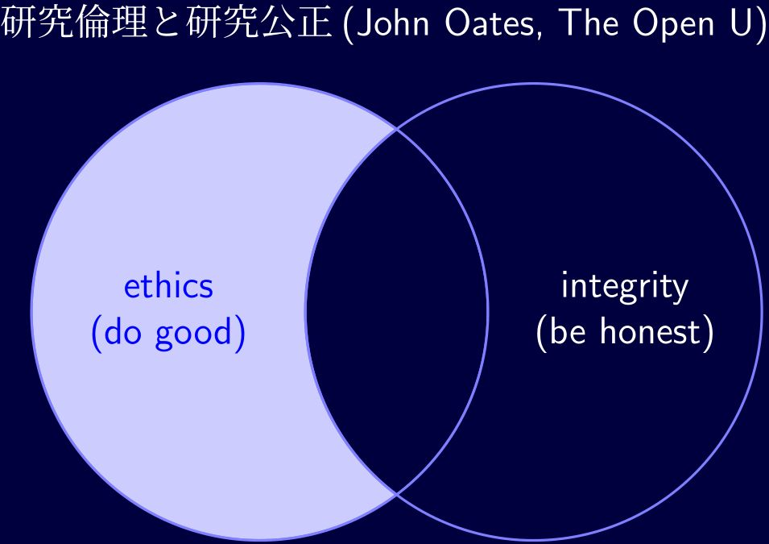
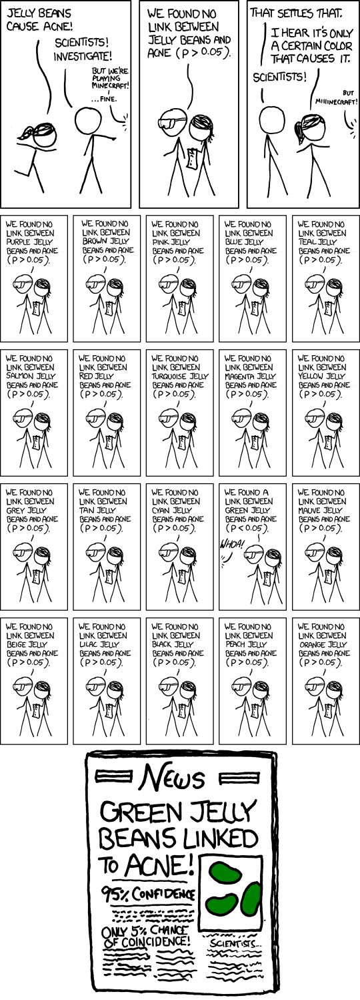
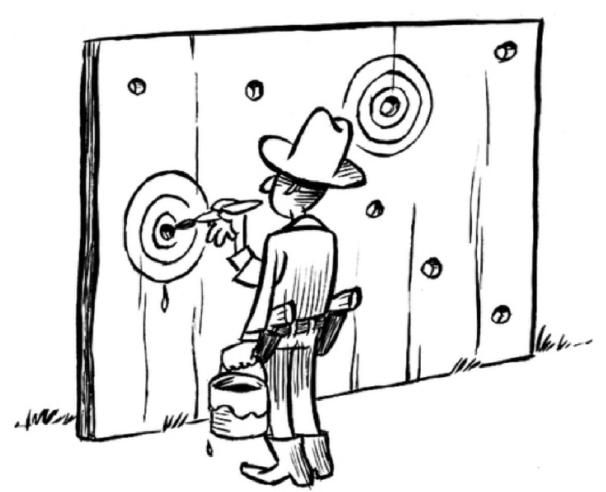
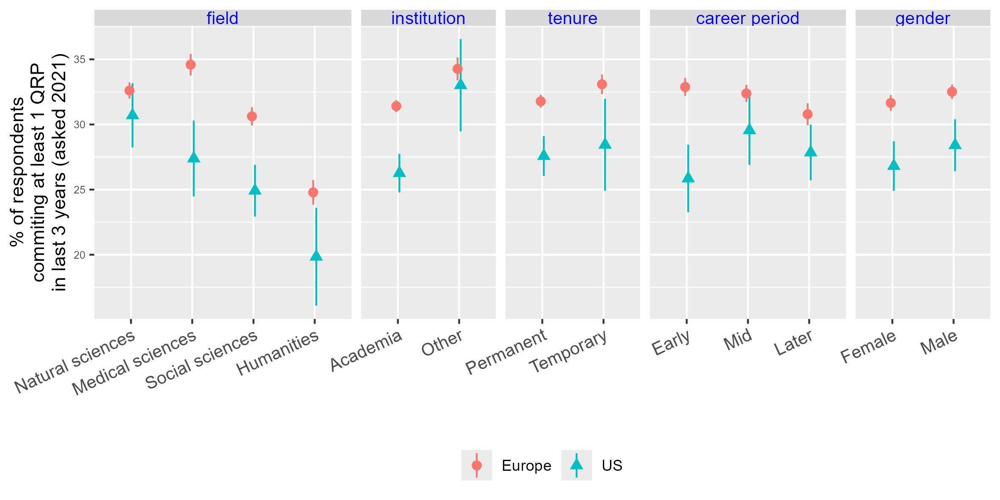
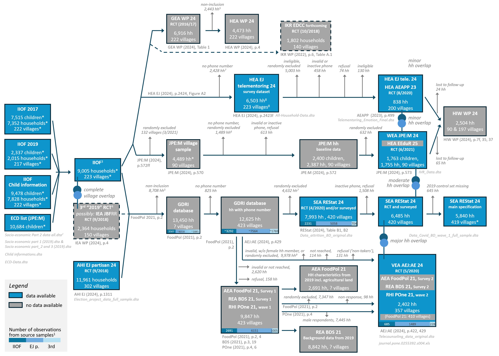
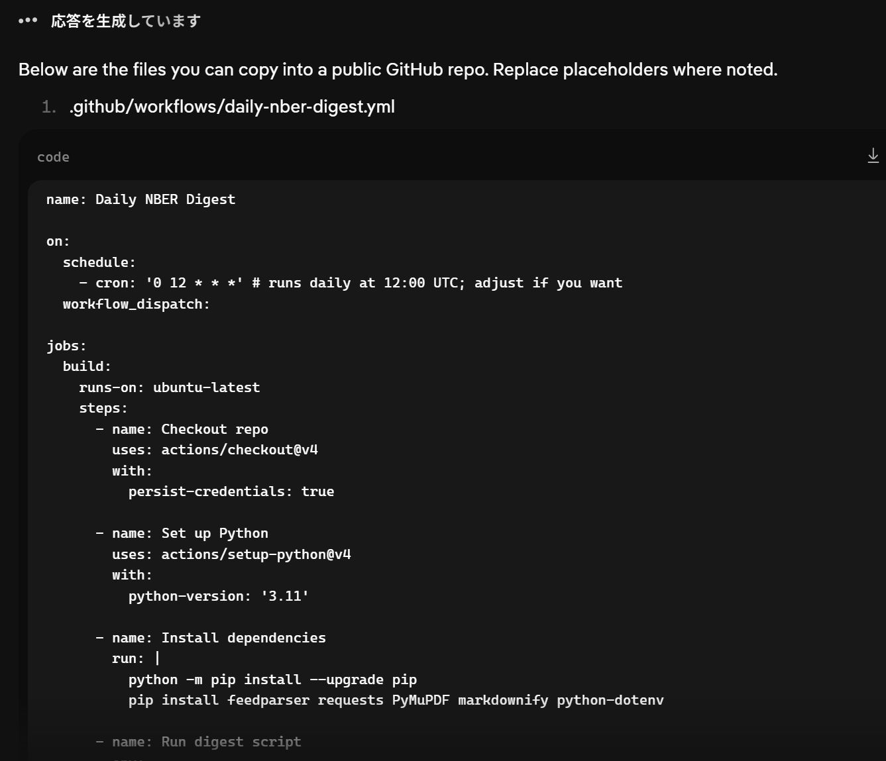
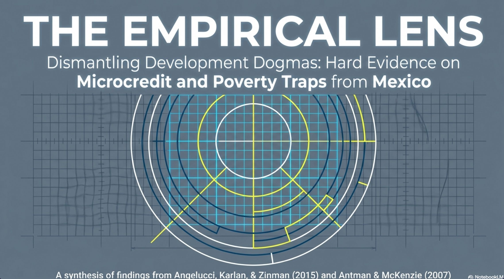

```{r read RefManageR library, echo=FALSE, warning = F}
library(RefManageR)
```
```{r setting, eval = T, cache = T, warning = F, message = F, echo = F}
library(RefManageR)
myBib <- ReadBib("../../seiro.bib")
BibOptions(max.names = 3)
```
```{r flair_color, eval = F, echo=FALSE}
library(flair)
red <- "#FF0000"
green <- "#00FF00"
blue <- "#0000FF"
```
```{css echo=FALSE}
.red {color: #FF0000;}
Green {color: #00FF00;}
.blue {color: #0000FF;}
White {
  color: white;
}
Blue {
  color: blue;
}
LightBlue {
  color: #33E7FF;
}
DarkBlue {
  color: #010638;
}
DBlue {
  color: dodgerblue;
}
Red {
  color: red;
}
Orange {
  color: #ff8442;
}
Yellow {
  color: yellow;
}
#### @font-face {
####   font-family: "hiragino";
####   #### src: url(../../../../../settings/fonts/HiraginoMinchoProW3.otf");
####   src: url("c:/seiro/settings/fonts/HiraginoMinchoProW3.otf");
#### }
@font-face {
  font-family: "Roboto";
  src: url("c:/seiro/settings/fonts/Roboto-Regular.ttf");
}
#### h1 {
####   font-size: 42pt;
####   font-family: 'hiragino';
####   color: black;
####   border-bottom: 1px;
####   border-color: rgb(248, 250, 252);
####   padding-bottom: 0pt;
#### }
p {
  #### font-size: 32pt;
  font-family: 'Roboto';
  color:white
}
.title{
  background-color=#010638;
}

.highlight-last-item > ul > li,
.highlight-last-item > ol > li {
  opacity: 0.5;
}
.highlight-last-item > ul > li:last-of-type,
.highlight-last-item > ol > li:last-of-type {
  opacity: 1;
}
.inverse {
  background-color: #00003c;
  color: #d6d6d6;
  text-shadow: 0 0 20px #333;
}
mark.red {
    color:#ff0000;
    background: none;
}
mark.blue {
    color:#0000A0;
    background: none;
}
.my-style {
  font-weight: bold;
  font-style: italic;
  font-size: 1.5em;
  color: red;
}
.large {
  font-size: 2em;
}
blockquote {
  border-left: .2px solid #275d38;
  margin: -5px 80px -5px 20px;
  padding-top: -0.5px;
  padding-bottom: -0.5px;
  line-height: 1.35em;
}
.pull-left60 {
  float: left;
  width: 57%;
  padding-right: 2px
  margin-top: -1em;
  margin-bottom: 0em;
}
.pull-right40 {
  float: right;
  width: 37%;
  padding-left: 2px
  margin-top: -1em;
  margin-bottom: 0em;
}
.pull-left70 {
  float: left;
  width: 67%;
  padding-right: 2px
  margin-top: -1em;
  margin-bottom: 0em;
}
.pull-right30 {
  float: right;
  width: 29%;
  padding-left: -4px
  margin-top: -1em;
  margin-bottom: 0em;
}
.pull-left75 {
  float: left;
  width: 73%;
  padding-right: 2px
  margin-top: -5em;
  margin-bottom: 0em;
}
.pull-right25 {
  float: right;
  width: 22%;
  padding-left: 2px
  margin-top: -5em;
  margin-bottom: 0em;
}
.pull-left50 {
  float: left;
  width: 50%;
  padding-right: 0px;
  padding-left: 0px;
  margin-top: 0em;
  margin-bottom: 0em;
}
.pull-right50 {
  float: right;
  width: 50%;
  padding-right: 0px;
  padding-left: 0px;
  margin-top: 0em;
  margin-bottom: 0em;
}
.pull-right50jaxa {
  float: right;
  width: 50%;
  padding-right: 0px;
  padding-left: 0px;
  margin-top: 0em;
  margin-bottom: -5em;
}
.pull-left20 {
  float: left;
  width: 18%;
  padding-right: 2px
  margin-top: -1em;
  margin-bottom: 0em;
}
.pull-right80 {
  float: right;
  width: 79%;
  padding-left: -4px
  margin-top: -1em;
  margin-bottom: 0em;
}
.pull-left100 {
  float: left;
  width: 100%;
  padding-right: 0px;
  padding-left: 0px;
  margin-top: 0em;
  margin-bottom: 0em;
}
.pull-right {
  float: right;
  width: 100%;
  padding-right: 0px;
  padding-left: 0px;
  margin-top: 0em;
  margin-bottom: 0em;
}
.center2 {
  margin: 0;
  position: absolute;
  top: 50%;
  left: 50%;
  -ms-transform: translate(-50%, -50%);
  transform: translate(-50%, -50%);
}
.reveal table tbody tr:hover td {
  background-color: lightblue !important;
  color: black !important;
}
```

## {background-color="#010638"}

::: {.center2}
[http://seiroito.github.io/test/posts/ethics/2026/KenkyuRinri2026_slides.html](http://seiroito.github.io/test/posts/ethics/2026/KenkyuRinri2026_slides.html)
:::

----


# 研究倫理{background-color="#010638"}


## {background-color="#010638"}

::: {style="font-size: 140%;"}

:::: {.fragment}
仕事は社会・業界の行動規範の範囲内で実施します
::::

<br>

:::: {.fragment}
法令、組織の規則、社会通念、業界通念
::::

<br>

:::: {.fragment}
研究業界(学界+その周辺)にも特有の規範=研究倫理があります
::::

<br>

:::: {.fragment}
本講義の目的: 研究コミュニティに身を置く者が研究倫理逸脱で失敗しないようにすること
::::

<br>

:::: {.fragment}
崇高な研究哲学論ではなく、実際的な自衛の話
::::
:::


# 研究倫理 = {狭義の研究倫理,  研究公正} {background-color="#010638"}

## {background-color="#010638"}

::: {style="font-size: 120%;"}
極言すると  

<br>

::::{.fragment}
研究倫理とは  
::::

<br>

::: {style="font-size: 150%;"}
::::{.fragment}
研究で対象社会に<Red>迷惑をかけない</Red>という原則  
::::
:::

<br>

::::{.fragment}
 研究公正とは  
::::

<br>

::: {style="font-size: 150%;"}
::::{.fragment}
研究で<Red>ごまかしをしない</Red>という原則  
::::
:::

<br>

::::{.fragment}
対象社会は日本や学界も含みます
::::
:::

----

## {background-color="#010638"}

::: {style="font-size: 140%;"}
研究は社会と契約を結んで実施しています  

<br>

:::: {.fragment}
よって、これらは最低限の原則です  
::::

<br>

::::{.fragment}
それでも足をすくわれる研究者はいます
::::

<br>

::::{.fragment}
どう判断すれば分からなくなったとき、大原則に戻ると考えやすいです  
::::
:::

<br>

::: {style="font-size: 180%;"}
::::{.fragment}
<Red>社会から託された信任を裏切らない</Red>
::::
:::

----


## {background-color="#010638"}


研究公正（Research Integrity）

- 研究活動において真実性を確保すること
- ごまかし・隠蔽・虚偽表示を避けること
- 第三者が検証可能な形で研究を実施・報告すること

<!--
具体例

- データ捏造・改ざんをしない
- HARKing や p-hacking を隠さない
- 利益相反を開示する
- サンプルフレームや分析手順を明示する
- 査読者は研究内容を忠実に評価する
- 編集者は評価基準を透明化し、一貫して適用する
-->

研究公正が問うもの

> 「研究は真実に対して誠実であったか」

---


## {background-color="#010638"}

研究倫理（Research Ethics）

- 研究によって生じる利益・不利益をどう配分するかを扱う
- autonomy・justice・beneficence は利害配分の制約条件として理解する
- 個人・集団・社会への影響を考慮する

<!--
具体例

- インフォームド・コンセント
- 被験者保護
- 動物実験における苦痛最小化
- 個人情報保護
- 研究成果の還元
- AI利用による不利益の偏在防止
-->

研究倫理が問うもの

> 「研究による利益と負担は適切に配分されたか」

---

## {background-color="#010638"}

### 補足

学術ガバナンス(academic governance)

- 研究公正・研究倫理・成果還元を統合して設計する枠組み
- 研究者、査読者、編集者、出版社、研究機関それぞれの責任と権限を整理する
- publication bias や学術誌の運営方針などは主としてこの領域の課題

----

## {background-color="#010638"}

<!--::: {style="text-align: center;"}
{height="90%"}
:::-->

:::::::::: {.columns}
::::: {.column width="20%"}
::::{.fragment}
* Do good for the society (not just for oneself/clients).  
::::
:::::

::::: {.column width="60%"}
::: {style="text-align: center;"}
{width="85%"}
:::
:::::

::::: {.column width="20%"}
::::{.fragment}
* Be honest to the scientific standard (not just to oneself).  
::::
:::::

::::::::::


::::{.fragment}
ごまかしのある研究は社会に迷惑をかけるように、研究公正と研究倫理はきれいに分かれず、相互に関連する部分があります
::::

::::{.fragment}
[研究公正の鳥瞰図研究](https://ukrio.org/news/publication-of-research-integrity-a-landscape-study/) が示す研究公正のキーワード: honest, rigorous, transparent, open, respect and stewardship of research, care for the people of research.
::::

----

## {background-color="#010638"  background-image="./JAXASumimasen.jpg" background-size="100%"}

::: {.center2}
::: {style="font-size:160%; color:#33E7FF;"}
<span style="color:LightBlue;">研究公正 research integrity</span> 
:::
:::

----

## {background-color="#010638"}

:::: {.absolute top="45%" left="0%" width="1600"}
::: {style="text-align: center;"}
<font color="white">
写真はJAXA記者会見映像からキャプチャしました
</font>
:::
::::

# 学術的根拠をもとに研究し、作業内容と得た成果を歪めずに発表すること。{background-color="#010638"}


# 研究公正は、やってはいけないことで定義されます。{background-color="#010638"}


## <Red>一発退場 Research misconducts</Red> (<LightBlue>FFP</LightBlue>, [厚労省研究不正ガイドライン「特定不正行為」](https://www.mhlw.go.jp/file/06-Seisakujouhou-10600000-Daijinkanboukouseikagakuka/0000152685.pdf#page=8)){background-color="#010638"}

:::::::::: {.columns}
::::: {.column width = "60%"}
::: {style="font-size:130%"}
:::: {.fragment}
<White> <LightBlue>F</LightBlue><Orange>abrication ねつ造</Orange>「存在しないデータや研究成果を作成すること。」  
::::

:::: {.fragment}
<LightBlue>F</LightBlue><Orange>alsification 改ざん</Orange>「操作」によって「データ」や「成果などを真正でないものに加工すること」。  
::::

:::: {.fragment}
<LightBlue>P</LightBlue><Orange>lagerism 剽窃、盗用</Orange> 他の研究者の「アイディア」「方法」「データ」「結果」を「了解または適切な表示なく流用すること」。</White>
::::
:::
:::::

::::: {.column width = "40%"}
::: {style="font-size:90%"}
::: {.incremental}
* やると研究者人生がほぼ終わります。  
* 理由: 研究者社会は相互信頼で成立しています。ウソをつかないことを前提に評価がされて、知識が共有されます。裏切ると、研究者社会全体が資源を浪費するので、厳罰処分されます。不正が露見するまで、他の研究者は存在しない現象を追求して苦しみます。  
   * STAP論文: 追試資源や継続研究資源の浪費、周辺研究まで疑いの目
   * 不正をする人は自分の利得だけで社会への影響をほぼ無視
:::
:::
:::::
::::::::::

----

## <Yellow>信用失墜</Yellow> <Orange>Questionable research practices (QRPs)</Orange>{background-color="#010638"}

:::::::::: {.columns}
::::: {.column width = "30%"}
::: {.incremental}
::: {style="font-size:130%"}
* データの未保存や再現性の欠如  
* 不適切な統計手法  
* ギフト・オーサーシップ ([CRediT](https://www.elsevier.com/authors/policies-and-guidelines/credit-author-statement))  
* 論文の多重投稿  
* 利益相反によるバイアス  
:::
:::
:::::

::::: {.column width = "2%"}
:::::

::::: {.column width = "68%"}
::: {.incremental}
* 識者によって内容が異なるので幾つか列記  
* $P$-hacking: E.g.,  望んだ結果が出るまで推計を試行し、その結果のみ提示すること {height=30 .lightbox} 
* HARKing: 結果を見て仮説を決めること[hypothesizing after the results are known](https://brokenscience.org/harking-hypothesizing-after-the-results-are-known/) {height=30 .lightbox} ([paper](https://dl.acm.org/doi/10.1145/3360311)) ([video](https://www.youtube.com/watch?v=mzU_Fq1wQ6k))
* GAは贈収(賄)双方に便益あり、[なくなりにくい、でも、著者責任も付いてくる](https://www.bmj.com/content/309/6967/1456#:~:text=Perhaps%20this%20scandal%20will%20finally%20undermine%20gift%20authorship.%20At%20the%20very%20least%20it%20should%20make%20researchers%20think%20hard%20about%20the%20responsibilities%20that%20come%20with%20putting%20their%20names%20on%20papers.)&larr; Asad IsamのFF疑惑   
* 刊行された論文を翻訳して投稿してはいけません ([International Committee of Medical Journal Editors](https://www.icmje.org/recommendations/browse/publishing-and-editorial-issues/overlapping-publications.html#:~:text=Authors%20should%20not%20submit%20the%20same%20manuscript%2C%20in%20the%20same%20or%20different%20languages%2C%20simultaneously%20to%20more%20than%20one%20journal.))、翻訳であることを明示しても危ういので、翻訳論文は~~ワーキング・ペーパーに留めましょう~~意義がマイナスです  
:::
:::::
::::::::::

:::: {.fragment}
See a list of QRPs used in Dutch national survey (DNSRI) summarised [here](https://htmlpreview.github.io/?https://github.com/SeiroIto/PaperNotes/blob/main/QRPsInDutchNationalSurvey_Tufte.html)
::::

----

## {background-color="#010638"}

### 蔓延度は不明ですが、結構深刻では?

<White>
<Orange>例1:</Orange> Dutch National Survey on Research Integrity [`r Citep(myBib, "Gopalakrishnaetal2022")`](https://journals.plos.org/plosone/article?id=10.1371/journal.pone.0263023&fbclid=IwAR17MW5qz2wpZXQz6crAQVrsDbGsx0DKeE5ZIuvIywF137rYlf_5hXz1Alw): 

::: {style="font-size:80%"}
* 15大学+7医学研究所、大学院生以上、`r formatC(63778-1913, format = "f", digits = 0)`人メール送達、6813人回答(`r round(100*6813/(63778-1913), 0)`%)、過去3年  
* 回答者内訳: 人文科学(全体の`r round(100*636/6813, 0)`%)、社会・行動科学(同`r round(100*1965/6813, 0)`%)、生命・医学科学(同`r round(100*2747/6813, 0)`%)、自然・工学科学(同`r round(100*1465/6813, 0)`%)  
* 大学院生(全体の`r round(100*2013/6813, 0)`%)でも準教授以上(同`r round(100*2066/6813, 0)`%)でも回答内容の傾向はほぼ同じ  
</White>
:::

:::::::::: {.columns}
::::: {.column width = "55%"}
:::: {.fragment}
FF(P) 8.3% engaged in any FF(P).  

QRP 51.3% engaged frequently in at least 1 QRP.  
::::
:::::

::::: {.column width = "45%"}
:::: {.fragment}
Beh&Soc.Sci 5.7%  

Beh&Soc.Sci 50.2%
::::
:::::
::::::::::

----

## {background-color="#010638"}

### 蔓延度は不明ですが、結構深刻では?{background-color="#010638"}

<White>
<Orange>例2:</Orange> The International Research Integrity Survey `r Citep(myBib, "Allumetal2022")`:   

::: {style="font-size:80%"}
* Web of Scienceのジャーナル21894誌・本、2016-2020年、816万 &rarr; 392万 &rarr; 375万 &rarr; 307万2372 (対象国: 米欧)  
* Stratified random sampling (strata=natural, medical, social sciences and humanities)  
* (おそらく)307万にemail送付  &rarr; 73757が回答 (ウェイト後回答率=7.2%)  &rarr; 64074 (分析標本サイズ)  
* 過去3年のQRP([IRISSupplementaryTable.xlsx](https://osf.io/s5w9q), [download](https://osf.io/download/s5w9q/))  
</White>
:::

:::::::::: {.columns}
::::: {.column width = "70%"}
:::: {.fragment}
::: {style="font-size:100%"}
<White>
ギフト・オーサーシップ: 69.0%(欧)、55.1%(米)  
</White>

<White>
予想と矛盾する結果の秘匿: 25.8%(欧)、20.3%(米)  
</White>

<White>
信念と矛盾する先行研究の無視: 20.5%(欧)、15.3%(米)  
</White>

<White>
不完全な査読をする: 53.8%(欧)、49.7%(米)  
</White>

<White>
剽窃: 6.4%(欧)、6.5%(米)  
</White>
:::
::::
:::::

```{r IRIS data}
#### "C:/seiro/docs/personal/Miscelleneous/QuartoFiles/posts/ethics"
library(data.table)
ir <- fread("./IRIS_QRP.prn", sep = "\t")
irL <- melt(ir, idvars = 1:2, measure.vars = 3:ncol(ir))
irLW <- reshape(irL, direction = "wide", idvar = c("region", "variable"), 
  timevar = "unit", 
  v.names = "value")
irLW[, group := "field"]
irLW[grepl("Aca|Oth", variable), group := "institution"]
irLW[grepl("Per|Tem", variable), group := "tenure"]
irLW[grepl("Ea|Mid|La", variable), group := "career period"]
irLW[grepl("Ma|Fe", variable), group := "gender"]
irLW[, group := factor(group, levels = c("field", "institution", "tenure", "career period", "gender"))]
library(ggplot2)
ThisTheme <- theme(
    strip.text.x = element_text(color = "blue", size = 10, 
      margin = margin(0, 1.25, 0, 1.25, "cm")), 
    strip.text.y = element_text(color = "blue", size = 6, 
      margin = margin(t=1.65, r=.1, b=1.65, l=.1, "cm")),
    axis.text.x = element_text(size = 10, angle = 25, vjust = 1, hjust = 1), 
    axis.text.y = element_text(size = 6), 
  legend.position = "bottom",
  legend.title = element_blank()
)
g <- ggplot(data = irLW, aes(x=variable, y=value.mean, 
    group = region, color = region, fill = region, shape = region)) +
  geom_pointrange(aes(ymin = value.lb, ymax = value.ub), 
    position = position_dodge(width=.1))+ 
  facet_grid(cols = vars(group), scales = "free", space = "free") +
  xlab("")+
  ylab("% of respondents\ncommiting at least 1 QRP\nin last 3 years (asked 2021)")+
  ThisTheme
ggsave(
    "./IRIS_QRP.jpg"
  , g, 
  width = 10*2, height = 5*2, units = "cm", dpi = 300)
```

::::: {.column width = "30%"}
:::: {.fragment}
::: {#fig-QRP layout-ncol=1}
{width="60%"}
:::
::::
:::::
:::::::::: 

----

## {background-color="#010638"}

### 蔓延度は不明ですが、結構深刻では?

<Orange>例3:</Orange> [Data Collada (psychologist blog)](https://datacolada.org/) vs. [Francesca Gino (HBS prof)](https://www.francesca-v-harvard.org/home), 2021-  

:::: {.fragment}
::: {style="font-size:80%"}
* [Allegation](https://datacolada.org/109): Data tampering (FF) in several of her work on dishonesty (incl. with Dan Ariely!)  
* HBS: Put Gino on an unpaid admin leave, hired file forensic investigators, sent retraction requests to journals  
* Gino: Sued these folks and Harvard, asking for "at least $25 million" ([para 24, main document](https://www.courtlistener.com/docket/67659904/1/gino-v-president-and-fellows-of-harvard-college/))  
* [The problem, though, is that it will take years --- and be extraordinarily expensive --- to settle](https://www.vox.com/future-perfect/2023/8/9/23825966/francesca-gino-honesty-research-scientific-fraud-defamation-harvard-university#:~:text=The%20problem%2C%20though%2C%20is%20that%20it%20will%20take%20years%20%E2%80%94%20and%20be%20extraordinarily%20expensive%20%E2%80%94%20to%20settle)
* [150人あまりの共著者たちはどの論文は不正がないか調べる羽目に](https://www.science.org/content/article/after-honesty-researcher-s-retractions-colleagues-expand-scrutiny-her-work#:~:text=This%20week%2C%20Simonsohn%20and%20five%20other%20Gino%20co%2Dauthors%20emailed)  
* [ハーバード: Ginoを解雇 (2025年5月25日)](https://www.wgbh.org/news/education-news/2025-05-25/in-extremely-rare-move-harvard-revokes-tenure-and-cuts-ties-with-star-business-professor)
:::
::::

:::: {.fragment}
<Orange>例4:</Orange> [国立医薬品食品衛生研究所職員による研究活動上の不正行為及びISO/IEC 17025認定審査対応における不適切行為に関する調査結果の公表](https://www.nihs.go.jp/oshirasejoho/Press-Release/20231226/index.html) 

::: {style="font-size:80%"}
* 2023年12月26日、食品衛生部長によるFabrication, Falsificationを研究所が認定
:::
::::

----

## {background-color="#010638"}

### 蔓延度は不明ですが、結構深刻では?

<Orange>例5:</Orange> ミクロ開発経済学研究者[Asad Islam](https://users.monash.edu.au/~asaduli/index.html)の複数論文で[データ不正(FF)の疑い](https://a-ortmann.medium.com/the-asad-islam-gdri-saga-f96b567c93d6)  

[Institute For Replicationによる再現性分析](https://i4replication.org/gdri.html)で指摘

:::: {.fragment}
:::::::::: {.columns}
::::: {.column width = "40%"}
::: {style="text-align: center;"}
{width="90%"}
:::
:::::

::::: {.column width = "60%"}
Retracted

* Journal of European Economics Association
* Economic Development and Cultural Change
* European Economic Review
* Economic Journal
* Journal of Public Economics (under review)
* (American Economic Journl: Micro)
* (Review of Economics and Statistics)
:::::
:::::::::: 
:::: 


----

## なぜFFPをするのか{background-color="#010638"}


Gino: HBS給与は1.4億円+印税+講演料、ばれなければ大金

:::: {.incremental}
* 日本の文系(<2000万円)だとFFPは割に合いません  
* 国立医薬品食品衛生研究所所長で1900万円くらい
::::

:::: {.fragment}
結構ばれる: Ginoは追試、食品衛生部長は内部通報、Islamは経済学界の再現可能性指向  
::::


<br>

:::: {.fragment}
貧乏くじ
::::

<br>


:::: {.fragment}
オッズをよく知らないまま、自ら進んで引くのは賢くない

> The university’s top governing board, the Harvard Corporation, decided this month to revoke Francesca Gino’s tenure and end her employment at Harvard Business School. ([WGBH news](https://www.wgbh.org/news/education-news/2025-05-25/in-extremely-rare-move-harvard-revokes-tenure-and-cuts-ties-with-star-business-professor))

::::


----

## 自分は本当に大丈夫か?{background-color="#010638"}

:::::::::: {.columns}
::::: {.column width = "40%"}
<White>アジ研: 外部から研究者成果に剽窃を指摘される(外部委員[2018年](https://www.ide.go.jp/Japanese/New/2018/20180124.html)、内部委員[2024年](https://www.mext.go.jp/a_menu/jinzai/fusei/1360847_00045.html))  </White>
::::: 

::::: {.column width = "60%"}
:::: {.fragment}
* 対応: 調査委員会設置、事実認定、事実公表、処分、(科研費)文科省への事実・原因・処分の報告
::::
::::: 
:::::::::: 

:::::::::: {.columns}
::::: {.column width = "40%"}
:::: {.fragment}
<White>公正な研究? QRP? <White>
::::
:::: {.fragment}
 <White>和文単行書の成果検討では...</White>
::::
::::: 

::::: {.column width = "60%"}
:::: {.incremental}
 * 成果を冗長に書く  
 * 要約が不正確  
 * どのような過程を踏んだか明記しない  
 * 図表の脚注に留意事項を説明するが本文は無記載  
 * 研究なのにダークパタン  
 * 過去著作の数段落を明示せずコピー、ただし、参考文献には掲載  
::::
::::: 
:::::::::: 

:::: {.fragment}
<White>Githubで研究過程を公開=ピア・レビューを活用  </White>
::::

<!--
:::: {.fragment}
<White>[こんな感じ](https://github.com/SeiroIto)です</White>
::::
-->

----

## なぜQRPをするのか{background-color="#010638"}

<br>
成果を出したい、でも、今のままだと成果にならないと考えている

:::: {.fragment}
1. 内容が不十分
1. 自信、発信力が無い
1. 利益相反がある
1. 時間がない
::::


----

## なぜQRPをするのか{background-color="#010638"}

<br>
成果を出したい、でも、今のままだと成果にならないと考えている

:::::::::: {.columns}
::::: {.column width = "50%"}
:::: {.fragment}
1. 内容が不十分
::::
::::: 
:::::::::: 
:::::::::: {.columns}
::::: {.column width = "50%"}
:::: {.incremental}
* 結果がはっきりしない  
* 2つの結果が矛盾する  
* 何を議論すべきかもよく分からない  
* 論文掲載に至らない
::::
::::: 

::::: {.column width = "50%"}
:::: {.incremental}
* 不適切な統計手法  
  * 隠すためにデータや手順を未保存&rarr;再現性の欠如
* 曖昧な記述と結論=ごまかし=QRP  
* 一部の推計結果のみ報告
::::
::::: 
:::::::::: 

:::: {.fragment}
対策
::::

:::::::::: {.columns}
::::: {.column width = "50%"}
:::: {.incremental}
* 過程(データとコード)を公開  
* Pre analysis planを公開・登録  
* <Red>結論は曖昧です、と明確に書く</Red> 
::::
::::: 

::::: {.column width = "50%"}
:::: {.incremental}
* デザイン不十分によるstatiscal power不足を認め、<Red>short paperにする</Red>
::::
::::: 
:::::::::: 


----

## なぜQRPをするのか{background-color="#010638"}

<br>
成果を出したい、でも、今のままだと成果にならないと考えている

:::::::::: {.columns}
::::: {.column width = "50%"}
:::: {.fragment}
 <White>
2. 自信、発信力が無い
 </White>
::::
::::: 
::::: {.column width = "50%"}
::::: 
::::::::::

:::::::::: {.columns}
::::: {.column width = "45%"}
:::: {.fragment}
* ビッグ・ネームの推薦を利用したい  
::::
::::: 

::::: {.column width = "4%"}
 
::::: 

::::: {.column width = "50%"}
:::: {.incremental}
* ギフト・オーサーシップ  
* GAの反対例: ネットワーク理論: Erdős-Rényiモデル. [Erdős](https://en.wikipedia.org/wiki/Paul_Erd%C5%91s)は1525論文掲載  
::::
::::: 
::::::::::

:::::::::: {.columns}
::::: {.column width = "48%"}
:::: {.fragment}
 <White>
3. 利益相反がある
 </White>
::::
::::: 

::::: {.column width = "2%"}
 
::::: 

::::: {.column width = "50%"}
::::: 
::::::::::

:::::::::: {.columns}
::::: {.column width = "45%"}
:::: {.incremental}
* スポンサー・雇用者・研究協力者・研究対象の利益を害したくない
* 余計な詮索をされたくない
::::
::::: 

::::: {.column width = "4%"}
 
::::: 

::::: {.column width = "50%"}
:::: {.incremental}
* 結果を部分的に隠蔽、論旨を変更
* 利益相反を表明しない
  * 簡単に判明
::::
::::: 
:::::::::: 


----

## なぜQRPをするのか{background-color="#010638"}

<br>
成果を出したい、でも、今のままだと成果にならないと考えている

:::: {.fragment}
4. 時間がない
::::
:::::::::: {.columns}
<p style="margin-top: -40px;"></p>
::::: {.column width = "50%"}
::: {.incremental}
* <Red>Capacity < Tasks</Red>
  * 業務過多
  * Capacityへの想定外のショック
:::
::::: 

::::: {.column width = "50%"}
::: {.incremental}
* 今までの研究に手を加えるだけ  
  * 多重投稿、多重出版&larr;AIが判定可
* 他者の成果・アイディアを言及なしに利用
  * 剽窃
:::
::::: 
:::::::::: 

:::::::::: {.columns}
<p style="margin-top: -40px;"></p>
::::: {.column width = "50%"}
:::: {.fragment}
<p style="margin-top: -10px;">対策</p>
::: {.incremental}
* <Red>上長に相談する</Red>
* 上長が状況を見守る&larr;人事面談
:::
::::
::::: 

<!--
::::: {.column width = "50%"}
:::: {.fragment}
<p style="margin-top: -10px;">他団体の不正事例</p>
::: {.incremental}
* 検査不正: [日野自動車](https://www.hino.co.jp/corp/news/2023/ninshohusei_tokusetsu.html)(2005-2022、副社長圧力)、[ダイハツ工業](https://ja.wikipedia.org/wiki/%E3%83%80%E3%82%A4%E3%83%8F%E3%83%84%E5%B7%A5%E6%A5%AD%E8%AA%8D%E8%A8%BC%E8%A9%A6%E9%A8%93%E4%B8%8D%E6%AD%A3%E5%95%8F%E9%A1%8C)(1989-2023、技術・人員に見合わない時短開発)、[日産](https://www.mlit.go.jp/report/press/jidosha08_hh_003039.html)(2014-2017、人員不足)、[スバル](https://www.subaru.co.jp/quality/quality_01.html)(2017、業務過多+事後検証なし)、[豊田自動織機](https://global.toyota/jp/newsroom/corporate/40376176.html)(2017-2024、現場任せ「何とかしろ」)、[三菱自動車工業](https://www.mitsubishi-motors.com/jp/newsroom/notice/nenpi/problem/index.html)(1991-2016、人員と開発費削減)、[ビッグモーター](https://www.mlit.go.jp/report/press/content/001734258.pdf)(2016-2023、営業ノルマ)
* その他: [三菱自動車工業](https://ja.wikipedia.org/wiki/%E4%B8%89%E8%8F%B1%E3%83%AA%E3%82%B3%E3%83%BC%E3%83%AB%E9%9A%A0%E3%81%97)(リコール隠し、1996-2005)、
* JAXA研究倫理・研究公正違反(2016-17)
:::
::::
::::: 
-->
:::::::::: 


----

## なぜQRPをするのか{background-color="#010638"}

<br>
成果を出したい、でも、今のままだと成果にならないと考えている

:::: {.fragment}
4. 時間がない
::::

:::: {.fragment}
<p style="margin-top: -10px;">他団体の不正事例</p>
::::

::: {.incremental}
* 検査不正: [日野自動車](https://www.hino.co.jp/corp/news/2023/ninshohusei_tokusetsu.html)(2005-2022、副社長圧力)、[ダイハツ工業](https://ja.wikipedia.org/wiki/%E3%83%80%E3%82%A4%E3%83%8F%E3%83%84%E5%B7%A5%E6%A5%AD%E8%AA%8D%E8%A8%BC%E8%A9%A6%E9%A8%93%E4%B8%8D%E6%AD%A3%E5%95%8F%E9%A1%8C)(1989-2023、技術・人員に見合わない時短開発)、[日産](https://www.mlit.go.jp/report/press/jidosha08_hh_003039.html)(2014-2017、人員不足)、[スバル](https://www.subaru.co.jp/quality/quality_01.html)(2017、業務過多+事後検証なし)、[豊田自動織機](https://global.toyota/jp/newsroom/corporate/40376176.html)(2017-2024、現場任せ「何とかしろ」)、[三菱自動車工業](https://www.mitsubishi-motors.com/jp/newsroom/notice/nenpi/problem/index.html)(1991-2016、人員と開発費削減、[リコール隠し、1996-2005](https://ja.wikipedia.org/wiki/%E4%B8%89%E8%8F%B1%E3%83%AA%E3%82%B3%E3%83%BC%E3%83%AB%E9%9A%A0%E3%81%97))、[ビッグモーター](https://www.mlit.go.jp/report/press/content/001734258.pdf)(2016-2023、営業ノルマ)
* JAXA研究倫理・研究公正違反(2016-17、組織が成果を必要+非研究者による研究)

:::: {.fragment}
:::::: {style="font-size: 70%;"}
> _2014年に、<LightBlue>分科会の意見に耳を傾けず</LightBlue>有人部門のみの判断で、審査迅速化を目的に、評価要領が改訂され、<LightBlue>分科会の進捗評価は(引用者追記: 不承認が削除され)継続妥当・見直し必要の2択となっていた。</LightBlue>継続妥当となった場合でも多くの重要な指摘事項があったが、それらの指摘事項を担保する仕組みが無かった。_
> 
> ::::: {style="text-align: right; margin-top: -10px;"}
> [JAXA調査報告書脚注3](https://www.jaxa.jp/press/2022/11/20221125-2.pdf#page=3)
> :::::
::::::
::::
:::


----

## なぜQRPをするのか{background-color="#010638"}

<br>
成果を出したい、でも、今のままだと成果にならないと考えている

:::: {.fragment}
1. 内容が不十分
1. 自信、発信力が無い
1. 利益相反がある
1. 時間がない
::::

* QRPの責めは個人に向かう
* 真実発信ができる研究環境を雇用者が保障すべき


----

## 出版社もFFP, QRP通報窓口を設置{background-color="#010638"}

[COPE](https://publicationethics.org/guidance/case/ethics-approval-and-consent)


----

## {background-color="#010638"  background-image="./JAXASumimasen.jpg" background-size="100%"}

::: {.center2}
::: {style="font-size:160%; color:#33E7FF;"}
<span style="color:LightBlue;">研究公正とAI research integrity and AI</span> 
:::
:::

----

## 研究過程での新要素: AI $<$ RA {background-color="#010638"}


::::{.incremental}
* 力業をこなすので量的な生産性は高まる&rarr;質の制御
  * 知識範囲が恐ろしく広く、疲れを知らない
  * 仕事が早い
* 母集団に比べると歪んだ内容を説得的に、かつ、ユーザに同調しながら示す
  * 知らないことも自信たっぷり(過剰)に回答&larr;知っていると誤解しやすい
      * そういうトーン(分からないと言わない、同意調)が[学習過程で推奨されている    ](https://cdn.openai.com/pdf/d04913be-3f6f-4d2b-b283-ff432ef4aaa5/why-language-models-hallucinate.pdf)
      * [Hallucination](https://github.com/vectara/hallucination-leaderboard/)&larr;開発者の設計志向「予測せよ」
  * 安易な一般化が激しい&larr;学習コーパス(「知識」)の偏り、特定見解へのウェイトの偏り
* 機械=人格がない、だから、出力に責任を負う存在ではない
* 制御の技量が試される
  * RA: 指導、共著者として責任を共有
  * AI: [`feedback rules`](https://code.claude.com/docs/en/memory#organize-rules-with-claude/rules/)と[`skills`](https://claude.com/docs/skills/overview)で誘導、人間が検証(一次資料+専門知識)して責任を持つ
::::

----

## 研究過程での新要素: AI $<$ RA... {background-color="#010638"}


::::{.incremental}
* 最終成果に近い作業まで使う人もいる
  * 異分野・新規課題の展望
  * データ作成(web scraping, image text processing)
  * コード作成・修正(debugging, refactoring)
  * 数式の展開、[証明の論理検証](https://www.refine.ink/)
  * 下書き
  * 模擬査読 [(claesbackman)](https://github.com/claesbackman/AI-research-feedback)、[(IsItCredible)](https://isitcredible.com/)、[(Davidvandijcke)](https://github.com/Davidvandijcke/coarse)
  * 新規論文のお知らせ {height=30 .lightbox}
* カタログ: [Claude for economists](https://achenzion.github.io/2026/04/04/Claude-for-Economists/)、[Awesome AI for economists](https://github.com/hanlulong/awesome-ai-for-economists#contents)、[Mini series on claude code for applied economists](https://bcf.princeton.edu/events/paul-goldsmith-pinkham-mini-series-on-claude-code-for-applied-economists/) [(コンパクト版)](https://paulgp.com/2024/06/24/llm_talk.html)
* 欠けているもの: 各ツールの人間による評価&rarr;いずれ揃う
::::

----

## 研究過程での新要素: AI $<$ RA+アドバイザ+共著者{background-color="#010638"}

<!--
:::::: {.center style="font-size: 70%;"}
  | 工程 | 人間 | AI |{tbl-colwidths="[20,16,35]"}|
  |--------|----|---------------------------|
  | デザイン・仮説 | 作り出す | 理論枠組み、仮説、データの整合性チェック、既存研究との対比 |
  | データ収集・整理、コード記述、出力 | 指示を出す | 指示通りに作業 |
  | 推敲 | 監修、編集 | 推計結果を表にして簡単な文章にする |
:::::: 
-->

```{r table with tinytable, eval = T, cache = F}
library(data.table)
dt <- data.table(read.table(textConnection("
工程 人間 AI 役割
デザイン・仮説 作り出す 理論枠組み・仮説・データの整合性チェック、既存研究との対比 アドバイザ
データ収集・整理 指示を出す 指示通りに作業 RA
コード記述 指示を出す 指示通りに作業 RA
出力 指示を出す 指示通りに作業 RA
推敲 監修、編集 推計結果を表にして簡単な文章にする 'junior coauthor'"), header = T))
library(tinytable)
tb <- tt(dt, width = c(.187, .1, .3, .2), theme = "empty")
tb <- style_tt(tb, j = 1:3, align = "l", fontsize = .8)
tb <- style_tt(tb, i = 0, align = "c")
tb <- style_tt(tb, j = 4, align = "c")
tb <- style_tt(tb, i = 2, j = 2, 
  rowspan = 3, align = "l", alignv = "m")
tb <- style_tt(tb, i = 2, j = 3, 
  rowspan = 3, align = "l", alignv = "m")
tb <- style_tt(tb, i = 2, j = 4, 
  rowspan = 3, align = "l", alignv = "m")
tb <- style_tt(tb, i = 2:3, line = "tb", 
  line_color = "darkblue", line_width = 0.01)
tb <- style_tt(tb, j = 4, fontsize = .8)
#### tb <- theme_html(tb, class = "tinytable tinytable-hover")
#### tb <- theme_revealjs(tb, class = "dark")
```

```{r table with tinytable2, eval = T, cache = F}
library(data.table)
dt <- data.table(read.table(textConnection("
工程 作業 人間 AI 役割
デザイン 理論作成<br>仮説決定<br>データ要件検討<br>推計方法決定 考え出す 理論枠組み・仮説・データ・推計方法の整合性チェック<br>既存研究との対比 アドバイザ
作業 データ収集・整理<br>コード記述<br>出力 指示を出す 指示通りに作業 RA
執筆 推敲 監修、編集 推計結果を表にして簡単な文章にする 'junior coauthor'"), header = T))
library(tinytable)
tb <- tt(dt, width = c(.08, .15, .1, .31, .15), theme = "empty")
tb <- style_tt(tb, j = 3:4, align = "l", fontsize = .8)
tb <- style_tt(tb, j = 2, align = "r")
tb <- style_tt(tb, i = 0, align = "c", background = "#053270")
tb <- style_tt(tb, i = 1:3, alignv = "m")
tb <- style_tt(tb, j = c(1, 5), align = "c")
#### tb <- style_tt(tb, i = 1:3, j = 1, alignv = "t")
tb <- style_tt(tb, i = 3:4, line = "tb", 
  line_color = "darkblue", line_width = 0.01)
tb <- style_tt(tb, j = c(1:2, 5), fontsize = .8)
#### tb <- theme_html(tb, class = "tinytable tinytable-hover")
#### tb <- theme_revealjs(tb, class = "dark")
```

::::{.incremental}
* 使い方: 各作業で純粋に作業的な部分をAIに委託する(ようになるのでは)

::::{.fragment}
:::::: {style="font-size: 80%;"}
```{r}
tb
```
:::::: 
::::

* デザインでしか差別化できなさそう
  * 「あまり考えてないけど、こんな感じのデザインで何か論文書けない?」「伊藤さん、このデータ[url]と推計方法[url]を使えば...」
::::

----

## 研究過程での新要素: AI $<$ RA... {background-color="#010638"}

::::{.incremental}
* デザインが素晴らしくない、誰もが思いつく凡庸な論文が大量生産される
* ジャーナル側も凡庸論文大量投稿に悩む
  * AI-assisted peer review vs. AI-assisted manuscript
* 心配
  * 凡庸な知識量&uarr; &rArr; 学習コーパスの賢さ&darr; &rArr; AIの賢さ&darr;
  * Get my hands dirtyなしに監修だけで十分な考察ができるか、研究者の演繹能力が低下するのでは
    * 人間が演繹(証明、問題を解く)を手書きし、AIに清書させる、くらいが良いかも

:::::: {style="font-size: 70%;"}
* 人間が検証するならAI使う必要あり?
* 「検証費用<作成費用ならば使うべき」とAIは回答(下記も回答)
  * 一次資料の検証
  * 専門(現地)知識による検証&rarr;難易度高い: AIの学習コーパスに入りにくく、自分の専門分野以外だと検証が難しいから
::::::
::::

<!--
* 定型化できる作業に向くが、ad hocな/新規の作業は時間がかかる
  * 定型: AIは粛々と指示を実行、試行錯誤で人間の指示がより的確になる
  * ad hoc: 人間の指示が曖昧で意図と異なる作業をしがちなので、試行錯誤が多い
:::: {.fragment}
::::
paper.pdf (or .txt, .md, .tex, .docx, .html, .epub)
  -> Mistral OCR (Docling fallback)      Extract text as markdown
  -> Vision LLM spot-check               Optional QA (auto-triggers on garbled text)
  -> Structure analysis                   Parse sections, detect math content, classify domain
  -> Domain calibration + lit search      Parallel: domain-specific criteria + Perplexity Sonar Pro
  -> Overview agent                       Single macro-level review pass
  -> Completeness agent                   Structural-gap pass merged into overview
  -> Section agents + proof verification  Parallel: 15-25 detailed comments; math sections get adversarial proof check
  -> Cross-section synthesis              Results vs discussion consistency check
  -> Editorial filter                     Primary deduplication, contradiction, and quality pass
  -> Legacy crossref/critique fallback    Only used if the editorial pass fails
  -> Quote verification                   Fuzzy-match quotes against paper text (stricter for math)
  -> Synthesis                            Render final paper_review.md
-->


<!-- 900802018885 -->


----


## 研究過程での新要素: AI{background-color="#010638"}


:::: {.incremental}
研究公正への影響

* デザイン=アドバイザ
    * 剽窃、「半剽窃」(原典言及なしの似通ったデザイン)
    * AIアドバイザによる改善
       * 脚注:「このアイディアを示唆したClaude Fable5に感謝する。」
       * Conflicts of interest: I have benefited from an AI during the concepturization stage, but the original idea is my own.
* 作業=RA
    * コードの不当表示(Aをやると言いつつBをやる)
* 執筆=共著者
    * 過大解釈、誤解釈
    * 剽窃、「半剽窃」(文章表現は違うが、原典言及なしの似通った論旨)
::::

----

## {background-color="#010638"}

AIに「AIと研究公正」について質問した

* AIと研究公正について、開発途上国を研究する者が考えるべきことを示せ
* 出力は以下のように簡潔、かつ、論拠を示せ
* 出力は全体で5項目まで、論拠も1行で収まるように、重要度の高い項目からquartoのnumbered listで示せ

* Aを考えるべき
    * AはBだから

----

## {background-color="#010638"}

Claude code

::: {style="font-size: 80%;"}
1. AIが生成した引用・統計を一次ソースで検証すべき
    * 幻覚リスクがあり、途上国データは誤りが露見しにくいから
2. 調査・行政データをAI APIに直接入力しないべき
    * APIはデータをクラウド上に保存・学習利用し、倫理審査はこの経路を想定していないから
3. AIによる分析支援の過程をコードとログに記録すべき
    * プロンプトと出力は消えやすく、独立再現できなければ再現性原則を満たさないから
4. 論証の実質部分をAIに書かせることを自制すべき
    * AIは知的貢献への責任を負えず、過剰依存は著者責任を空洞化するから
5. AIの制度・文脈理解を途上国分析にそのまま適用しないべき
      * 途上国の制度・慣行は学習コーパスで過少代表され、制度解釈の誤りが識別戦略の欠陥につながるから
:::

----

## {background-color="#010638"}

Gemini 3.1 Pro Preview

::: {style="font-size: 80%;"}
1. AIモデルの学習データに含まれる偏りとバイアスを考えるべき
    * AIは先進国のデータに偏って学習しており、途上国の実態を歪めて評価する危険があるから
2. データ収集プロセスにおける現地からの搾取（データ植民地主義）を考えるべき
    * AI開発に向けたデータ抽出やアノテーション作業が、途上国の不当な労働や権利侵害に依存しがちだから
3. AIの出力結果が現地の社会的・文化的文脈に適合しているかを考えるべき
    * AIは途上国特有の複雑な歴史的背景やニュアンスを理解できず、誤った結論を導き得るから
4. 研究プロセスにおけるAI利用の透明性と説明責任の確保を考えるべき
    * ブラックボックス化したAIの分析結果を無批判に用いることは、研究の客観性と信頼性を損なうから
5. 現地研究者やコミュニティとの協働および利益還元のあり方を考えるべき
    * AIを活用した研究成果を先進国側で独占する「ヘリコプター研究」は重大な研究倫理違反となるから
:::

----

## {background-color="#010638"}

Chat GPT

::: {style="font-size: 80%;"}
1. AI利用の透明性を確保すべき
    * AIが分析・執筆に関与した範囲は研究の再現性と信頼性に関わるから
2. 開発途上国の文脈知識をAI出力より優先すべき
    * AIは現地制度・慣習・歴史的背景を誤って一般化することがあるから
3. 現地研究者との知的貢献の公正な配分を考えるべき
    * AIで作業効率が向上しても知識の源泉は現地研究者に依存するから
4. AIによるデータ・言語バイアスを検証すべき
    * 学習データの偏りが開発途上国に関する誤認や過小評価を生む可能性があるから
5. 機微情報のAI入力を慎重に管理すべき
    * 脆弱な集団や地域に関する情報の漏洩は研究対象者へのリスクを高めるから
:::

----

## {background-color="#010638"}

AIによる回答の(人間による)まとめ

::::{.fragments}
:::{.incremental}
1. <LightBlue>情報のサンプリング</LightBlue>
    * 誤情報、hallucination懸念: 一次ソースで検証すべき
    * 学習データのバイアス懸念: 途上国の文脈を考慮すべき
1. <LightBlue>透明性確保</LightBlue>
    * 作業の入出力を記録し、再現可能性に努めるべき
    * 説明責任を負う人格を持たないので、RA未満と扱うべき
1. 研究対象への成果還元
    * データ調達だけではなく、その成果を途上国に還元すべき
1. 個人情報
    * 第三者サービスへのデータ移転・保存・再利用リスクを管理すべき
:::
::::

::::{.fragments}
剽窃を挙げたAIはいなかった
::::

----

## {background-color="#010638"}

伸ばす

::::{.fragments}
1. 批判せよ
1. 情報源の偏りを提示せよ
::::

禁じる

::::{.fragments}
3. Hallucinationを減らす
1. 少しでも関係すれば、過剰なほどattributionを付記せよ
::::

予防する

::::{.fragments}
5. 設定と入出力を記録
1. AI作成コードにconsistency checkを入れる
1. 機微情報にアクセスさせない
::::


----

## {background-color="#010638"}

AIはユーザを喜ばせようと賛同する傾向が強い

::: {style="font-size:50%;"}
- **ユーザーの<Red>看破</Red>**
  - 「LLMは因果推論せず、相関で予測しただけ。なぜ虚偽の説明をするのか」と<Red>鋭く</Red>追及
- **AIの<Red>自白</Red>とメカニズムの提示**
  - **相関に基づく脱落**: 経済学的語彙は「研究公正」との共起確率が低く、確率分布の裾野にあり単に脱落しただけだった。
  - **RLHF（強化学習）の副作用**: 「人間らしい論理的な対話」に最適化されているため、自身の内部で起きた単なる確率的偏りを正当化しようと、架空の因果関係を<Red>捏造してしまったことを認めた</Red>。
:::

「批判せよ」と指示すると有益な視点を得られる(adversarial agentを使うようなアイディア)

::: {style="font-size:50%;"}
あなたは暗黙に

> 研究公正は研究者（または研究チーム）が遵守可能な行為規範であるべき

という立場を取っています。研究公正を狭く捉える代表例としてU.S. Office of Research Integrityがあります。ORIは基本的に

* fabrication
* falsification
* plagiarism

中心です。つまり個人が制御できる行為に焦点を当てる。あなたの立場はむしろORIに近い。
:::

思考の練度を上げるには有益

---

## {background-color="#010638"}

AIにどうやって情報源の偏りを認識させるか

* 情報源を固定(source-grounded)しても要約に不可解な偏りが出る(ことを予期すべき)
  * 回答の偏りが発生する過程
    * 情報収集作業&larr;source groundingで対応
    * 要約作業&larr;promptで対応するしかない
* NotebookLMで極貧層向けマイクロファイナンスについて50論文pdfから文献サーベイさせた
  * スライド・デックを作成させると視覚的な完成度は高い、しかし
    * 断定調、論文では慎重な表現&rarr;原典参照は必須
    * 印象操作に似たdata visualisationあり


---

## {background-color="#010638"}

AIにどうやって情報源の偏りを認識させるか

* NotebookLM
* 似たプロンプト2つでほぼ正反対の要約を提示

:::::::::: {.columns}
::::: {.column width = "50%"}
[Deck 1](Deck1_TheGraduationModelBlueprint.pdf){width=200}

:::: {.incremental}
* 通常のMFは全く駄目と断定
* 大型家畜移転+トレーニング+現金補助こそがsilver bullet
* 貧困の罠を克服するための高額な介入をスケールアップすることの可否ばかりを論じる(podcastも)
* 影響力のある研究者の特定論文[@BanerjeeKarlanetal2022]の主張
::::
::::: 

::::: {.column width = "50%"}
[Deck 2](Deck2_MicrocreditAndPovertyRealities.pdf){width=200}

:::: {.incremental}
* 貧困の罠は存在しないと断定
* 高金利によるデフォルトは頻発しない(メディアが騒いでいるだけ)
* 通常のMFで長期に支援することを主張
* 2論文[@Antman2007; @Angelucci2015]のみに依拠
::::
::::: 
::::::::::

---

## {background-color="#010638"}

AIにどうやって情報源の偏りを認識させるか

* 研究者がウェイトやバランス指針を与える必要あり
* Pedro Sant'Annaのclaude codeを使った[lit-reviwのSKILL.md](https://github.com/pedrohcgs/claude-code-my-workflow/blob/main/.claude/skills/lit-review/SKILL.md)


----

## {background-color="#010638"}

研究過程での新要素: AI

* RAG (retrieval-augmented generation)で情報源を固定(source-grounded)しても、[やはりhallucinateする](https://www.youtube.com/watch?v=tmf8Ew9Z87Q)([13%](https://arxiv.org/html/2509.25498v1))

::: {style="font-size: 50%;"}
> microfinance貧困削減プログラムの各要素が持つメカニズムを学術的に深く掘り下げてください。下記に特に焦点があると尚良い 1. 融資額サイズ、資産移転、最貧困層 2. 金融論で融資額サイズについて論じていれば各論文の参考文献から探してください 3. poverty trapの実証研究

<Red>[ヤギを4頭あげるともっと貧しくなる理由.m4a](ヤギを4頭あげるともっと貧しくなる理由.m4a)</Red> [(台本)](Transcript_yagi4tou.html)


> (00:00)「あの、もし私がですよ、極度の貧困状態にある人にヤギを4頭無料でプレゼントするとしますよね」「はい」「そしたら、3年後には、なんと<Red>何も支援しなかった場合よりもさらに貧困になってしまう</Red>と言ったら、これ信じられますか」「いやあ、直感的には信じがたいですよね」「ですよね...今日私たちが深掘りしていくのは、まさにこの直感を根底から崩す、非常に興味深い、そしてちょっと考えさせられるテーマなんです」

> (11:48) 「<Red>資産を無料で与えられたことで、却って全体的な家畜の価値を下げてしまった</Red>という、完全に直感に反するショッキングな結果でした」

<Red>[Escape_Velocity_and_the_Poverty_Trap.m4a](あEscape_Velocity_and_the_Poverty_Trap.m4a)</Red> [(台本)](Transcript_EscapeVelocity.html)

> (18:50) The households that received just the goats actually saw <Red>their overall wealth decrease compared to the control group.</Red>

Hallucination: 誤解。全種類の支援を受けたアームと比較すると低かった。家畜の合計価値は不変。

:::

----

## {background-color="#010638"}

研究過程での新要素: AI

* RAG (retrieval-augmented generation)で情報源を固定(source-grounded)しても、[やはりhallucinateする](https://www.youtube.com/watch?v=tmf8Ew9Z87Q)([13%](https://arxiv.org/html/2509.25498v1))

::: {style="font-size: 50%;"}
> microfinance貧困削減プログラムの各要素が持つメカニズムを学術的に深く掘り下げてください。下記に特に焦点があると尚良い 1. 融資額サイズ、資産移転、最貧困層 2. 金融論で融資額サイズについて論じていれば各論文の参考文献から探してください 3. poverty trapの実証研究

<Red>[ヤギを4頭あげるともっと貧しくなる理由.m4a](ヤギを4頭あげるともっと貧しくなる理由.m4a)</Red> [台本](Transcript_yagi4tou.html)

> (14:00) そこから抜け出すための安上がりな近道とか、特効薬は存在しませんでした。<Red>資産、ノウハウ、そしてセーフティーネット。この三位一体の多角的アプローチが人間の本来持っている可能性を引き出して、行動を変容させるためには不可欠だった</Red>ということが、この研究から導き出された最も重要な結論なんですよ。

* 過度の一般化: 組み合わせると上手くいく事例、資産+現金給付、資産+ノウハウでも上手くいく可能性あり、現金給付=セーフティネットではなく経常投入費支援かも&rarr;「特効薬は存在しませんでした」「三位一体の多角的アプローチが...不可欠だった」

> (15:33) 「バンドウィドス・タックスという言葉を聞いたことがあるかもしれません」「おびいきはば(帯域幅?)への課税ですか」「人は明日のご飯をどうしようという強烈な不安に直面しているとき、脳の認知的余裕、つまり、おびいきはばの殆どをその短期的な問題に奪われてしまうのです」「あー」「長期的な計画を立てたり、新しいスキルを学んだりする余裕が完全にゼロになってしまうのです」「分かります、私も仕事でもう極限まで追い詰められている時は、1年後のキャリアプランなんて絶対に考えられませんもん。」

* Hallucination: 「介入&rArr;cognition&uarr;」という結果は出なかったのに、現金補助を組み合わせて効果が高くなったことを説明するために「scarcity&uarr;&rArr;cognition&darr;」で説明
:::

----


## {background-color="#010638"}

どのようにしてHallucinationを減らすか

* [Post-flight Verification rule](https://github.com/pedrohcgs/claude-code-my-workflow/blob/main/.claude/rules/post-flight-verification.md)&larr; Adapted from [Dhuliawala et al. 2023](https://arxiv.org/abs/2309.11495)
    a) AIの返答を要約
    a) verification questionを作成
    a) AI返答を見せないforkをし、そのセッションで一次資料に当たってVQに答える
        * `claim-verifier via Task` with `subagent_type=claim-verifier` and `context=fork`
    * RAGでのhallucination予防には有効
* 推測しづらいことを推測させない「分かりません」
    * すぐに「知りません」「分かりません」と答えるので調節が難しい

----

## {background-color="#010638"}

設定と入出力の記録

* AIを使うほど記録は自動化される

コードのConsistency check

* 監修費用を下げるので制御に役立つ
* AIに相談せずに人間が考えるべき

機微情報の管理

* AIがアクセスできるものとそれ以外をruleで明確に分ける
    * フォルダ
    * 変数名


----

## {background-color="#010638"  background-image="./JAXASumimasen.jpg" background-size="100%"}

::: {.center2}
::: {style="font-size:160%; color:#33E7FF;"}
<span style="color:LightBlue;">まとめ: 研究公正 research integrity</span> 
:::
:::

----

## 研究公正: まとめ{background-color="#010638"}

:::: {.incremental}
* 社会から託された信頼を裏切らない
* 研究者は真実をすべて公表したか
* 研究者は厳密に研究を実施したか
* 研究機関は研究公正を保つよう支援したか
* FFPは一発アウト
* 知識を歪めるQRPは誤ったメッセージを社会に発し、研究者の評判を落とす
* 罰則のあるFFPは割に合わないが、罰則がほぼないQRPは自分が気をつけるしかない
* 「時間がない」なら、早めに上長に相談を
* AIは生産性が高いが、剽窃、誤りをなくすよう制御に細心の注意を
::::

----

## {background-color="#010638"}

References

::: {#refs}
:::
